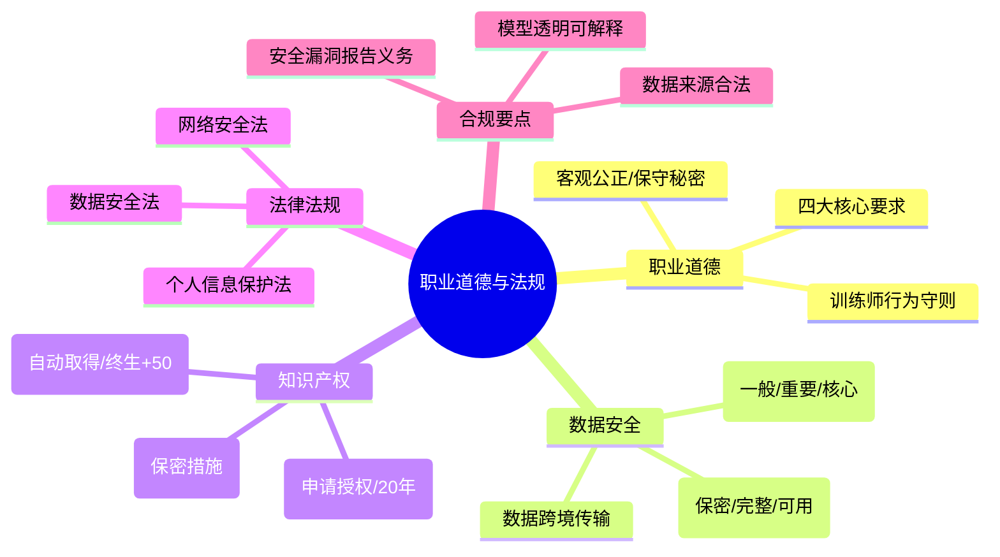

# 第一章：职业道德与法律法规

> 分值占比：10%-15% | 重要程度：★★★

## 考情快照

- **分值占比**：10%-15%（上午选择题 6-8 题）
- **题型**：选择题（法规条款 + 职业道德情景判断）
- **备考建议**：三法（个保法/数安法/网安法）+ 知识产权 + 数据安全三性 = 必考。法律责任罚款额度要记。

## 知识导图

## 考情分析

本章是三级人工智能训练师考试的基础章节，主要考查职业道德规范、数据安全与隐私保护、知识产权、以及人工智能相关法律法规。考试以概念理解和案例分析为主，需重点掌握职业守则、数据合规要求和法律责任。

**高频考点分布：**
- 数据安全三性 + 数据分级：~25%
- 个人信息保护法（同意/敏感信息/罚款）：~25%
- 知识产权（著作权/专利权/商业秘密）：~20%
- 职业道德核心要求：~15%
- AI 合规（透明/可解释/无歧视）：~15%

---

## 1.1 职业道德与职业守则

### 1.1.1 职业道德基本规范

**人工智能训练师职业道德核心要求：**
- **爱岗敬业**：忠于职守，认真履行岗位职责
- **诚实守信**：如实记录训练过程，不篡改数据与结果
- **客观公正**：在数据标注、模型评估中保持中立
- **保守秘密**：不泄露训练数据、模型参数及商业信息
- **持续学习**：跟踪算法与技术发展，提升专业能力

### 1.1.2 职业守则具体内容

**训练过程中的职业要求：**
- 严格按照训练规范执行数据标注与处理
- 如实记录训练日志，不隐瞒异常结果
- 尊重数据隐私，不私自复制或传播训练数据
- 对模型缺陷保持客观，不夸大模型性能
- 配合审计与评估，提供真实完整的训练资料

---

## 1.2 数据安全与隐私保护

### 1.2.1 数据安全基本概念

| 安全属性 | 含义 | 威胁 |
|---------|------|------|
| **保密性** | 信息不被未授权访问 | 窃听、泄露 |
| **完整性** | 信息不被未授权篡改 | 篡改、破坏 |
| **可用性** | 授权用户可正常访问 | 拒绝服务 |

**数据分级保护：**
| 级别 | 定义 | 保护措施 |
|------|------|---------|
| **一般数据** | 公开信息 | 常规保护 |
| **重要数据** | 泄露影响公共利益 | 加密/访问控制/审计 |
| **核心数据** | 涉及国家安全 | 最高级别保护 |

### 1.2.2 个人信息保护（⚠️ 必考罚款额度）

**《个人信息保护法》核心要点：**
- 处理个人信息应征得个人**同意**（敏感个人信息需**单独同意**）
- 遵循合法、正当、必要、诚信原则
- 个人有权查询、更正、删除其个人信息

::: warning 法律责任
- 违反《个人信息保护法》：最高罚款**五千万元或上一年度营业额 5%**（两者取高）
- 情节严重：责令暂停业务、停业整顿、吊销许可
- 直接责任人：禁止一定期限从业
:::

### 1.2.3 训练数据合规

- 训练前进行个人信息识别与分类
- 脱敏处理：去标识化、匿名化
- 最小必要原则：仅收集训练所需最少个人信息
- 留存期限：训练完成后及时删除或匿名化

---

## 1.3 知识产权（⚠️ 必考保护期）

| 类型 | 保护对象 | 保护期限 | 取得方式 |
|------|----------|----------|----------|
| **著作权** | 代码、文档、模型设计 | **作者终生加 50 年** | **自动取得** |
| **专利权** | 算法创新、技术方案 | 发明 20 年，实用新型 10 年 | 申请授权 |
| **商业秘密** | 训练数据、参数、技巧 | 不确定 | 保密措施 |
| **商标权** | 产品名称、标识 | 10 年（可续展） | 注册取得 |

::: tip 高频辨析
- 著作权 = 自动取得（无需注册）
- 专利权 = 需申请 + 20 年
- 商业秘密 = 保密措施 + 期限不确定
:::

---

## 1.4 人工智能相关法律法规

### 国内三法体系

| 法律 | 核心内容 |
|------|---------|
| **《个人信息保护法》** | 个人信息的收集/使用/共享规则，敏感信息单独同意 |
| **《数据安全法》** | 数据分类分级保护，数据安全审查，数据出境评估 |
| **《网络安全法》** | 网络运营者安全义务，关键信息基础设施保护 |

### AI 专项合规
- **算法透明与可解释性**：模型决策可追溯
- **避免算法歧视与偏见**：公平性评估
- **安全漏洞报告义务**：发现问题立即停止并报告

---

## 1.5 数据跨境传输

**需安全评估情形：**
- 向境外提供重要数据
- 向境外提供个人信息达到规定数量
- 其他法定情形

**评估要点：**
- 出境目的、范围、方式
- 接收方安全保护能力
- 个人权益保护措施

---

## 考点速查

| 考点 | 一句话定义 | 频次 |
|------|----------|------|
| 职业道德四大要求 | 爱岗敬业/诚实守信/客观公正/保守秘密 | ★★★★ |
| 数据安全 CIA 三性 | 保密性/完整性/可用性 | ★★★★ |
| 数据三级 | 一般→重要→核心 | ★★★★ |
| 敏感个人信息 | 需单独同意 | ★★★★ |
| 个保法罚款 | 最高五千万或营业额 5% | ★★★★ |
| 著作权 | 自动取得 + 终生 50 年 | ★★★★ |
| 专利权 | 申请授权 + 发明 20 年 | ★★★★ |
| 商业秘密 | 保密措施 + 期限不确定 | ★★★ |
| 数据跨境 | 安全评估 + 接收方能力 | ★★★ |
| 安全漏洞 | 发现即停训并报告 | ★★★ |

## 考点→题目索引

- **职业道德**：[level3-001]() · [level3-002]() · [level3-041]() · [level3-047]()
- **数据安全三性与分级**：[level3-003]() · [level3-004]() · [level3-042]() · [level3-043]()
- **个人信息保护**：[level3-005]() · [level3-006]() · [level3-041]() · [level3-049]()
- **知识产权**：[level3-007]() · [level3-008]() · [level3-009]() · [level3-045]() · [level3-046]()
- **法律法规**：[level3-010]() · [level3-011]() · [level3-044]() · [level3-048]()
- **合规与跨境**：[level3-049]()

## 真题练习

::: tip
本章共 20 题，建议 25 分钟。记忆型考点为主——罚款额度和保护期数字必须记准确。
:::

<Quiz dataUrl="./quiz.json" />
