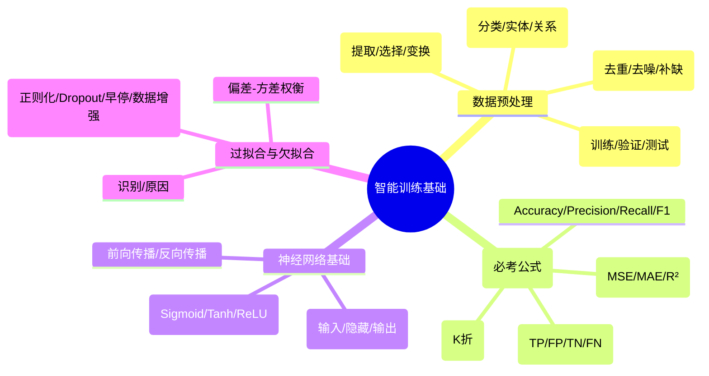

# 第二章：智能训练基础

> 分值占比：25%-30% | 重要程度：★★★★

## 考情快照

- **分值占比**：25%-30%（上午选择题 8-12 题）
- **题型**：选择题（混淆矩阵公式 + 预处理流程 + 激活函数 + 过拟合判断）
- **备考建议**：混淆矩阵四指标公式（Accuracy/Precision/Recall/F1）必考，数据预处理流程串联题高频，ReLU vs Sigmoid 对比要熟。

## 知识导图



## 考情分析

本章是三级人工智能训练师考试的核心技术章节，主要考查数据处理规范、算法测试评价方法、深度学习基础等内容。考试重点在于数据预处理流程、算法测试指标体系、神经网络基础原理。

**高频考点分布：**
- 混淆矩阵四指标 + 公式：~30%（几乎必考）
- 数据预处理流程：~20%
- 激活函数对比 + 神经网络：~15%
- 过拟合/欠拟合识别与解法：~15%
- 特征工程 + 数据变换：~10%
- 回归指标 + 交叉验证：~10%

---

## 2.1 数据处理规范

### 2.1.1 数据预处理标准流程

```
原始数据 → 数据清洗 → 数据标注 → 特征工程 → 数据集划分 → 训练数据
```

| 环节 | 主要工作 | 关键要点 |
|------|----------|---------|
| 数据清洗 | 去重、去噪、补全缺失值 | 异常值处理、格式统一 |
| 数据标注 | 分类/实体/关系标注 | 标注规范、一致性校验 |
| 特征工程 | 提取/选择/变换 | 降维、归一化、标准化 |
| 数据集划分 | 训练集/验证集/测试集 | 比例合理、分布一致 |

### 2.1.2 数据清洗方法

| 问题 | 识别 | 处理 |
|------|------|------|
| 缺失值 | 空值比例 | 删除/均值填充/模型预测 |
| 异常值 | 箱线图/Z-score | 删除/修正/分箱 |
| 重复数据 | 唯一性校验 | 去重保留一条 |
| 格式不一致 | 数据探查 | 统一格式 |

### 2.1.3 数据集划分（⚠️ 必考比例）

| 数据集 | 比例 | 用途 |
|--------|------|------|
| **训练集** | 60%-80% | 学习模型参数 |
| **验证集** | 10%-20% | 调参/选模型 |
| **测试集** | 10%-20% | **仅最终评估** |

::: warning 测试集使用原则
测试集只能用一次！验证集用于调参，测试集用于最终评估。交叉验证可减少划分带来的波动。
:::

---

## 2.2 算法测试评价（⚠️ 必考混淆矩阵）

### 2.2.1 混淆矩阵

```
                预测正例    预测负例
实际正例    TP（真正例）  FN（假负例）
实际负例    FP（假正例）  TN（真负例）
```

### 2.2.2 分类指标公式（⚠️ 必须熟记）

| 指标 | 公式 | 含义 |
|------|------|------|
| **Accuracy** | (TP+TN)/(TP+FP+TN+FN) | 预测正确的占比 |
| **Precision** | TP/(TP+FP) | 预测为正的中实际为正的比例 |
| **Recall** | TP/(TP+FN) | 实际为正的中预测正确的比例 |
| **F1-score** | 2×P×R/(P+R) | Precision 和 Recall 的调和平均 |

::: tip 记忆技巧
- Precision = 预测准不准（预测正的里面有多少真的）
- Recall = 找得全不全（实际正的里面找到了多少）
- F1 = 两者的调和平均，类别不平衡时比 Accuracy 更可靠
:::

### 2.2.3 回归任务指标

| 指标 | 公式 | 特点 |
|------|------|------|
| MSE | Σ(y-ŷ)²/n | 最常用，对大误差敏感 |
| RMSE | √MSE | 量纲与数据一致 |
| MAE | Σ|y-ŷ|/n | 对异常值鲁棒 |
| R² | 1-SSres/SStot | 解释方差比例 |

### 2.2.4 交叉验证

| 方法 | K 值 | 特点 |
|------|------|------|
| K 折交叉验证 | K=5 或 10 | 常用，平衡稳定性与计算量 |
| 留一法 LOOCV | K=N（样本总数） | 最稳定但计算量最大 |
| 分层 K 折 | K=5/10 | 保持类别分布，不平衡数据必用 |

---

## 2.3 深度学习基础

### 2.3.1 神经网络基本结构

```
输入层 → 隐藏层1 → 隐藏层2 → ... → 输出层
```

**关键概念：**
- **权重（W）**：连接强度，通过训练更新
- **偏置（b）**：激活阈值调节
- **激活函数**：引入非线性（没有它多层=单层）

### 2.3.2 激活函数对比（⚠️ 必考）

| 函数 | 公式 | 特点 |
|------|------|------|
| Sigmoid | 1/(1+e^-x) | 输出 0-1，两端饱和→梯度消失 |
| Tanh | (e^x-e^-x)/(e^x+e^-x) | 输出 -1~1，零中心 |
| **ReLU** | max(0,x) | **最常用**，缓解梯度死亡 |
| Leaky ReLU | max(0.01x,x) | 解决 ReLU 死亡问题 |
| Softmax | e^x_i/Σe^x_j | 多分类输出（概率分布） |

::: tip 为什么 ReLU 最常用？
正区间梯度恒为 1（不饱和），计算简单，训练快。Sigmoid/Tanh 在两端梯度→0，导致梯度消失。
:::

### 2.3.3 前向传播与反向传播

- **前向传播**：输入 → 逐层计算 → 输出预测值
- **反向传播**：计算损失对每层权重的梯度 → 链式法则 → 更新权重
- **权重更新**：`W = W - lr × ∇L`

---

## 2.4 过拟合与欠拟合

### 识别与解法

| 现象 | 训练集 | 验证集 | 原因 | 解法 |
|------|--------|--------|------|------|
| **过拟合** | 好 | 差 | 模型太复杂/数据太少 | 正则化/Dropout/早停/数据增强 |
| **欠拟合** | 差 | 差 | 模型太简单/特征不足 | 增加模型/特征/减少正则 |

### 偏差-方差权衡
```
总误差 = 偏差² + 方差 + 噪声
偏差大 → 欠拟合；方差大 → 过拟合
目标：找到最佳平衡点
```

### 正则化与早停

| 方法 | 原理 |
|------|------|
| L1 正则化 | 产生稀疏权重（特征选择） |
| L2 正则化 | 权重趋向小值（防过拟合） |
| **Dropout** | 训练时随机丢弃神经元（0.2-0.5） |
| **早停** | 验证集性能不提升即停（Patience=5-20） |

---

## 2.5 特征工程基础

### 特征变换

| 方法 | 适用 | 说明 |
|------|------|------|
| 标准化 Z-score | 分布接近正态 | μ=0, σ=1 |
| 归一化 Min-Max | 范围差异大 | 缩放到 [0,1] |
| 独热编码 | 无序类别 | 每类一维 |
| 对数变换 | 右偏分布 | 压缩大值 |

### 特征选择三法
| 方法 | 策略 |
|------|------|
| 过滤法 | 统计指标（方差/相关系数/卡方） |
| 包裹法 | 以模型性能为准（RFE） |
| 嵌入法 | 训练中自动选（L1/树模型重要性） |

---

## 考点速查

| 考点 | 一句话定义 | 频次 |
|------|----------|------|
| 混淆矩阵 TP/FP/TN/FN | 真正/假正/真负/假负 | ★★★★★ |
| Precision 公式 | TP/(TP+FP) = 预测准不准 | ★★★★★ |
| Recall 公式 | TP/(TP+FN) = 找得全不全 | ★★★★★ |
| F1 = 2PR/(P+R) | 精确率与召回率调和平均 | ★★★★★ |
| 预处理流程 | 清洗→标注→特征工程→划分 | ★★★★ |
| 数据集比例 | 训练 60-80%/验证 10-20%/测试 10-20% | ★★★★ |
| ReLU vs Sigmoid | ReLU 不饱和大法好；Sigmoid 两端梯度消失 | ★★★★ |
| 过拟合解法 | 正则/Dropout/早停/数据增强/增数据 | ★★★★ |
| 偏差-方差 | 总误差 = 偏差² + 方差 + 噪声 | ★★★ |
| K 折交叉验证 | K=5/10，分层用于不平衡数据 | ★★★ |

## 考点→题目索引

- **混淆矩阵与指标**：[level3-011]() · [level3-012]() · [level3-013]() · [level3-014]() · [level3-051]() · [level3-052]()
- **预处理流程**：[level3-015]() · [level3-016]() · [level3-017]()
- **数据集划分**：[level3-018]() · [level3-019]()
- **评价指标计算**：[level3-020]() · [level3-053]() · [level3-054]()
- **激活函数**：[level3-021]() · [level3-022]() · [level3-055]()
- **过拟合与解法**：[level3-023]() · [level3-024]() · [level3-025]() · [level3-056]()
- **特征工程**：[level3-026]() · [level3-027]()

## 真题练习

::: warning 本章是 AI 训练师核心重点
混淆矩阵公式 + 数据预处理流程 = 必考。做错题重读上方考点。
:::

<Quiz dataUrl="./quiz.json" />
