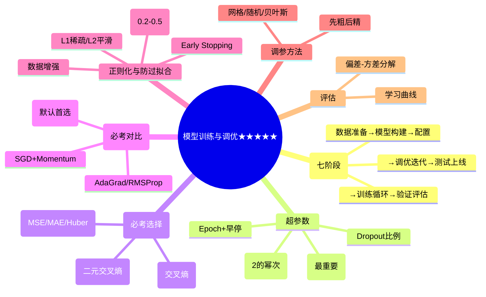

# 第三章：模型训练与调优

> 分值占比：45%-50% | 重要程度：★★★★★

## 考情快照

- **分值占比**：45%-50%（全卷最高！上午 12-15 题 + 下午可能出综合题）
- **题型**：选择题（训练流程 + 损失函数选择 + 优化器对比 + 超参数调优）
- **备考建议**：**全卷最重点章节，没有之一**。训练七阶段 + 损失函数三大分类 + Adam vs SGD 对比 + 学习率/批次大小设置 = 必考铁四角。

## 知识导图



## 考情分析

本章是三级人工智能训练师考试的核心章节，分值占比最高（45%-50%）。主要考查模型训练流程、超参数调整、损失函数与优化器等知识。

**高频考点分布（按真题频次）：**
- 训练流程七阶段：~15%
- 损失函数选择（任务匹配）：~20%
- 优化器对比（Adam vs SGD）：~20%
- 超参数调优（lr/Batch Size/Dropout）：~15%
- 过拟合解法（正则/Dropout/早停）：~15%
- 评估与泛化（偏差-方差/学习曲线）：~10%
- 数据增强：~5%

---

## 3.1 训练流程（⚠️ 必考七阶段）

### 完整训练流程

```
准备数据 → 构建模型 → 配置损失函数与优化器 → 训练循环 → 验证评估 → 调优迭代 → 测试上线
```

| 阶段 | 主要工作 | 关键要点 |
|------|----------|---------|
| 数据准备 | 加载/预处理/划分 | 数据质量、分布一致 |
| 模型构建 | 选架构/初始化参数 | 架构适配任务 |
| 配置优化器 | 选损失函数/优化器 | 任务匹配、超参设置 |
| 训练循环 | 前向/反向/更新权重 | 批次大小、训练轮数 |
| 验证评估 | 验证集评估指标 | 监控过拟合 |
| 调优迭代 | 调整超参数 | 网格/随机/贝叶斯 |
| 测试上线 | 测试集最终评估 | 性能达标 |

### 训练核心概念（⚠️ 必考定义）

| 概念 | 定义 | 常见值 |
|------|------|--------|
| **Epoch** | 完整遍历一次训练数据集 | 10-100 轮 + 早停 |
| **Batch Size** | 每次参数更新的样本数 | **32/64/128/256**（2 的幂次） |
| **Learning Rate** | 参数更新步长 | 0.001（Adam 默认） |
| **Iteration** | 一个 Batch 的训练过程 | 1 Epoch = N/BatchSize 次 Iteration |

::: tip 学习率影响
- 过大：不收敛或震荡
- 过小：收敛慢，陷入局部最优
- **学习率是最重要的超参数**，优先调优
:::

### 学习率调度策略
| 策略 | 说明 |
|------|------|
| 固定学习率 | 简单任务 |
| Step Decay | 每隔 N 轮衰减为原来的 γ 倍 |
| Exponential Decay | 指数衰减 |
| Cosine Annealing | 余弦退火 |
| **自适应学习率** | Adam/AdamW 自动调整（推荐） |

---

## 3.2 超参数调优

### 超参数分类

| 类型 | 示例 |
|------|------|
| 模型结构 | 层数、神经元数量 |
| 训练超参数 | 学习率、Batch Size、Epoch |
| 正则化 | Dropout 比例、权重衰减 |

### 搜索方法对比

| 方法 | 策略 | 适用 |
|------|------|------|
| 网格搜索 | 遍历所有组合 | 参数少（≤3 维） |
| **随机搜索** | 随机采样 | 高维空间，**推荐** |
| 贝叶斯优化 | 概率模型引导 | 样本效率要求高 |

::: tip 调参原则
1. 先调学习率（最重要）
2. 再调网络结构
3. 最后调正则化参数
4. 每次只调一个参数
5. 用验证集评估，测试集只用一次
:::

---

## 3.3 损失函数（⚠️ 必考任务匹配）

### 回归任务损失

| 损失函数 | 公式 | 特点 |
|----------|------|------|
| **MSE** | Σ(y-ŷ)²/n | 对大误差敏感（最常用） |
| **MAE** | Σ|y-ŷ|/n | 对异常值鲁棒 |
| Huber | MSE(小)+MAE(大) | 结合两者优点 |

### 分类任务损失

| 任务 | 损失函数 | 输出层 |
|------|---------|--------|
| **二分类** | 二元交叉熵（BCE） | Sigmoid |
| **多分类** | 交叉熵损失（CE） | Softmax |

::: tip 损失函数选择口诀
"回归用 MSE，二分类 BCE，多分类 CE；异常多选 MAE，默认 Adam 配 CE"
:::

### 损失函数与激活函数搭配
- 回归 + 线性输出 → MSE
- 二分类 + Sigmoid → 二元交叉熵
- 多分类 + Softmax → 交叉熵

---

## 3.4 优化器（⚠️ 必考 Adam vs SGD）

### 优化器对比表

| 优化器 | 核心公式 | 优点 | 缺点 | 适用 |
|--------|---------|------|------|------|
| **SGD** | θ = θ - η∇J | 简单，泛化可能好 | 震荡大，收敛慢 | 简单任务 |
| Momentum | v = βv + η∇J | 加速收敛 | 需调 β | 凸优化 |
| AdaGrad | 自适应学习率 | 稀疏数据好 | 学习率早衰 | NLP |
| RMSProp | 指数加权平均 | 解决 AdaGrad 衰减 | 需调衰减 | RNN |
| **Adam** | M+RMSProp | **综合优势，默认首选** | 内存稍大 | **通用** |
| **AdamW** | Adam+权重衰减修正 | 泛化更好 | 实现稍复杂 | **推荐首选** |

::: tip Adam 计算步骤
```
m = β1·m + (1-β1)·∇J      # 一阶矩（动量）
v = β2·v + (1-β2)·∇J²     # 二阶矩（RMS）
m̂ = m/(1-β1^t)            # 偏差修正
v̂ = v/(1-β2^t)            # 偏差修正
θ = θ - η·m̂/(√v̂ + ε)      # 更新
默认: β1=0.9, β2=0.999, ε=1e-8
```

### 优化器选择决策树
```
数据量大 + 通用任务 → Adam/AdamW（默认）
追求最佳泛化 → AdamW 或 SGD+Momentum
RNN/时序 → RMSProp 或 Adam
NLP/稀疏特征 → AdaGrad
内存受限 → SGD
```

### ⚠️ 常见误区

| 误区 | 事实 |
|------|------|
| Adam 总是最好 | 不一定，SGD+良好调度可能泛化更好 |
| 学习率设好就不动 | 应配合学习率调度策略 |
| 权重衰减 = L2 正则 | 不完全等价，AdamW 做了修正 |

---

## 3.5 正则化与防止过拟合

### L1 vs L2 正则化

| 类型 | 公式 | 效果 |
|------|------|------|
| **L1** | Loss + λ·Σ\|w\| | 产生稀疏权重（特征选择） |
| **L2** | Loss + λ·Σw² | 权重趋向小值（防过拟合） |

### Dropout
- 训练时随机丢弃神经元（比例 **0.2-0.5**）
- 测试时不丢弃，输出乘以保留概率
- 效果：训练多个子网络集成

### 早停（Early Stopping）
- 验证集性能连续 **5-20** 轮不提升则停止
- 保存验证集最好的模型权重

### 数据增强
- 图像：旋转/翻转/裁剪/缩放/色彩变换
- 文本：同义词替换/随机插入删除/回译

---

## 3.6 模型评估与泛化

### 泛化误差分解
```
泛化误差 = 偏差² + 方差 + 噪声
偏差大 → 欠拟合
方差大 → 过拟合
```

### 学习曲线判断

| 训练曲线 | 验证曲线 | 判断 |
|---------|---------|------|
| 上升 | 平稳不升 | 欠拟合 |
| 远高于验证 | 差距大 | 过拟合 |
| 接近且高 | 接近且高 | 拟合良好 |

### 数据集职责
| 数据集 | 职责 | 使用次数 |
|--------|------|---------|
| 训练集 | 学习参数 | 每轮 |
| 验证集 | 调参 + 选模型 | 频繁 |
| 测试集 | **仅最终评估** | **一次** |

---

## 考点速查

| 考点 | 一句话定义 | 频次 |
|------|----------|------|
| 训练七阶段 | 准备→构建→配置→训练→验证→调优→测试 | ★★★★★ |
| Epoch 定义 | 完整遍历一次训练集 | ★★★★★ |
| Batch Size | 2 的幂次：32/64/128/256 | ★★★★★ |
| **Adam vs SGD** | Adam=自适应默认首选；SGD可能泛化更好 | ★★★★★ |
| **MSE vs MAE** | MSE 对大误差敏感；MAE 鲁棒 | ★★★★ |
| **BCE vs CE** | 二分类 vs 多分类 | ★★★★ |
| 学习率过大 → 震荡 | 过小 → 收敛慢 | ★★★★ |
| Dropout 0.2-0.5 | 训练丢弃，测试不丢 | ★★★★ |
| 早停 Patience 5-20 | 验证集不提升即停 | ★★★★ |
| L1 稀疏 / L2 平滑 | 防过拟合两大正则 | ★★★ |
| 偏差-方差 | 总误差 = 偏差² + 方差 + 噪声 | ★★★ |
| 贝叶斯优化 | 概率模型引导搜索 | ★★★ |

## 考点→题目索引

- **训练流程**：[level3-021]() · [level3-022]() · [level3-061]() · [level3-062]()
- **超参数调优**：[level3-023]() · [level3-024]() · [level3-061]() · [level3-062]()
- **损失函数选择**：[level3-025]() · [level3-026]() · [level3-027]() · [level3-063]()
- **优化器对比**：[level3-028]() · [level3-029]() · [level3-064]() · [level3-065]()
- **过拟合与正则**：[level3-030]() · [level3-031]() · [level3-064]()
- **评估与泛化**：[level3-032]() · [level3-033]()

## 真题练习

::: warning 本章是全卷最重要章节（占比 45%-50%）
训练流程 + 损失函数 + 优化器 + 超参调优 = 四大铁角。做错的题必须回链考点！
:::

<Quiz dataUrl="./quiz.json" />
