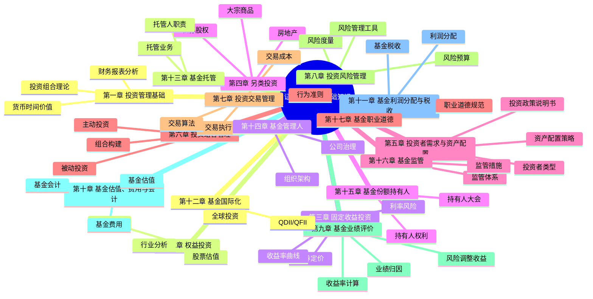

# 证券投资基金基础知识 - 总结

## 知识框架思维导图

## 高频考点速查表

| 考点 | 内容 | 记忆要点 |
|------|------|----------|
| 夏普比率 | S = (Rp - Rf) / σp | 单位总风险超额收益 |
| 特雷诺比率 | T = (Rp - Rf) / βp | 单位系统风险超额收益 |
| 詹森α | α = Rp - [Rf + β(Rm-Rf)] | 超额收益 |
| 信息比率 | IR = α / σ(残差) | 单位主动风险超额收益 |
| 修正久期 | Dmod = D / (1+y) | 利率敏感性 |
| Gordon模型 | P = D₁ / (k - g) | 股票内在价值 |
| WACC | WACC = We×Ke + Wd×Kd×(1-t) | 加权平均资本成本 |
| CAPM | E(Ri) = Rf + βi×[E(Rm)-Rf] | 资本资产定价模型 |
| β系数 | β = Cov(Ri,Rm) / Var(Rm) | 系统风险度量 |
| 跟踪误差 | TE = σ(Rp - Rb) | 主动管理偏离度 |
| 最大回撤 | MDD = (Peak - Trough) / Peak | 最大亏损幅度 |
| 基金净值 | NAV = (总资产-总负债) / 总份额 | 单位净值 |
| 累计净值 | 累计净值 = 单位净值 + 累计分红 | 含分红的净值 |
| 申购份额 | 申购份额 = 申购金额 / (1+申购费率) / T日净值 | 未知价法 |

## 易混淆概念对比表

### 1. 被动投资 vs 主动投资

| 对比项 | 被动投资 | 主动投资 |
|--------|----------|----------|
| 目标 | 复制基准指数 | 超越基准指数 |
| 策略 | 指数化投资 | 选股/择时 |
| 费用 | 较低 | 较高 |
| 换手率 | 低 | 高 |
| 跟踪误差 | 小 | 大 |
| 典型产品 | ETF/指数基金 | 主动管理基金 |

### 2. 系统性风险 vs 非系统性风险

| 对比项 | 系统性风险 | 非系统性风险 |
|--------|-----------|-------------|
| 定义 | 影响整个市场的风险 | 影响个别证券的风险 |
| 来源 | 宏观因素(政策/利率/通胀) | 公司经营/财务因素 |
| 度量 | β系数 | 个股标准差 |
| 分散化 | 不可分散 | 可通过组合分散 |
| 补偿 | 市场给予风险溢价 | 无额外补偿 |

### 3. 夏普比率 vs 特雷诺比率

| 对比项 | 夏普比率 | 特雷诺比率 |
|--------|----------|-----------|
| 公式 | (Rp-Rf)/σp | (Rp-Rf)/βp |
| 风险度量 | 总风险(标准差) | 系统风险(β) |
| 适用场景 | 非充分分散组合 | 充分分散组合 |
| 比较对象 | 单位总风险收益 | 单位系统风险收益 |

### 4. 市场法 vs 收益法 vs 成本法

| 对比项 | 市场法 | 收益法 | 成本法 |
|--------|--------|--------|--------|
| 核心思路 | 参照可比公司 | 未来现金流折现 | 重置成本 |
| 关键指标 | P/E、P/B、EV/EBITDA | DCF、DDM | 账面价值调整 |
| 适用场景 | 有可比公司 | 现金流可预测 | 资产密集型 |
| 优点 | 市场定价、简单 | 理论完善 | 客观可验证 |
| 缺点 | 可比性问题 | 假设敏感 | 忽略无形资产 |

### 5. ETF vs LOF

| 对比项 | ETF | LOF |
|--------|-----|-----|
| 申购赎回 | 实物(一篮子股票) | 现金 |
| 交易方式 | 交易所+申购赎回 | 交易所+申购赎回 |
| 套利机制 | 有 | 无(或有限) |
| 跟踪误差 | 小 | 较大 |
| 管理费率 | 低 | 较高 |
| 信息披露 | 实时(IOPV) | 日终净值 |
