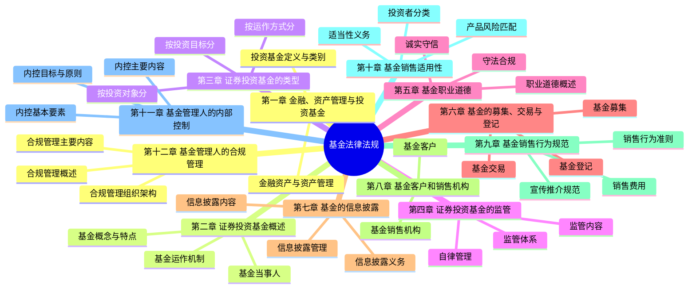

# 基金法律法规 - 总结

## 知识框架思维导图

## 高频考点速查表

| 考点 | 内容 | 记忆要点 |
|------|------|----------|
| 基金合同生效 | 募集份额≥2亿份、金额≥2亿元、持有人≥200人 | 2亿份/2亿元/200人 |
| 基金募集期限 | 自证监会核准之日起6个月内 | 6个月 |
| 开放式基金申购赎回 | T日申购，T+1日确认 | T+1确认 |
| 基金管理人变更 | 重大事项5个工作日内报告 | 5个工作日 |
| 年报披露 | 会计年度结束之日起90日内 | 90日 |
| 半年报披露 | 上半年结束之日起60日内 | 60日 |
| 季报披露 | 每季度结束之日起15日内 | 15日 |
| 单只基金持仓限制 | ≤基金资产净值10% | 10% |
| 股票基金投资比例 | 股票≥基金资产80% | 80% |
| 基金托管人资格 | 净资产≥200亿 | 200亿 |
| 合格投资者个人 | 金融资产≥300万或年均收入≥50万 | 300万/50万 |
| 基金销售机构 | 需取得基金销售业务资格 | 销售资格 |
| 前端收费 vs 后端收费 | 申购时收取 vs 赎回时收取 | 购前赎后 |
| 基金转换 | T日申请，T+1日确认 | T+1确认 |

## 易混淆概念对比表

### 1. 公募基金 vs 私募基金

| 对比项 | 公募基金 | 私募基金 |
|--------|----------|----------|
| 募集方式 | 公开发行 | 非公开发行 |
| 投资者门槛 | 无特定门槛 | 合格投资者 |
| 募集人数 | 不限(≥200人) | ≤200人 |
| 信息披露 | 严格披露要求 | 有限披露 |
| 投资限制 | 严格(双十限制) | 相对灵活 |
| 监管程度 | 严格 | 相对宽松 |

### 2. 基金管理人 vs 基金托管人

| 对比项 | 基金管理人 | 基金托管人 |
|--------|-----------|-----------|
| 职责 | 基金投资管理 | 资产保管与监督 |
| 资格 | 基金管理公司 | 商业银行/证券公司 |
| 核心义务 | 忠实、注意义务 | 安全保管、独立核算 |
| 收入来源 | 管理费 | 托管费 |
| 净资产要求 | ≥1亿(公募) | ≥200亿 |

### 3. 前端收费 vs 后端收费

| 对比项 | 前端收费 | 后端收费 |
|--------|----------|----------|
| 收取时点 | 申购时 | 赎回时 |
| 费率特点 | 固定费率 | 持有时间越长费率越低 |
| 计入方式 | 从申购金额中扣除 | 从赎回金额中扣除 |
| 适用场景 | 短期持有 | 长期持有 |
| 对投资影响 | 实际申购份额减少 | 实际赎回金额减少 |

### 4. 基金申购 vs 基金赎回

| 对比项 | 基金申购 | 基金赎回 |
|--------|----------|----------|
| 方向 | 买入基金份额 | 卖出基金份额 |
| 价格 | 未知价法(T日净值) | 未知价法(T日净值) |
| 确认时间 | T+1日 | T+1日 |
| 资金到账 | T+2日 | T+3~7日 |
| 费用 | 申购费 | 赎回费 |

### 5. 内部控制 vs 合规管理

| 对比项 | 内部控制 | 合规管理 |
|--------|----------|----------|
| 目标 | 防范风险、保证经营合法合规 | 防范合规风险 |
| 范围 | 经营管理全流程 | 法律法规合规性 |
| 责任主体 | 全体员工 | 合规部门/合规负责人 |
| 核心内容 | 控制环境、风险评估、控制活动 | 制度建设、合规审查、合规培训 |
| 独立性 | 纳入经营管理 | 独立于经营管理 |
