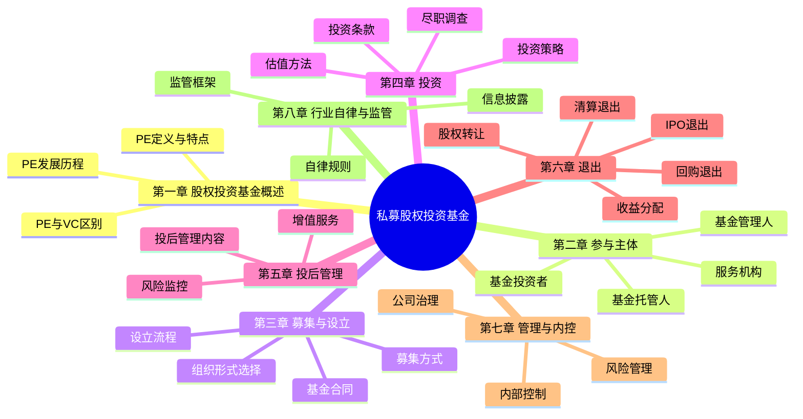

# 私募股权投资基金 - 总结

## 知识框架思维导图

## 高频考点速查表

| 考点 | 内容 | 记忆要点 |
|------|------|----------|
| 合格投资者-个人 | 金融资产≥300万或年均收入≥50万 | 300万/50万 |
| 合格投资者-机构 | 净资产≥1000万 | 1000万 |
| 基金募集人数 | 单只基金投资者≤200人 | 200人 |
| 基金备案 | 募集完毕后20个工作日内备案 | 20个工作日 |
| 管理人登记 | 基金业协会登记 | AMAC登记 |
| 合伙型基金 | LP(有限合伙人)+GP(普通合伙人) | LP有限责任/GP无限责任 |
| 公司型基金 | 投资者为股东 | 股东大会决策 |
| 契约型基金 | 通过基金合同设立 | 无独立法律地位 |
| 对赌协议 | 业绩补偿/股权回购 | 估值调整机制 |
| 反稀释条款 | 完全棘轮/加权平均 | 防止股权被稀释 |
| 优先权条款 | 优先清算权/优先认购权 | 保护投资者利益 |
| 瀑布式分配 | 优先回报→追补→共投→分成 | 收益分配顺序 |
| 管理费 | 通常1.5%-2.5%/年 | 按承诺资本收取 |
| 业绩报酬 | 通常20% | 超过优先回报部分 |
| 基金存续期 | 通常5-10年 | 可延长1-2年 |

## 易混淆概念对比表

### 1. 合伙型 vs 公司型 vs 契约型

| 对比项 | 合伙型 | 公司型 | 契约型 |
|--------|--------|--------|--------|
| 法律依据 | 《合伙企业法》 | 《公司法》 | 《基金法》 |
| 法律地位 | 非法人 | 独立法人 | 非法人 |
| 投资者身份 | 合伙人 | 股东 | 基金份额持有人 |
| 决策机制 | 合伙人会议 | 股东大会/董事会 | 基金份额持有人大会 |
| 税收 | 穿透征税 | 双重征税 | 穿透征税 |
| 有限责任 | LP承担有限责任 | 股东承担有限责任 | 投资者承担有限责任 |
| 设立依据 | 合伙协议 | 公司章程 | 基金合同 |
| 管理方式 | GP执行合伙事务 | 董事会/管理层管理 | 管理人管理 |

### 2. PE vs VC

| 对比项 | PE(私募股权) | VC(风险投资) |
|--------|-------------|-------------|
| 投资阶段 | 成长期/成熟期 | 种子期/初创期 |
| 投资规模 | 较大 | 较小 |
| 控股比例 | 常获得控制权 | 少数股权 |
| 风险收益 | 相对较低 | 相对较高 |
| 退出方式 | IPO/并购/回购 | IPO/并购 |
| 投资周期 | 3-7年 | 5-10年 |

### 3. 完全棘轮 vs 加权平均反稀释

| 对比项 | 完全棘轮 | 加权平均 |
|--------|----------|----------|
| 调整方式 | 按最低价格调整 | 按加权平均调整 |
| 对创始人影响 | 不利 | 相对温和 |
| 计算复杂度 | 简单 | 复杂 |
| 常见程度 | 较少见 | 常见 |
| 公式 | 新转股价=后续融资价格 | 综合考虑融资规模 |

### 4. 管理费 vs 业绩报酬

| 对比项 | 管理费 | 业绩报酬 |
|--------|--------|----------|
| 收取基础 | 承诺资本/已投资本 | 投资收益 |
| 费率 | 1.5%-2.5%/年 | 通常20% |
| 收取时间 | 持续收取 | 退出时收取 |
| 覆盖成本 | 运营管理成本 | 激励管理人 |
| 优先级 | 先于业绩报酬 | 后于管理费 |

### 5. IPO退出 vs 并购退出

| 对比项 | IPO退出 | 并购退出 |
|--------|---------|----------|
| 退出价格 | 通常最高 | 相对较低 |
| 退出周期 | 较长(1-2年) | 较短 |
| 流动性 | 上市后可交易 | 一次性退出 |
| 不确定性 | 较高(审核风险) | 较低 |
| 锁定期 | 通常1-3年 | 无锁定期 |
| 适用条件 | 企业规模大、盈利好 | 各类企业 |
