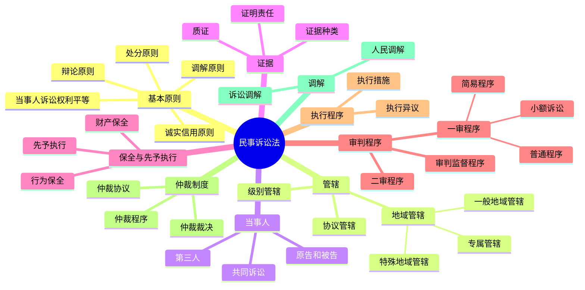

# 民事诉讼法总结

## 思维导图

## 高频考点

| 考点 | 频率 | 重要程度 | 考查方式 |
|------|------|---------|---------|
| 地域管辖 | ⭐⭐⭐⭐⭐ | ⭐⭐⭐⭐⭐ | 案例分析 |
| 协议管辖 | ⭐⭐⭐⭐ | ⭐⭐⭐⭐ | 概念辨析 |
| 当事人确定 | ⭐⭐⭐⭐ | ⭐⭐⭐⭐ | 案例分析 |
| 第三人 | ⭐⭐⭐⭐⭐ | ⭐⭐⭐⭐⭐ | 案例分析 |
| 证明责任 | ⭐⭐⭐⭐⭐ | ⭐⭐⭐⭐⭐ | 案例分析 |
| 财产保全 | ⭐⭐⭐⭐ | ⭐⭐⭐⭐ | 概念辨析 |
| 一审程序 | ⭐⭐⭐⭐⭐ | ⭐⭐⭐⭐⭐ | 案例分析 |
| 二审程序 | ⭐⭐⭐⭐ | ⭐⭐⭐⭐ | 案例分析 |
| 再审条件 | ⭐⭐⭐⭐ | ⭐⭐⭐⭐ | 概念辨析 |
| 仲裁协议 | ⭐⭐⭐⭐⭐ | ⭐⭐⭐⭐⭐ | 案例分析 |
| 仲裁裁决 | ⭐⭐⭐⭐ | ⭐⭐⭐⭐ | 概念辨析 |

## 重点比较表

### 1. 普通程序、简易程序、小额诉讼

| 比较项 | 普通程序 | 简易程序 | 小额诉讼 |
|--------|---------|---------|---------|
| 适用法院 | 各级法院 | 基层法院 | 基层法院 |
| 审判组织 | 合议庭 | 独任审判 | 独任审判 |
| 审理期限 | 6个月 | 3个月 | 2个月 |
| 审级 | 两审终审 | 两审终审 | 一审终审 |

### 2. 有独立请求权第三人与无独立请求权第三人

| 比较项 | 有独立请求权第三人 | 无独立请求权第三人 |
|--------|-------------------|-------------------|
| 请求权 | 有独立请求权 | 无独立请求权 |
| 诉讼地位 | 原告 | 辅助当事人一方 |
| 参加方式 | 提起诉讼 | 申请参加或法院通知 |

### 3. 诉前财产保全与诉讼财产保全

| 比较项 | 诉前财产保全 | 诉讼财产保全 |
|--------|-------------|-------------|
| 时间 | 起诉前 | 诉讼过程中 |
| 担保 | 必须提供担保 | 可以责令提供担保 |
| 条件 | 情况紧急 | 可能使判决难以执行 |

### 4. 民事诉讼与刑事诉讼的区别

| 比较项 | 民事诉讼 | 刑事诉讼 |
|--------|---------|---------|
| 证明责任 | 谁主张谁举证 | 控方举证 |
| 证明标准 | 高度盖然性 | 排除合理怀疑 |
| 调解 | 可以调解 | 一般不调解 |
| 执行 | 当事人申请 | 依职权执行 |
