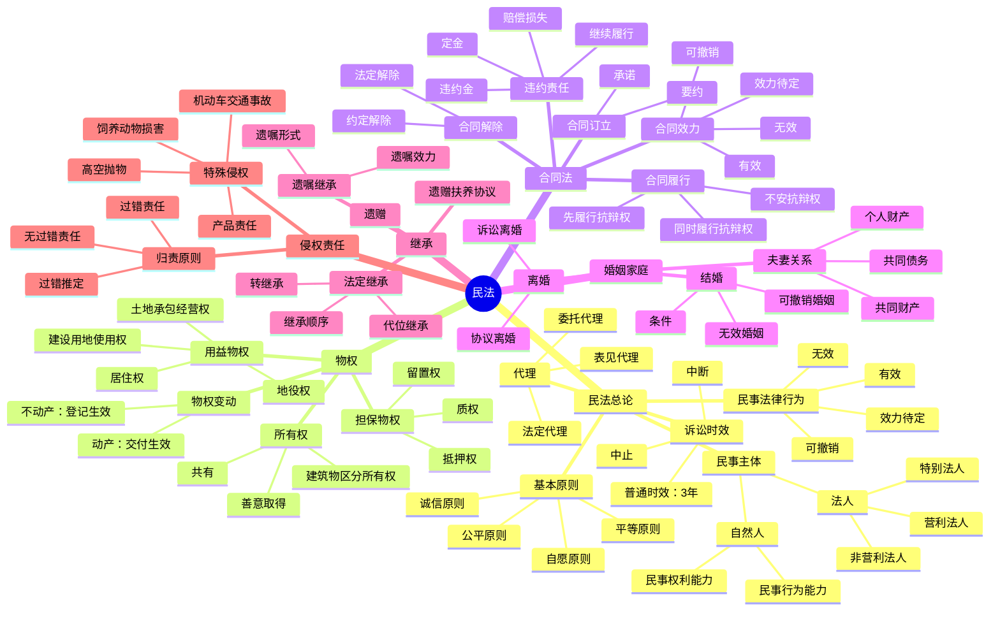

# 民法总结

## 思维导图

## 高频考点

| 考点 | 频率 | 重要程度 | 考查方式 |
|------|------|---------|---------|
| 民事法律行为的效力 | ⭐⭐⭐⭐⭐ | ⭐⭐⭐⭐⭐ | 案例分析 |
| 表见代理 | ⭐⭐⭐⭐ | ⭐⭐⭐⭐ | 案例分析 |
| 诉讼时效 | ⭐⭐⭐⭐ | ⭐⭐⭐⭐ | 概念辨析 |
| 善意取得 | ⭐⭐⭐⭐⭐ | ⭐⭐⭐⭐⭐ | 案例分析 |
| 物权变动 | ⭐⭐⭐⭐⭐ | ⭐⭐⭐⭐⭐ | 案例分析 |
| 合同的效力 | ⭐⭐⭐⭐⭐ | ⭐⭐⭐⭐⭐ | 案例分析 |
| 违约责任 | ⭐⭐⭐⭐ | ⭐⭐⭐⭐ | 案例分析 |
| 夫妻共同财产 | ⭐⭐⭐⭐⭐ | ⭐⭐⭐⭐⭐ | 案例分析 |
| 法定继承 | ⭐⭐⭐⭐ | ⭐⭐⭐⭐ | 案例分析 |
| 遗嘱的形式 | ⭐⭐⭐⭐ | ⭐⭐⭐⭐ | 概念辨析 |
| 侵权责任归责原则 | ⭐⭐⭐⭐⭐ | ⭐⭐⭐⭐⭐ | 案例分析 |
| 产品责任 | ⭐⭐⭐⭐ | ⭐⭐⭐⭐ | 案例分析 |

## 重点比较表

### 1. 无效民事法律行为与可撤销民事法律行为

| 比较项 | 无效 | 可撤销 |
|--------|------|--------|
| 效力 | 自始无效 | 撤销前有效 |
| 主张 | 任何人可以主张 | 只有撤销权人可以主张 |
| 期限 | 无期限限制 | 有撤销期限 |

### 2. 委托代理与法定代理

| 比较项 | 委托代理 | 法定代理 |
|--------|---------|---------|
| 产生依据 | 被代理人的委托 | 法律的直接规定 |
| 适用情形 | 民事活动 | 无民事行为能力人、限制民事行为能力人 |

### 3. 无权代理与表见代理

| 比较项 | 无权代理 | 表见代理 |
|--------|---------|---------|
| 相对人 | 不知道无权代理 | 有理由相信有代理权 |
| 效力 | 效力待定 | 有效 |

### 4. 抵押权、质权、留置权

| 比较项 | 抵押权 | 质权 | 留置权 |
|--------|--------|------|--------|
| 标的 | 动产或不动产 | 动产或权利 | 动产 |
| 是否转移占有 | 不转移 | 转移 | 已经占有 |
| 设立方式 | 登记 | 交付 | 法定 |

### 5. 代位继承与转继承

| 比较项 | 代位继承 | 转继承 |
|--------|---------|--------|
| 继承人死亡时间 | 先于被继承人 | 后于被继承人 |
| 继承人范围 | 晚辈直系血亲 | 所有法定继承人 |
| 适用范围 | 法定继承 | 法定继承和遗嘱继承 |

### 6. 过错责任与无过错责任

| 比较项 | 过错责任 | 无过错责任 |
|--------|---------|-----------|
| 过错要件 | 需要证明过错 | 不需要证明过错 |
| 适用情形 | 一般侵权 | 特殊侵权 |
| 举证责任 | 受害人举证 | 行为人举证免责 |
