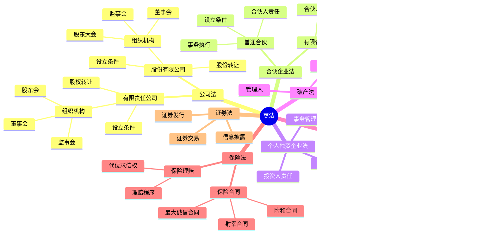

# 商法总结

## 思维导图

## 高频考点

| 考点 | 频率 | 重要程度 | 考查方式 |
|------|------|---------|---------|
| 有限责任公司股权转让 | ⭐⭐⭐⭐⭐ | ⭐⭐⭐⭐⭐ | 案例分析 |
| 股份有限公司股份转让 | ⭐⭐⭐⭐ | ⭐⭐⭐⭐ | 概念辨析 |
| 普通合伙与有限合伙的区别 | ⭐⭐⭐⭐⭐ | ⭐⭐⭐⭐⭐ | 概念辨析 |
| 破产财产分配顺序 | ⭐⭐⭐⭐⭐ | ⭐⭐⭐⭐⭐ | 案例分析 |
| 票据的特征 | ⭐⭐⭐⭐ | ⭐⭐⭐⭐ | 概念辨析 |
| 保险合同的特征 | ⭐⭐⭐⭐ | ⭐⭐⭐⭐ | 概念辨析 |
| 代位求偿权 | ⭐⭐⭐⭐ | ⭐⭐⭐⭐ | 案例分析 |

## 重点比较表

### 1. 有限责任公司与股份有限公司

| 比较项 | 有限责任公司 | 股份有限公司 |
|--------|-------------|-------------|
| 股东人数 | 50人以下 | 2-200人 |
| 设立方式 | 发起设立 | 发起设立或募集设立 |
| 股权转让 | 对外转让需其他股东过半数同意 | 自由转让 |
| 组织机构 | 股东会、董事会、监事会 | 股东大会、董事会、监事会 |

### 2. 普通合伙与有限合伙

| 比较项 | 普通合伙 | 有限合伙 |
|--------|---------|---------|
| 合伙人责任 | 无限连带责任 | 有限责任 |
| 合伙人人数 | 2人以上 | 2-50人 |
| 执行事务 | 均可执行 | 普通合伙人执行 |

### 3. 汇票、本票、支票

| 比较项 | 汇票 | 本票 | 支票 |
|--------|------|------|------|
| 付款人 | 付款人 | 出票人 | 付款人 |
| 付款期限 | 见票即付或定日付款 | 见票即付 | 见票即付 |

### 4. 破产财产分配顺序

| 顺序 | 内容 |
|------|------|
| 第一顺序 | 破产费用和共益债务 |
| 第二顺序 | 职工工资、社保费用、补偿金 |
| 第三顺序 | 其他社保费用和税款 |
| 第四顺序 | 普通破产债权 |
