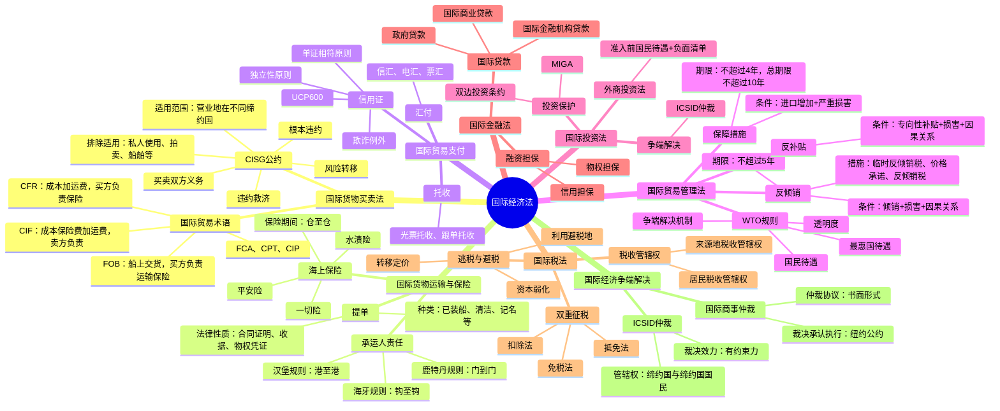

# 国际经济法 知识总结

## 思维导图

## 高频考点速查表

### 国际货物买卖法

| 考点 | 内容 | 考频 |
|------|------|------|
| CISG适用范围 | 营业地在不同缔约国 | ★★★★★ |
| CISG排除适用 | 私人使用、拍卖、船舶等 | ★★★★★ |
| 根本违约 | 实际剥夺对方期待利益 | ★★★★★ |
| 风险转移 | 货交第一承运人/交货时/订立合同时 | ★★★★★ |
| FOB | 买方负责运输保险 | ★★★★★ |
| CIF | 卖方负责运输保险 | ★★★★★ |
| CFR | 卖方负责运输，买方负责保险 | ★★★★☆ |

### 国际货物运输与保险

| 考点 | 内容 | 考频 |
|------|------|------|
| 提单性质 | 合同证明、收据、物权凭证 | ★★★★☆ |
| 海牙规则 | 钩至钩，航行过失免责 | ★★★★☆ |
| 汉堡规则 | 港至港，取消航行过失免责 | ★★★☆☆ |
| 平安险 | 自然灾害全损、共同海损 | ★★★★☆ |
| 水渍险 | 平安险+自然灾害部分损失 | ★★★★☆ |
| 一切险 | 水渍险+一般附加险 | ★★★★★ |

### 国际贸易支付

| 考点 | 内容 | 考频 |
|------|------|------|
| 信用证独立性 | 与买卖合同相互独立 | ★★★★★ |
| 单证相符 | 银行只审查单据 | ★★★★★ |
| 欺诈例外 | 实质性欺诈可拒绝付款 | ★★★★☆ |
| UCP600 | 信用证统一惯例 | ★★★★☆ |

### 国际贸易管理法

| 考点 | 内容 | 考频 |
|------|------|------|
| 反倾销条件 | 倾销+损害+因果关系 | ★★★★★ |
| 反倾销税期限 | 不超过5年 | ★★★★☆ |
| 保障措施期限 | 不超过4年，总期限不超过10年 | ★★★★☆ |
| WTO基本原则 | 最惠国待遇、国民待遇、透明度 | ★★★★☆ |

### 国际投资法与争端解决

| 考点 | 内容 | 考频 |
|------|------|------|
| MIGA险别 | 货币汇兑、征收、违约、战争内乱 | ★★★★☆ |
| ICSID管辖权 | 缔约国与缔约国国民的投资争端 | ★★★★☆ |
| 纽约公约 | 承认执行外国仲裁裁决 | ★★★★★ |
| 拒绝承认执行 | 程序违法、公共秩序 | ★★★★☆ |

## 易混淆概念对比

### 贸易术语对比

| 术语 | 交货地点 | 风险转移 | 运输 | 保险 |
|------|----------|----------|------|------|
| FOB | 装运港船上 | 货物装上船 | 买方 | 买方 |
| CIF | 装运港船上 | 货物装上船 | 卖方 | 卖方 |
| CFR | 装运港船上 | 货物装上船 | 卖方 | 买方 |
| FCA | 货交承运人 | 货交承运人 | 买方 | 买方 |
| CPT | 货交承运人 | 货交承运人 | 卖方 | 买方 |
| CIP | 货交承运人 | 货交承运人 | 卖方 | 卖方 |

### 海上保险险别对比

| 险别 | 承保范围 |
|------|----------|
| 平安险 | 自然灾害全损、共同海损、意外事故全损或部分损失 |
| 水渍险 | 平安险+自然灾害部分损失 |
| 一切险 | 水渍险+一般附加险 |

### 贸易救济措施对比

| 措施 | 条件 | 期限 |
|------|------|------|
| 反倾销 | 倾销+损害+因果关系 | 不超过5年 |
| 反补贴 | 专向性补贴+损害+因果关系 | 不超过5年 |
| 保障措施 | 进口增加+严重损害 | 不超过4年，总期限不超过10年 |
