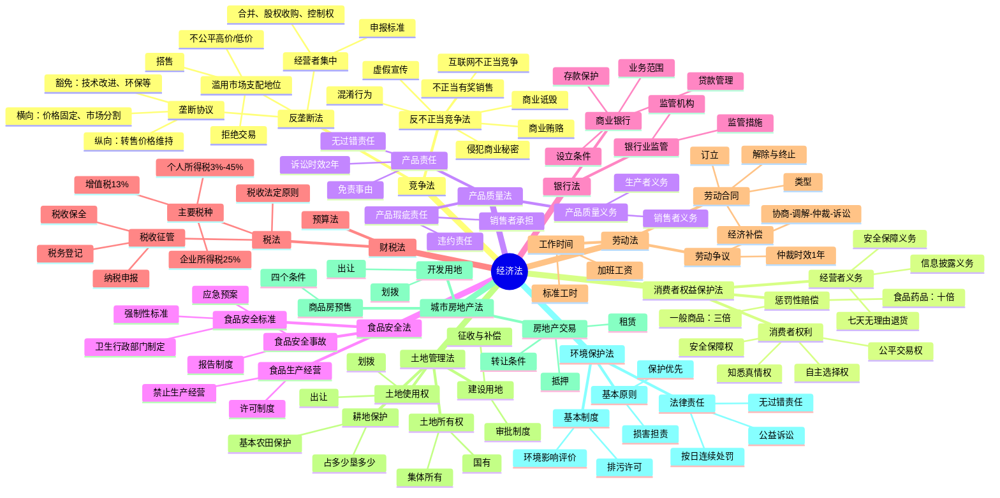

# 经济法 知识总结

## 思维导图

## 高频考点速查表

### 竞争法

| 考点 | 内容 | 考频 |
|------|------|------|
| 横向垄断协议 | 价格固定、数量限制、市场分割、联合抵制 | ★★★★★ |
| 纵向垄断协议 | 转售价格维持 | ★★★★☆ |
| 垄断协议豁免 | 技术改进、标准化、中小企业、环保、经济不景气 | ★★★★☆ |
| 市场支配地位 | 60%市场份额可推定 | ★★★★★ |
| 滥用市场支配地位 | 不公平价格、拒绝交易、搭售、差别待遇 | ★★★★★ |
| 经营者集中 | 全球100亿+中国4亿 | ★★★★☆ |
| 混淆行为 | 擅自使用他人有一定影响的标识 | ★★★★★ |
| 虚假宣传 | 对商品性能等作虚假宣传 | ★★★★☆ |
| 商业诋毁 | 编造虚假信息损害竞争对手 | ★★★★☆ |
| 互联网不正当竞争 | 强制跳转、恶意不兼容 | ★★★★☆ |

### 消费者权益保护法

| 考点 | 内容 | 考频 |
|------|------|------|
| 七天无理由退货 | 网络购物，4类商品除外 | ★★★★★ |
| 三倍赔偿 | 欺诈行为，最低500元 | ★★★★★ |
| 十倍赔偿 | 不符合食品安全标准，最低1000元 | ★★★★★ |
| 网络平台责任 | 不能提供销售者信息时承担赔偿责任 | ★★★★☆ |
| 展销会责任 | 结束后可向举办者要求赔偿 | ★★★☆☆ |

### 产品质量法

| 考点 | 内容 | 考频 |
|------|------|------|
| 生产者责任 | 无过错责任 | ★★★★★ |
| 销售者责任 | 过错责任，不能指明生产者时无过错 | ★★★★☆ |
| 免责事由 | 未投入流通、投入时无缺陷、科技水平限制 | ★★★★★ |
| 诉讼时效 | 2年 | ★★★★☆ |
| 最长保护期 | 10年 | ★★★★☆ |

### 劳动法

| 考点 | 内容 | 考频 |
|------|------|------|
| 书面劳动合同 | 用工之日起1个月内 | ★★★★★ |
| 二倍工资 | 超过1个月不满1年未签书面合同 | ★★★★★ |
| 无固定期限合同 | 连续工作满10年、连续订立2次固定期限 | ★★★★★ |
| 试用期 | 最长6个月 | ★★★★☆ |
| 经济补偿 | 每满1年支付1个月工资 | ★★★★★ |
| 加班工资 | 150%、200%、300% | ★★★★★ |
| 仲裁时效 | 1年 | ★★★★☆ |
| 不得解除情形 | 孕期产期哺乳期、职业病、医疗期 | ★★★★★ |

### 土地管理法与房地产法

| 考点 | 内容 | 考频 |
|------|------|------|
| 国有土地 | 城市市区 | ★★★★☆ |
| 集体土地 | 农村和城市郊区（除国有外） | ★★★★☆ |
| 宅基地 | 一户一宅 | ★★★★☆ |
| 永久基本农田 | 国务院审批转建设用地 | ★★★★★ |
| 出让年限 | 居住70年、工业50年、商业40年 | ★★★★★ |
| 商品房预售 | 四个条件（土地证+规划证+25%+预售证） | ★★★★★ |

### 财税法

| 考点 | 内容 | 考频 |
|------|------|------|
| 增值税基本税率 | 13% | ★★★★☆ |
| 企业所得税基本税率 | 25% | ★★★★★ |
| 个人所得税综合所得 | 3%-45% | ★★★★☆ |
| 税收优先权 | 优先于无担保债权 | ★★★★☆ |
| 税收保全 | 县以上税务局局长批准 | ★★★★☆ |

## 易混淆概念对比

### 产品责任 vs 产品瑕疵责任

| 比较项 | 产品责任 | 产品瑕疵责任 |
|--------|----------|-------------|
| 性质 | 侵权责任 | 违约责任 |
| 归责原则 | 无过错责任 | 过错责任 |
| 责任主体 | 生产者（无过错）、销售者（过错） | 销售者 |
| 诉讼时效 | 2年 | 1年（买卖合同） |
| 最长保护期 | 10年 | - |

### 三倍赔偿 vs 十倍赔偿

| 比较项 | 三倍赔偿 | 十倍赔偿 |
|--------|----------|----------|
| 适用情形 | 欺诈行为 | 不符合食品安全标准 |
| 赔偿基数 | 商品价款或服务费用 | 商品价款或损失 |
| 最低金额 | 500元 | 1000元 |
| 法律依据 | 消费者权益保护法 | 食品安全法 |

### 横向垄断协议 vs 纵向垄断协议

| 比较项 | 横向垄断协议 | 纵向垄断协议 |
|--------|-------------|-------------|
| 主体 | 具有竞争关系的经营者 | 经营者与交易相对人 |
| 典型行为 | 价格固定、市场分割 | 转售价格维持 |
| 危害程度 | 更严重 | 相对较轻 |
| 豁免可能 | 有豁免情形 | 一般不适用豁免 |
