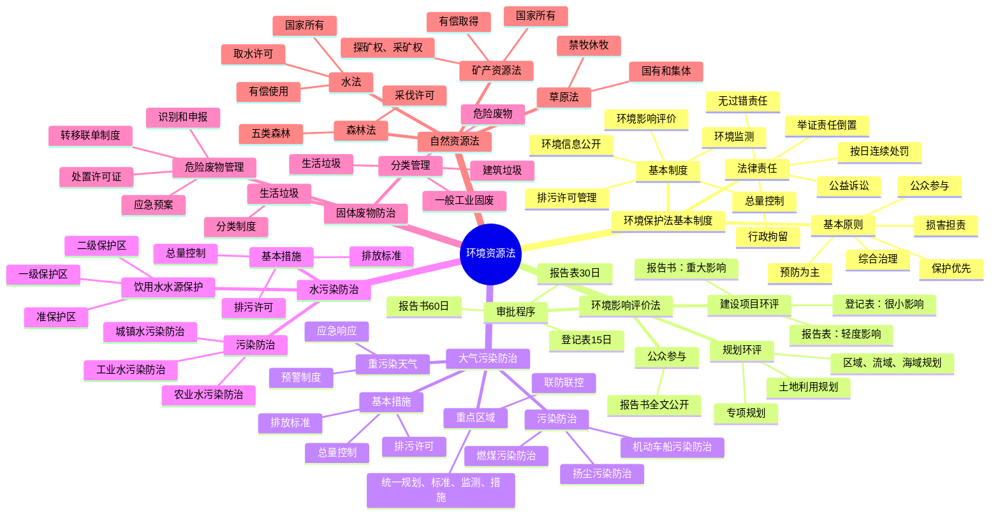

# 环境资源法 知识总结

## 思维导图

## 高频考点速查表

### 环境保护法基本制度

| 考点 | 内容 | 考频 |
|------|------|------|
| 基本原则 | 保护优先、预防为主、综合治理、公众参与、损害担责 | ★★★★★ |
| 环境影响评价 | 规划环评和建设项目环评 | ★★★★★ |
| 排污许可管理 | 按证排污，无证不得排污 | ★★★★★ |
| 环境公益诉讼 | 设区市级以上登记，连续5年，无违法记录 | ★★★★★ |
| 无过错责任 | 污染者承担举证责任倒置 | ★★★★★ |
| 按日连续处罚 | 拒不改正的，按原处罚数额按日连续处罚 | ★★★★★ |
| 行政拘留 | 10-15日，情节较轻5-10日 | ★★★★☆ |

### 环境影响评价法

| 考点 | 内容 | 考频 |
|------|------|------|
| 环评分类 | 报告书、报告表、登记表 | ★★★★★ |
| 审批时限 | 报告书60日、报告表30日、登记表15日 | ★★★★☆ |
| 公众参与 | 报告书全文公开，征求公众意见 | ★★★★☆ |
| 未批先建 | 总投资额1%-5%罚款 | ★★★★★ |
| 环评造假 | 所收费用3-5倍罚款 | ★★★★☆ |

### 污染防治法

| 考点 | 内容 | 考频 |
|------|------|------|
| 超标排放 | 10-100万元罚款 | ★★★★★ |
| 重点区域联防联控 | 统一规划、标准、监测、措施 | ★★★★☆ |
| 饮用水水源保护 | 一级、二级保护区 | ★★★★★ |
| 危险废物转移 | 转移联单制度 | ★★★★☆ |
| 生活垃圾分类 | 国家推行分类制度 | ★★★★☆ |

### 自然资源法

| 考点 | 内容 | 考频 |
|------|------|------|
| 水资源所有权 | 国家所有 | ★★★★☆ |
| 取水许可 | 家庭生活少量取水除外 | ★★★★☆ |
| 矿产资源所有权 | 国家所有 | ★★★★☆ |
| 探矿权、采矿权 | 申请取得，有偿取得 | ★★★★☆ |
| 森林分类 | 防护林、用材林、经济林、薪炭林、特种用途林 | ★★★★☆ |
| 采伐许可 | 农村居民自留地零星林木除外 | ★★★★☆ |

## 易混淆概念对比

### 环境影响评价分类

| 类型 | 适用情形 | 评价深度 | 审批时限 |
|------|----------|----------|----------|
| 环境影响报告书 | 可能造成重大环境影响 | 全面评价 | 60日 |
| 环境影响报告表 | 可能造成轻度环境影响 | 分析或专项评价 | 30日 |
| 环境影响登记表 | 对环境影响很小 | 填报登记 | 15日 |

### 饮用水水源保护区

| 保护区 | 禁止行为 |
|--------|----------|
| 一级保护区 | 禁止新建、改建、扩建与供水设施和保护水源无关的建设项目 |
| 二级保护区 | 禁止新建、改建、扩建排放污染物的建设项目 |
| 准保护区 | 禁止新建、扩建对水体污染严重的建设项目 |

### 污染防治罚款对比

| 违法行为 | 罚款数额 |
|----------|----------|
| 超标排放大气污染物 | 10-100万元 |
| 超标排放水污染物 | 10-100万元 |
| 在饮用水水源保护区设置排污口 | 10-50万元 |
| 未批先建 | 总投资额1%-5% |
| 环评弄虚作假 | 所收费用3-5倍 |
