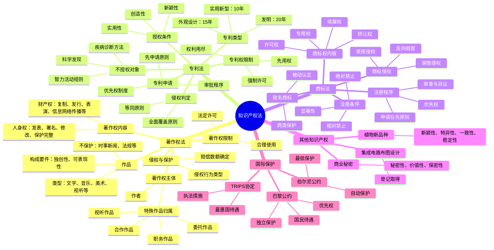

# 知识产权法 知识总结

## 思维导图

## 高频考点速查表

### 著作权法

| 考点 | 内容 | 考频 |
|------|------|------|
| 著作权取得 | 自动取得，创作完成即享有 | ★★★★★ |
| 作品构成要件 | 独创性、可表现性、属于文学艺术科学领域 | ★★★★★ |
| 著作人身权 | 发表权、署名权、修改权、保护作品完整权 | ★★★★☆ |
| 著作财产权 | 复制权、发行权、表演权、信息网络传播权等 | ★★★★★ |
| 合理使用 | 10种法定情形，不需许可不付费 | ★★★★★ |
| 法定许可 | 教科书、报刊转载、录音、广播 | ★★★★☆ |
| 职务作品 | 一般归作者，特殊归单位 | ★★★★☆ |
| 委托作品 | 有约定从约定，无约定归受托人 | ★★★★☆ |
| 视听作品 | 著作权归制作者 | ★★★★☆ |
| 保护期限 | 人身权永久（发表权除外），财产权终生+50年 | ★★★★☆ |

### 专利法

| 考点 | 内容 | 考频 |
|------|------|------|
| 专利类型 | 发明20年、实用新型10年、外观设计15年 | ★★★★★ |
| 授权条件 | 新颖性、创造性、实用性 | ★★★★★ |
| 不授权对象 | 科学发现、疾病诊断方法、智力活动规则 | ★★★★★ |
| 先申请原则 | 同日申请以使用在先为准 | ★★★★☆ |
| 优先权 | 发明/实用新型12个月，外观设计6个月 | ★★★★☆ |
| 新颖性宽限期 | 6个月内：国际展览、学术会议、他人泄露 | ★★★★★ |
| 强制许可 | 未实施3年、反垄断、公共利益、从属专利 | ★★★★☆ |
| 侵权判定 | 全面覆盖、等同原则、禁止反悔 | ★★★★★ |
| 惩罚性赔偿 | 故意侵权情节严重，1-5倍 | ★★★☆☆ |

### 商标法

| 考点 | 内容 | 考频 |
|------|------|------|
| 注册条件 | 显著性、不违反禁止性规定 | ★★★★★ |
| 绝对禁止 | 国家名称、国旗、地名、民族歧视等 | ★★★★★ |
| 相对禁止 | 通用名称、描述性标志（可通过使用获得显著性） | ★★★★☆ |
| 申请在先原则 | 同日申请以使用在先为准 | ★★★★☆ |
| 保护期限 | 10年，可续展 | ★★★★★ |
| 商标侵权 | 相同商标+相同商品；近似商标+类似商品 | ★★★★★ |
| 反向假冒 | 更换商标后再投入市场 | ★★★★☆ |
| 驰名商标 | 被动认定、跨类保护、不得用于广告 | ★★★★★ |
| 惩罚性赔偿 | 恶意侵权情节严重，1-5倍 | ★★★☆☆ |

### 商业秘密

| 考点 | 内容 | 考频 |
|------|------|------|
| 构成要件 | 秘密性、价值性、保密性 | ★★★★☆ |
| 侵权行为 | 不正当手段获取、违反保密义务、第三人侵权 | ★★★★☆ |
| 举证责任 | 权利人提供初步证据后举证责任转移 | ★★★☆☆ |
| 合理手段 | 反向工程、独立开发 | ★★★☆☆ |

### 国际保护

| 考点 | 内容 | 考频 |
|------|------|------|
| 巴黎公约 | 国民待遇、优先权、独立保护 | ★★★★☆ |
| 伯尔尼公约 | 国民待遇、自动保护、最低保护 | ★★★★☆ |
| TRIPS协定 | 最惠国待遇、执法措施 | ★★★★☆ |
| PCT体系 | 国际专利申请 | ★★★☆☆ |
| 马德里体系 | 国际商标注册 | ★★★☆☆ |

## 易混淆概念对比

### 著作权 vs 专利权 vs 商标权

| 比较项 | 著作权 | 专利权 | 商标权 |
|--------|--------|--------|--------|
| 保护对象 | 作品 | 发明创造 | 商标标识 |
| 取得方式 | 自动取得 | 申请授权 | 申请注册 |
| 保护条件 | 独创性 | 新颖性、创造性、实用性 | 显著性 |
| 保护期限 | 作者终生+50年 | 发明20年/实用新型10年/外观设计15年 | 10年（可续展） |
| 权利限制 | 合理使用、法定许可 | 权利用尽、强制许可 | 合理使用、在先使用 |

### 合理使用 vs 法定许可

| 比较项 | 合理使用 | 法定许可 |
|--------|----------|----------|
| 是否需要许可 | 不需要 | 不需要 |
| 是否需要付费 | 不需要 | 需要 |
| 适用情形 | 个人学习、评论引用、新闻报道等 | 教科书、报刊转载、录音等 |
| 法律依据 | 《著作权法》第24条 | 《著作权法》相关条款 |
