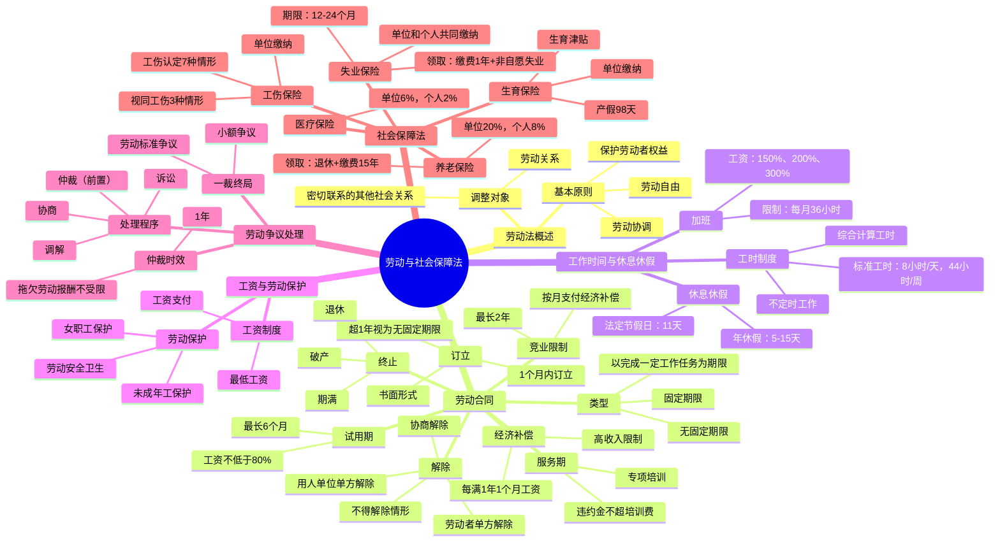

# 劳动与社会保障法 知识总结

## 思维导图

## 高频考点速查表

### 劳动合同

| 考点 | 内容 | 考频 |
|------|------|------|
| 书面形式 | 用工之日起1个月内 | ★★★★★ |
| 二倍工资 | 超过1个月不满1年未签书面合同 | ★★★★★ |
| 无固定期限合同 | 连续工作满10年、连续订立2次固定期限 | ★★★★★ |
| 试用期 | 最长6个月，工资不低于80% | ★★★★★ |
| 服务期 | 专项培训，违约金不超培训费 | ★★★★☆ |
| 竞业限制 | 最长2年，按月支付补偿 | ★★★★☆ |
| 经济补偿 | 每满1年1个月工资 | ★★★★★ |
| 违法解除 | 经济补偿标准二倍的赔偿金 | ★★★★★ |
| 不得解除 | 孕期产期哺乳期、职业病、医疗期 | ★★★★★ |

### 工作时间与休息休假

| 考点 | 内容 | 考频 |
|------|------|------|
| 标准工时 | 8小时/天，44小时/周 | ★★★★☆ |
| 加班限制 | 每月36小时 | ★★★★☆ |
| 加班工资 | 150%、200%、300% | ★★★★★ |
| 年休假 | 5天、10天、15天 | ★★★★☆ |
| 法定节假日 | 11天 | ★★★☆☆ |

### 劳动争议处理

| 考点 | 内容 | 考频 |
|------|------|------|
| 处理程序 | 协商-调解-仲裁-诉讼 | ★★★★★ |
| 仲裁前置 | 必须先仲裁后诉讼 | ★★★★★ |
| 仲裁时效 | 1年，拖欠劳动报酬不受限 | ★★★★★ |
| 一裁终局 | 小额争议、劳动标准争议 | ★★★★☆ |
| 举证责任 | 开除等由用人单位举证 | ★★★★☆ |

### 社会保障法

| 考点 | 内容 | 考频 |
|------|------|------|
| 养老保险缴费 | 单位不超过20%，个人8% | ★★★★☆ |
| 养老金领取 | 退休+缴费满15年 | ★★★★★ |
| 工伤认定 | 7种应当认定+3种视同 | ★★★★★ |
| 工伤保险缴费 | 单位缴纳，个人不缴 | ★★★★☆ |
| 失业保险领取 | 缴费满1年+非自愿失业+登记 | ★★★★★ |
| 失业保险期限 | 12个月、18个月、24个月 | ★★★★☆ |
| 生育保险 | 单位缴纳，产假98天 | ★★★★☆ |

## 易混淆概念对比

### 经济补偿金 vs 赔偿金

| 比较项 | 经济补偿金 | 赔偿金 |
|--------|-----------|--------|
| 适用情形 | 合法解除/终止 | 违法解除/终止 |
| 计算标准 | 每满1年1个月工资 | 经济补偿标准的2倍 |
| 是否封顶 | 高收入者有12年上限 | 无上限 |
| 支付时间 | 解除/终止时 | 违法行为发生时 |

### 劳动关系 vs 劳务关系

| 比较项 | 劳动关系 | 劳务关系 |
|--------|----------|----------|
| 主体 | 劳动者与用人单位 | 自然人、法人、非法人组织 |
| 从属性 | 人身从属性 | 无从属性 |
| 适用法律 | 劳动法 | 民法 |
| 争议处理 | 劳动仲裁前置 | 直接起诉 |
| 社会保险 | 用人单位缴纳 | 无 |

### 工伤认定 vs 视同工伤

| 比较项 | 工伤认定 | 视同工伤 |
|--------|----------|----------|
| 典型情形 | 工作原因受伤、职业病、上下班交通事故 | 突发疾病48小时内死亡、抢险救灾 |
| 举证责任 | 用人单位 | 用人单位 |
| 待遇 | 相同 | 相同 |
