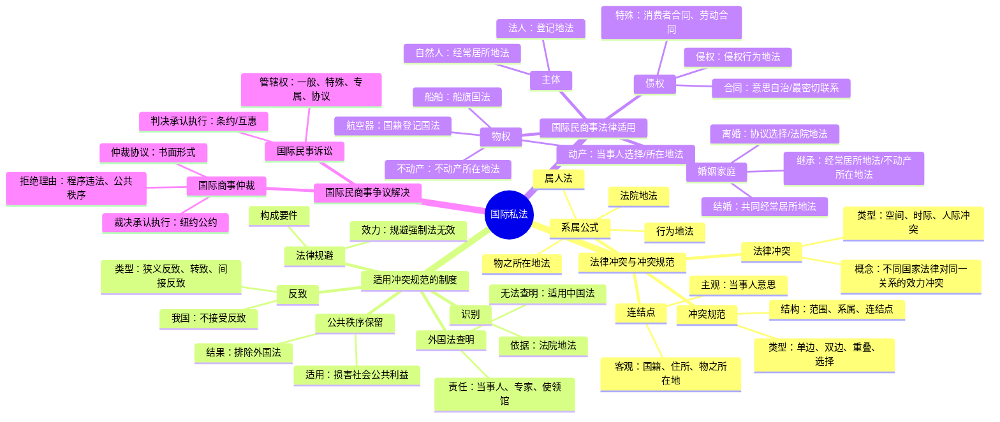

# 国际私法 知识总结

## 思维导图

## 高频考点速查表

### 冲突规范

| 考点 | 内容 | 考频 |
|------|------|------|
| 冲突规范结构 | 范围、系属、连结点 | ★★★★★ |
| 单边冲突规范 | 直接规定适用某国法律 | ★★★★☆ |
| 双边冲突规范 | 规定连结点，不直接规定适用何国 | ★★★★☆ |
| 选择适用的冲突规范 | 可以选择适用 | ★★★★☆ |
| 重叠适用的冲突规范 | 必须同时适用 | ★★★☆☆ |

### 适用冲突规范的制度

| 考点 | 内容 | 考频 |
|------|------|------|
| 识别 | 依法院地法 | ★★★★☆ |
| 反致 | 我国不接受 | ★★★★★ |
| 法律规避 | 规避强制法无效 | ★★★★☆ |
| 公共秩序保留 | 损害社会公共利益 | ★★★★★ |
| 外国法查明 | 无法查明适用中国法 | ★★★★★ |

### 国际民商事法律适用

| 考点 | 内容 | 考频 |
|------|------|------|
| 自然人行为能力 | 经常居所地法 | ★★★★☆ |
| 法人权利能力 | 登记地法 | ★★★★☆ |
| 不动产物权 | 不动产所在地法 | ★★★★★ |
| 船舶物权 | 船旗国法 | ★★★★☆ |
| 合同法律适用 | 意思自治/最密切联系 | ★★★★★ |
| 侵权法律适用 | 侵权行为地法 | ★★★★★ |
| 诉讼离婚 | 法院地法 | ★★★★★ |
| 法定继承 | 经常居所地法/不动产所在地法 | ★★★★★ |

### 国际民商事争议解决

| 考点 | 内容 | 考频 |
|------|------|------|
| 不动产管辖 | 不动产所在地法院 | ★★★★☆ |
| 协议管辖 | 书面+有实际联系 | ★★★★☆ |
| 仲裁协议 | 书面形式，独立存在 | ★★★★★ |
| 纽约公约 | 互惠保留+商事保留 | ★★★★★ |
| 拒绝承认执行 | 程序违法、公共秩序 | ★★★★☆ |

## 易混淆概念对比

### 反致的类型

| 类型 | 含义 | 示例 |
|------|------|------|
| 狭义反致 | 甲国→乙国法→甲国法 | 反致回国 |
| 转致 | 甲国→乙国法→丙国法 | 转向第三国 |
| 间接反致 | 甲国→乙国法→丙国法→甲国法 | 间接回国 |

### 冲突规范的类型

| 类型 | 特点 | 示例 |
|------|------|------|
| 单边冲突规范 | 直接规定适用某国法律 | "适用中国法律" |
| 双边冲突规范 | 规定连结点，不直接规定 | "适用不动产所在地法律" |
| 选择适用的冲突规范 | 可以选择适用 | "适用A法或B法" |
| 重叠适用的冲突规范 | 必须同时适用 | "同时适用A法和B法" |

### 法律适用对比

| 事项 | 法律适用 |
|------|----------|
| 不动产物权 | 不动产所在地法 |
| 船舶物权 | 船旗国法 |
| 航空器物权 | 国籍登记国法 |
| 合同 | 意思自治/最密切联系 |
| 侵权 | 侵权行为地法 |
| 诉讼离婚 | 法院地法 |
| 不动产继承 | 不动产所在地法 |
