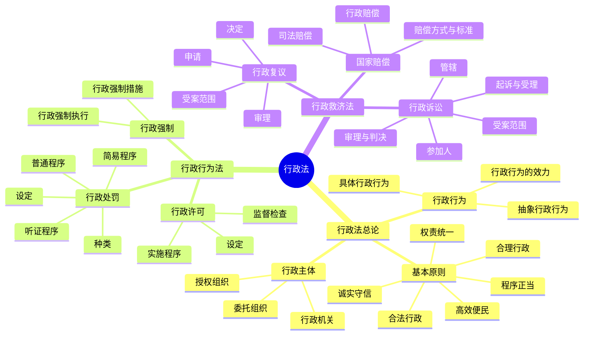

# 行政法与行政诉讼法总结

## 思维导图

## 高频考点

| 考点 | 频率 | 重要程度 | 考查方式 |
|------|------|---------|---------|
| 行政处罚的种类 | ⭐⭐⭐⭐⭐ | ⭐⭐⭐⭐⭐ | 概念辨析 |
| 行政处罚的程序 | ⭐⭐⭐⭐⭐ | ⭐⭐⭐⭐⭐ | 案例分析 |
| 行政许可的设定 | ⭐⭐⭐⭐ | ⭐⭐⭐⭐ | 概念辨析 |
| 行政强制措施与执行的区别 | ⭐⭐⭐⭐ | ⭐⭐⭐⭐ | 概念辨析 |
| 行政复议的申请 | ⭐⭐⭐⭐ | ⭐⭐⭐⭐ | 案例分析 |
| 行政诉讼的受案范围 | ⭐⭐⭐⭐⭐ | ⭐⭐⭐⭐⭐ | 案例分析 |
| 行政诉讼的管辖 | ⭐⭐⭐⭐ | ⭐⭐⭐⭐ | 案例分析 |
| 行政诉讼的被告 | ⭐⭐⭐⭐⭐ | ⭐⭐⭐⭐⭐ | 案例分析 |
| 行政诉讼的判决类型 | ⭐⭐⭐⭐⭐ | ⭐⭐⭐⭐⭐ | 案例分析 |
| 国家赔偿的范围 | ⭐⭐⭐⭐ | ⭐⭐⭐⭐ | 案例分析 |

## 重点比较表

### 1. 行政处罚与行政强制

| 比较项 | 行政处罚 | 行政强制 |
|--------|---------|---------|
| 目的 | 制裁违法行为 | 实现行政目的 |
| 时间 | 行为发生后 | 可以在行为发生前 |
| 性质 | 制裁性 | 执行性 |

### 2. 行政强制措施与行政强制执行

| 比较项 | 行政强制措施 | 行政强制执行 |
|--------|-------------|-------------|
| 目的 | 制止违法行为 | 实现行政决定 |
| 时间 | 行政决定前 | 行政决定后 |
| 性质 | 临时性 | 终结性 |

### 3. 行政复议与行政诉讼

| 比较项 | 行政复议 | 行政诉讼 |
|--------|---------|---------|
| 受理机关 | 行政机关 | 人民法院 |
| 审查范围 | 合法性与合理性 | 一般只审查合法性 |
| 申请期限 | 60日 | 6个月 |
| 审理方式 | 书面审查 | 开庭审理 |

### 4. 行政赔偿与司法赔偿

| 比较项 | 行政赔偿 | 司法赔偿 |
|--------|---------|---------|
| 侵权主体 | 行政机关 | 司法机关 |
| 侵权行为 | 行政行为 | 司法行为 |
| 程序 | 先向赔偿义务机关申请 | 先向赔偿义务机关申请 |
