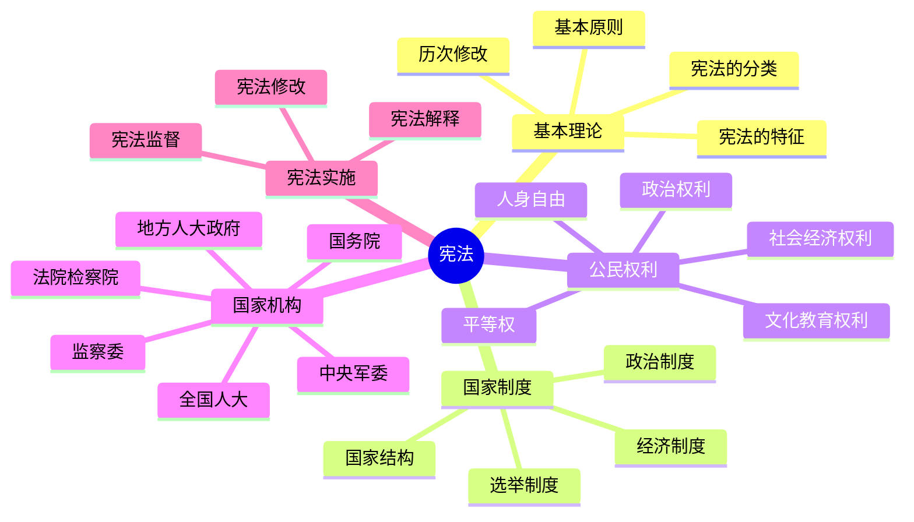

# 宪法 总结

## 思维导图

## 高频考点速记表

| 考点 | 核心内容 | 关键词 |
|------|----------|--------|
| 宪法特征 | 内容最根本、效力最高、程序最严格 | 根本法 |
| 基本原则 | 人民主权、基本人权、法治、权力制约 | 四项原则 |
| 根本政治制度 | 人民代表大会制度 | 人大制度 |
| 基本政治制度 | 多党合作、民族区域自治、基层自治 | 三项制度 |
| 公民权利 | 政治权利、人身自由、社会经济权利 | 六大自由 |
| 全国人大 | 最高国家权力机关 | 立法权人事权 |
| 国务院 | 最高国家行政机关 | 总理负责制 |
| 监察委 | 国家监察机关 | 监督调查处置 |
| 法院 | 审判机关 | 监督关系 |
| 检察院 | 法律监督机关 | 领导关系 |
| 宪法修改 | 常委会或1/5代表提案，2/3通过 | 严格程序 |
| 宪法监督 | 全国人大及其常委会 | 合宪性审查 |

## 易混淆概念对比

| 概念A | 概念B | 区别要点 |
|-------|-------|----------|
| 根本政治制度 | 基本政治制度 | 人大制度vs多党合作/民族自治/基层自治 |
| 上下级法院 | 上下级检察院 | 监督关系vs领导关系 |
| 审判机关 | 法律监督机关 | 法院vs检察院 |
| 选举权 | 被选举权 | 年满18周岁，未被剥夺政治权利 |
| 直接选举 | 间接选举 | 县乡直接vs县级以上间接 |
| 宪法解释 | 宪法修改 | 解释=常委会；修改=全国人大2/3 |
