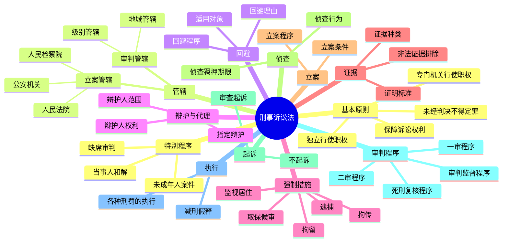

# 刑事诉讼法总结

## 思维导图

## 高频考点

| 考点 | 频率 | 重要程度 | 考查方式 |
|------|------|---------|---------|
| 立案管辖 | ⭐⭐⭐⭐ | ⭐⭐⭐⭐ | 概念辨析 |
| 级别管辖 | ⭐⭐⭐⭐ | ⭐⭐⭐⭐ | 案例分析 |
| 辩护人的范围和权利 | ⭐⭐⭐⭐ | ⭐⭐⭐⭐ | 概念辨析 |
| 取保候审 | ⭐⭐⭐⭐⭐ | ⭐⭐⭐⭐⭐ | 案例分析 |
| 逮捕的条件 | ⭐⭐⭐⭐⭐ | ⭐⭐⭐⭐⭐ | 案例分析 |
| 非法证据排除 | ⭐⭐⭐⭐⭐ | ⭐⭐⭐⭐⭐ | 案例分析 |
| 审查起诉 | ⭐⭐⭐⭐ | ⭐⭐⭐⭐ | 概念辨析 |
| 不起诉的种类 | ⭐⭐⭐⭐⭐ | ⭐⭐⭐⭐⭐ | 概念辨析 |
| 一审程序 | ⭐⭐⭐⭐⭐ | ⭐⭐⭐⭐⭐ | 案例分析 |
| 上诉不加刑原则 | ⭐⭐⭐⭐⭐ | ⭐⭐⭐⭐⭐ | 案例分析 |
| 死刑复核 | ⭐⭐⭐⭐ | ⭐⭐⭐⭐ | 概念辨析 |

## 重点比较表

### 1. 拘传、取保候审、监视居住、拘留、逮捕

| 措施 | 期限 | 执行机关 |
|------|------|---------|
| 拘传 | 12小时（最长24小时） | 公安机关 |
| 取保候审 | 12个月 | 公安机关 |
| 监视居住 | 6个月 | 公安机关 |
| 拘留 | 14日（最长37日） | 公安机关 |
| 逮捕 | 至案件审结 | 公安机关 |

### 2. 法定不起诉、酌定不起诉、存疑不起诉

| 类型 | 条件 |
|------|------|
| 法定不起诉 | 没有犯罪事实或依法不追究刑事责任 |
| 酌定不起诉 | 犯罪情节轻微，不需要判处刑罚或免除刑罚 |
| 存疑不起诉 | 二次补充侦查后证据不足 |

### 3. 一审程序、二审程序

| 比较项 | 一审程序 | 二审程序 |
|--------|---------|---------|
| 审理对象 | 公诉或自诉案件 | 一审判决、裁定 |
| 审查范围 | 案件事实和法律适用 | 全面审查 |
| 审理方式 | 开庭审理 | 开庭审理或书面审理 |
| 判决效力 | 可以上诉、抗诉 | 终审判决 |

### 4. 公诉案件与自诉案件

| 比较项 | 公诉案件 | 自诉案件 |
|--------|---------|---------|
| 提起主体 | 人民检察院 | 自诉人 |
| 审查程序 | 审查起诉 | 直接起诉 |
| 审理程序 | 普通程序 | 可以调解 |
