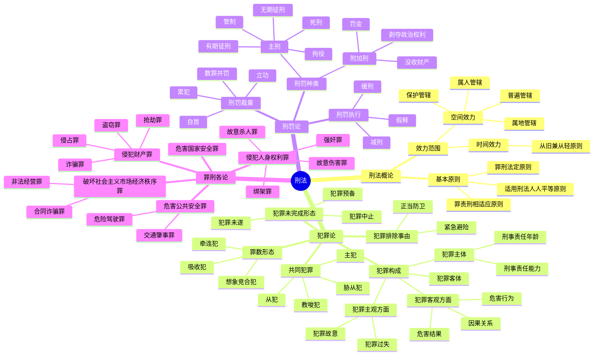

# 刑法总结

## 思维导图

## 高频考点

| 考点 | 频率 | 重要程度 | 考查方式 |
|------|------|---------|---------|
| 罪刑法定原则 | ⭐⭐⭐⭐ | ⭐⭐⭐⭐ | 概念辨析 |
| 刑事责任年龄 | ⭐⭐⭐⭐⭐ | ⭐⭐⭐⭐⭐ | 案例分析 |
| 不作为犯罪 | ⭐⭐⭐⭐ | ⭐⭐⭐⭐ | 案例分析 |
| 正当防卫 | ⭐⭐⭐⭐⭐ | ⭐⭐⭐⭐⭐ | 案例分析 |
| 犯罪未遂与中止 | ⭐⭐⭐⭐⭐ | ⭐⭐⭐⭐⭐ | 案例分析 |
| 共同犯罪 | ⭐⭐⭐⭐⭐ | ⭐⭐⭐⭐⭐ | 案例分析 |
| 累犯 | ⭐⭐⭐⭐ | ⭐⭐⭐⭐ | 概念辨析 |
| 自首 | ⭐⭐⭐⭐⭐ | ⭐⭐⭐⭐⭐ | 案例分析 |
| 数罪并罚 | ⭐⭐⭐⭐ | ⭐⭐⭐⭐ | 计算题 |
| 抢劫罪 | ⭐⭐⭐⭐⭐ | ⭐⭐⭐⭐⭐ | 案例分析 |
| 盗窃罪 | ⭐⭐⭐⭐⭐ | ⭐⭐⭐⭐⭐ | 案例分析 |
| 诈骗罪 | ⭐⭐⭐⭐ | ⭐⭐⭐⭐ | 案例分析 |
| 绑架罪 | ⭐⭐⭐⭐ | ⭐⭐⭐⭐ | 案例分析 |
| 交通肇事罪 | ⭐⭐⭐⭐ | ⭐⭐⭐⭐ | 案例分析 |

## 重点比较表

### 1. 正当防卫与紧急避险

| 比较项 | 正当防卫 | 紧急避险 |
|--------|---------|---------|
| 危险来源 | 人的不法侵害 | 各种危险 |
| 损害对象 | 不法侵害人本人 | 第三者合法权益 |
| 适用限制 | 无限制 | 不得已而为之 |
| 必要限度 | 造成的损害可以等于所保护的损害 | 造成的损害必须小于所保护的损害 |

### 2. 犯罪未遂与犯罪中止

| 比较项 | 犯罪未遂 | 犯罪中止 |
|--------|---------|---------|
| 停止原因 | 意志以外的原因 | 自动放弃 |
| 主观态度 | 欲而不能 | 能而不欲 |
| 处罚原则 | 可以从轻或减轻处罚 | 没有造成损害的免除处罚，造成损害的减轻处罚 |

### 3. 主犯、从犯、胁从犯

| 类型 | 定义 | 处罚原则 |
|------|------|---------|
| 主犯 | 起主要作用 | 按全部犯罪处罚 |
| 从犯 | 起次要或辅助作用 | 应当从轻、减轻或免除处罚 |
| 胁从犯 | 被胁迫参加犯罪 | 应当减轻或免除处罚 |

### 4. 盗窃罪、诈骗罪、侵占罪

| 罪名 | 行为方式 | 犯罪对象 |
|------|---------|---------|
| 盗窃罪 | 秘密窃取 | 他人占有的财物 |
| 诈骗罪 | 虚构事实或隐瞒真相 | 他人占有的财物 |
| 侵占罪 | 拒不退还或拒不交出 | 自己占有的他人财物 |

### 5. 抢劫罪与敲诈勒索罪

| 比较项 | 抢劫罪 | 敲诈勒索罪 |
|--------|--------|-----------|
| 威胁内容 | 暴力威胁 | 暴力或其他威胁 |
| 威胁时间 | 当场实现 | 将来实现 |
| 取得财物 | 当场取得 | 将来取得 |

### 6. 累犯与再犯

| 比较项 | 累犯 | 再犯 |
|--------|------|------|
| 前后罪要求 | 均为故意犯罪 | 无要求 |
| 刑度要求 | 前罪有期徒刑以上 | 无要求 |
| 时间要求 | 5年以内 | 无要求 |
| 法律后果 | 从重处罚，不得缓刑假释 | 无特殊规定 |

### 7. 自首与立功

| 比较项 | 自首 | 立功 |
|--------|------|------|
| 行为内容 | 如实供述自己的罪行 | 揭发他人犯罪或提供线索 |
| 法律后果 | 可以从轻或减轻处罚 | 可以从轻或减轻处罚 |
| 特殊情形 | 犯罪较轻的可以免除处罚 | 重大立功可以减轻或免除处罚 |
