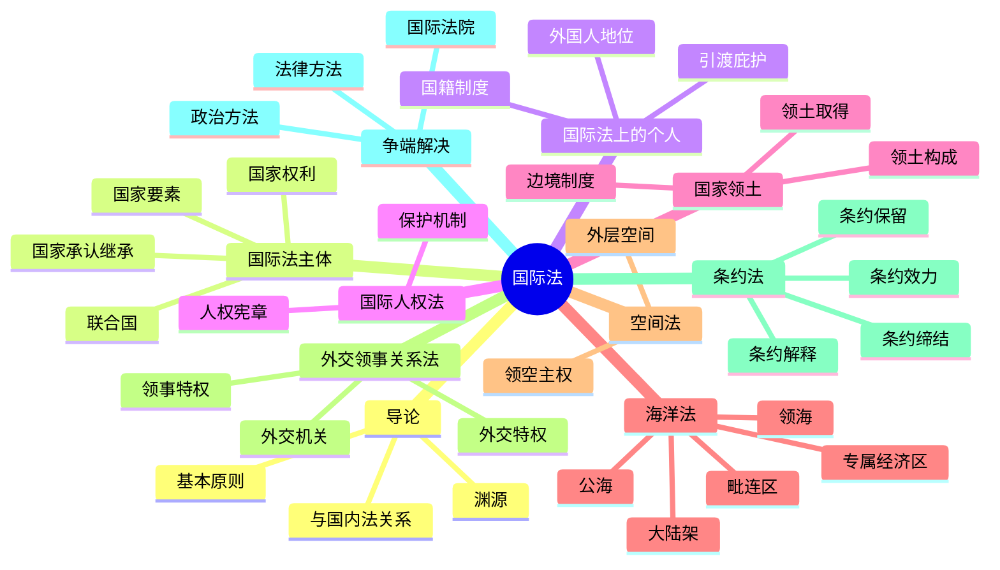

# 国际法 总结

## 思维导图

## 高频考点速记表

| 考点 | 核心内容 | 关键词 |
|------|----------|--------|
| 国际法渊源 | 条约、习惯、一般法律原则 | 三大渊源 |
| 基本原则 | 主权平等、不干涉内政、不使用武力 | 六大原则 |
| 国家要素 | 居民、领土、政府、主权 | 四要素 |
| 安理会 | 15理事国，9票通过，否决权 | 实质性问题 |
| 国籍 | 不承认双重国籍 | 我国国籍法 |
| 引渡 | 双重犯罪、政治犯不引渡 | 三大原则 |
| 领海 | 12海里，无害通过 | 12海里 |
| 专属经济区 | 200海里，主权权利 | 200海里 |
| 大陆架 | 自然延伸，最远350海里 | 自然延伸 |
| 外交特权 | 人身不可侵犯、管辖豁免 | 完全豁免 |
| 领事特权 | 执行职务范围内豁免 | 有限豁免 |
| 条约保留 | 单方面声明 | 限制条件 |
| 国际法院 | 海牙，15法官，9年任期 | 诉讼管辖 |

## 易混淆概念对比

| 概念A | 概念B | 区别要点 |
|-------|-------|----------|
| 领海 | 毗连区 | 12海里vs24海里 |
| 专属经济区 | 大陆架 | 200海里vs自然延伸 |
| 外交特权 | 领事特权 | 完全豁免vs有限豁免 |
| 属地管辖 | 属人管辖 | 领土内vs本国人 |
| 斡旋 | 调停 | 促成谈判vs提出方案 |
| 仲裁 | 司法解决 | 当事国选择vs国际法院 |
