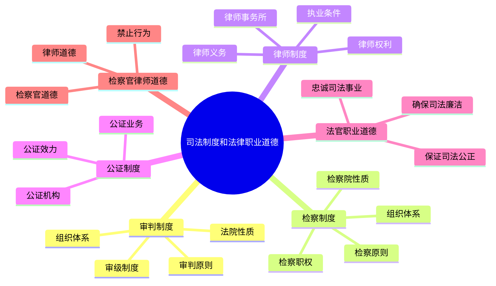

# 司法制度和法律职业道德 总结

## 思维导图

## 高频考点速记表

| 考点 | 核心内容 | 关键词 |
|------|----------|--------|
| 法院性质 | 审判机关 | 监督关系 |
| 检察院性质 | 法律监督机关 | 领导关系 |
| 两审终审 | 一个案件两级法院审判 | 终审判决 |
| 律师执业 | 实习1年，通过法考 | 执业条件 |
| 律师权利 | 阅卷、会见、调查取证、辩护 | 四大权利 |
| 律师禁止 | 私自收费、双方代理、收受贿赂 | 利益冲突 |
| 公证效力 | 证据效力、强制执行效力 | 证明机构 |
| 法官道德 | 忠诚、公正、廉洁、为民、形象 | 五大要求 |
| 检察官道德 | 忠诚、公正、清廉、文明 | 四大要求 |
| 律师道德 | 忠于当事人、诚实守信、勤勉尽责 | 维护权益 |

## 易混淆概念对比

| 概念A | 概念B | 区别要点 |
|-------|-------|----------|
| 审判机关 | 法律监督机关 | 法院vs检察院 |
| 上下级法院 | 上下级检察院 | 监督关系vs领导关系 |
| 法官回避 | 检察官回避 | 审判委员会决定vs检察长决定 |
| 合伙律所 | 个人律所 | 无限连带责任vs无限责任 |
| 公证效力 | 判决效力 | 证据效力vs强制执行 |
| 法官道德 | 律师道德 | 公正审判vs维护当事人权益 |
