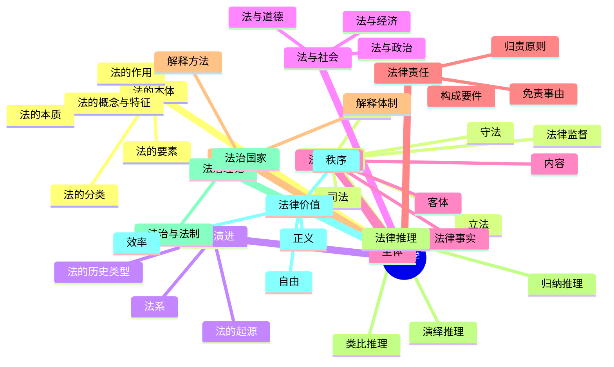

# 法理学 总结

## 思维导图

## 高频考点速记表

| 考点 | 核心内容 | 关键词 |
|------|----------|--------|
| 法的特征 | 规范性、国家意志性、普遍性、强制性、程序性 | 国家强制力 |
| 法的要素 | 规则、原则、概念 | 逻辑结构 |
| 法的作用 | 指引、评价、教育、预测、强制 | 规范作用 |
| 立法体制 | 统一而又分层次 | 全国人大立法权 |
| 执法与司法 | 主体、程序、主动性不同 | 不告不理 |
| 两大法系 | 大陆法系vs英美法系 | 成文法vs判例法 |
| 法与道德 | 联系与区别 | 外在行为vs内心 |
| 法律关系 | 主体、客体、内容 | 法律事实 |
| 法律责任 | 构成要件、归责、免责 | 责任法定 |
| 法律解释 | 文义、体系、历史、目的 | 扩大解释 |
| 法律推理 | 演绎、归纳、类比 | 三段论 |
| 法治vs法制 | 是否与民主相联系 | 法律至上 |
| 法律价值 | 秩序、自由、正义、效率 | 价值位阶 |

## 易混淆概念对比

| 概念A | 概念B | 区别要点 |
|-------|-------|----------|
| 法治 | 法制 | 法治与民主相联系；法制不一定 |
| 执法 | 司法 | 执法=行政机关，主动；司法=司法机关，被动 |
| 法律规则 | 法律原则 | 规则明确具体，全有全无；原则宽泛抽象，权衡适用 |
| 法律事件 | 法律行为 | 事件与意志无关；行为与意志有关 |
| 正式解释 | 非正式解释 | 正式=法定效力；非正式=学理性质 |
| 扩大解释 | 限制解释 | 扩大=含义宽于字面；限制=含义窄于字面 |
| 演绎推理 | 归纳推理 | 演绎=一般到个别；归纳=个别到一般 |
| 实体正义 | 程序正义 | 实体=结果正义；程序=过程正义 |
