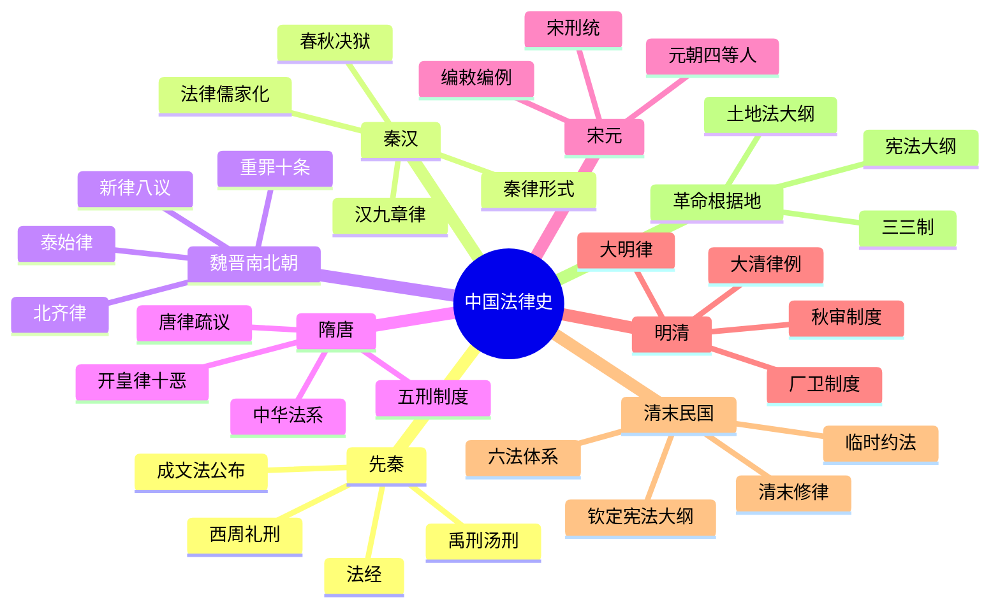

# 中国法律史 总结

## 思维导图

## 高频考点速记表

| 考点 | 核心内容 | 关键词 |
|------|----------|--------|
| 成文法公布 | 郑国子产铸刑书 | 公元前536年 |
| 法经 | 中国第一部成文法典 | 六篇 |
| 九章律 | 法经基础上增加三篇 | 萧何 |
| 春秋决狱 | 论心定罪 | 董仲舒 |
| 八议 | 贵族官僚减免处罚 | 曹魏新律 |
| 北齐律 | 首创名例律 | 重罪十条 |
| 开皇律 | 新五刑、十恶 | 隋朝 |
| 唐律疏议 | 中华法系代表 | 12篇502条 |
| 宋刑统 | 第一部刊印法典 | 宋朝 |
| 大明律 | 七篇体例 | 六部分篇 |
| 大清律例 | 最后一部封建法典 | 律例合编 |
| 钦定宪法大纲 | 第一部宪法性文件 | 1908年 |
| 临时约法 | 资产阶级宪法文件 | 1912年 |

## 重要法典一览表

| 法典 | 朝代 | 特点 |
|------|------|------|
| 法经 | 战国魏 | 第一部成文法典，六篇 |
| 九章律 | 汉 | 法经基础上增加三篇 |
| 新律 | 曹魏 | 具律改刑名，八议入律 |
| 泰始律 | 西晋 | 增设法例，准五服以制罪 |
| 北齐律 | 北齐 | 首创名例律，重罪十条 |
| 开皇律 | 隋 | 新五刑，十恶 |
| 唐律疏议 | 唐 | 中华法系代表，12篇502条 |
| 宋刑统 | 宋 | 第一部刊印法典 |
| 大明律 | 明 | 七篇，六部分篇 |
| 大清律例 | 清 | 最后一部封建法典 |
