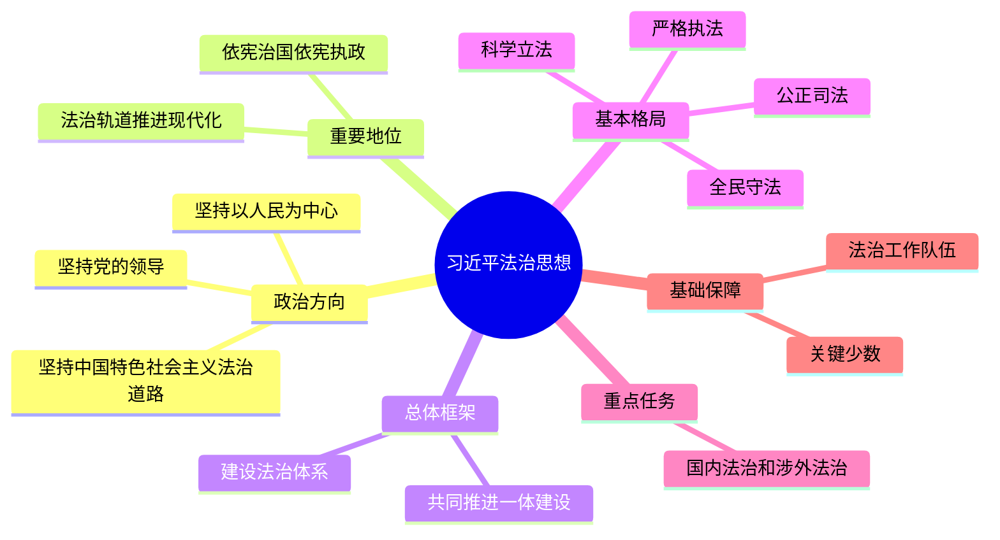

# 习近平法治思想 总结

## 思维导图

## 高频考点速记表

| 考点 | 核心内容 | 关键词 |
|------|----------|--------|
| 十一个坚持 | 习近平法治思想的核心内容 | 总纲灵魂 |
| 党的领导 | 全面依法治国的根本保证 | 根本保证 |
| 以人民为中心 | 最广泛最深厚的基础是人民 | 人民主体 |
| 依宪治国 | 依法治国首先要依宪治国 | 宪法至上 |
| 法治体系 | 全面推进依法治国的总抓手 | 五大体系 |
| 鸟之两翼 | 改革和法治的关系 | 于法有据 |
| 法德结合 | 法律是成文的道德 | 相辅相成 |
| 公正司法 | 维护公平正义的最后防线 | 最后防线 |
| 关键少数 | 领导干部要做尊法学法守法用法模范 | 率先垂范 |
| 涉外法治 | 统筹国内法治和涉外法治 | 人类命运共同体 |

## 易混淆概念对比

| 概念A | 概念B | 区别要点 |
|-------|-------|----------|
| 总目标 | 总抓手 | 总目标=法治体系+法治国家；总抓手=法治体系 |
| 科学立法 | 民主立法 | 科学=尊重规律；民主=反映民意 |
| 严格执法 | 公正司法 | 执法=行政机关；司法=司法机关 |
| 法治国家 | 法治政府 | 国家=宏观目标；政府=重点主体 |
| 依法治国 | 以德治国 | 治国=强制规范；德治=教化引导 |
