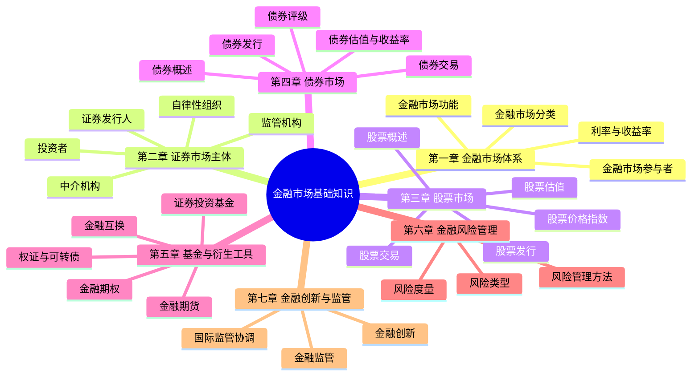

# 金融市场基础知识 - 总结

## 知识框架思维导图

## 高频考点速查表

| 考点 | 内容 | 记忆要点 |
|------|------|----------|
| 货币市场工具 | 国库券、回购协议、大额存单、商业票据 | 期限≤1年 |
| 资本市场工具 | 股票、债券、基金 | 期限>1年 |
| 股票估值DDM | P = D₁ / (k - g) | 股利贴现模型Gordon |
| 股票估值PE法 | P = EPS × P/E | 市盈率法 |
| 债券久期 | D = Σ(t×PVt) / P | 衡量利率敏感性 |
| 修正久期 | Dmod = D / (1+y) | 利率变动1%的价格变动 |
| 夏普比率 | S = (Rp - Rf) / σp | 单位总风险超额收益 |
| 特雷诺比率 | T = (Rp - Rf) / βp | 单位系统风险超额收益 |
| 詹森α | α = Rp - [Rf + β(Rm-Rf)] | 超额收益 |
| β系数 | β = Cov(Ri,Rm) / Var(Rm) | 系统风险度量 |
| 期权定价BS模型 | C = S×N(d1) - X×e^(-rT)×N(d2) | 欧式期权定价 |
| 可转债转股价格 | 初始转股价≥募集说明书公告日前20/30日均价 | 前20/30日均价 |

## 易混淆概念对比表

### 1. 股票 vs 债券

| 对比项 | 股票 | 债券 |
|--------|------|------|
| 性质 | 所有权凭证 | 债权凭证 |
| 收益 | 股息+资本利得 | 利息+资本利得 |
| 风险 | 较高 | 较低 |
| 期限 | 永久性 | 有到期日 |
| 清偿顺序 | 最后 | 优先于股票 |
| 发行主体 | 股份公司 | 政府/金融机构/企业 |

### 2. 场内市场 vs 场外市场

| 对比项 | 场内市场 | 场外市场 |
|--------|----------|----------|
| 交易场所 | 证券交易所 | 银行间市场/柜台市场 |
| 交易方式 | 集中竞价 | 协议定价/做市商 |
| 监管程度 | 严格 | 相对灵活 |
| 产品类型 | 标准化产品 | 非标准化/定制化 |
| 流动性 | 较高 | 较低 |
| 典型代表 | 沪深交易所 | 银行间债券市场/新三板 |

### 3. 看涨期权 vs 看跌期权

| 对比项 | 看涨期权(Call) | 看跌期权(Put) |
|--------|---------------|--------------|
| 权利 | 以约定价格买入 | 以约定价格卖出 |
| 买方预期 | 标的价格上涨 | 标的价格下跌 |
| 卖方义务 | 被行权时须卖出 | 被行权时须买入 |
| 最大收益 | 无限(理论) | 行权价-权利金 |
| 最大损失 | 权利金 | 行权价-权利金 |

### 4. 系统性风险 vs 非系统性风险

| 对比项 | 系统性风险 | 非系统性风险 |
|--------|-----------|-------------|
| 定义 | 影响整个市场的风险 | 影响个别证券的风险 |
| 来源 | 宏观因素(政策/利率/通胀) | 公司经营/财务因素 |
| 度量 | β系数 | 个股标准差 |
| 分散化 | 不可分散 | 可通过组合分散 |
| 补偿 | 市场给予风险溢价 | 无额外补偿 |

### 5. 封闭式基金 vs 开放式基金

| 对比项 | 封闭式基金 | 开放式基金 |
|--------|-----------|-----------|
| 份额规模 | 固定 | 可变 |
| 交易方式 | 交易所交易 | 申购/赎回 |
| 价格决定 | 供求关系(可能折价/溢价) | 基金净值 |
| 流动性 | 交易所买卖 | 每日申赎 |
| 期限 | 有固定期限(5-15年) | 无固定期限 |
