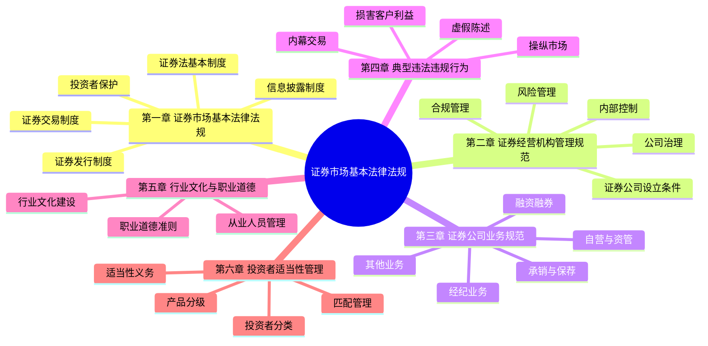

# 证券市场基本法律法规 - 总结

## 知识框架思维导图

## 高频考点速查表

| 考点 | 内容 | 记忆要点 |
|------|------|----------|
| 证券发行审核 | 注册制（科创板/创业板/北交所）、核准制（主板） | 注册制以信息披露为核心 |
| 股票上市条件 | 股本总额≥3000万、公开发行股份≥25%（4亿以上≥10%） | 3000万、25%/10% |
| 债券公开发行 | 净资产要求：股份公司≥3000万、有限公司≥6000万 | 股3000、有6000 |
| 内幕交易 | 知情人员+内幕信息+交易行为 | 三要素缺一不可 |
| 操纵市场 | 连续交易、约定交易、洗售、虚假申报 | 四种主要方式 |
| 虚假陈述 | 信息披露义务人+虚假记载/误导性陈述/重大遗漏 | 三种表现形式 |
| 证券公司净资本 | 净资产-资产调整值+负债调整值-或有负债 | 风险控制核心指标 |
| 投资者适当性 | C1-C5五级、R1-R5五级 | C保守型-R进取型 |
| 从业人员资格 | 一般从业资格考试2科 | 《金融市场》+《证券市场》 |
| 证券登记结算 | 中国结算（CSDC）集中统一登记结算 | 证券无纸化 |

## 易混淆概念对比表

### 1. 注册制 vs 核准制

| 对比项 | 注册制 | 核准制 |
|--------|--------|--------|
| 审核理念 | 信息披露为核心 | 实质性审核 |
| 审核机构 | 交易所审核、证监会注册 | 证监会发审委审核 |
| 适用范围 | 科创板、创业板、北交所 | 主板（过渡期） |
| 审核重点 | 信息披露是否齐备合规 | 企业是否符合发行条件 |
| 责任主体 | 发行人承担信息披露责任 | 监管机构承担部分审核责任 |

### 2. 经纪业务 vs 自营业务

| 对比项 | 经纪业务 | 自营业务 |
|--------|----------|----------|
| 资金来源 | 客户资金 | 证券公司自有资金 |
| 风险承担 | 客户承担 | 证券公司承担 |
| 收益来源 | 佣金/手续费 | 买卖价差 |
| 账户性质 | 客户证券账户 | 自营证券账户 |
| 法律关系 | 委托代理关系 | 以自己名义交易 |

### 3. 内幕交易 vs 操纵市场

| 对比项 | 内幕交易 | 操纵市场 |
|--------|----------|----------|
| 行为主体 | 知情人员 | 任何人 |
| 行为方式 | 利用内幕信息交易 | 影响证券价格或交易量 |
| 信息要素 | 须有内幕信息 | 不依赖内幕信息 |
| 主观要件 | 故意 | 故意 |
| 法律责任 | 没收违法所得+1-5倍罚款 | 没收违法所得+1-10倍罚款 |

### 4. 承销 vs 保荐

| 对比项 | 承销 | 保荐 |
|--------|------|------|
| 定义 | 代发行人销售证券 | 推荐并担保发行人符合上市条件 |
| 责任范围 | 销售责任 | 持续督导责任 |
| 适用场景 | 证券发行 | 证券发行上市 |
| 期限 | 发行完成即结束 | 持续督导期2-3年 |
| 失职后果 | 承担赔偿责任 | 与发行人承担连带责任 |

### 5. 普通投资者 vs 专业投资者

| 对比项 | 普通投资者 | 专业投资者 |
|--------|-----------|-----------|
| 划分标准 | 不满足专业投资者条件 | 金融资产≥500万或年收入≥50万 |
| 适当性保护 | 享有特别保护 | 可自主判断风险 |
| 产品匹配 | 必须匹配风险等级 | 可购买所有产品 |
| 信息告知 | 证券公司须充分告知 | 无需特别告知 |
| 转化条件 | 可申请转化为专业投资者 | 可申请转化为普通投资者 |
