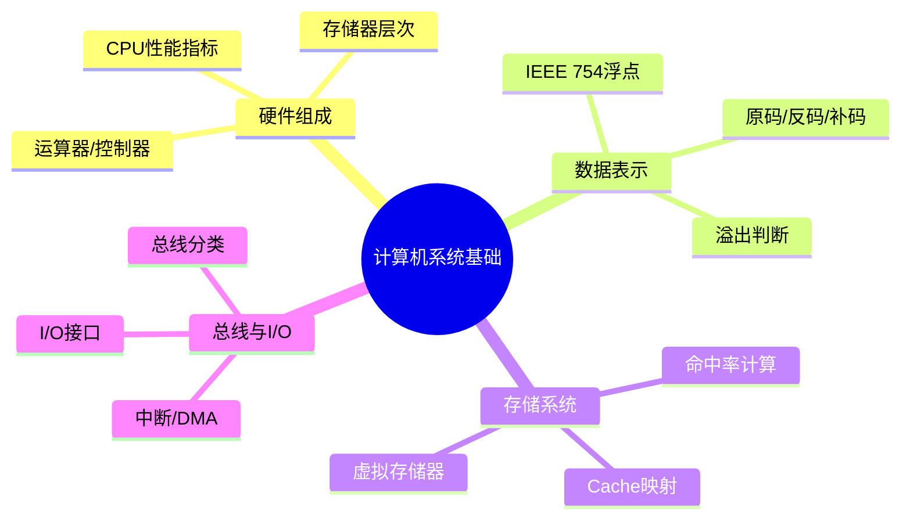

# 第一章：计算机系统基础知识

> 分值占比：5%-8% | 重要程度：★★★

## 考情快照

- **分值占比**：5%-8%（上午选择题，约 4-6 题）
- **题型**：全部为单项选择题
- **备考建议**：重点掌握数据表示（补码/浮点）和 Cache 映射计算，这两个点必考。

## 知识导图



## 考情分析

本章是软件设计师考试的基础章节，主要介绍计算机硬件组成、数据表示与运算、体系结构等基础知识。考试以概念理解为主，需掌握基本硬件组成和二进制运算。

**高频考点分布：**
- 数据表示与运算（补码、浮点）：~30%
- 存储系统（Cache、命中率）：~25%
- CPU 性能指标（CPI、主频）：~20%
- 总线与 I/O（DMA、中断）：~15%
- 其他（寻址、流水线）：~10%

---

## 1.1 计算机硬件基础

### 1.1.1 计算机组成

**五大基本部件：**
- **运算器（ALU）**：执行算术运算和逻辑运算
- **控制器（CU）**：指挥和协调各部件工作
- **存储器**：存储程序和数据（内存/外存）
- **输入设备**：键盘、鼠标、扫描仪等
- **输出设备**：显示器、打印机、音箱等

**冯·诺依曼体系结构特点：**
- 程序存储：程序和数据以同等地位存放在内存中
- 按地址访问：存储单元按地址访问
- 指令驱动：程序运行由指令序列驱动
- 顺序控制：指令按顺序执行

### 1.1.2 中央处理器（CPU）

**CPU主要组成：**
- **运算器（ALU）**：执行算术和逻辑运算
- **控制器**：产生控制信号，协调各部件工作
- **寄存器**：通用寄存器、专用寄存器（PC、IR、PSW等）
- **内部总线**：连接各部件的数据通路

**CPU主要性能指标：**
- 主频（时钟频率）：CPU每秒时钟周期数，单位GHz
- CPI（Clock Cycles Per Instruction）：执行一条指令所需时钟周期数
- CPU时间 = 指令数 × CPI × 时钟周期时间

---

## 1.2 数据表示与运算

### 1.2.1 数制转换

**常用数制：**
- 二进制（B）：基数为2，逢2进1
- 八进制（O）：基数为8，逢8进1
- 十进制（D）：基数为10，逢10进1
- 十六进制（H）：基数为16，逢16进1

**转换规则：**
- 二进制 → 八进制：每3位一组
- 二进制 → 十六进制：每4位一组
- 任意进制 → 十进制：按权展开求和

### 1.2.2 定点数与浮点数

**定点数表示：**
- **原码**：最高位为符号位，其余为数值位
- **补码**：正数与原码相同，负数按位取反末位加1
- **反码**：正数与原码相同，负数按位取反

**浮点数表示（IEEE 754标准）：**
- 单精度浮点数（32位）：1位符号 + 8位阶码 + 23位尾数
- 双精度浮点数（64位）：1位符号 + 11位阶码 + 52位尾数
- 阶码采用移码表示（偏置值127/1023）

### 1.2.3 二进制运算

**算术运算：**
- 加法：逢2进1
- 减法：被减数加减数的补码
- 乘法：移位累加
- 除法：移位减法

**逻辑运算：**
- 与（AND）：全1为1，否则为0
- 或（OR）：有1为1，全0为0
- 非（NOT）：取反
- 异或（XOR）：相同为0，不同为1

---

## 1.3 存储系统

### 1.3.1 存储器分类

**按存取方式分类：**
- **随机存取存储器（RAM）**：可读可写，断电丢失
  - SRAM（静态RAM）：速度快，集成度低，用于Cache
  - DRAM（动态RAM）：速度慢，集成度高，用于主存
- **只读存储器（ROM）**：只读不写，断电不丢失
  - PROM：可编程一次
  - EPROM：可擦除可编程
  - EEPROM：电可擦除可编程

**按存储介质分类：**
- 半导体存储器（RAM、ROM）
- 磁表面存储器（磁盘、磁带）
- 光盘存储器（CD、DVD、蓝光）

### 1.3.2 存储层次结构

```
寄存器 → Cache → 主存 → 外存（磁盘）
    ↑        ↑        ↑        ↑
  最快    快      中等     慢
  最小    小      大      极大
  最贵    贵      便宜    便宜
```

**Cache工作原理（程序局部性原理）：**
- 时间局部性：最近访问的内容很可能再次被访问
- 空间局部性：当前访问位置附近的存储单元很可能被访问

**直接映射Cache：**
- 主存块号 mod Cache行数 = Cache行号
- 地址组成：标记 + Cache行号 + 块内偏移

---

## 1.4 总线与输入输出

### 1.4.1 总线分类

**按功能分类：**
- **数据总线（DB）**：双向传输数据，宽度决定吞吐量
- **地址总线（AB）**：单向传输地址，宽度决定寻址范围
- **控制总线（CB）**：传输控制信号

**按连接范围分类：**
- 片内总线：芯片内部连接
- 系统总线：CPU与各部件之间（数据、地址、控制）
- 通信总线：设备之间（串行/并行）

### 1.4.2 输入输出方式

- **程序查询方式**：CPU不断查询I/O状态，效率低
- **程序中断方式**：I/O完成时通知CPU，提高效率
- **DMA方式**：I/O与内存直接交换，CPU不干预
- **通道方式**：I/O设备独立于CPU工作，效率最高

---

## 考点速查

| 考点 | 一句话定义 | 难度 |
|------|----------|------|
| 补码表示法 | 负数=反码+1，正数同原码，简化加减法 | ★★★ |
| CPU时间公式 | CPU时间 = 指令数 × CPI × 时钟周期 | ★★★ |
| Cache命中率 | 命中次数/总访问次数，与容量/映射/局部性相关 | ★★★ |
| Cache直接映射 | 主存块号 mod Cache行数 = Cache行号 | ★★☆ |
| RAID级别 | 0=条带 1=镜像 5=奇偶校验 10=镜像+条带 | ★★★ |
| IEEE 754浮点 | 1位符号+8位阶码(+127)+23位尾数（单精度） | ★★☆ |
| 存储层次 | 寄存器>Cache>主存>外存（速度递减/容量递增） | ★★☆ |
| 总线三要素 | 数据总线(双向)+地址总线(单向)+控制总线 | ★★☆ |
| I/O方式演进 | 程序查询→中断→DMA→通道（CPU干预递减） | ★★☆ |
| 中断向量 | 中断服务程序入口地址的地址 | ★★☆ |
| 溢出判断 | 双符号位法 / 进位数异或法 | ★★☆ |
| DMA传输 | 预处理→数据传送→后处理（CPU不干预数据） | ★★☆ |

## 考点→题目索引

> 点击题号跳转到下方 Quiz 组件做题，做完后看解析回链到考点。

- **补码与溢出**：[softdesigner-001]() · [softdesigner-008]() · [softdesigner-006]()
- **Cache与命中率**：[softdesigner-002]() · [softdesigner-012]() · [softdesigner-017]()
- **RAID与存储层次**：[softdesigner-003]() · [softdesigner-004]() · [softdesigner-016]()
- **CPU性能与指令**：[softdesigner-005]() · [softdesigner-007]() · [softdesigner-011]() · [softdesigner-018]()
- **总线与I/O**：[softdesigner-006]() · [softdesigner-009]() · [softdesigner-013]() · [softdesigner-014]()
- **寻址与范围**：[softdesigner-010]() · [softdesigner-015]() · [softdesigner-020]()
- **流水线与分支**：[softdesigner-019]()

## 真题练习

::: tip
本章共 20 题，建议 30 分钟内做完。做完后对照上方"考点→题目索引"回链薄弱考点重新阅读。
:::

<Quiz dataUrl="./quiz.json" />
