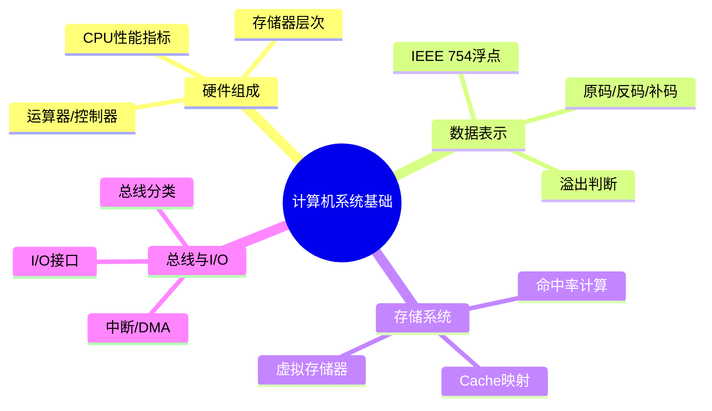

# 第一章：计算机系统基础知识

> 分值占比：5%-8% | 重要程度：★★★

## 考情快照

- **分值占比**：5%-8%（上午选择题，约 4-6 题）
- **题型**：全部为单项选择题
- **备考建议**：重点掌握数据表示（补码/浮点）和 Cache 映射计算，这两个点必考。

## 知识导图


```mermaid
mindmap
  root((计算机系统基础))
    硬件组成
      运算器/控制器
      存储器层次
      CPU性能指标
    数据表示
      原码/反码/补码
      IEEE 754浮点
      溢出判断
    存储系统
      Cache映射
      命中率计算
      虚拟存储器
    总线与I/O
      总线分类
      中断/DMA
      I/O接口
```

## 考情分析

本章是软件设计师考试的基础章节，主要介绍计算机硬件组成、数据表示与运算、体系结构等基础知识。考试以概念理解为主，需掌握基本硬件组成和二进制运算。

**高频考点分布：**
- 数据表示与运算（补码、浮点）：~30%
- 存储系统（Cache、命中率）：~25%
- CPU 性能指标（CPI、主频）：~20%
- 总线与 I/O（DMA、中断）：~15%
- 其他（寻址、流水线）：~10%

---

## 1.1 计算机硬件基础

### 1.1.1 计算机组成

**五大基本部件：**
- **运算器（ALU）**：执行算术运算和逻辑运算

**🎯 一句话人话**：计算机里专门做"数学题"的零件，加减乘除和比较大小都由它来算。

**💡 类比**：像算盘——算得快但只会算，自己不知道该算什么，听别人指挥。

**✍️ 小例子**：1+1=2 由加法器电路完成；判断 a>b 由比较电路完成——这些都是 ALU 的算术/逻辑运算。

**⚠️ 常见误区**：ALU 只负责"算"，"该算什么"由控制器决定；运算器和控制器合称 CPU 核心，别把两者混为一谈。

- **控制器（CU）**：指挥和协调各部件工作

**🎯 一句话人话**：计算机的"指挥官"，按指令节拍指挥各部件什么时候干什么。

**💡 类比**：乐队指挥——自己不演奏，但用指挥棒决定每个乐手何时开始、何时停。

**✍️ 小例子**：CPU 工作循环=取指→译码→执行→（中断响应），每一步的控制信号都由控制器发出。

**⚠️ 常见误区**：控制器不执行运算，运算由 ALU 做；但"指挥"是控制器的活，两者分工别记反。

- **存储器**：存储程序和数据（内存/外存）

**🎯 一句话人话**：计算机的"仓库"，程序和数据都放在里面，用时按地址去取。

**💡 类比**：带编号的储物柜——每个柜子有门牌号（地址），存什么取什么靠号码。

**✍️ 小例子**：内存（RAM）断电丢数据、速度快；外存（磁盘）断电不丢、速度慢——存长期资料用外存。

**⚠️ 常见误区**：存储器≠内存，存储器包含内存和外存；"断电丢失"只针对内存类（RAM），ROM/磁盘不丢。

- **输入设备**：键盘、鼠标、扫描仪等

**🎯 一句话人话**：把外界信息"送进"计算机的装置，方向是外→内。

**💡 类比**：人长眼睛耳朵接收外界信息，输入设备就是计算机的眼睛耳朵。

**✍️ 小例子**：敲键盘字母 A → 键盘编码电路把 A 的编码送入内存。

**⚠️ 常见误区**：触摸屏是输入+输出设备，不是纯输入；方向"外→内"是判断输入/输出的关键。

- **输出设备**：显示器、打印机、音箱等

**🎯 一句话人话**：把计算机里的信息"放出来"给人看的装置，方向是内→外。

**💡 类比**：人的嘴巴/手把想法表达出来，输出设备是计算机的"嘴"和"手"。

**✍️ 小例子**：CPU 算完 2+2=4 → 显卡把"4"渲染到显示器屏幕上。

**⚠️ 常见误区**：硬盘既能输入也能输出（读写数据），属于外存而非单纯输出设备。

**冯·诺依曼体系结构特点：**
- 程序存储：程序和数据以同等地位存放在内存中
- 按地址访问：存储单元按地址访问
- 指令驱动：程序运行由指令序列驱动
- 顺序控制：指令按顺序执行

**🎯 一句话人话**：计算机工作的总规矩——程序和普通数据一样放内存，靠地址找，靠指令一步步驱动。

**💡 类比**：做菜看菜谱：菜谱（程序）和食材（数据）都放桌上（内存），按页码（地址）翻，一步步照做（指令驱动）。

**✍️ 小例子**：开机后程序从磁盘装入内存，CPU 从起始地址取第一条指令，执行完再取下一条，顺序推进。

**⚠️ 常见误区**："顺序控制"不等于只能顺序执行——遇到跳转/分支指令会改变顺序；"程序存储"是冯·诺依曼区别于早期外插线计算的核心。

### 1.1.2 中央处理器（CPU）

**CPU主要组成：**
- **运算器（ALU）**：执行算术和逻辑运算
- **控制器**：产生控制信号，协调各部件工作
- **寄存器**：通用寄存器、专用寄存器（PC、IR、PSW等）

**🎯 一句话人话**：CPU 内部的"极速便签本"，临时放正在用的数据和状态，取用速度最快。

**💡 类比**：收银员手边的零钱盒——比去库房（内存）拿快得多，但盒子小放不了多少。

**✍️ 小例子**：PC 存下一条指令地址（取指后 PC 自动+1）；IR 存当前正在执行的指令；PSW 存进位/零/溢出等标志。

**⚠️ 常见误区**：寄存器在 CPU 内部、速度最快但数量极少；Cache 在主存和 CPU 之间，别把寄存器与 Cache 位置记混。

- **内部总线**：连接各部件的数据通路

**🎯 一句话人话**：CPU 内部各零件之间传数据、地址、控制信号的"道路"。

**💡 类比**：电路板上的高速路，运算器→寄存器→控制器的数据都走这条路。

**✍️ 小例子**：运算器算出结果 → 通过内部数据总线写入寄存器（取数→运算→回写都在内部总线上完成）。

**⚠️ 常见误区**：内部总线在 CPU 内部（芯片级）；系统总线才连接 CPU 与内存/外设，两者范围不同。

**CPU主要性能指标：**
- 主频（时钟频率）：CPU每秒时钟周期数，单位GHz
- CPI（Clock Cycles Per Instruction）：执行一条指令所需时钟周期数
- CPU时间 = 指令数 × CPI × 时钟周期时间

**🎯 一句话人话**：CPU 快不快看三件事——一秒有多少拍（主频）、一条指令拍几下（CPI）、一共几条指令。

**💡 类比**：搬砖效率 = 砖数 × 每块搬几下 × 每下耗时；少拍几下（低 CPI）和拍得快（高主频）都提速。

**✍️ 小例子**：指令数 10⁶，CPI=2，主频 1GHz（时钟周期=1ns）→ CPU时间 = 10⁶×2×1ns = 2ms。若主频翻倍到 2GHz（时钟周期 0.5ns），时间减半为 1ms。

**⚠️ 常见误区**：主频高≠一定快，还要看 CPI 和指令数；算 CPU 时间必须三者相乘，缺一不可。

- ⚠️ 必考行：CPU时间 = 指令数 × CPI × 时钟周期时间；主频高只代表拍子快，不能单独说明 CPU 快。

---

## 1.2 数据表示与运算

### 1.2.1 数制转换

**常用数制：**
- 二进制（B）：基数为2，逢2进1
- 八进制（O）：基数为8，逢8进1
- 十进制（D）：基数为10，逢10进1
- 十六进制（H）：基数为16，逢16进1

**🎯 一句话人话**：数的"进制"就是数到几就进位——二进制数到 2 就进一位，十六进制数到 16 才进位。

**💡 类比**：十进制是逢十进一（9 之后是 10）；二进制只有 0 和 1（1 之后是 10，即十进制的 2）。

**✍️ 小例子**：二进制 10 = 十进制 2；十六进制 A = 十进制 10，F = 15，10₁₆ = 16₁₀。十六进制每 4 位二进制一组，正好一位。

**⚠️ 常见误区**：十六进制的"A-F"也是数字；二进制只有 0/1 两个符号；八进制每一位代表 3 位二进制。

**转换规则：**
- 二进制 → 八进制：每3位一组
- 二进制 → 十六进制：每4位一组
- 任意进制 → 十进制：按权展开求和

**🎯 一句话人话**：转换就两招——二进制↔八/十六进制按位数分组；别的进制→十进制逐位乘权累加。

**💡 类比**：分组像把一长串数"三位一逗号"地切开；按权展开像人民币凑数（个十百千位各算各的）。

**✍️ 小例子**：101101₂ → 八进制：101|101 = 5|5 = 55₈；→ 十六进制：10|1101 = 2|D = 2D₁₆；→ 十进制：32+8+4+1 = 45₁₀。✓

**⚠️ 常见误区**：从低位（右边）开始分组，高位不足补 0；按权展开的权从最右位 2⁰=1 开始。

### 1.2.2 定点数与浮点数

**定点数表示：**
- **原码**：最高位为符号位，其余为数值位

**🎯 一句话人话**：最直观的表示法——最左边一位写正负号，其余位照抄数值。

**💡 类比**：账本上写"+5"或"-5"：符号位就是那个正负号，后面是金额。

**✍️ 小例子**：4 位机里 +3 = 0011，-3 = 1011（最高位 1 表示负）。原码的缺点是 0 有两种写法：0000 和 1000 都表示 0。

**⚠️ 常见误区**：原码做减法要判断符号很麻烦，所以计算机实际用补码运算；原码主要用来说明概念。

- **补码**：正数与原码相同，负数按位取反末位加1

**🎯 一句话人话**：把"减一个数"变成"加一个数"的魔术，CPU 只需要会加法就能做加减法。

**💡 类比**：时钟上 -3 点 = +9 点（12 进制模运算）。4 位机里 -3 = 16-3 = 13 = 1101。

**✍️ 小例子**：算 5 + (-3)：5=0101，-3=1101，0101+1101=10010，丢进位=0010=2 ✓

**⚠️ 常见误区**：反码≠补码，补码是"取反+1"，不是只取反；0 的补码唯一（0000），而原码/反码有两个 0。

- ⚠️ 必考行：负数补码=按位取反+1（即 反码+1）；补码的补码=原码；8 位补码范围 -128~+127（多表示一个 -128）。

- **反码**：正数与原码相同，负数按位取反

**🎯 一句话人话**：原码的符号位不动，数值位 0↔1 全翻过来。

**💡 类比**：照片负片——明暗颠倒，正片(原码)翻一翻就是负片(反码)。

**✍️ 小例子**：4 位机 -3：原码 1011 → 符号位 1 保留，数值位 011 取反为 100 → 反码 1100。

**⚠️ 常见误区**：反码是"补码的前一步"；反码+1 才等于补码，考试常考这三者的递进关系。

**浮点数表示（IEEE 754标准）：**
- 单精度浮点数（32位）：1位符号 + 8位阶码 + 23位尾数
- 双精度浮点数（64位）：1位符号 + 11位阶码 + 52位尾数
- 阶码采用移码表示（偏置值127/1023）

**🎯 一句话人话**：用"科学计数法"存小数——符号位+指数(阶码)+有效数字(尾数)，指数加个偏置避免负数。

**💡 类比**：3.14×10² 写成 符号0 + 指数2(+127) + 尾数.14——只要记三块就能还原原数。

**✍️ 小例子**：单精度 1.5 = 1.1₂×2⁰ → 符号0，阶码 0+127=127=01111111，尾数 1000…0。整串：0 01111111 10000000000000000000000 ✓

**⚠️ 常见误区**：阶码存的是"真值+127"（移码），不是补码；尾数默认最高位为 1（规格化），不显式存储；单精度 8 位阶码、双精度 11 位别记错。

- ⚠️ 必考行：单精度=1符号+8阶码(偏置127)+23尾数；阶码存"真值+127"；规格化尾数首位默认1。

### 1.2.3 二进制运算

**算术运算：**
- 加法：逢2进1
- 减法：被减数加减数的补码
- 乘法：移位累加
- 除法：移位减法

**🎯 一句话人话**：二进制的加减乘除和十进制类似，只是"逢 2 进 1"，且减法统一转成补码加法。

**💡 类比**：就像口算 9+9 要进位到 18；二进制里 1+1=10，写 0 进 1。

**✍️ 小例子**：5-3 → 5+(-3)=0101+1101=10010，丢进位=0010=2 ✓；6×2=110×10=1100=12（左移一位即乘 2）。

**⚠️ 常见误区**：计算机里没有"减法器"——减法全靠补码加法实现；乘除靠移位+加减组合。

**逻辑运算：**
- 与（AND）：全1为1，否则为0
- 或（OR）：有1为1，全0为0
- 非（NOT）：取反
- 异或（XOR）：相同为0，不同为1

**🎯 一句话人话**：逻辑运算是按位做"真假判断"：与=全真才真，或=一真就真，非=颠倒，异或=看两边是否不同。

**💡 类比**：与=两人都同意才通过；或=有一人同意就通过；非=唱反调；异或="我俩不一样"才为真。

**✍️ 小例子**：1 AND 0=0；1 OR 0=1；NOT 1=0；1 XOR 0=1，1 XOR 1=0。

**⚠️ 常见误区**：异或≠或——1 OR 1=1 但 1 XOR 1=0；"与或非"是基本门，"异或"由基本门组合而成。

---

## 1.3 存储系统

### 1.3.1 存储器分类

**按存取方式分类：**
- **随机存取存储器（RAM）**：可读可写，断电丢失
  - SRAM（静态RAM）：速度快，集成度低，用于Cache
  - DRAM（动态RAM）：速度慢，集成度高，用于主存

**🎯 一句话人话**：RAM 是"临时记事本"——可随时读改写，一断电全没了；SRAM/DRAM 是它的两种工艺。

**💡 类比**：RAM 像白板：能写能擦，断电/下课一擦就空；SRAM 贵但快（随手能记），DRAM 便宜但慢（大块记录）。

**✍️ 小例子**：主存用 DRAM（便宜容量大），Cache 用 SRAM（快但贵）；笔记本关机后内存数据全丢——因为用的是 RAM。

**⚠️ 常见误区**：SRAM 比 DRAM 快、贵、集成度低（容量小）；"随机存取"指可按任意地址直接访问，不是"随便存"。

- **只读存储器（ROM）**：只读不写，断电不丢失
  - PROM：可编程一次
  - EPROM：可擦除可编程
  - EEPROM：电可擦除可编程

**🎯 一句话人话**：ROM 是"出厂刻好/只读的说明书"——断电也不丢，一般只能读不能随便写。

**💡 类比**：ROM 像刻在石碑上的字，擦不掉；PROM=一次性烧录（刻一次），EPROM=紫外线照一下可重刻，EEPROM=通电即可擦写。

**✍️ 小例子**：计算机 BIOS/固件存在 ROM 里——开机先读 ROM 启动，断电后设置仍在。

**⚠️ 常见误区**：ROM 并非完全不能写——EPROM/EEPROM 可擦写，只是"正常工作时只读"；断电不丢失是 ROM 与 RAM 的根本区别。

**按存储介质分类：**
- 半导体存储器（RAM、ROM）
- 磁表面存储器（磁盘、磁带）
- 光盘存储器（CD、DVD、蓝光）

**🎯 一句话人话**：按"用什么材料装数据"分类：半导体（芯片）、磁表面（磁盘）、光（光盘）。

**💡 类比**：数据像货物，半导体=芯片仓库，磁盘=磁性仓库，光盘=光反射仓库，各有各的存取方式。

**✍️ 小例子**：内存条=半导体；硬盘/磁带=磁表面；CD/DVD/蓝光=光盘（蓝光容量最大）。

**⚠️ 常见误区**：U 盘/固态硬盘是半导体存储器（闪存），不是磁表面；别看到"盘"就归为磁表面。

### 1.3.2 存储层次结构

```
寄存器 → Cache → 主存 → 外存（磁盘）
    ↑        ↑        ↑        ↑
  最快    快      中等     慢
  最小    小      大      极大
  最贵    贵      便宜    便宜
```

**🎯 一句话人话**：数据从快到慢分层存放——寄存器最靠近 CPU 最快，越往下越大越慢，形成"金字塔"。

**💡 类比**：办公桌（寄存器/最快最小）→ 书架（Cache）→ 档案室（主存）→ 郊外仓库（磁盘），常用的放手边，不常用的存远库。

**✍️ 小例子**：CPU 取数先看寄存器→没有看 Cache→再没有才去主存/磁盘；每下一层速度慢一个数量级，但容量大得多。

**⚠️ 常见误区**：越靠上越快、越贵、越小；考试常考"速度递减/容量递增"的顺序，别把容量和速度的方向记反。

**Cache工作原理（程序局部性原理）：**
- 时间局部性：最近访问的内容很可能再次被访问
- 空间局部性：当前访问位置附近的存储单元很可能被访问

**🎯 一句话人话**：Cache 靠"局部性"押宝——程序总爱反复用刚用过的数据和它旁边的数据，提前把附近数据搬进 Cache。

**💡 类比**：食堂打菜：同一道菜总点（时间局部性），顺便把旁边的菜也舀一勺（空间局部性），下一位同学大概率也要。

**✍️ 小例子**：for 循环反复访问变量 i → 时间局部性；数组 a[0],a[1],a[2]…顺序读 → 空间局部性（一读拉一块进 Cache）。

**⚠️ 常见误区**：局部性是两个性质不是两种 Cache；命中率高正是因为局部性，循环/数组访问命中率高。

**直接映射Cache：**
- 主存块号 mod Cache行数 = Cache行号
- 地址组成：标记 + Cache行号 + 块内偏移

**🎯 一句话人话**：每块主存只能"住进"Cache 里固定的一行（取余算出来的），查的时候直接去那一行找，速度快但容易撞车。

**💡 类比**：宿舍分配——按学号末位分楼层，快是快，但同末位的同学会挤同一层；撞了就替换（抖动）。

**✍️ 小例子**：Cache 4 行，主存块 13 → 13 mod 4 = 1，只能放第 1 行；地址拆成 标记+行号+块内偏移 三截查。命中率=命中次数/总访问次数，如 1000 次访问 950 次命中 = 95%。

**⚠️ 常见误区**：直接映射的"行号"由主存块号 mod 行数定死，不像全相联那样随意放；命中率公式=命中次数÷总访问次数，别把分子/分母搞反。

- ⚠️ 必考行：主存块号 mod Cache行数 = Cache行号（直接映射）；命中率=命中次数/总访问次数；时间+空间局部性决定命中率。

---

## 1.4 总线与输入输出

### 1.4.1 总线分类

**按功能分类：**
- **数据总线（DB）**：双向传输数据，宽度决定吞吐量
- **地址总线（AB）**：单向传输地址，宽度决定寻址范围
- **控制总线（CB）**：传输控制信号

**🎯 一句话人话**：总线三兄弟分工明确——数据总线搬数据（可来回），地址总线报门牌（只出不进），控制总线发号施令。

**💡 类比**：货梯（数据总线）既能上楼又能下楼；对讲机（地址总线）单向喊"去 3 号房"；红绿灯（控制总线）指挥谁先走。

**✍️ 小例子**：20 根地址线 → 寻址 2²⁰ = 1MB；32 位数据总线 → 一次可传 4 字节。宽度决定吞吐量和寻址上限。

**⚠️ 常见误区**：数据总线双向、地址总线单向——方向是常考点；地址线根数 n → 寻址范围 2ⁿ（字节），数据线宽度 ≠ 寻址范围。

**按连接范围分类：**
- 片内总线：芯片内部连接
- 系统总线：CPU与各部件之间（数据、地址、控制）
- 通信总线：设备之间（串行/并行）

**🎯 一句话人话**：总线按"连接多远"分三档——芯片内部（片内）、整机内部（系统）、设备之间（通信）。

**💡 类比**：片内=房间里布线，系统=楼内管线，通信=楼与楼之间的光缆。

**✍️ 小例子**：CPU 内部寄存器间走片内总线；CPU↔内存走系统总线；两台电脑/电脑↔打印机走通信总线（串行或并行）。

**⚠️ 常见误区**：系统总线（含数据/地址/控制三总线）是三大总线的上位概念；"串行/并行"是通信总线的两种传输方式，别与数据/地址/控制混。

### 1.4.2 输入输出方式

- **程序查询方式**：CPU不断查询I/O状态，效率低

**🎯 一句话人话**：CPU 眼巴巴盯着外设问"好了没？好了没？"，没干别的活，浪费。

**💡 类比**：等电梯时一直按"开门"键——反复查看，自己啥也干不了。

**✍️ 小例子**：打印机打印时，CPU 循环读状态寄存器，直到"空闲"才传下一个字符——期间 CPU 无法做别的事。

**⚠️ 常见误区**：程序查询是"主动轮询"，CPU 全程占用；它与中断方式的本质区别是 CPU 是否被一直占着。

- **程序中断方式**：I/O完成时通知CPU，提高效率

**🎯 一句话人话**：外设干完了"敲门"通知 CPU，CPU 平时做自己的事，不用一直盯着。

**💡 类比**：外卖到了骑手打电话（中断）通知你下楼，你不需要在窗口干等。

**✍️ 小例子**：键盘敲一下 → 发出中断请求 → CPU 暂停当前任务、查中断向量表找到服务程序入口，处理完再恢复原任务。

**⚠️ 常见误区**：中断是"外设主动通知"，不是 CPU 查询；"中断向量"存的是中断服务程序入口地址的地址，是考点。

- **DMA方式**：I/O与内存直接交换，CPU不干预

**🎯 一句话人话**：外设和内存之间"直连"批量搬数据，CPU 只在开头和结尾露个面，中间全程不管。

**💡 类比**：用货车直接从仓库拉货到工地（DMA），而不是让工头一趟趟亲自搬（程序查询）。

**✍️ 小例子**：磁盘读一大块数据 → DMA 控制器接管，数据绕过 CPU 直接进内存，传送完才发中断通知 CPU；适合高速/大批量传送。

**⚠️ 常见误区**：DMA 只是"数据传送过程"不需要 CPU 干预，但 DMA 控制器本身要占用总线周期（周期窃取），且开始/结束仍需 CPU 配合。

- **通道方式**：I/O设备独立于CPU工作，效率最高

**🎯 一句话人话**：给外设配一个"小管家"（通道处理器），专门负责一批 I/O 设备的调度，CPU 彻底解放，效率最高。

**💡 类比**：请个专职管家管所有杂事（多个外设），主人只需交代一句，管家自己统筹完成。

**✍️ 小例子**：一个通道可管理多个磁盘/终端，执行通道程序控制设备工作，CPU 与通道并行——I/O 方式演进：查询→中断→DMA→通道，CPU 干预递减。

**⚠️ 常见误区**：通道本身也是一种"处理器"，能执行通道程序；它比 DMA 更进一步（管理多个设备），效率最高是通道不是 DMA。

---

## 考点速查

| 考点 | 一句话定义 | 难度 |
|------|----------|------|
| 补码表示法 | 负数=反码+1，正数同原码，简化加减法 | ★★★ |
| CPU时间公式 | CPU时间 = 指令数 × CPI × 时钟周期 | ★★★ |
| Cache命中率 | 命中次数/总访问次数，与容量/映射/局部性相关 | ★★★ |
| Cache直接映射 | 主存块号 mod Cache行数 = Cache行号 | ★★☆ |
| RAID级别 | 0=条带 1=镜像 5=奇偶校验 10=镜像+条带 | ★★★ |
| IEEE 754浮点 | 1位符号+8位阶码(+127)+23位尾数（单精度） | ★★☆ |
| 存储层次 | 寄存器>Cache>主存>外存（速度递减/容量递增） | ★★☆ |
| 总线三要素 | 数据总线(双向)+地址总线(单向)+控制总线 | ★★☆ |
| I/O方式演进 | 程序查询→中断→DMA→通道（CPU干预递减） | ★★☆ |
| 中断向量 | 中断服务程序入口地址的地址 | ★★☆ |
| 溢出判断 | 双符号位法 / 进位数异或法 | ★★☆ |
| DMA传输 | 预处理→数据传送→后处理（CPU不干预数据） | ★★☆ |

## 考点→题目索引

> 点击题号跳转到下方 Quiz 组件做题，做完后看解析回链到考点。

- **补码与溢出**：[softdesigner-001]() · [softdesigner-008]() · [softdesigner-006]()
- **Cache与命中率**：[softdesigner-002]() · [softdesigner-012]() · [softdesigner-017]()
- **RAID与存储层次**：[softdesigner-003]() · [softdesigner-004]() · [softdesigner-016]()
- **CPU性能与指令**：[softdesigner-005]() · [softdesigner-007]() · [softdesigner-011]() · [softdesigner-018]()
- **总线与I/O**：[softdesigner-006]() · [softdesigner-009]() · [softdesigner-013]() · [softdesigner-014]()
- **寻址与范围**：[softdesigner-010]() · [softdesigner-015]() · [softdesigner-020]()
- **流水线与分支**：[softdesigner-019]()

## 真题练习

::: tip
本章共 20 题，建议 30 分钟内做完。做完后对照上方"考点→题目索引"回链薄弱考点重新阅读。
:::

<Quiz dataUrl="./quiz.json" />
