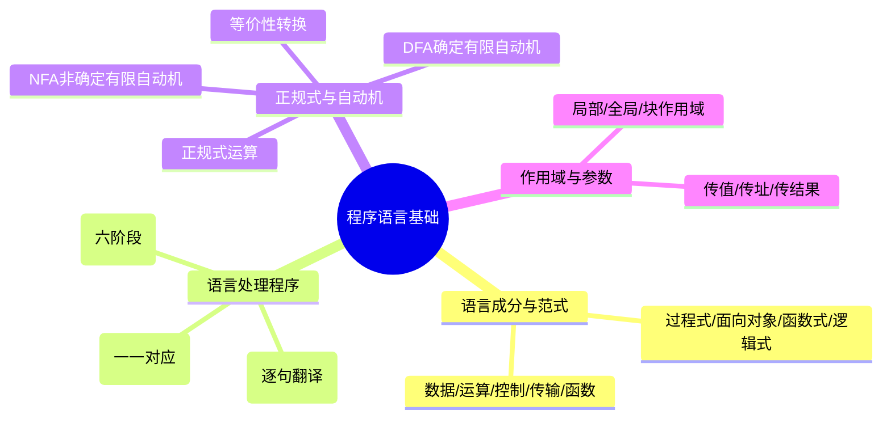

# 第二章：程序设计语言基础

> 分值占比：5%-8% | 重要程度：★★★

## 考情快照

- **分值占比**：5%-8%（上午选择题，约 4-6 题）
- **题型**：单项选择题（概念辨析 + 流程判断）
- **备考建议**：编译六阶段是必考正规式 + 有限自动机是难点，重点掌握 DFA/NFA 等价性和参数传递方式。

## 知识导图



## 考情分析

本章介绍程序设计语言的基本概念、编译原理、语言分类等。考试重点在于语言处理过程、编译与解释的区别、各种程序设计范型的特征。

**高频考点分布：**
- 编译六阶段（词法 → 目标代码）：~30%
- 正规式与有限自动机（DFA/NFA）：~25%
- 参数传递方式 / 作用域：~20%
- 语言范式与分类：~15%
- 其他：~10%

---

## 2.1 程序设计语言概述

### 2.1.1 程序设计语言分类

**按语言级别分类：**
- **低级语言**
  - 机器语言：二进制代码，计算机直接执行
  - 汇编语言：用助记符表示，需要汇编
- **高级语言**
  - 面向过程：C、Pascal、Fortran
  - 面向对象：C++、Java、C#、Python
  - 函数式：Haskell、Lisp、Scala
  - 脚本语言：Python、JavaScript、PHP

**按编程范式分类：**
- **过程式**：以过程（函数）为中心，自顶向下
- **面向对象**：以对象为中心，封装、继承、多态
- **函数式**：以函数为中心，无副作用，λ演算
- **逻辑式**：以逻辑推理为中心，Prolog

### 2.1.2 程序设计语言的基本成分

- **数据成分**：常量、变量、数据类型、数组、结构体等
- **运算成分**：算术运算、关系运算、逻辑运算
- **控制成分**：顺序、选择（if/switch）、循环（for/while）
- **传输成分**：输入输出语句
- **函数成分**：函数定义、调用、参数传递

---

## 2.2 语言处理程序

### 2.2.1 翻译程序

**编译程序（Compiler）：**
- 将高级语言源程序翻译成目标程序（机器码或汇编）
- 翻译完成后生成目标文件，再执行
- 特点：执行速度快，调试相对困难
- 过程：词法分析 → 语法分析 → 语义分析 → 中间代码生成 → 代码优化 → 目标代码生成

**解释程序（Interpreter）：**
- 逐条翻译并立即执行源程序语句
- 不生成独立的目标程序
- 特点：执行速度慢，调试方便，跨平台性好
- 代表：Python、JavaScript（早期）

**汇编程序（Assembler）：**
- 将汇编语言翻译成机器语言
- 一对一直译，一条汇编语句对应一条机器指令

### 2.2.2 编译过程详解

```
源程序
  │
  ▼
词法分析 → 识别单词（标识符、关键字、常量等）
  │
  ▼
语法分析 → 识别语法结构（表达式、语句等）
  │
  ▼
语义分析 → 检查语义正确性（类型检查等）
  │
  ▼
中间代码生成 → 便于优化和翻译的中间表示
  │
  ▼
代码优化 → 提高目标代码效率
  │
  ▼
目标代码生成 → 生成机器码或汇编代码
  │
  ▼
目标程序
```

**各阶段主要任务：**
- **词法分析**：扫描源程序，识别记号（token），删除注释和空白
- **语法分析**：根据语法规则分析语法结构，构造语法树
- **语义分析**：检查语义正确性，如类型匹配、作用域等
- **中间代码**：便于优化和翻译，如三地址码
- **代码优化**：等价变换，提高效率
- **目标代码**：生成可执行的机器指令

---

## 2.3 正规式与有限自动机

### 2.3.1 正规式

**基本符号：**
- `a`：字符a
- `ε`：空串
- `∅`：空集
- `|`：或（选择）
- `*`：闭包（0次或多次）
- `+`：正闭包（1次或多次）
- `?`：可选（0次或1次）
- `.`：连接

**示例：**
- `(a|b)*`：由a和b组成的任意字符串
- `a*b*`：若干a后跟若干b
- `(ab)+`：一个或多个ab

### 2.3.2 有限自动机（FA）

**确定有限自动机（DFA）：**
- 状态数有限
- 每个状态对每个输入符号有唯一转移
- 没有ε-转移

**非确定有限自动机（NFA）：**
- 一个状态对同一输入符号可以有多个转移
- 允许ε-转移

**DFA与NFA的等价性：**
- 任何NFA都可以转换为等价的DFA
- 等价指接受相同的语言

---

## 2.4 程序设计语言基础知识

### 2.4.1 作用域与生存期

**作用域：**
- **局部作用域**：函数或块内声明的变量
- **全局作用域**：文件级别声明的变量
- **块作用域**：由花括号{}界定的作用域

**生存期：**
- **静态生存期**：程序运行期间一直存在（全局变量、static变量）
- **动态生存期**：运行时创建和销毁（局部变量、堆变量）

**存储类别：**
- `auto`（自动）：存储在栈中，函数调用时创建
- `static`（静态）：存储在静态存储区，全程存在
- `extern`（外部）：引用其他文件的全局变量
- `register`（寄存器）：建议存储在寄存器中

### 2.4.2 参数传递方式

- **传值调用（Call by Value）**：实参的值传递给形参，形参修改不影响实参
- **传址调用（Call by Reference）**：实参的地址传递给形参，形参修改影响实参
- **传结果调用（Call by Result）**：形参的值在过程返回时写回实参
- **传值-结果调用（Call by Value-Result）**：结合传值和传结果

### 2.4.3 表达式与语句

**优先级（从高到低）：**
1. 括号 `() []`
2. 一元运算符 `+ - ! ~ ++ --`
3. 乘除 `* / %`
4. 加减 `+ -`
5. 关系 `< <= > >=`
6. 相等 `== !=`
7. 逻辑与 `&&`
8. 逻辑或 `||`
9. 条件 `? :`
10. 赋值 `= += -=`
11. 逗号 `,`

**结合性：**
- 左结合：大多数运算符（+、-、*、/、&&、||）
- 右结合：赋值运算符、条件运算符、单目运算符

---

## 考点速查

| 考点 | 一句话定义 | 难度 |
|------|----------|------|
| 编译 vs 解释 | 编译=生成目标程序后执行；解释=逐句翻译立即执行 | ★★★ |
| 六阶段顺序 | 词法→语法→语义→中间代码→优化→目标代码 | ★★★ |
| 词法分析 | 识别 token（标识符/关键字/常量），删注释空白 | ★★☆ |
| 语法分析 | 构造语法树，判断是否符合文法规则 | ★★☆ |
| 语义分析 | 类型检查、作用域检查、类型转换 | ★★☆ |
| 正规式闭包 | `a*`=0或多，`a+`=1或多，`a?`=0或1 | ★★★ |
| DFA 性质 | 无 ε-转移，每状态每输入唯一转移 | ★★★ |
| NFA→DFA | 子集构造法，任何 NFA 可转为等价 DFA | ★★☆ |
| 传值调用 | 形参是实参副本，修改不影响实参 | ★★★ |
| 传址调用 | 形参是实参地址，修改影响实参 | ★★★ |
| 作用域 | 局部/块/全局，static 延寿到全程 | ★★☆ |

## 考点→题目索引

> 点击题号跳转 Quiz 做题。

- **编译与解释**：[softdesigner-021]() · [softdesigner-022]() · [softdesigner-029]()
- **六阶段流程**：[softdesigner-023]() · [softdesigner-024]() · [softdesigner-030]()
- **词法与语法**：[softdesigner-025]() · [softdesigner-031]()
- **正规式与自动机**：[softdesigner-026]() · [softdesigner-027]() · [softdesigner-032]() · [softdesigner-033]()
- **作用域与生存期**：[softdesigner-028]() · [softdesigner-034]() · [softdesigner-035]()
- **参数传递**：[softdesigner-036]() · [softdesigner-037]()
- **表达式优先级**：[softdesigner-038]() · [softdesigner-039]() · [softdesigner-040]()

## 真题练习

::: tip
本章共 20 题，建议 25 分钟。编译六阶段和正规式是必考点，做完重点复习上方索引中标红的考点。
:::

<Quiz dataUrl="./quiz.json" />
