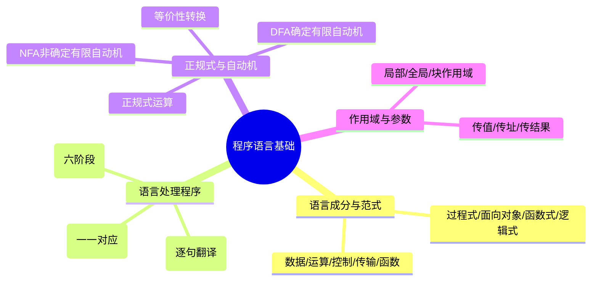

# 第二章：程序设计语言基础

> 分值占比：5%-8% | 重要程度：★★★

**📖 零基础导读**

::: guide 零基础导读

> 本章讲的是**"人话"到"机器话"的翻译流水线**：编程语言有哪些门派、你的代码怎么一步步变成电脑能执行的机器码、用什么公式描述"字符串长什么样"、变量和参数在程序里怎么被管理。软设考试考的是这些机制的名字和顺序——背下来、会判断就行，不要求你会写编译器。

**人话概述**：这一章分四块——先认识编程语言本身：有哪些门派（低级/高级、过程式/面向对象/函数式/逻辑式），一段程序由哪五种成分拼成（2.1）；再看代码怎么被电脑执行：编译、解释、汇编三条路线，其中编译要过六道工序（2.2）；接着认识"描述字符串的公式"正规式，和识别它的自动机 DFA/NFA（2.3）；最后看程序运行时的事：变量在哪能看见、活多久（作用域/生存期），函数参数怎么传（2.4）。

**生活联系**：你写的 Python 代码电脑看不懂，是解释器在背后逐句翻译；搜索引擎里 `*.pdf` 这样的通配符，就是正规式的日常亲戚；程序员常说的"这个变量作用域没写好""你传的是值还是引用"，全是本章的内容。

**学完会什么**：会背编译六阶段并说清每阶段干啥；分得清编译与解释、DFA 与 NFA；会用正规式判断一个字符串能不能匹配；能判断变量在哪能访问、函数参数传值还是传址对实参有没有影响。

**难点预告**：① 编译六阶段顺序是必考点，别硬背——用"认字→断句→查意思→写草稿→润色→排版"的流水线来记；② 正规式的 `*`/`+`/`?` 只作用于紧邻的前一个符号，`(ab)*` 和 `ab*` 意思完全不同——这两处是本章丢分高发区，先按例题照做一遍。

🔗 **前置**：本章讲的都是"代码怎么跑起来"，需要一点编程思维打底。零基础建议先花 10 分钟学预备篇 [P4 编程思维入门](/softdesigner/prep/p4)，再回来读本章。

:::
## 考情快照

- **分值占比**：5%-8%（上午选择题，约 4-6 题）
- **题型**：单项选择题（概念辨析 + 流程判断）
- **备考建议**：编译六阶段是必考正规式 + 有限自动机是难点，重点掌握 DFA/NFA 等价性和参数传递方式。

## 知识导图


```mermaid
mindmap
  root((程序语言基础))
    语言成分与范式
      数据/运算/控制/传输/函数
      过程式/面向对象/函数式/逻辑式
    语言处理程序
      编译(六阶段)
      解释(逐句翻译)
      汇编(一一对应)
    正规式与自动机
      正规式运算
      DFA确定有限自动机
      NFA非确定有限自动机
      等价性转换
    作用域与参数
      局部/全局/块作用域
      传值/传址/传结果
```

## 考情分析

本章介绍程序设计语言的基本概念、编译原理、语言分类等。考试重点在于语言处理过程、编译与解释的区别、各种程序设计范型的特征。

**高频考点分布：**
- 编译六阶段（词法 → 目标代码）：~30%
- 正规式与有限自动机（DFA/NFA）：~25%
- 参数传递方式 / 作用域：~20%
- 语言范式与分类：~15%
- 其他：~10%

---

## 2.1 程序设计语言概述

### 2.1.1 程序设计语言分类

**按语言级别分类：**
- **低级语言**
  - 机器语言：二进制代码，计算机直接执行
  - 汇编语言：用助记符表示，需要汇编

::: info
**🎯 一句话人话**：机器语言是电脑自己的"母语"（0/1 二进制），汇编语言是人写的"助记词"，都要翻译成机器码才能执行。
:::

::: tip
**💡 类比**：机器语言像摩尔斯电码（点划=0/1）；汇编像给每个电码起个英文名（MOV、ADD），好记但还得译回电码才能发报。
:::

::: details ✍️ 小例子
**✍️ 小例子**：字符 'A' 的 ASCII 码是 65，机器码写作 `01000001`，计算机直接执行；同一操作写汇编是 `MOV AL, 41H`，需汇编程序一一对应翻译成机器指令。
:::

::: warning
**⚠️ 常见误区**：机器语言≠汇编语言——前者是二进制直接执行，后者是助记符、需"汇编程序"翻译；"汇编"是翻译动作，"汇编语言"是语言本身。
:::

- **高级语言**
  - 面向过程：C、Pascal、Fortran
  - 面向对象：C++、Java、C#、Python
  - 函数式：Haskell、Lisp、Scala
  - 脚本语言：Python、JavaScript、PHP

::: info
**🎯 一句话人话**：高级语言就是"像人话、离机器远"的编程语言，还分门派：有的面向过程，有的面向对象，有的走函数式，有的专干脚本。
:::

::: tip
**💡 类比**：高级语言像中文指令"把柜子搬上楼"，一句顶多句；低级语言像一步步分解的肢体动作指令，繁琐但贴近机器。
:::

::: details ✍️ 小例子
**✍️ 小例子**：C/Pascal/Fortran→面向过程；C++/Java/C#/Python→面向对象；Haskell/Lisp/Scala→函数式；Python/JavaScript/PHP→脚本语言（Python 身兼面向对象与脚本两类）。
:::

::: warning
**⚠️ 常见误区**：Python 常被归为脚本语言，但它同时也是面向对象语言；"面向对象"和"脚本"不是互斥标签，别二选一。
:::


**按编程范式分类：**
- **过程式**：以过程（函数）为中心，自顶向下
- **面向对象**：以对象为中心，封装、继承、多态
- **函数式**：以函数为中心，无副作用，λ演算
- **逻辑式**：以逻辑推理为中心，Prolog

::: info
**🎯 一句话人话**：范式就是"写代码的世界观"——写代码时眼睛盯着过程、对象、函数还是逻辑推理，就决定了属于哪种范式。
:::

::: tip
**💡 类比**：过程式像流水线作业步骤；面向对象像公司里各司其职的部门；函数式像纯数学函数（同样输入永远同样输出）；逻辑式像警察根据线索规则推案。
:::

::: details ✍️ 小例子
**✍️ 小例子**：过程式 C 的 `main` 自顶向下调用函数；面向对象 Java 用 `class` 封装+继承+多态；函数式 Haskell 的 `add x y = x + y` 无副作用；逻辑式 Prolog 写 `father(tom, bob).` 事实+规则推理。
:::

::: warning
**⚠️ 常见误区**：函数式强调"无副作用"（不修改外部状态）；逻辑式（Prolog）以"事实+规则"推理，不是传统指令式编程，别把函数式和逻辑式混为一谈。
:::


### 2.1.2 程序设计语言的基本成分

- **数据成分**：常量、变量、数据类型、数组、结构体等
- **运算成分**：算术运算、关系运算、逻辑运算
- **控制成分**：顺序、选择（if/switch）、循环（for/while）
- **传输成分**：输入输出语句
- **函数成分**：函数定义、调用、参数传递

::: info
**🎯 一句话人话**：任何程序都靠五种"零件"拼出来——存数据的、算数据的、控制流程的、进出数据的、组织代码的。
:::

::: tip
**💡 类比**：像做饭：数据成分=食材，运算成分=刀工火候，控制成分=先煮还是先炒的流程，传输成分=上菜端盘，函数成分=菜谱配方。
:::

::: details ✍️ 小例子
**✍️ 小例子**：`if (a > 0) { printf("%d", a); }`——`a` 是数据成分；`>` 是运算成分；`if` 是控制成分；`printf` 是传输成分；整个函数头 `int main()` 是函数成分。
:::

::: warning
**⚠️ 常见误区**：`printf` 属于传输成分（输入输出），不是运算成分；"控制成分"只管顺序/选择/循环三类结构，不含数据定义。
:::


---

## 2.2 语言处理程序

### 2.2.1 翻译程序

**编译程序（Compiler）：**
- 将高级语言源程序翻译成目标程序（机器码或汇编）
- 翻译完成后生成目标文件，再执行
- 特点：执行速度快，调试相对困难
- 过程：词法分析 → 语法分析 → 语义分析 → 中间代码生成 → 代码优化 → 目标代码生成

::: info
**🎯 一句话人话**：编译=一次性把整本源代码"翻译成"目标程序，翻完再执行；翻译一次，运行多次。
:::

::: tip
**💡 类比**：把整本中文小说一次性译成英文出版，读者直接读英文版——译书慢，但读起来快、不用反复查原文。
:::

::: details ✍️ 小例子
**✍️ 小例子**：`a = b + c * 2` 编译后生成 .exe/.obj 目标文件，之后每次运行 CPU 直接执行机器码；执行快、调试难（报错在编译产物层面，不易定位源码行）。
:::

::: warning
**⚠️ 常见误区**：编译≠解释：编译先生成目标程序再执行，解释逐句翻译立即执行；"编译型执行快但调试难、解释型执行慢但调试易"是常考对比。
:::


**解释程序（Interpreter）：**
- 逐条翻译并立即执行源程序语句
- 不生成独立的目标程序
- 特点：执行速度慢，调试方便，跨平台性好
- 代表：Python、JavaScript（早期）

::: info
**🎯 一句话人话**：解释=拿到一句翻一句、翻完马上跑，不生成独立的目标文件，改完代码直接重跑即可。
:::

::: tip
**💡 类比**：像同声传译——发言人说一句，翻译马上译一句；边听边译、随时能改，但整体比"先译完全文再念"慢。
:::

::: details ✍️ 小例子
**✍️ 小例子**：Python 里输入 `print(1 + 2)` 立即输出 3，全程不产生 .exe；改动一行代码直接重跑，无需重新编译，调试方便。
:::

::: warning
**⚠️ 常见误区**：Python 是解释执行，但"执行慢"不等于"能力弱"；解释型跨平台性好（有解释器就能跑），这是它和编译型的另一常考差异。
:::

::: danger ⚠️ 必考行
编译=先生成目标程序再执行（快、调试难）；解释=逐句翻译立即执行（慢、调试易、跨平台好）。
:::


**汇编程序（Assembler）：**
- 将汇编语言翻译成机器语言
- 一对一直译，一条汇编语句对应一条机器指令

::: info
**🎯 一句话人话**：汇编=把助记符逐条翻成机器指令，一条对一条，不做编译那套复杂的多阶段优化。
:::

::: tip
**💡 类比**：像对照词典逐词直译：一个英文词对一个中文词，一一对应、不走样，但整句不一定优美。
:::

::: details ✍️ 小例子
**✍️ 小例子**：汇编 `MOV AL, 05H` 对应一条机器指令 `B0 05`——一条汇编语句↔一条机器指令，一一对应，这正是汇编程序与编译程序最直观的区别。
:::

::: warning
**⚠️ 常见误区**：汇编程序"一一对应"指的是语句到指令的直译关系；汇编语言仍属于低级语言，别因为能写助记符就把它归为高级语言。
:::


### 2.2.2 编译过程详解

```
源程序
  │
  ▼
词法分析 → 识别单词（标识符、关键字、常量等）
  │
  ▼
语法分析 → 识别语法结构（表达式、语句等）
  │
  ▼
语义分析 → 检查语义正确性（类型检查等）
  │
  ▼
中间代码生成 → 便于优化和翻译的中间表示
  │
  ▼
代码优化 → 提高目标代码效率
  │
  ▼
目标代码生成 → 生成机器码或汇编代码
  │
  ▼
目标程序
```

**各阶段主要任务：**
- **词法分析**：扫描源程序，识别记号（token），删除注释和空白
- **语法分析**：根据语法规则分析语法结构，构造语法树
- **语义分析**：检查语义正确性，如类型匹配、作用域等
- **中间代码**：便于优化和翻译，如三地址码
- **代码优化**：等价变换，提高效率
- **目标代码**：生成可执行的机器指令

::: info
**🎯 一句话人话**：编译是条"流水线"：先认字（词法）→再断句（语法）→查意思（语义）→转草稿（中间代码）→改顺溜（优化）→出成品（目标代码）。
:::

::: tip
**💡 类比**：像翻译一本外文书：先扫描单词（词法）→按语法断句（语法）→理解句意（语义）→写初稿（中间代码）→润色（优化）→排版成书（目标代码）。
:::

::: details ✍️ 小例子
**✍️ 小例子**：对 `a = b + c * 2`：词法切出 token（a、=、b、+、c、*、2）→语法分析知 `c*2` 先算（* 优先于 +）→语义分析查类型是否匹配→中间代码生成 `t1 = c*2; t2 = b + t1; a = t2`→代码优化→目标代码生成。可复算：三地址码中 t1 只存 `c*2` 一个乘法结果。
:::

::: warning
**⚠️ 常见误区**：六阶段顺序必背：词法→语法→语义→中间代码→优化→目标代码；语法分析只判断结构是否合法（构造语法树），类型检查归语义分析，别混阶段。
:::

::: danger ⚠️ 必考行
六阶段顺序=词法→语法→语义→中间代码→优化→目标代码；词法分析识别 token、语法分析构造语法树、语义分析做类型检查。
:::


---

## 2.3 正规式与有限自动机

### 2.3.1 正规式

**基本符号：**
- `a`：字符a
- `ε`：空串
- `∅`：空集
- `|`：或（选择）
- `*`：闭包（0次或多次）
- `+`：正闭包（1次或多次）
- `?`：可选（0次或1次）
- `.`：连接

**示例：**
- `(a|b)*`：由a和b组成的任意字符串
- `a*b*`：若干a后跟若干b
- `(ab)+`：一个或多个ab

::: info
**🎯 一句话人话**：正规式是"描述字符串长啥样"的公式：闭包管"重复几次"，`|` 管"二选一"，连接就是"挨着写"。
:::

::: tip
**💡 类比**：像填空题的格式说明：`*` 表示"这格可空、可填任意多次"，`+` 表示"至少填一次"，`?` 表示"可填可不填"。
:::

::: details ✍️ 小例子
**✍️ 小例子**：`a*` 可匹配 ""、a、aa、aaa…（0次或多次）；`a+` 至少 1 个 a；`a?` 只匹配 "" 或 a；`(ab)+` 匹配 ab、abab、ababab…（注意 `ab+` = a 后跟 1 个或多个 b，因为 `+` 只作用于紧邻的 b）。
:::

::: warning
**⚠️ 常见误区**：`*`/`+`/`?` 只作用于它前面的一个符号（`ab*`=a 加若干 b，不是若干 ab）；`ε` 是空串、`∅` 是空集，二者完全不同。
:::

::: danger ⚠️ 必考行
闭包规则：`a*`=0或多、`a+`=1或多、`a?`=0或1；闭包/正闭包/可选只作用于紧邻的前一符号。
:::


### 2.3.2 有限自动机（FA）

**确定有限自动机（DFA）：**
- 状态数有限
- 每个状态对每个输入符号有唯一转移
- 没有ε-转移

::: info
**🎯 一句话人话**：DFA 是"特别守规矩"的自动机：每个状态读每个输入，去向唯一，绝不玩"两条路"，也不允许"空着脚跳"。
:::

::: tip
**💡 类比**：像一条单行道：在任意路口看到某个信号，只有一条固定的路可走，永远不会纠结、不会瞬移。
:::

::: details ✍️ 小例子
**✍️ 小例子**：两个状态 q0、q1：q0 读 0 去 q0、读 1 去 q1；q1 读 0 去 q1、读 1 去 q0——每个状态对 0/1 各只有一条转移，且无 ε 转移，这就是 DFA。
:::

::: warning
**⚠️ 常见误区**：DFA 的"确定性"=每状态每输入符号转移唯一；DFA 不允许 ε 转移（必须读字符才能跳转），这是它与 NFA 的关键区别。
:::


**非确定有限自动机（NFA）：**
- 一个状态对同一输入符号可以有多个转移
- 允许ε-转移

::: info
**🎯 一句话人话**：NFA 是"三心二意"的自动机：一个输入可能有多条路可走，还能"不读字符"就跳转（ε 转移）。
:::

::: tip
**💡 类比**：像迷宫里的岔路口：同一个信号可能有多条可选通道；甚至有些"传送门"（ε）不消耗任何输入就能瞬移到下一格。
:::

::: details ✍️ 小例子
**✍️ 小例子**：状态 q0 读 0 可去 q0 也可去 q1（同一输入两条转移）；q1 还能通过 ε 直接跳到 q2 而不读任何字符——这两种行为在 DFA 里都不允许。
:::

::: warning
**⚠️ 常见误区**：NFA 与 DFA 的本质差别在"转移唯一性"和"是否允许 ε"；NFA 更容易从正规式直接构造，但模拟运行更复杂。
:::


**DFA与NFA的等价性：**
- 任何NFA都可以转换为等价的DFA
- 等价指接受相同的语言

::: info
**🎯 一句话人话**：NFA 和 DFA 是"两种表达、一样的能力"——任何 NFA 都能改造成等价的 DFA，二者接受的字符串集合完全一样。
:::

::: tip
**💡 类比**：同一道菜的中文菜谱和英文菜谱，做法等价；NFA→DFA 就是用"子集构造法"把菜谱换个写法，菜不变。
:::

::: details ✍️ 小例子
**✍️ 小例子**：把识别 `(a|b)*ab` 的 NFA 转 DFA：先对初始状态求 ε-闭包得到一个"状态集合"，把这个集合当作 DFA 的一个新状态，再逐步处理各输入；最终 DFA 与 NFA 接受完全相同的字符串集合。
:::

::: warning
**⚠️ 常见误区**：等价≠状态数相同——转换后 DFA 状态数可能指数级膨胀（最多 2^n 个子集）；"等价"专指接受相同语言，不要求结构一致。
:::

::: danger ⚠️ 必考行
DFA 无 ε 转移、每状态每输入唯一转移；NFA 允许多转移和 ε 转移；NFA→DFA 用子集构造法（ε-闭包），二者接受相同语言。
:::


---

## 2.4 程序设计语言基础知识

### 2.4.1 作用域与生存期

**作用域：**
- **局部作用域**：函数或块内声明的变量
- **全局作用域**：文件级别声明的变量
- **块作用域**：由花括号{}界定的作用域

::: info
**🎯 一句话人话**：作用域=变量"在哪能看得见、用得了"：写在函数里就是局部的，写在文件顶就是全局的，写在一对花括号里就是块内的。
:::

::: tip
**💡 类比**：全局变量像公司公告栏（人人可见）；局部变量像工位上的便签（只有自己用）；块作用域像会议室白板（散会即擦）。
:::

::: details ✍️ 小例子
**✍️ 小例子**：`int x=1;`（全局）→ 函数内 `int x=2;`（局部）→ 花括号内 `int x=3;`（块），最内层 `printf("%d",x)` 输出 3（就近遮蔽），离开花括号后输出 2。可复算：内层块 x=3，外层 x=2。
:::

::: warning
**⚠️ 常见误区**："块作用域"由 `{}` 界定，离开花括号立即失效；同名变量内层遮蔽外层，别把块作用域和全局作用域混为一谈。
:::


**生存期：**
- **静态生存期**：程序运行期间一直存在（全局变量、static变量）
- **动态生存期**：运行时创建和销毁（局部变量、堆变量）

**存储类别：**
- `auto`（自动）：存储在栈中，函数调用时创建
- `static`（静态）：存储在静态存储区，全程存在
- `extern`（外部）：引用其他文件的全局变量
- `register`（寄存器）：建议存储在寄存器中

::: info
**🎯 一句话人话**：生存期=变量"活多久"：static/全局变量从头活到尾，普通局部变量随函数进出而生死；存储类别就是告诉编译器把变量安放在哪。
:::

::: tip
**💡 类比**：static 像图书馆的常驻馆藏（一直在）；auto 像读者借走的书（借阅期结束就归还/销毁）；extern 像借他馆的书来用（引用别处）；register 像随身揣兜里（建议放寄存器更快）。
:::

::: details ✍️ 小例子
**✍️ 小例子**：函数内 `static int count=0; count++;` 第 1/2/3 次调用后 count 依次为 1/2/3（初始化只做一次，静态生存期）；若换成普通局部 `int count=0;` 每次调用重新归零，三次后仍为 1。可复算。
:::

::: warning
**⚠️ 常见误区**：static 局部变量"初始化只执行一次"，生存期延长到整个程序运行期，但作用域仍是局部；`extern` 是"引用别处的全局变量"，不是新定义。
:::


### 2.4.2 参数传递方式

- **传值调用（Call by Value）**：实参的值传递给形参，形参修改不影响实参
- **传址调用（Call by Reference）**：实参的地址传递给形参，形参修改影响实参
- **传结果调用（Call by Result）**：形参的值在过程返回时写回实参
- **传值-结果调用（Call by Value-Result）**：结合传值和传结果

::: info
**🎯 一句话人话**：参数传递就是"实参怎么交给形参"：传值是交复印件，传址是交原件地址——改复印件不影响原件，改原件就真变了。
:::

::: tip
**💡 类比**：传值像把作业复印一份给别人改，原件不受影响；传址像把作业原件交给别人，他改了原件就真变了；传结果像"先领空白卷、写完把卷子交回"。
:::

::: details ✍️ 小例子
**✍️ 小例子**：`void f(int x){ x=10; }` 传值 + `int a=1; f(a);` 后 a 仍为 1（形参是副本）；`void g(int *p){ *p=10; }` 传址 + `g(&a);` 后 a 变为 10（经地址改原变量）。可复算：传值后 a=1，传址后 a=10。
:::

::: warning
**⚠️ 常见误区**：判断传值/传址看形参类型——普通变量=传值，指针/引用=传址；传结果调用进入时形参未初始化、只在返回时写回实参，与传址不同；传值-结果=进入传值拷贝+返回写回。
:::

::: danger ⚠️ 必考行
传值=实参副本，形参修改不影响实参；传址=实参地址，形参修改影响实参。
:::


### 2.4.3 表达式与语句

**优先级（从高到低）：**
1. 括号 `() []`
2. 一元运算符 `+ - ! ~ ++ --`
3. 乘除 `* / %`
4. 加减 `+ -`
5. 关系 `< <= > >=`
6. 相等 `== !=`
7. 逻辑与 `&&`
8. 逻辑或 `||`
9. 条件 `? :`
10. 赋值 `= += -=`
11. 逗号 `,`

**结合性：**
- 左结合：大多数运算符（+、-、*、/、&&、||）
- 右结合：赋值运算符、条件运算符、单目运算符

::: info
**🎯 一句话人话**：优先级决定"先算谁"，结合性决定"同级别谁先算"——背熟优先级前几级，表达式求值就不会错。
:::

::: tip
**💡 类比**：优先级像"先乘除后加减"的规矩；结合性像排队方向——大多数人从左往右（左结合），赋值/条件/单目特殊，从右往左（右结合）。
:::

::: details ✍️ 小例子
**✍️ 小例子**：`2 + 3 * 4` = 2 + 12 = 14（乘除优先于加减）；`a = b = 1` 右结合等价于 `a = (b = 1)`，先 b=1 再 a=1，结果 a、b 都为 1。可复算。
:::

::: warning
**⚠️ 常见误区**：右结合只属于赋值、条件、单目运算符，其余（+、-、*、/、&&、||）都左结合；口诀：括号>单目>乘除>加减>关系>相等>逻辑与>逻辑或>条件>赋值>逗号。
:::

::: danger ⚠️ 必考行
优先级从高到低=括号>单目>乘除>加减>关系>相等>逻辑与>逻辑或>条件>赋值>逗号；赋值/条件/单目右结合，其余左结合。
:::


---

## 考点速查

| 考点 | 一句话定义 | 难度 |
|------|----------|------|
| 编译 vs 解释 | 编译=生成目标程序后执行；解释=逐句翻译立即执行 | ★★★ |
| 六阶段顺序 | 词法→语法→语义→中间代码→优化→目标代码 | ★★★ |
| 词法分析 | 识别 token（标识符/关键字/常量），删注释空白 | ★★☆ |
| 语法分析 | 构造语法树，判断是否符合文法规则 | ★★☆ |
| 语义分析 | 类型检查、作用域检查、类型转换 | ★★☆ |
| 正规式闭包 | `a*`=0或多，`a+`=1或多，`a?`=0或1 | ★★★ |
| DFA 性质 | 无 ε-转移，每状态每输入唯一转移 | ★★★ |
| NFA→DFA | 子集构造法，任何 NFA 可转为等价 DFA | ★★☆ |
| 传值调用 | 形参是实参副本，修改不影响实参 | ★★★ |
| 传址调用 | 形参是实参地址，修改影响实参 | ★★★ |
| 作用域 | 局部/块/全局，static 延寿到全程 | ★★☆ |

## 考点→题目索引

> 点击题号跳转 Quiz 做题。

- **编译与解释**：[softdesigner-021](#softdesigner-021) · [softdesigner-022](#softdesigner-022) · [softdesigner-029](#softdesigner-029)
- **六阶段流程**：[softdesigner-023](#softdesigner-023) · [softdesigner-024](#softdesigner-024) · [softdesigner-030](#softdesigner-030)
- **词法与语法**：[softdesigner-025](#softdesigner-025) · [softdesigner-031](#softdesigner-031)
- **正规式与自动机**：[softdesigner-026](#softdesigner-026) · [softdesigner-027](#softdesigner-027) · [softdesigner-032](#softdesigner-032) · [softdesigner-033](#softdesigner-033)
- **作用域与生存期**：[softdesigner-028](#softdesigner-028) · [softdesigner-034](#softdesigner-034) · [softdesigner-035](#softdesigner-035)
- **参数传递**：[softdesigner-036](#softdesigner-036) · [softdesigner-037](#softdesigner-037)
- **表达式优先级**：[softdesigner-038](#softdesigner-038) · [softdesigner-039](#softdesigner-039) · [softdesigner-040](#softdesigner-040)

## 🧮 例题精讲

> 下面 5 道题覆盖本章必考点（编译阶段、正规式、自动机、参数传递、语义分析）。先自己动手做，再看思路与逐步推演——考试时选择题也能快速锁定答案。

::: details 例题 1
**例题 1**：编译程序的第一阶段是：
- A. 语法分析　B. 词法分析　C. 语义分析　D. 目标代码生成

**思路**：编译是条"流水线"，问"第一阶段"就是问流水线开头那道工序——先把源代码"认字"切成一个个单词。

**逐步推演**：
1. 编译六阶段顺序：词法分析 → 语法分析 → 语义分析 → 中间代码生成 → 代码优化 → 目标代码生成
2. 第一阶段先把源程序字符序列拆成 token（单词符号）序列——这就是"认字"
3. 语法分析、语义分析、目标代码生成都排在它后面，不可能是第一阶段

**答案**：B（词法分析）——与 Quiz 中 softdesigner-021 的答案一致。

**易错点**：把"语法分析"当成第一步——语法分析排第二，它分析的是词法分析产出的 token 序列，不是源字符；记牢口诀"词法→语法→语义"。

:::
::: details 例题 2
**例题 2**：传值调用（call by value）与传址调用（call by reference）的区别是：
- A. 传值调用传递的是变量的值副本，形参修改不影响实参
- B. 传址调用传递的是值的副本
- C. 传值调用形参修改影响实参
- D. 两者没有区别

**思路**：关键在"交出去的是什么"——交复印件（值副本）还是交原件地址。交复印件，别人改的是复印件；交原件地址，别人一改原件就真变了。

**逐步推演**：
1. 传值调用：形参 = 实参的值副本 → 函数内改形参，实参不受影响
2. 传址调用：形参 = 实参的地址 → 函数内经地址改变量，实参受影响
3. 对照选项：A 描述的是传值调用且完全正确；B、C 把两者的效果说反了；D 明显错误

**答案**：A——与 Quiz 中 softdesigner-036 的答案一致。

**易错点**：① 把传值的效果安到传址头上——传值是"副本随便改"，传址是"改动真生效"，一句话区分；② 判断看形参类型：普通变量=传值，指针/引用=传址。

:::
::: details 例题 3
**例题 3**：正规式 `a(b|c)*d` 能匹配下列哪个字符串？
- A. "abd"　B. "abc"　C. "dab"　D. "ab"

**思路**：把正规式从左到右"对号入座"：`a` 打头、中间是任意多个 b 或 c、最后必须以 `d` 收尾。逐个字符串试配。

**逐步推演**：
1. `a(b|c)*d` 的结构 = 一个 a + 任意多个（b 或 c）+ 一个 d，中间的 `(b|c)*` 取 0 次也可以（此时串是 "ad"）
2. "abd"：a ✓ → 中间取一个 b ✓ → 结尾 d ✓，匹配
3. "abc"：a、b、c 都对得上，但结尾是 c 不是 d → 不匹配
4. "dab"：开头是 d 不是 a → 不匹配
5. "ab"：a ✓、b ✓，但缺结尾的 d → 不匹配

**答案**：A（"abd"）——自编题，与 quiz.json 无关，按正规式运算规则手算复核。

**易错点**：① 忘掉结尾必须有 `d`——"abc"和"ab"都栽在这；② `*` 只作用于紧跟它的括号组 `(b|c)`，表示"b 或 c 可重复任意次（含 0 次）"，别把 `*` 的作用范围看成整个式子。

:::
::: details 例题 4
**例题 4**：下列关于 DFA 和 NFA 的说法，正确的是：
- A. DFA 允许 ε 转移
- B. NFA 中每个状态对每个输入符号的转移是唯一的
- C. 任何 NFA 都可以转换为接受相同语言的 DFA
- D. DFA 的状态数一定比等价的 NFA 少

**思路**：对比两者的"性格"——DFA 守规矩（每状态每输入唯一转移、无 ε 转移），NFA 三心二意（可多转移、可有 ε 转移）；再记结论：NFA→DFA 总能转、语言相同、状态数不一定少。

**逐步推演**：
1. A：ε 转移是 NFA 的特权，DFA 不允许 → 错
2. B："每状态每输入唯一转移"正是 DFA 的定义，NFA 同一输入可以有多条转移 → 错
3. C：子集构造法保证任何 NFA 都能转成等价的 DFA，二者接受相同的语言 → 对
4. D：转换后 DFA 状态数可能指数级膨胀（最多 2ⁿ 个子集），"一定比 NFA 少"不成立 → 错

**答案**：C——自编题，与 quiz.json 无关，按 DFA/NFA 性质判断复核。

**易错点**：① 把 DFA 的"唯一转移"安到 NFA 头上——恰恰相反，NFA 允许同一输入走多条路；② 记死"等价"的含义：接受相同语言，不要求状态数相同。

:::
::: details 例题 5
**例题 5**：在程序语言的语义分析中，类型检查的主要作用是：
- A. 检查语法错误
- B. 检查运算符与操作数类型是否匹配
- C. 检查变量是否声明
- D. 检查程序格式

**思路**：先把各阶段分工记牢——语法分析管"结构对不对"，语义分析管"意思对不对"，类型检查属于后者。

**逐步推演**：
1. 词法分析：识别 token、删注释空白 → 与类型无关
2. 语法分析：构造语法树、判断结构是否合法 → 管的是"语法错误"和"程序格式"
3. 语义分析：检查语义正确性，类型匹配、作用域检查都在这一阶段
4. 所以类型检查 = 检查运算符与操作数类型是否匹配，属于语义分析

**答案**：B（检查运算符与操作数类型是否匹配）——与 Quiz 中 softdesigner-040 的答案一致。

**易错点**：把"类型检查"归到语法分析——语法分析只关心结构合法（括号配对、语句形式），类型、作用域这类"意思层面"的检查全归语义分析；A 和 D 描述的也是语法分析的活，别混淆。

:::
## 真题练习

::: tip
本章共 25 题，建议 25 分钟。编译六阶段和正规式是必考点，做完重点复习上方索引中标红的考点。
:::

<Quiz dataUrl="./quiz.json" initialChapter="02" />
