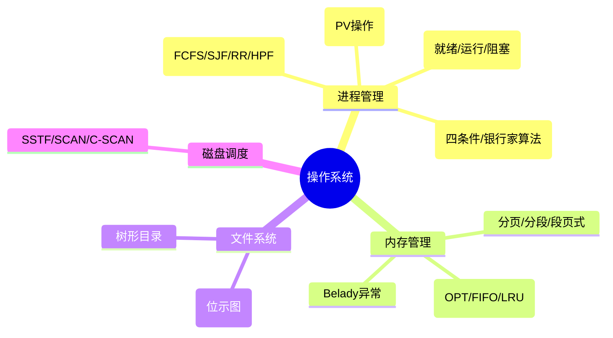

# 第四章：操作系统基础

> 分值占比：5%-8% | 重要程度：★★★★

## 考情快照

- **分值占比**：5%-8%（上午选择题 4-6 题）
- **题型**：选择题（进程调度 + 死锁 + 页面置换 + 磁盘调度）
- **备考建议**：死锁四个必要条件 + 银行家算法 + 页面置换算法（LRU/FIFO/Belady异常）必考。PV 操作生产者-消费者模型需要会写。

## 知识导图



## 考情分析

本章是软件设计师考试的重要章节，主要介绍操作系统的基本概念、进程管理、内存管理、文件系统等。考试重点在于进程调度算法、内存管理方式和死锁处理。

**高频考点分布：**
- 进程调度与同步：~25%
- 死锁（四条件 + 银行家）：~25%
- 内存管理（分页/置换）：~25%
- 文件系统 + 磁盘调度：~15%
- 其他：~10%

---

## 4.1 操作系统概述

### 4.1.1 操作系统基本概念

**操作系统定义：** 管理和控制计算机硬件与软件资源的核心软件。

**操作系统功能：**
- **处理机管理**：进程调度、同步、通信
- **存储器管理**：内存分配、地址映射、保护
- **设备管理**：设备分配、缓冲区管理、I/O控制
- **文件管理**：文件存储、访问控制、目录管理
- **用户接口**：命令接口、程序接口（系统调用）

### 4.1.2 操作系统分类

- **批处理操作系统**：作业成批处理，无交互
- **分时操作系统**：CPU 时间分片，多用户共享
- **实时操作系统**：在规定时间内完成处理（硬实时/软实时）
- **网络/分布式操作系统**：多台计算机协同

---

## 4.2 进程管理

### 4.2.1 进程基础

**进程 = 程序的一次执行过程**，是资源分配和调度基本单位。

**进程状态转换：**
```
就绪 ──调度──▶ 运行 ──时间片到──▶ 就绪
  ▲              │
  │              │ I/O请求
  │              ▼
  └──I/O完成── 阻塞（等待）
```

**进程控制块（PCB）**：操作系统管理进程的数据结构
- 进程标识符、状态、CPU现场、调度信息、资源清单

**进程 vs 线程：**
| 对比项 | 进程 | 线程 |
|--------|------|------|
| 资源 | 拥有资源 | 共享进程资源 |
| 调度 | 资源分配单位 | CPU 调度单位 |
| 开销 | 大 | 小 |
| 通信 | IPC | 共享变量 |

### 4.2.2 进程调度算法

| 算法 | 策略 | 优点 | 缺点 |
|------|------|------|------|
| **FCFS** | 先来先服务 | 公平简单 | 护航效应（长作业拖后） |
| **SJF** | 最短作业优先 | 平均等待时间最短 | 预估不准、饥饿 |
| **SRT** | 最短剩余时间优先 | 抢占式 | 频繁切换开销 |
| **RR** | 时间片轮转 | 公平响应快 | 时间片大小敏感 |
| **HPF** | 最高优先级 | 实时性好 | 低优先级饥饿 |
| **MFQ** | 多级反馈队列 | 兼顾效率响应 | 参数复杂 |

### 4.2.3 进程同步与 PV 操作

**信号量机制：**
- `P(s)`/`wait(s)`：s--，若 s<0 则阻塞
- `V(s)`/`signal(s)`：s++，若 s≤0 则唤醒

**经典模型 — 生产者-消费者：**

```markdown
semaphore mutex = 1;   // 互斥
semaphore empty = N;   // 空位
semaphore full  = 0;   // 满位

// 生产者（P顺序不能反！empty在full前）
P(empty); P(mutex); 放产品; V(mutex); V(full);

// 消费者（P顺序不能反！）
P(full); P(mutex); 取产品; V(mutex); V(empty);
```

::: warning 易错
P 操作顺序 = 先同步信号量(empty/full)，再互斥信号量(mutex)。反了可能死锁！V 操作顺序任意。
:::

**其他经典模型：** 读者-写者、哲学家进餐、吸烟者问题

### 4.2.4 死锁（⚠️ 必考）

**死锁四个必要条件（缺一不可）：**
1. **互斥**：资源独占
2. **请求保持**：占有一批还请求新的
3. **不可剥夺**：已分配不能强行夺走
4. **环路等待**：进程-资源有向环

**死锁处理策略：**
| 策略 | 方法 |
|------|------|
| 预防 | 破坏四个条件之一 |
| 避免 | 银行家算法（分配前检查安全性） |
| 检测与恢复 | 资源分配图简化，发现后剥夺/撤销 |

::: tip 银行家算法步骤
1. 检查请求 ≤ Need 且 ≤ Available
2. 试探性分配
3. 执行安全性算法：寻找安全序列
4. 有安全序列 → 分配；无 → 拒绝
:::

---

## 4.3 内存管理

### 4.3.1 存储管理方式

| 管理方式 | 特点 | 碎片 |
|---------|------|------|
| 固定分区 | 预先划分等大小区 | 内部碎片 |
| 可变分区 | 按需划分 | 外部碎片 |
| 分页 | 固定大小页（进程）/ 块（内存） | 内部碎片 |
| 分段 | 按逻辑划分 | 外部碎片 |
| 段页式 | 先分段，每段再分页 | 最小 |

::: tip 地址变换
逻辑地址 = 页号 + 页内偏移 → 查页表得物理块号 + 页内偏移 = 物理地址
:::

### 4.3.2 页面置换算法（⚠️ 必考 + Belady异常）

| 算法 | 策略 | 特点 |
|------|------|------|
| OPT | 淘汰最久不用 | 理论最优，无法实现 |
| FIFO | 先进先出 | **Belady 异常**（分配页框↑ 反而缺页↑） |
| LRU | 最近最少使用 | 效果好，需硬件支持 |
| LFU | 访问次数最少 | 不反映时间局部性 |

::: danger Belady 异常
FIFO 算法特有：增加物理页框数，缺页率反而上升。LRU/LFU 没有此异常（栈算法）。
:::

### 4.3.3 虚拟存储

**实现基础：** 程序局部性原理（时间局部性 + 空间局部性）
**特征：** 多次性、对换性、虚拟性

---

## 4.4 文件系统与磁盘调度

### 文件目录
- **树形目录**：现代 OS 标准
- **路径**：绝对（从根开始）/ 相对（从当前目录）

### 空闲空间管理：位示图法
- 每位 = 1 个物理块，0=空闲，1=已分配
- 优点：快速找到连续空间

### 磁盘调度算法（⚠️ 必考 SSTF vs SCAN）

| 算法 | 移动策略 | 特点 |
|------|---------|------|
| FCFS | 到达顺序 | 公平但寻道长 |
| SSTF | 最近柱面 | 寻道短但饥饿 |
| SCAN（电梯）| 单向走到底再反 | 比较均衡 |
| C-SCAN | 单向循环 | 两端更均匀 |

---

## 考点速查

| 考点 | 一句话定义 | 频次 |
|------|----------|------|
| 进程状态转换 | 时间片到→就绪，I/O→阻塞，调度→运行 | ★★★★ |
| 死锁四条件 | 互斥/请求保持/不可剥夺/环路 | ★★★★★ |
| 银行家算法 | 分配前安全检查，找安全序列 | ★★★★ |
| PV 操作 | P减阻塞，V加唤醒；先同步再互斥 | ★★★★★ |
| 页面置换 LRU | 淘汰最近最少使用 | ★★★★ |
| Belady 异常 | FIFO 特有毒药：页面多反而缺页多 | ★★★★ |
| 磁盘 SCAN | 电梯算法，单向往返 | ★★★ |
| 段页式 | 先分段后分页，逻辑清晰物理规整 | ★★★ |

## 考点→题目索引

- **进程调度与状态**：[softdesigner-061]() · [softdesigner-062]() · [softdesigner-071]()
- **PV 操作与同步**：[softdesigner-063]() · [softdesigner-064]() · [softdesigner-072]()
- **死锁与银行家**：[softdesigner-065]() · [softdesigner-066]() · [softdesigner-073]()
- **页面置换**：[softdesigner-067]() · [softdesigner-068]() · [softdesigner-074]() · [softdesigner-075]()
- **内存管理**：[softdesigner-069]() · [softdesigner-070]()
- **文件系统**：[softdesigner-076]() · [softdesigner-077]()
- **磁盘调度**：[softdesigner-078]() · [softdesigner-079]() · [softdesigner-080]()

## 真题练习

::: tip
本章共 20 题，建议 30 分钟。死锁四条件 + PV 操作 + 页面置换 = 必考三件套。
:::

<Quiz dataUrl="./quiz.json" />
