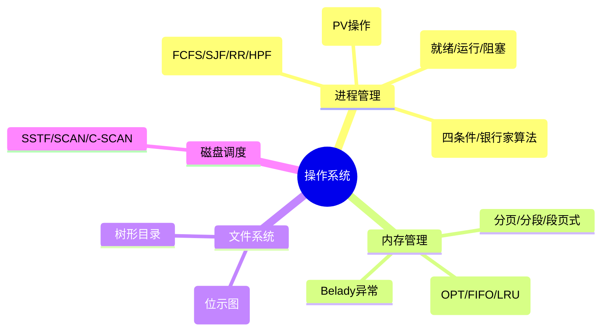

# 第四章：操作系统基础

> 分值占比：5%-8% | 重要程度：★★★★

**📖 零基础导读**

> 本章讲的是**操作系统这台"电脑管家"的日常工作**：程序打开后谁先运行、内存装不下怎么办、文件存在哪、磁盘怎么转。软设考试里它是出题大户（约 4-6 题），而且考法机械——算法步骤背下来就能拿分，是零基础最好捡的分。

**人话概述**：这一章的主角是操作系统——你每天用电脑/手机，背后全是它在忙。先看它怎么"管活儿"（4.1-4.2 进程管理：程序跑起来叫进程，谁先用 CPU 由调度算法决定，进程之间抢资源可能"死锁"）；再看它怎么"管仓库"（4.3 内存管理：程序要装进内存，装不下就靠虚拟内存 + 页面置换硬撑）；最后看它怎么"管文件柜和快递"（4.4 文件系统 + 磁盘调度）。

**生活联系**：手机后台的一排 App 就是进程，来回切换就是进程调度；食堂排队先到先打饭 = FCFS，调度算法全是生活中的排队规则；"两个程序各占着一个打印机互不相让"就是死锁；手机存储快满还能继续用 = 虚拟内存；外卖小哥先送顺路的单 = SSTF 磁盘调度。

**学完会什么**：会画进程三态转换图（就绪→运行→阻塞）并说清每条边的原因；会算 SJF/RR 的平均等待时间；会默写死锁四条件、按三步走完银行家算法找到安全序列；会手推 LRU/FIFO 的缺页次数，知道 Belady 异常只有 FIFO 才有；会给磁盘请求排 SSTF/SCAN 的服务顺序。

**难点预告**：① 死锁四条件要"缺一不可"地记——题目爱考"打破哪一条能预防"，死锁 = 四条全占；② 银行家算法第一次看像在记账：算 Need（还差多少）→ 看谁"差得少"能满足 → 满足后把资源收回来接着分，三步循环；③ 页面置换最怕心算——LRU 看"最久没被用"、FIFO 看"最早进来"，拿 3 个物理块一步步写块表，别跳步。

🔗 **前置**：本章讲的是"谁来调度 CPU、内存、磁盘这些资源"，前提是先认识这些资源本身——零基础建议先花 10 分钟学预备篇 [P2 计算机长什么样](/softdesigner/prep/p2)，再回来读本章。

## 考情快照

- **分值占比**：5%-8%（上午选择题 4-6 题）
- **题型**：选择题（进程调度 + 死锁 + 页面置换 + 磁盘调度）
- **备考建议**：死锁四个必要条件 + 银行家算法 + 页面置换算法（LRU/FIFO/Belady异常）必考。PV 操作生产者-消费者模型需要会写。

## 知识导图


```mermaid
mindmap
  root((操作系统))
    进程管理
      状态(就绪/运行/阻塞)
      调度算法(FCFS/SJF/RR/HPF)
      同步(PV操作)
      死锁(四条件/银行家算法)
    内存管理
      分页/分段/段页式
      页面置换(OPT/FIFO/LRU)
      Belady异常
    文件系统
      树形目录
      空闲空间管理(位示图)
    磁盘调度
      SSTF/SCAN/C-SCAN
```

## 考情分析

本章是软件设计师考试的重要章节，主要介绍操作系统的基本概念、进程管理、内存管理、文件系统等。考试重点在于进程调度算法、内存管理方式和死锁处理。

**高频考点分布：**
- 进程调度与同步：~25%
- 死锁（四条件 + 银行家）：~25%
- 内存管理（分页/置换）：~25%
- 文件系统 + 磁盘调度：~15%
- 其他：~10%

---

## 4.1 操作系统概述

### 4.1.1 操作系统基本概念

**操作系统定义：** 管理和控制计算机硬件与软件资源的核心软件。

**操作系统功能：**
- **处理机管理**：进程调度、同步、通信
- **存储器管理**：内存分配、地址映射、保护
- **设备管理**：设备分配、缓冲区管理、I/O控制
- **文件管理**：文件存储、访问控制、目录管理
- **用户接口**：命令接口、程序接口（系统调用）

**🎯 一句话人话**：操作系统是电脑的"大管家"——管 CPU/内存/设备/文件，还给人一个用电脑的入口。

**💡 类比**：酒店前台：处理机管理=给客人（进程）安排房间；存储器管理=仓库进出登记；文件管理=物品寄存台账；用户接口=前台接待窗口。

**✍️ 小例子**：同时开微信和浏览器：内存分配由存储器管理负责；读文件由文件管理负责；两个程序轮流用 CPU 是处理机管理在调度。

**⚠️ 常见误区**：处理机管理管的是"CPU 分给谁用"（进程调度），不是管散热风扇；存储器管理管内存分配，别和磁盘文件管理混。

### 4.1.2 操作系统分类

- **批处理操作系统**：作业成批处理，无交互
- **分时操作系统**：CPU 时间分片，多用户共享
- **实时操作系统**：在规定时间内完成处理（硬实时/软实时）
- **网络/分布式操作系统**：多台计算机协同

**🎯 一句话人话**：操作系统按"人机交互方式"分四类：批处理不问人、分时人人分一点 CPU、实时必须按时完成、网络/分布式多机协作。

**💡 类比**：餐厅出菜：批处理=按订单成批做、做完才通知；分时=每桌轮流上菜、大家都吃着；实时=手术室监控必须毫秒级响应；分布式=几个厨房一起做一桌菜。

**✍️ 小例子**：银行柜台取号排队=分时（轮流服务）；导弹制导=硬实时（规定时间内必须响应）；股票撮合按批结算=批处理。

**⚠️ 常见误区**：分时看"时间片轮流"、实时看"在期限内必须完成"——实时系统不是"更快"而是"有硬性截止时间"，超时就是事故。

---

## 4.2 进程管理

### 4.2.1 进程基础

**进程 = 程序的一次执行过程**，是资源分配和调度基本单位。

**🎯 一句话人话**：程序是"菜谱"，进程是"按菜谱实际做菜这一次"——同一份菜谱可以做很多次菜，每次都是一次独立进程。

**💡 类比**：同一个 App（程序），你手机后台开 3 个实例，就是 3 个进程，各占各的内存和状态。

**✍️ 小例子**：一个 C 程序编译出的 exe 同时运行 2 份，就有 2 个进程，各有独立内存空间和 PCB；进程是资源分配单位，线程才是 CPU 调度单位。

**⚠️ 常见误区**：程序是静态的、进程是动态的；引入线程后"进程是资源分配单位、线程是 CPU 调度单位"，别把两者的单位搞混。

**进程状态转换：**
```
就绪 ──调度──▶ 运行 ──时间片到──▶ 就绪
  ▲              │
  │              │ I/O请求
  │              ▼
  └──I/O完成── 阻塞（等待）
```

**🎯 一句话人话**：进程在"就绪/运行/阻塞"三个状态里转圈：能跑的先排着队（就绪），轮到了就运行（运行），要等 I/O 就睡一会儿（阻塞）。

**💡 类比**：食堂打饭：排队=就绪，正在打=运行，饭还没熟得等=阻塞；等饭熟了（I/O 完成）又回去排队。

**✍️ 小例子**：进程 A 时间片用完 → 从运行回到就绪；A 请求磁盘读数据 → 从运行进阻塞；数据读完 → 阻塞回就绪（不能直接回运行！）。

**⚠️ 常见误区**：阻塞结束只能回"就绪"再被调度，不能直接变"运行"；时间片到回就绪、I/O 请求进阻塞、调度到才运行——三条边方向别记反。

- ⚠️ 必考行：时间片到→就绪，I/O请求→阻塞，调度→运行，I/O完成→阻塞回就绪（不能直接到运行）。

**进程控制块（PCB）**：操作系统管理进程的数据结构
- 进程标识符、状态、CPU现场、调度信息、资源清单

**🎯 一句话人话**：PCB 是每个进程的"身份证+档案袋"，操作系统靠它认人、知道每个进程现在在哪、用了什么。

**💡 类比**：医院病历：每个病人（进程）一份病历（PCB），记录姓名（标识符）、病情（状态）、上次检查数据（CPU 现场）。

**✍️ 小例子**：进程从运行变阻塞时，把当前 CPU 寄存器的值存进 PCB 的"CPU 现场"字段；下次调度回它时再从 PCB 恢复现场，程序接着跑。

**⚠️ 常见误区**：PCB 存的是"进程的现场信息"，不是进程的代码/数据本身；代码在内存里，PCB 只记管理用的元信息。

**进程 vs 线程：**
| 对比项 | 进程 | 线程 |
|--------|------|------|
| 资源 | 拥有资源 | 共享进程资源 |
| 调度 | 资源分配单位 | CPU 调度单位 |
| 开销 | 大 | 小 |
| 通信 | IPC | 共享变量 |

**🎯 一句话人话**：进程是"老板"（拥有资源、独立核算），线程是"员工"（共享老板的资源、分工干活）；干活的是员工（线程）。

**💡 类比**：一家公司（进程）有独立办公室和预算（资源）；公司里的员工（线程）共用办公室，各干各的活；换员工（切换线程）比换公司（切换进程）便宜得多。

**✍️ 小例子**：一个浏览器进程里多个标签页=多个线程，共享同一块内存；两个不同 App 进程之间通信要用 IPC（管道/消息队列），进程内线程间直接用共享变量。

**⚠️ 常见误区**：进程才是"拥有资源"的单位，线程只共享不独占；"开销大"指进程切换，线程切换开销小；线程通信用共享变量（要加锁），进程通信才用 IPC。

### 4.2.2 进程调度算法

| 算法 | 策略 | 优点 | 缺点 |
|------|------|------|------|
| **FCFS** | 先来先服务 | 公平简单 | 护航效应（长作业拖后） |
| **SJF** | 最短作业优先 | 平均等待时间最短 | 预估不准、饥饿 |
| **SRT** | 最短剩余时间优先 | 抢占式 | 频繁切换开销 |
| **RR** | 时间片轮转 | 公平响应快 | 时间片大小敏感 |
| **HPF** | 最高优先级 | 实时性好 | 低优先级饥饿 |
| **MFQ** | 多级反馈队列 | 兼顾效率响应 | 参数复杂 |

**🎯 一句话人话**：调度算法就是"CPU 先伺候谁"的排队规则——先来先服务、短的先来、轮流、或按优先级来。

**💡 类比**：便利店收银：FCFS=先到先结账；SJF=只买一瓶水的先结；RR=每人最多 30 秒轮着来；HPF=会员优先。

**✍️ 小例子**：作业耗时 8、4、1：FCFS 平均等待=(0+8+12)/3≈6.7；SJF 按 1、4、8 排，平均等待=(0+1+5)/3=2——最短优先明显更省等待，但长作业可能饿死。

**⚠️ 常见误区**：SJF 平均等待最短但可能饿死长作业，且需预估运行时间；FCFS 的"护航效应"=一个长作业堵住后面所有短作业；RR 时间片太大退化成 FCFS、太小切换开销剧增。

### 4.2.3 进程同步与 PV 操作

**信号量机制：**
- `P(s)`/`wait(s)`：s--，若 s<0 则阻塞
- `V(s)`/`signal(s)`：s++，若 s≤0 则唤醒

**经典模型 — 生产者-消费者：**

```markdown
semaphore mutex = 1;   // 互斥
semaphore empty = N;   // 空位
semaphore full  = 0;   // 满位

// 生产者（P顺序不能反！empty在full前）
P(empty); P(mutex); 放产品; V(mutex); V(full);

// 消费者（P顺序不能反！）
P(full); P(mutex); 取产品; V(mutex); V(empty);
```

::: warning 易错
P 操作顺序 = 先同步信号量(empty/full)，再互斥信号量(mutex)。反了可能死锁！V 操作顺序任意。
:::

**🎯 一句话人话**：P 就是"申请"（数量减 1，不够就排队等），V 就是"释放"（数量加 1，顺便叫醒排队的）——一对信号量控制"还能放几个/有几个"，mutex 保证同一时刻只有一个人动缓冲区。

**💡 类比**：奶茶店取餐口：empty=还能放几杯的空位、full=做好待取的几杯、mutex=取餐口这把锁；放一杯先占空位（P(empty)）再锁门（P(mutex)），做完开门（V(mutex)）再喊"有一杯好了"（V(full)）。

**✍️ 小例子**：N=2 时初始 empty=2、full=0：生产 1 件 → P(empty) 使 empty 变 1、V(full) 使 full 变 1；再消费 1 件 → P(full) 使 full 变 0、V(empty) 使 empty 变 2，回到初始。满缓冲时生产者在 P(empty) 上排队，空缓冲时消费者在 P(full) 上排队。

**⚠️ 常见误区**：P 的顺序必须先同步（empty/full）后互斥（mutex），反了会死锁（见上方 warning）；P 减 V 加别记反，且 P 判 s<0 阻塞、V 判 s≤0 才唤醒。

- ⚠️ 必考行：PV 口诀"P 减阻塞、V 加唤醒"；生产者-消费者必须先 P 同步再 P 互斥，V 顺序任意。

**其他经典模型：** 读者-写者、哲学家进餐、吸烟者问题

**🎯 一句话人话**：除了生产者-消费者，还有三个必眼熟的同步模型——读者写者（多人读可以、写时独占）、哲学家进餐（抢筷子别死锁）、吸烟者（材料凑齐才开工）。

**💡 类比**：读者写者像图书馆：几个人一起看书可以，有人要写笔记就得等没人；哲学家进餐像圆桌吃饭：一人拿左右两根筷子才能吃，全拿左手筷就全饿着（死锁）。

**✍️ 小例子**：5 个哲学家 5 根筷子：都先拿左手筷 → 每人只剩右手没有筷 → 死锁；解法是限制最多 4 人同时拿筷，或"要么一次拿两根、要么都不拿"。

**⚠️ 常见误区**：哲学家进餐考的就是"如何破坏死锁四条件之一"（如限制并发人数）；读者写者里"写者优先"不是让写者插队，而是防止写者被读者不断饿死。

### 4.2.4 死锁（⚠️ 必考）

**死锁四个必要条件（缺一不可）：**
1. **互斥**：资源独占
2. **请求保持**：占有一批还请求新的
3. **不可剥夺**：已分配不能强行夺走
4. **环路等待**：进程-资源有向环

**🎯 一句话人话**：死锁四条件缺一不可：资源不共享 + 占了还想要 + 抢不走 + 互相等成环——四条全占才死锁。

**💡 类比**：两个人过独木桥：各占一头（互斥）、手上拄着棍还想对方让路（请求保持）、棍子夺不走（不可剥夺）、互相盯着等对方退（环路等待）——于是谁也过不去。

**✍️ 小例子**：进程 A 占打印机等扫描仪、进程 B 占扫描仪等打印机：互斥✓ 请求保持✓ 不可剥夺✓ 环路等待✓ → 死锁；只要 A 先释放打印机就能活。

**⚠️ 常见误区**：四条是"缺一不可"，不是满足任一条就死锁；破坏任何一条即可预防死锁，所以题目常问"哪种策略破坏哪一条"。

- ⚠️ 必考行：死锁四条件=互斥+请求保持+不可剥夺+环路等待，缺一不可；破坏任一条即可预防。

**死锁处理策略：**
| 策略 | 方法 |
|------|------|
| 预防 | 破坏四个条件之一 |
| 避免 | 银行家算法（分配前检查安全性） |
| 检测与恢复 | 资源分配图简化，发现后剥夺/撤销 |

::: tip 银行家算法步骤
1. 检查请求 ≤ Need 且 ≤ Available
2. 试探性分配
3. 执行安全性算法：寻找安全序列
4. 有安全序列 → 分配；无 → 拒绝
:::

**🎯 一句话人话**：对付死锁三层手段——预防（破坏条件）、避免（银行家算法分配前先演算安不安全）、检测恢复（等死锁发生了再抢救）。

**💡 类比**：预防=修桥时直接设计成不会堵；避免=每次放行前先问"放他过去会不会让整条路堵死"（银行家）；检测恢复=已经堵死了再拖车。

**✍️ 小例子**：单类资源总量 12，已分配 P0=2/P1=4/P2=4，Available=2，Need=P0=4/P1=1/P2=4：先满足 P1（need1≤2）→ 释放后 Available=6 → 满足 P0（4≤6）→ Available=8 → 满足 P2 → 安全序列 P1→P0→P2，可分配（步骤见上方 tip）。

**⚠️ 常见误区**：银行家算法是"避免"不是"预防"；安全性检查看 Need ≤ Available，看的是"还缺多少"，不是已经占了多少；找不到安全序列就拒绝分配。

- ⚠️ 必考行：银行家算法=分配前安全检查，找安全序列；安全序列存在才分配，否则拒绝。

---

## 4.3 内存管理

### 4.3.1 存储管理方式

| 管理方式 | 特点 | 碎片 |
|---------|------|------|
| 固定分区 | 预先划分等大小区 | 内部碎片 |
| 可变分区 | 按需划分 | 外部碎片 |
| 分页 | 固定大小页（进程）/ 块（内存） | 内部碎片 |
| 分段 | 按逻辑划分 | 外部碎片 |
| 段页式 | 先分段，每段再分页 | 最小 |

::: tip 地址变换
逻辑地址 = 页号 + 页内偏移 → 查页表得物理块号 + 页内偏移 = 物理地址
:::

**🎯 一句话人话**：内存装进程的三种姿势——分区（一大块直接分）、分页（切成等大小格子）、分段（按逻辑模块切）；段页式先分段再分页，兼顾两者。

**💡 类比**：仓库放货：分区=按订单划整片区域；分页=统一码成同尺寸货格（内部容易剩缝=内部碎片）；分段=按"零件/成品"分区域（区域间容易留缝=外部碎片）；段页式=先分区再在每个区里码货格，最省。

**✍️ 小例子**：分页地址变换：页大小 1KB，逻辑地址页号 2、偏移 100，页表 2→物理块 5 → 物理地址 = 5×1024+100 = 5220（偏移不变、只换块号）。

**⚠️ 常见误区**：分页是固定大小→内部碎片，分段按逻辑划分→外部碎片；地址变换只换"页号→块号"，页内偏移原样保留，别把偏移也乘块大小。

### 4.3.2 页面置换算法（⚠️ 必考 + Belady异常）

| 算法 | 策略 | 特点 |
|------|------|------|
| OPT | 淘汰最久不用 | 理论最优，无法实现 |
| FIFO | 先进先出 | **Belady 异常**（分配页框↑ 反而缺页↑） |
| LRU | 最近最少使用 | 效果好，需硬件支持 |
| LFU | 访问次数最少 | 不反映时间局部性 |

**🎯 一句话人话**：物理块不够用时，页面置换决定"把哪一页踢出去"——OPT 踢最久不用的、FIFO 踢最早进来的、LRU 踢最久没用的、LFU 踢用得最少的。

**💡 类比**：书桌放不下书：OPT=你知道下周哪本不用先收走（开挂）；FIFO=先放上去的先收回书架（不管最近用没用）；LRU=最近翻得最少的那本收走（最合理）。

**✍️ 小例子**：访问串 1,2,3,1,4（3 个块）：第 5 步 FIFO 淘汰最先进入的 1 → [2,3,4]；LRU 淘汰最久没用过的 2（1 刚在第 4 步用过）→ [3,1,4]。同一输入两者淘汰页不同，缺页都 4 次但策略差异可见。

**⚠️ 常见误区**：LRU 看"最近没用过"，LFU 看"总共用得少"；OPT 只能理论推演不能实现；FIFO 才会触发 Belady 异常，LRU/OPT 不会（栈算法）。

- ⚠️ 必考行：LRU=淘汰最近最少使用，效果好需硬件支持；OPT 理论最优不可实现；FIFO 有 Belady 异常。

::: danger Belady 异常
FIFO 算法特有：增加物理页框数，缺页率反而上升。LRU/LFU 没有此异常（栈算法）。
:::

**🎯 一句话人话**：Belady 异常是 FIFO 的"反直觉 bug"：按理说内存越多越不容易缺页，但 FIFO 下页框加多，缺页反而变多。

**💡 类比**：本来 3 个停车位车位排队更顺，换成 4 个车位却更堵了——因为 FIFO 只认"先进先出"，不认"这辆马上还要用"。

**✍️ 小例子**：典型访问串 1,2,3,4,1,2,5,1,2,3,4,5：3 框时 FIFO 缺页 9 次，4 框反而缺页 10 次（具体演算见上方 danger 块）。

**⚠️ 常见误区**：Belady 异常**只有 FIFO** 有，LRU/OPT/LFU 都不会（它们是栈算法）；别以为"页框越多一定缺页越少"。

- ⚠️ 必考行：Belady 异常=FIFO 特有，加页框反而缺页更多；LRU/OPT 属栈算法无此异常。

### 4.3.3 虚拟存储

**实现基础：** 程序局部性原理（时间局部性 + 空间局部性）
**特征：** 多次性、对换性、虚拟性

**🎯 一句话人话**：虚拟存储让"看起来内存比实际大"——靠局部性原理，只把正在用的部分放进内存，其余留在磁盘，用的时候再换进来。

**💡 类比**：图书馆书架放不下全部藏书，但读者总在借固定几个区（局部性），于是只把常借的放书架、冷门的存仓库，看着像全在馆内。

**✍️ 小例子**：程序 100MB 但内存只有 64MB：靠请求调页只装载当前用到的页，缺页时从磁盘换入；时间局部性=循环反复用同一变量，空间局部性=数组连续访问相邻元素。

**⚠️ 常见误区**：局部性原理是虚拟存储的"实现基础"，两个局部性别混淆——时间=同一地址反复用、空间=相邻地址连着用；特征"多次性/对换性/虚拟性"是三个词，别只记虚拟性。

---

## 4.4 文件系统与磁盘调度

### 文件目录
- **树形目录**：现代 OS 标准
- **路径**：绝对（从根开始）/ 相对（从当前目录）

**🎯 一句话人话**：文件用"树形目录"组织（文件夹套文件夹），找文件用两条路——绝对路径从根一路写全，相对路径从当前位置开始写。

**💡 类比**：公司组织架构是棵树；介绍自己位置：绝对路径="总部→产品部→前端组→我"，相对路径=从前端组说"同层右边是后端组"。

**✍️ 小例子**：当前目录是 `/home/u/doc`：绝对路径 `/home/u/doc/a.txt` 从头写；相对路径 `a.txt` 直接写文件名；`../b.txt` 表示上一级目录 `/home/u/` 下的 b.txt。

**⚠️ 常见误区**：绝对路径以根（/）开头、相对路径不以根开头；`..` 表示上一级目录，别当成当前目录；树形目录是现代 OS 标准，非树形是早期单级/二级目录。

### 空闲空间管理：位示图法
- 每位 = 1 个物理块，0=空闲，1=已分配
- 优点：快速找到连续空间

**🎯 一句话人话**：位示图用一个 0/1 位图记录"哪个磁盘块空着、哪个被占了"，0 空 1 忙，查图就知道哪里有连续空块。

**💡 类比**：电影院座位图：每个座位一格，亮灯=已售（1）、灭灯=空座（0），售票员扫一眼就知道哪里连着空着。

**✍️ 小例子**：磁盘 1000 个块，位示图就 1000 位（约 125 字节）；要找连续 3 块，扫位图找 3 个连续 0：如块 50、51、52 都是 0 → 分配后把对应位置 1。

**⚠️ 常见误区**：位示图记"块是否空闲"，不是记"文件内容"；一位对一个物理块，0=空闲 1=已分配，别把 0/1 含义记反；它属于空闲空间管理，与文件目录（树形）是两回事。

### 磁盘调度算法（⚠️ 必考 SSTF vs SCAN）

| 算法 | 移动策略 | 特点 |
|------|---------|------|
| FCFS | 到达顺序 | 公平但寻道长 |
| SSTF | 最近柱面 | 寻道短但饥饿 |
| SCAN（电梯）| 单向走到底再反 | 比较均衡 |
| C-SCAN | 单向循环 | 两端更均匀 |

**🎯 一句话人话**：磁盘调度决定磁头先服务哪个请求——FCFS 按到达顺序、SSTF 找最近的、SCAN 像电梯单向往返、C-SCAN 单方向循环。

**💡 类比**：外卖骑手送单：FCFS=单子按顺序来送；SSTF=先送最近的（但远处单子可能饿死）；SCAN=从 1 楼一路送到 20 楼再返回来；C-SCAN=只从 1 楼上到 20 楼，到了就瞬移回 1 楼重新上。

**✍️ 小例子**：磁头在 53，请求 98/183/37/122/14/124/65/67：SSTF 先服务最近的 65（|65-53|=12）；SCAN 先朝大号走：65→67→98→122→124→183，到尽头再反向服务小号。

**⚠️ 常见误区**：SSTF 寻道最短但可能饥饿；SCAN"单向走到底再反"不是每到一层就变向；C-SCAN 是只往一个方向服务、到端回起点再循环，两端等待更均匀。

- ⚠️ 必考行：SSTF=最近柱面优先、寻道短但饥饿；SCAN=电梯算法单向往返；C-SCAN=单向循环两端更均匀。

---

## 考点速查

| 考点 | 一句话定义 | 频次 |
|------|----------|------|
| 进程状态转换 | 时间片到→就绪，I/O→阻塞，调度→运行 | ★★★★ |
| 死锁四条件 | 互斥/请求保持/不可剥夺/环路 | ★★★★★ |
| 银行家算法 | 分配前安全检查，找安全序列 | ★★★★ |
| PV 操作 | P减阻塞，V加唤醒；先同步再互斥 | ★★★★★ |
| 页面置换 LRU | 淘汰最近最少使用 | ★★★★ |
| Belady 异常 | FIFO 特有毒药：页面多反而缺页多 | ★★★★ |
| 磁盘 SCAN | 电梯算法，单向往返 | ★★★ |
| 段页式 | 先分段后分页，逻辑清晰物理规整 | ★★★ |

## 考点→题目索引

- **进程调度与状态**：[softdesigner-061]() · [softdesigner-062]() · [softdesigner-071]()
- **PV 操作与同步**：[softdesigner-063]() · [softdesigner-064]() · [softdesigner-072]()
- **死锁与银行家**：[softdesigner-065]() · [softdesigner-066]() · [softdesigner-073]()
- **页面置换**：[softdesigner-067]() · [softdesigner-068]() · [softdesigner-074]() · [softdesigner-075]()
- **内存管理**：[softdesigner-069]() · [softdesigner-070]()
- **文件系统**：[softdesigner-076]() · [softdesigner-077]()
- **磁盘调度**：[softdesigner-078]() · [softdesigner-079]() · [softdesigner-080]()

## 🧮 例题精讲

> 下面 5 道题覆盖本章必考点（死锁四条件、银行家算法、页面置换、磁盘调度）。先自己动手算，再看思路与逐步推演——考试时选择题也能快速锁定答案。

**例题 1**：系统发生死锁的四个必要条件是：
- A. 互斥、请求与保持、不剥夺、循环等待　B. 同步、互斥、死锁、饥饿　C. 进程、资源、分配、释放　D. 并发、共享、异步、不确定性

**思路**：死锁是"大家卡住谁也动不了"，所以四条必须都是"卡住"的原因：资源独占（互斥）、占了还想要（请求与保持）、抢不走（不剥夺）、互相等成环（循环等待）——用"独、要、抢、环"四字口诀记。

**逐步推演**：
1. 互斥：每个资源同一时刻只能给一个进程用——这是资源本性。
2. 请求与保持：进程占着手里资源不放，又去请求新资源。
3. 不可剥夺：别人不能强行把已分配的资源拿走。
4. 循环等待：A 等 B 的资源、B 等 A 的资源，形成有向环。
5. 四条必须同时满足才会死锁，缺一条就不会；所以打破任何一条就能预防。

**答案**：A（互斥、请求与保持、不剥夺、循环等待）——与 Quiz 中 softdesigner-065 的答案一致。

**易错点**：B 里的"同步、互斥"是信号量概念、D 的"并发、共享、异步"是操作系统特征，都不是死锁条件。考试还爱反着问"哪种策略破坏了哪一条"——比如资源一次性全部分配 = 破坏"请求与保持"。

**例题 2**：银行家算法属于死锁的：
- A. 预防策略　B. 避免策略　C. 检测与解除策略　D. 忽略策略

**思路**：死锁处理四层手段——预防（动手脚让死锁不可能发生）、避免（每次分配前先演算安不安全）、检测与解除（发生了再抢救）、忽略（鸵鸟策略）。银行家算法是"分配前先问借不借得起"——先检查安全性，所以是避免。

**逐步推演**：
1. 预防 = 直接破坏死锁四条件之一（如资源一次性全部分配）。
2. 避免 = 分配前用安全性算法检查：有安全序列才分配（银行家算法）。
3. 检测与解除 = 允许死锁发生，定期检测资源分配图，发现后撤销/剥夺资源。
4. 银行家算法发生在"分配之前"，属于避免策略。

**答案**：B（避免策略）——与 Quiz 中 softdesigner-066 的答案一致。

**易错点**："避免"和"预防"一字之差最爱考——预防是"提前设规则"，避免是"运行时动态检查"；银行家算法是避免，不是预防，也不是检测。

**例题 3**：某系统共有同类资源 12 个，三个进程 P0、P1、P2 的已分配数和最大需求为：P0 已分配 2、最大需求 6；P1 已分配 4、最大需求 5；P2 已分配 4、最大需求 8。当前剩余资源数为 2。下列哪个是该系统的安全序列？
- A. P0→P1→P2　B. P1→P0→P2　C. P2→P1→P0　D. 不存在安全序列

**思路**：银行家算法三步循环：算每个进程"还差多少"（Need = 最大需求 − 已分配）→ 找 Need ≤ 剩余资源的进程满足它 → 它跑完把资源全还回来（剩余资源变多）→ 重复直到全部跑完。全部能跑完 = 有安全序列。

**逐步推演**：
1. 算 Need：P0 需 6−2=4，P1 需 5−4=1，P2 需 8−4=4。
2. 剩余 Available=2：Need≤2 的只有 P1（1≤2）→ 先满足 P1。
3. P1 跑完归还已分配的 4 → Available=2+4=6。
4. 现在 P0（4≤6）、P2（4≤6）都能满足：先给 P0，跑完归还 2 → Available=6+2=8。
5. 最后 P2（4≤8）→ 跑完。安全序列 P1→P0→P2，可以分配。

**答案**：B（P1→P0→P2）——自编题，与 quiz.json 无关，按银行家算法手算复核。

**易错点**：① 第一步必须先满足 P1——P0、P2 的 Need（4）都大于剩余资源（2），直接满足它们会死锁；② 判断条件看"还差多少"（Need），不是看"已经占了多少"（已分配）；③ 满足 P1 后剩余资源要加上它还回的 4，别只加不还。

**例题 4**：某系统为进程分配 3 个物理块，页面访问序列为 1, 2, 3, 1, 4。采用 LRU（最近最少使用）置换算法，访问页 4 时被淘汰的页面是：
- A. 页 1　B. 页 2　C. 页 3　D. 页 4

**思路**：LRU 淘汰"最久没被访问过"的页——把每次访问后的物理块内容写在纸上，看"谁的最近一次使用时间最老"，就踢谁。

**逐步推演**：
1. 访问 1、2、3：三次都缺页，物理块依次装入 [1]、[1,2]、[1,2,3]。
2. 访问 1：命中。此刻三页的"最近使用"顺序：1 最新 → 3 次之 → 2 最久。
3. 访问 4：缺页。LRU 踢最久未用的页 2 → 物理块变为 [3,1,4]。
4. 对比：若用 FIFO，会踢最先装入的页 1 → [2,3,4]。

**答案**：B（页 2）——自编题，与 quiz.json 无关，按 LRU 规则手算复核。

**易错点**：① 页 1 在第 4 步刚命中过，是"最近使用"不是"最久未用"，别被它迷惑；② LRU 看"多久没用过"、FIFO 看"多久前进来的"——同一序列两者淘汰的页往往不同；③ 只有 FIFO 会触发 Belady 异常（加页框反而缺页更多），LRU 不会。

**例题 5**：磁盘磁头当前位于柱面 53，磁盘请求队列为 98、183、37、122、14、124、65、67（按到达先后）。采用 SSTF（最短寻道时间优先）算法，磁头最先服务的柱面是：
- A. 37　B. 67　C. 65　D. 98

**思路**：SSTF 每次从当前位置出发，选"距离最近"的请求——算绝对值差，最小的先服务。

**逐步推演**：
1. 从 53 出发，计算各请求的距离：65 距 12、67 距 14、37 距 16、14 距 39、98 距 45、122 距 69、124 距 71、183 距 130。
2. 距离最短的是 65（|65−53|=12）→ 最先服务 65。
3. 磁头移到 65 后继续找最近：67（距离 2）→ 再 37（距离 30）……
4. 完整服务顺序：65 → 67 → 37 → 14 → 98 → 122 → 124 → 183。

**答案**：C（65）——自编题，与 quiz.json 无关，按 SSTF 规则手算复核。

**易错点**：① 选"距离最近"不是"柱面号最小"——37 柱面号虽小，但距离 16 比 65 的 12 远；② SSTF 总是迁就近的请求，远处的可能一直轮不到（饥饿），SCAN（电梯）单向往返更均衡；③ 每服务完一个请求，磁头位置就变了，距离要重新算。

## 真题练习

::: tip
本章共 20 题，建议 30 分钟。死锁四条件 + PV 操作 + 页面置换 = 必考三件套。
:::

<Quiz dataUrl="./quiz.json" />
