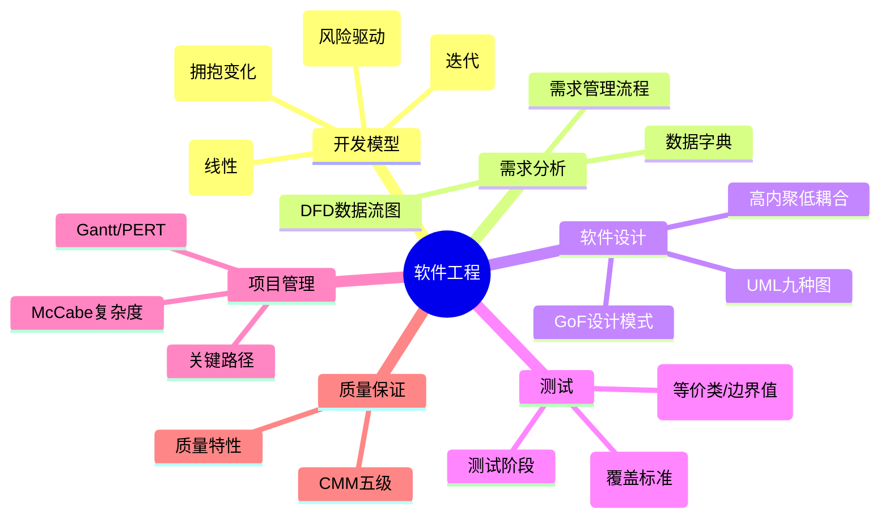

# 第五章：软件工程

> 分值占比：10%-12% | 重要程度：★★★★

## 考情快照

- **分值占比**：10%-12%（上午选择题 6-8 题）
- **题型**：选择题（开发模型对比 + 测试覆盖 + CMMI + McCabe）
- **备考建议**：开发模型对比（瀑布/螺旋/敏捷）必考；白盒测试覆盖标准（语句→路径）考频次极高；McCabe 圈复杂度公式必须记。

## 知识导图



## 考情分析

**高频考点分布：**
- 软件开发模型（瀑布/原型/螺旋/敏捷）：~25%
- 软件测试（覆盖标准 + 等价类/边界值）：~25%
- 软件设计（UML + 设计模式）：~20%
- 项目管理（关键路径 + McCabe）：~15%
- 质量保证（CMM + 维护类型）：~15%

---

## 5.1 软件开发模型（⚠️ 必考对比）

| 模型 | 策略 | 优点 | 缺点 | 适用 |
|------|------|------|------|------|
| **瀑布** | 线性顺序，无交叉 | 简单可控 | 后期变更代价大 | 需求明确稳定 |
| **原型** | 快速原型 + 用户反馈 | 需求理解准确 | 原型被误认为成品 | 需求不确定 |
| **增量** | 分批交付功能增量 | 早期反馈 | 需良好架构 | 大型系统 |
| **螺旋** | 瀑布+原型+风险分析 | 风险驱动 | 管理复杂 | 大型高风险 |
| **敏捷** | 迭代增量，拥抱变化 | 快速响应 | 文档少 | 需求变化快 |

::: tip 模型选择口诀
需求明确→瀑布；需求不清→原型；大型+高风险→螺旋；变化快→敏捷
:::

---

## 5.2 需求分析

### 结构化分析（SA）工具
- **DFD（数据流图）**：外部实体 + 加工 + 数据存储 + 数据流
- **DD（数据字典）**：定义 DFD 中所有元素
- **加工逻辑说明**：判定表/判定树/结构化语言

---

## 5.3 软件设计

### 模块设计原则：高内聚低耦合

| 内聚（高→低） | 耦合（低→高） |
|--------------|--------------|
| 功能内聚 → 顺序内聚 → 通信内聚 → 过程内聚 → 时间内聚 → 逻辑内聚 → 偶然内聚 | 非直接耦合 → 数据耦合 → 标记耦合 → 控制耦合 → 外部耦合 → 公共耦合 → 内容耦合 |

### UML 视图（5 视图）
| 视图 | 核心图 |
|------|--------|
| 用例视图 | 用例图 |
| 逻辑视图 | 类图、对象图、状态图 |
| 进程视图 | 序列图、协作图、活动图 |
| 构件视图 | 组件图 |
| 部署视图 | 部署图 |

---

## 5.4 软件测试（⚠️ 必考覆盖标准）

### 白盒测试覆盖（从弱到强）
```
语句覆盖 < 判定(分支)覆盖 < 条件覆盖 < 判定-条件覆盖 < 条件组合覆盖 < 路径覆盖
```

### 黑盒测试方法
| 方法 | 核心策略 |
|------|---------|
| 等价类划分 | 有效类 + 无效类各选代表 |
| 边界值分析 | 取边界、略大于/小于边界 |
| 因果图 | 输入条件组合 |
| 错误推测 | 基于经验 |

### 测试阶段
| 阶段 | 对象 | 方法 |
|------|------|------|
| 单元测试 | 模块 | 白盒为主 |
| 集成测试 | 模块组合 | 黑盒为主 |
| 确认测试 | 完整系统 | 黑盒 |
| 系统测试 | 完整系统 | 黑盒 |

### 集成测试策略
- **非增量**：一次性集成（Big Bang）
- **自顶向下**：先测顶层，逐步向下（需桩模块）
- **自底向上**：先测底层，逐步向上（需驱动模块）
- **三明治**：两者结合

---

## 5.5 项目管理

### McCabe 圈复杂度（⚠️ 必考公式）
```
V(G) = E - N + 2P    (边数 - 节点数 + 2×连通分量)
V(G) = 判定节点数 + 1  (最常用！)
```

### 关键路径
- **关键路径**：决定项目最短工期的路径
- **关键活动**：总时差 = 0 的活动
- **总时差** = 最迟完成 - 最早完成

### CMM 五级
```
初始级(无序) → 可重复级 → 已定义级 → 已管理级 → 优化级
```

---

## 💼 真实工作案例

### 案例 1：敏捷开发在互联网公司的落地（ch05 → 开发模型）

::: tip 背景
某互联网公司开发一款新功能，需求每周都在变（老板看了竞品要加功能、运营要改流程），传统瀑布模型完全不适用。
:::

**采用方案**：Scrum 敏捷开发
- **Sprint 周期**：2 周一个迭代
- **每日站会**：15 分钟同步进度和阻塞
- **Sprint 评审**：每两周演示可工作软件给产品
- **Sprint 回顾**：团队反思改进

**效果对比**：

| 指标 | 瀑布时期 | 敏捷时期 |
|------|---------|---------|
| 需求变更响应 | 需走变更流程（1-2 周） | 下一个 Sprint 即可排入 |
| 交付周期 | 3 个月大版本 | 2 周可见增量 |
| 返工率 | 40%（前期需求不清） | 10%（早期反馈） |
| 客户满意度 | 交付时才发现偏差 | 持续参与，偏差小 |

**口诀**：需求明确选瀑布；需求不清选原型；大型+高风险选螺旋；变化快选敏捷

### 案例 2：白盒覆盖在代码审查中的应用（ch05 → 软件测试）

::: tip 背景
某银行核心系统开发中，监管要求核心模块代码覆盖率 ≥ 80%。
:::

| 覆盖级别 | 可达覆盖率 | 成本 | 适用模块 |
|---------|-----------|------|---------|
| 语句覆盖 | ~90% | 低 | 所有模块 |
| **分支覆盖** | ~80% | **中** | **核心模块** |
| 条件组合覆盖 | ~60% | 高 | 安全关键模块 |
| 路径覆盖 | <50% | 极高 | 极少使用 |

**实际操作**：
```
核心支付模块 → 分支覆盖 ≥ 80%
普通日志模块 → 语句覆盖 ≥ 70%
加密算法模块 → 条件组合覆盖（因为条件组合多，安全性要求高）
```

## 考点速查

| 考点 | 一句话定义 | 频次 |
|------|----------|------|
| 瀑布 vs 螺旋 | 瀑布=线性无交叉；螺旋=瀑布+原型+风险 | ★★★★★ |
| 白盒覆盖强度 | 语句<分支<条件<判定-条件<组合<路径 | ★★★★★ |
| McCabe 公式 | V(G) = 判定节点数 + 1 | ★★★★ |
| 等价类+边界值 | 黑盒两大核心方法 | ★★★★ |
| 高内聚低耦合 | 模块设计黄金原则 | ★★★★ |
| CMM 五级 | 初始→可重复→已定义→已管理→优化 | ★★★ |
| 维护类型占比 | 纠错21%+适应25%+完善50%+预防4% | ★★★ |
| DFD 四要素 | 外部实体/加工/数据存储/数据流 | ★★★ |

## 考点→题目索引

- **开发模型**：[softdesigner-081]() · [softdesigner-082]() · [softdesigner-091]()
- **需求与 DFD**：[softdesigner-083]() · [softdesigner-092]()
- **测试覆盖与用例**：[softdesigner-084]() · [softdesigner-085]() · [softdesigner-093]() · [softdesigner-094]()
- **集成与测试阶段**：[softdesigner-086]() · [softdesigner-095]()
- **项目管理/Gantt**：[softdesigner-087]() · [softdesigner-096]()
- **McCabe/关键路径**：[softdesigner-088]() · [softdesigner-097]()
- **CMM/质量**：[softdesigner-089]() · [softdesigner-098]()
- **维护类型**：[softdesigner-090]() · [softdesigner-099]() · [softdesigner-100]()

## 真题练习

::: tip
本章共 20 题，建议 35 分钟。开发模型对比 + 测试覆盖标准 = 必考双核心。
:::

<Quiz dataUrl="./quiz.json" />
