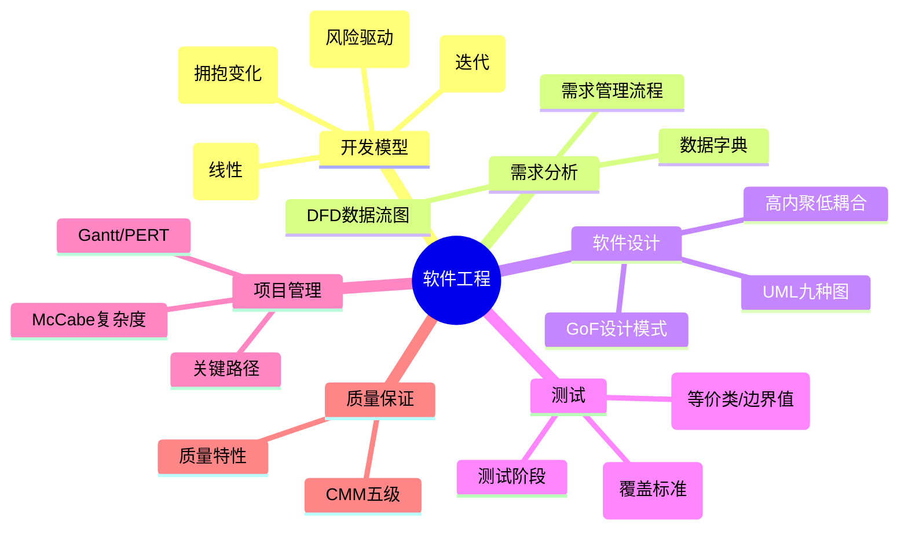

# 第五章：软件工程

> 分值占比：10%-12% | 重要程度：★★★★

**📖 零基础导读**

::: guide 零基础导读

> 本章讲的是**软件是怎么"造"出来的**：从想法到上线，一个软件项目怎么组织、怎么分工。软设考试把它叫"软件工程"，占 10%-12%、是高分值章，而且学的全是能听懂的大白话套路——学完它，你就知道程序员平时在忙什么、公司靠什么保证软件按时交付。

**人话概述**：软件工程就是"造软件的工程方法"，和盖房子一样要先有图纸、过程和检查。它按顺序讲五件事：先选开发流程（5.1 瀑布/原型/螺旋/敏捷——相当于选"图纸方案"，是必考对比）；再搞清楚客户到底要什么（5.2 需求分析）；然后设计模块结构（5.3 高内聚低耦合 + UML）；接着用测试把错误揪出来（5.4 白盒/黑盒测试）；最后用项目管理手段保证不延期（5.5 McCabe 复杂度、关键路径、CMM 成熟度）。

**生活联系**：你点过外卖的 App、打过的游戏，都是这套流程"造"出来的。装修时改方案又贵又慢——软件也一样：需求天天变，选错开发模型就得反复返工。考试不考写代码，考的是"这套工程套路怎么选、怎么用、怎么测"。

**学完会什么**：能一眼分清瀑布和螺旋的根本区别（线性 vs 风险驱动）；能说出"高内聚低耦合"为什么是模块设计的黄金原则；能判断一条测试用例属于白盒还是黑盒、覆盖到了哪一档；会给一段代码数 McCabe 圈复杂度（判定节点数+1）；知道 CMM 五级从低到高的顺序。

**难点预告**：① 五种开发模型的对比表——别硬背，抓住"需求清不清楚、风险大不大"两条判断线；② 内聚/耦合各七个等级——只记两头（功能内聚最高/偶然内聚最低，非直接耦合最低/内容耦合最高）；③ UML 9 种图挂到 5 个视图上容易混，按"静态/动态"分就行；④ 白盒覆盖强度顺序（语句<分支<条件<…<路径）考频极高，理解"越来越严"就推得出来。

🔗 **前置**：本章不要求会写代码，但需要"软件行业是怎么回事"的基本概念。零基础建议先花 10 分钟学预备篇 [P5 领域常识](/softdesigner/prep/p5)，再回来读本章。

:::
## 考情快照

- **分值占比**：10%-12%（上午选择题 6-8 题）
- **题型**：选择题（开发模型对比 + 测试覆盖 + CMMI + McCabe）
- **备考建议**：开发模型对比（瀑布/螺旋/敏捷）必考；白盒测试覆盖标准（语句→路径）考频次极高；McCabe 圈复杂度公式必须记。

## 知识导图


```mermaid
mindmap
  root((软件工程))
    开发模型
      瀑布(线性)
      原型(迭代)
      螺旋(风险驱动)
      敏捷(拥抱变化)
    需求分析
      DFD数据流图
      数据字典
      需求管理流程
    软件设计
      高内聚低耦合
      UML九种图
      GoF设计模式
    测试
      白盒(覆盖标准)
      黑盒(等价类/边界值)
      测试阶段
    项目管理
      Gantt/PERT
      关键路径
      McCabe复杂度
    质量保证
      CMM五级
      质量特性
```

## 考情分析

**高频考点分布：**
- 软件开发模型（瀑布/原型/螺旋/敏捷）：~25%
- 软件测试（覆盖标准 + 等价类/边界值）：~25%
- 软件设计（UML + 设计模式）：~20%
- 项目管理（关键路径 + McCabe）：~15%
- 质量保证（CMM + 维护类型）：~15%

---

## 5.1 软件开发模型（⚠️ 必考对比）

| 模型 | 策略 | 优点 | 缺点 | 适用 |
|------|------|------|------|------|
| **瀑布** | 线性顺序，无交叉 | 简单可控 | 后期变更代价大 | 需求明确稳定 |
| **原型** | 快速原型 + 用户反馈 | 需求理解准确 | 原型被误认为成品 | 需求不确定 |
| **增量** | 分批交付功能增量 | 早期反馈 | 需良好架构 | 大型系统 |
| **螺旋** | 瀑布+原型+风险分析 | 风险驱动 | 管理复杂 | 大型高风险 |
| **敏捷** | 迭代增量，拥抱变化 | 快速响应 | 文档少 | 需求变化快 |

::: info
**🎯 一句话人话**：选开发模型就看两件事——需求清不清楚、风险大不大。
:::

::: tip
**💡 类比**：盖房子。图纸完全确定→瀑布一次盖完；需求天天变→敏捷每 2 周盖一层先看；大楼+高风险→螺旋每圈先排查风险再动工。
:::

::: details ✍️ 小例子
**✍️ 小例子**：需求每周变→选敏捷，2 周一个 Sprint 交付增量（见 ch05 案例1）。
:::

::: warning
**⚠️ 常见误区**：螺旋不是顺序模型，它每圈都先做风险分析，是"风险驱动"；增量靠"分批交付"，别把它当成瀑布的别名。
:::

::: danger ⚠️ 必考行
瀑布=线性无交叉；螺旋=瀑布+原型+风险分析，大型高风险项目用螺旋。
:::

::: tip 模型选择口诀
需求明确→瀑布；需求不清→原型；大型+高风险→螺旋；变化快→敏捷
:::

---

## 5.2 需求分析

### 结构化分析（SA）工具
- **DFD（数据流图）**：外部实体 + 加工 + 数据存储 + 数据流

::: info
**🎯 一句话人话**：DFD 把系统画成"谁给我数据、怎么加工、存在哪、往哪送"的流动图。
:::

::: tip
**💡 类比**：餐厅点餐：客人（外部实体）→ 服务员（加工）→ 菜品数据（数据存储），一张图看全数据流向。
:::

::: details ✍️ 小例子
**✍️ 小例子**：学生选课：学生（外部实体）→ 选课处理（加工）→ 课程表（数据存储），"选课请求"就是数据流。
:::

::: warning
**⚠️ 常见误区**：加工必须既有输入又有输出，只有输入（黑洞）或只有输出（奇迹）都是错误的 DFD。
:::

- **DD（数据字典）**：定义 DFD 中所有元素

::: info
**🎯 一句话人话**：DFD 是"图"，数据字典是"说明书"，把图里每个元素的含义都写清楚。
:::

::: tip
**💡 类比**：DFD 是地图，数据字典是图例+地名录，查一下就知道"数据存储#2"存的是什么。
:::

::: details ✍️ 小例子
**✍️ 小例子**：字典条目："选课请求 = 学号 + 课程号 + 选课时间"，每条数据流都配一条定义。
:::

::: warning
**⚠️ 常见误区**：数据字典不只定义数据存储，DFD 里的数据流、加工也要在字典里定义。
:::

- **加工逻辑说明**：判定表/判定树/结构化语言

::: info
**🎯 一句话人话**：加工内部"怎么算"说不清时，用判定表/判定树/结构化语言把规则掰开揉碎。
:::

::: tip
**💡 类比**：购物优惠规则太绕？画一棵"是不是会员→金额够不够→打几折"的判定树，一目了然。
:::

::: details ✍️ 小例子
**✍️ 小例子**：会员且满 100 打 8 折：判定表列 2 个条件（是否会员、金额≥100），4 行组合里只有"是+是"才打折。
:::

::: warning
**⚠️ 常见误区**：判定表/判定树是表达加工逻辑的工具，不是画系统数据流的，别和 DFD 混用。
:::

---

## 5.3 软件设计

### 模块设计原则：高内聚低耦合

| 内聚（高→低） | 耦合（低→高） |
|--------------|--------------|
| 功能内聚 → 顺序内聚 → 通信内聚 → 过程内聚 → 时间内聚 → 逻辑内聚 → 偶然内聚 | 非直接耦合 → 数据耦合 → 标记耦合 → 控制耦合 → 外部耦合 → 公共耦合 → 内容耦合 |

::: info
**🎯 一句话人话**：内聚看"模块内部有多团结"，耦合看"模块之间有多纠缠"；越高内聚、越低耦合越好。
:::

::: tip
**💡 类比**：好团队=内部各司其职（高内聚），对外只通过一张名片沟通（低耦合）；坏团队=人手互相借、全局变量互相查（内容耦合）。
:::

::: details ✍️ 小例子
**✍️ 小例子**：一个模块只干"计算工资"一件事=功能内聚（最好）；两个模块共享同一个全局变量=公共耦合（要避免）。
:::

::: warning
**⚠️ 常见误区**：两头顺序记牢：内聚 功能→偶然 从最好到最差；耦合 非直接→内容 从最弱到最强，中间顺序别搞反。
:::

::: danger ⚠️ 必考行
高内聚低耦合=模块设计黄金原则；功能内聚最高、偶然内聚最低；非直接耦合最低、内容耦合最高。
:::

### UML 视图（5 视图）
| 视图 | 核心图 |
|------|--------|
| 用例视图 | 用例图 |
| 逻辑视图 | 类图、对象图、状态图 |
| 进程视图 | 序列图、协作图、活动图 |
| 构件视图 | 组件图 |
| 部署视图 | 部署图 |

::: info
**🎯 一句话人话**：UML 的 9 种图分装进 5 个"镜头"，每个镜头只看系统的一个侧面。
:::

::: tip
**💡 类比**：手机拍大楼：用例图拍"谁在用"、类图拍"内部结构"、部署图拍"装在哪台机器上"。
:::

::: details ✍️ 小例子
**✍️ 小例子**：网上银行：用例图画"用户转账"，类图画"账户类+余额属性"，部署图画"服务器+数据库节点"。
:::

::: warning
**⚠️ 常见误区**：序列图/协作图/活动图都属于进程视图（动态行为），别把活动图归到逻辑视图。
:::

---

## 5.4 软件测试（⚠️ 必考覆盖标准）

### 白盒测试覆盖（从弱到强）
```
语句覆盖 < 判定(分支)覆盖 < 条件覆盖 < 判定-条件覆盖 < 条件组合覆盖 < 路径覆盖
```

::: info
**🎯 一句话人话**：白盒覆盖度是"检查代码内部走得够不够全"的尺子，从"每条语句跑过"到"每条路径都跑过"越来越严。
:::

::: tip
**💡 类比**：查仓库：语句覆盖=每个房间都进门看一眼；路径覆盖=每层楼的每种走法都走一遍。
:::

::: details ✍️ 小例子
**✍️ 小例子**：银行核心模块要求分支覆盖 ≥ 80%、日志模块语句覆盖 ≥ 70%（见 ch05 案例2）。
:::

::: warning
**⚠️ 常见误区**：覆盖强度顺序 语句<分支<条件<判定-条件<条件组合<路径；条件覆盖比分支覆盖强，但"判定-条件"是两者都覆盖。
:::

::: danger ⚠️ 必考行
白盒覆盖强度：语句<分支<条件<判定-条件<条件组合<路径。
:::

### 黑盒测试方法
| 方法 | 核心策略 |
|------|---------|
| 等价类划分 | 有效类 + 无效类各选代表 |
| 边界值分析 | 取边界、略大于/小于边界 |
| 因果图 | 输入条件组合 |
| 错误推测 | 基于经验 |

::: info
**🎯 一句话人话**：黑盒测试不看内部代码，只看"输入什么、输出什么"，等价类和边界值是两大王牌。
:::

::: tip
**💡 类比**：测自动售货机：等价类=把输入分成"有效/无效"几类各试一个；边界值=专挑 5 元 1 分、5 元整这类临界点测。
:::

::: details ✍️ 小例子
**✍️ 小例子**：输入范围 1~100：有效等价类取 50，无效等价类取 0 和 101；边界值取 1、100、0、101。
:::

::: warning
**⚠️ 常见误区**：边界值是取边界本身及边界两侧紧邻的值，不是"在范围内随便取"；无效等价类取一个代表即可。
:::

::: danger ⚠️ 必考行
等价类划分+边界值分析=黑盒测试两大核心方法；边界值取边界及边界两侧。
:::

### 测试阶段
| 阶段 | 对象 | 方法 |
|------|------|------|
| 单元测试 | 模块 | 白盒为主 |
| 集成测试 | 模块组合 | 黑盒为主 |
| 确认测试 | 完整系统 | 黑盒 |
| 系统测试 | 完整系统 | 黑盒 |

::: info
**🎯 一句话人话**：测试像"由小到大"的四级体检：单模块→拼起来→确认功能→整机体检。
:::

::: tip
**💡 类比**：组装汽车：先测发动机（单元）→ 测发动机和变速箱配合（集成）→ 上路确认能开（确认）→ 各种路况全试（系统）。
:::

::: details ✍️ 小例子
**✍️ 小例子**：单元测试用白盒测"登录模块"；集成测试用黑盒测"登录+订单"协作；系统测试对完整 App 全流程回归。
:::

::: warning
**⚠️ 常见误区**：确认测试和系统测试都是黑盒、都测完整系统；确认测试侧重"满足用户需求"，系统测试侧重"真实环境运行"。
:::

### 集成测试策略
- **非增量**：一次性集成（Big Bang）

::: info
**🎯 一句话人话**：Big Bang 把所有模块攒到最后一口气拼起来测。
:::

::: tip
**💡 类比**：把整台机器的零件全装好再通电，一冒烟根本不知道是哪个零件的问题。
:::

::: details ✍️ 小例子
**✍️ 小例子**：5 个模块全部开发完一次性集成 → 出错时要在 5 个模块里排查，定位难。
:::

::: warning
**⚠️ 常见误区**：Big Bang 不是"不需要桩/驱动"，而是所有模块一次性集成，出错难定位是它最大的缺点。
:::

- **自顶向下**：先测顶层，逐步向下（需桩模块）

::: info
**🎯 一句话人话**：从最上层的"总控"开始测，往下逐层接入下层模块，没写好的下层先用"桩"冒充。
:::

::: tip
**💡 类比**：先从总经理流程测起，基层岗位还没人就先找临时工顶替（桩模块）。
:::

::: details ✍️ 小例子
**✍️ 小例子**：测订单系统：先测"订单处理主流程"，底层"库存扣减"还没好，就写一个返回固定值的桩。
:::

::: warning
**⚠️ 常见误区**：自顶向下需要"桩模块"（替身下层）；自底向上才需要"驱动模块"（调用上层的测试器）。
:::

- **自底向上**：先测底层，逐步向上（需驱动模块）

::: info
**🎯 一句话人话**：先测最底层的小模块，测好了再一层层往上拼，没写好的上层用"驱动"来调用。
:::

::: tip
**💡 类比**：先验好每一块砖再砌墙；测最底下的砖时要有人喊"开测"——那就是驱动模块。
:::

::: details ✍️ 小例子
**✍️ 小例子**：先测"库存扣减"模块，写一个测试程序（驱动模块）调用它；测好了再拼"订单处理"。
:::

::: warning
**⚠️ 常见误区**：驱动模块=模拟上层调用者，桩模块=模拟下层被调用者，两者别记反。
:::

- **三明治**：两者结合

::: info
**🎯 一句话人话**：三明治=自顶向下+自底向上两头夹击、中间汇合，结合两者优点。
:::

::: tip
**💡 类比**：做三明治：上面面包片往下压、下面往上托，两头同时往中间夹。
:::

::: details ✍️ 小例子
**✍️ 小例子**：系统分 3 层：顶层自顶向下（带桩）、底层自底向上（带驱动），中间层最后汇合集成。
:::

::: warning
**⚠️ 常见误区**：三明治不是第三种独立策略，而是桩+驱动同时用的混合策略，成本更高。
:::

---

## 5.5 项目管理

### McCabe 圈复杂度（⚠️ 必考公式）
```
V(G) = E - N + 2P    (边数 - 节点数 + 2×连通分量)
V(G) = 判定节点数 + 1  (最常用！)
```

::: info
**🎯 一句话人话**：McCabe 圈复杂度就是数"程序里有多少个独立回路"，判断代码绕不绕。
:::

::: tip
**💡 类比**：路口越多、岔路越多，走法就越多；程序里 if/for/while 每多一个判定，复杂度就 +1。
:::

::: details ✍️ 小例子
**✍️ 小例子**：一段代码有 3 个 if 判定 → V(G) = 判定节点数 + 1 = 3 + 1 = 4。
:::

::: warning
**⚠️ 常见误区**：最常用公式是 V(G)=判定节点数+1；V(G)=E-N+2P 也能用但易数错边数，优先用判定数法。
:::

::: danger ⚠️ 必考行
McCabe 圈复杂度 V(G)=判定节点数+1；if/while 每多一个判定，复杂度 +1。
:::

### 关键路径
- **关键路径**：决定项目最短工期的路径

::: info
**🎯 一句话人话**：项目里最"拖后腿"的那条路线决定了最早完工时间，它就是关键路径。
:::

::: tip
**💡 类比**：从家到机场走 3 段路，总耗时=每段相加最长的那条；其中任何一段晚了，整个就晚了。
:::

::: details ✍️ 小例子
**✍️ 小例子**：A(3天)→B(4天)→C(2天) 共 9 天；A(3天)→D(5天)→C(2天) 共 10 天 → 关键路径是 A-D-C，工期 10 天。
:::

::: warning
**⚠️ 常见误区**：关键路径是"最长"路径，它决定最短工期；压缩工期必须先压关键路径上的活动。
:::

- **关键活动**：总时差 = 0 的活动

::: info
**🎯 一句话人话**：关键活动就是"一天都不能拖"的活动，它的总时差是 0。
:::

::: tip
**💡 类比**：航班起飞前的地勤——晚了就延误，没有弹性时间（总时差=0）的就是关键活动。
:::

::: details ✍️ 小例子
**✍️ 小例子**：上面例子中 A-D-C 上的 A、D、C 都是关键活动：A 晚 1 天，总工期就晚 1 天。
:::

::: warning
**⚠️ 常见误区**：关键活动总时差=0；但不是所有总时差=0 的活动都在同一条路径上，关键路径上的必是关键活动。
:::

- **总时差** = 最迟完成 - 最早完成

::: info
**🎯 一句话人话**：总时差=一个活动最晚能拖多久还不影响整个项目工期。
:::

::: tip
**💡 类比**：9:00 开会，你 8:40 到，那么"最迟 8:55 到"带来的弹性就是总时差。
:::

::: details ✍️ 小例子
**✍️ 小例子**：某活动最早第 5 天完成、最迟第 8 天完成 → 总时差 = 8 - 5 = 3 天。
:::

::: warning
**⚠️ 常见误区**：考试按"最迟完成-最早完成"算；关键路径上的活动总时差必为 0，拖它=拖整个项目。
:::

### CMM 五级
```
初始级(无序) → 可重复级 → 已定义级 → 已管理级 → 优化级
```

::: info
**🎯 一句话人话**：CMM 把软件组织的能力分成 5 个等级，从"全靠个人英雄"到"持续量化优化"。
:::

::: tip
**💡 类比**：厨艺进化：瞎炒（初始）→ 按菜谱能复刻（可重复）→ 有标准菜谱库（已定义）→ 用量表量化火候（已管理）→ 不断改良菜品（优化）。
:::

::: details ✍️ 小例子
**✍️ 小例子**：公司有标准开发流程文档且全员遵守 → 第 3 级"已定义级"；还能量化缺陷率并持续优化 → 升到第 5 级。
:::

::: warning
**⚠️ 常见误区**：等级只能从低到高逐级提升（初始→可重复→已定义→已管理→优化），不能跳级；2 级靠经验、3 级靠文档流程。
:::

---

## 💼 真实工作案例

### 案例 1：敏捷开发在互联网公司的落地（ch05 → 开发模型）

::: tip 背景
某互联网公司开发一款新功能，需求每周都在变（老板看了竞品要加功能、运营要改流程），传统瀑布模型完全不适用。
:::

**采用方案**：Scrum 敏捷开发
- **Sprint 周期**：2 周一个迭代
- **每日站会**：15 分钟同步进度和阻塞
- **Sprint 评审**：每两周演示可工作软件给产品
- **Sprint 回顾**：团队反思改进

**效果对比**：

| 指标 | 瀑布时期 | 敏捷时期 |
|------|---------|---------|
| 需求变更响应 | 需走变更流程（1-2 周） | 下一个 Sprint 即可排入 |
| 交付周期 | 3 个月大版本 | 2 周可见增量 |
| 返工率 | 40%（前期需求不清） | 10%（早期反馈） |
| 客户满意度 | 交付时才发现偏差 | 持续参与，偏差小 |

**口诀**：需求明确选瀑布；需求不清选原型；大型+高风险选螺旋；变化快选敏捷

### 案例 2：白盒覆盖在代码审查中的应用（ch05 → 软件测试）

::: tip 背景
某银行核心系统开发中，监管要求核心模块代码覆盖率 ≥ 80%。
:::

| 覆盖级别 | 可达覆盖率 | 成本 | 适用模块 |
|---------|-----------|------|---------|
| 语句覆盖 | ~90% | 低 | 所有模块 |
| **分支覆盖** | ~80% | **中** | **核心模块** |
| 条件组合覆盖 | ~60% | 高 | 安全关键模块 |
| 路径覆盖 | <50% | 极高 | 极少使用 |

**实际操作**：
```
核心支付模块 → 分支覆盖 ≥ 80%
普通日志模块 → 语句覆盖 ≥ 70%
加密算法模块 → 条件组合覆盖（因为条件组合多，安全性要求高）
```

## 考点速查

| 考点 | 一句话定义 | 频次 |
|------|----------|------|
| 瀑布 vs 螺旋 | 瀑布=线性无交叉；螺旋=瀑布+原型+风险 | ★★★★★ |
| 白盒覆盖强度 | 语句<分支<条件<判定-条件<组合<路径 | ★★★★★ |
| McCabe 公式 | V(G) = 判定节点数 + 1 | ★★★★ |
| 等价类+边界值 | 黑盒两大核心方法 | ★★★★ |
| 高内聚低耦合 | 模块设计黄金原则 | ★★★★ |
| CMM 五级 | 初始→可重复→已定义→已管理→优化 | ★★★ |
| 维护类型占比 | 纠错21%+适应25%+完善50%+预防4% | ★★★ |
| DFD 四要素 | 外部实体/加工/数据存储/数据流 | ★★★ |

## 考点→题目索引

- **开发模型**：[softdesigner-081](#softdesigner-081) · [softdesigner-082](#softdesigner-082) · [softdesigner-091](#softdesigner-091)
- **需求与 DFD**：[softdesigner-083](#softdesigner-083) · [softdesigner-092](#softdesigner-092)
- **测试覆盖与用例**：[softdesigner-084](#softdesigner-084) · [softdesigner-085](#softdesigner-085) · [softdesigner-093](#softdesigner-093) · [softdesigner-094](#softdesigner-094)
- **集成与测试阶段**：[softdesigner-086](#softdesigner-086) · [softdesigner-095](#softdesigner-095)
- **项目管理/Gantt**：[softdesigner-087](#softdesigner-087) · [softdesigner-096](#softdesigner-096)
- **McCabe/关键路径**：[softdesigner-088](#softdesigner-088) · [softdesigner-097](#softdesigner-097)
- **CMM/质量**：[softdesigner-089](#softdesigner-089) · [softdesigner-098](#softdesigner-098)
- **维护类型**：[softdesigner-090](#softdesigner-090) · [softdesigner-099](#softdesigner-099) · [softdesigner-100](#softdesigner-100)

## 🧮 例题精讲

> 下面 5 道题覆盖本章必考点（开发模型、内聚耦合、白盒/黑盒测试、McCabe 复杂度）。先自己动手做，再看思路与逐步推演——考试时选择题也能快速锁定答案。

::: details 例题 1
**例题 1**：瀑布模型的主要缺点是：
- A. 需要用户大量参与　B. 缺乏灵活性，难以适应需求变化　C. 文档过于简单　D. 开发周期短

**思路**：抓题干关键词"缺点"——瀑布是线性顺序模型，最大的毛病是"前期定了就不许改"，后期想改代价极大。

**逐步推演**：
1. 瀑布模型：需求→设计→编码→测试→维护，一个阶段走完才进下一阶段，阶段间不回头（线性、无交叉）
2. 需求一旦定死，后期需求变化就得大量返工 → 缺乏灵活性、难以适应变化（B）
3. 排除法：A 错——瀑布恰恰是"用户参与少"，用户通常到最后才看到成品；C 错——瀑布文档"过于详细"而非过于简单；D 错——瀑布开发周期长、交付晚，不是周期短

**答案**：B——与 Quiz 中 softdesigner-082 的答案一致。

**易错点**：① 别把瀑布当成"用户全程参与"——恰恰相反，用户后期才见到东西，这正是它需求易错位的根源；② "文档多"是瀑布的优点（便于管理），不是缺点，别被"文档过于简单"这个诱饵带偏。

:::
::: details 例题 2
**例题 2**：关于模块设计原则"高内聚、低耦合"，下列说法正确的是：
- A. 模块内部联系越紧密（内聚越高）、模块之间联系越少（耦合越低）越好
- B. 内聚越低越好，耦合越高越好
- C. 内容耦合是耦合程度最低的耦合
- D. 偶然内聚是内聚程度最高的内聚

**思路**：内聚看"模块内部有多团结"（越高越好），耦合看"模块之间有多纠缠"（越低越好）；排序题先盯两头——功能内聚最高/偶然内聚最低，非直接耦合最低/内容耦合最高。

**逐步推演**：
1. 高内聚低耦合=模块设计黄金原则（5.3 节）
2. 选项 A：内聚越高越好、耦合越低越好 → 与原则完全一致 ✓
3. 选项 B：两个方向都说反了（内聚应越高、耦合应越低）✗
4. 选项 C：内容耦合是最强（最差）耦合，不是最低 ✗
5. 选项 D：偶然内聚是最低（最差）内聚，不是最高 ✗

**答案**：A——自编题，与 quiz.json 无关，按 5.3 模块设计原则逐项手核。

**易错点**：① 内聚、耦合两个方向别记反——一个"越高越好"、一个"越低越好"；② 提到"内容耦合""偶然内聚"都是最差端，考排序题时先盯这两头。

:::
::: details 例题 3
**例题 3**：白盒测试的语句覆盖是指：
- A. 设计足够用例使程序中每个判定至少执行一次真和假
- B. 设计足够用例使程序中每条语句至少执行一次
- C. 设计足够用例使程序中每条路径至少执行一次
- D. 设计足够用例使每个条件的所有可能取值都至少出现一次

**思路**：语句覆盖是白盒六档覆盖里最弱的一档——只要"每条语句都跑过一遍"就行，不要求每个分支、每条路径都跑到。

**逐步推演**：
1. 白盒覆盖强度（从弱到强）：语句<分支(判定)<条件<判定-条件<条件组合<路径
2. 语句覆盖 = 每条语句至少执行一次 → 对应选项 B
3. 对照其它选项：A 描述的是判定覆盖（每个判定真假都试到）；C 是路径覆盖（最强档）；D 是条件覆盖（每个条件的取值都出现）
4. 与 B 完全吻合的就是语句覆盖的定义

**答案**：B——与 Quiz 中 softdesigner-087 的答案一致。

**易错点**：四个选项正好是四档覆盖标准——A（判定覆盖）、B（语句覆盖）、C（路径覆盖）、D（条件覆盖）。与其背定义，不如背"强度顺序"：从"最轻"到"最严"推下来，谁是谁自然就分清了。

:::
::: details 例题 4
**例题 4**：黑盒测试方法中，等价类划分的原理是：
- A. 每个等价类中选一个测试用例即可代表整个类
- B. 测试所有可能的输入组合
- C. 测试边界值
- D. 测试程序内部路径

**思路**：等价类划分的核心是"归类抽样"——把海量输入分成有限几类（有效类+无效类），每类挑一个代表测，用最少用例覆盖最多情况。

**逐步推演**：
1. 黑盒测试只看输入输出，不关心内部代码
2. 等价类划分：把输入域分成"有效等价类+无效等价类"，每个类选一个代表即可（A）
3. 排除法：B 是穷举（不现实，正是等价类要避免的）；C 是"边界值分析"——另一种黑盒方法，不是等价类；D 测内部路径=白盒测试
4. 所以原理是 A

**答案**：A——与 Quiz 中 softdesigner-086 的答案一致。

**易错点**：① 等价类划分和边界值分析常配对考——一个"每类选代表"、一个"专挑临界值"，别混；② "测程序内部路径"是白盒的事，黑盒永远只看输入输出。

:::
::: details 例题 5
**例题 5**：某程序片段如下，其 McCabe 圈复杂度 V(G) 为：
```
if (a > b)  x = 1;   // 判定 1
if (b > c)  y = 2;   // 判定 2
while (x < 10) x++;  // 判定 3
```
- A. 3　B. 4　C. 5　D. 6

**思路**：套必考公式 V(G)=判定节点数+1——数清代码里有几个 if/while（for、case 也算判定），加 1 就出结果。

**逐步推演**：
1. 数判定节点：if、if、while 共 3 个
2. V(G) = 判定节点数 + 1 = 3 + 1 = 4
3. 交叉验证：画流程图数边和点——本程序 10 条边、8 个节点，V(G)=E-N+2=10-8+2=4，两法结果一致
4. 含义：有 4 条独立路径，路径覆盖至少需要 4 个测试用例

**答案**：B（4）——自编题，与 quiz.json 无关，按公式手算复核。

**易错点**：① 最容易忘的是"+1"——3 个判定不是答案 3，而是 3+1=4；② 每个 if/while 只算一个判定节点，别把 if 的两个分支各算一个；③ 只有一条执行语句的 if 同样算一个判定。

:::
## 真题练习

::: tip
本章共 25 题，建议 35 分钟。开发模型对比 + 测试覆盖标准 = 必考双核心。
:::

<Quiz dataUrl="./quiz.json" initialChapter="05" />
