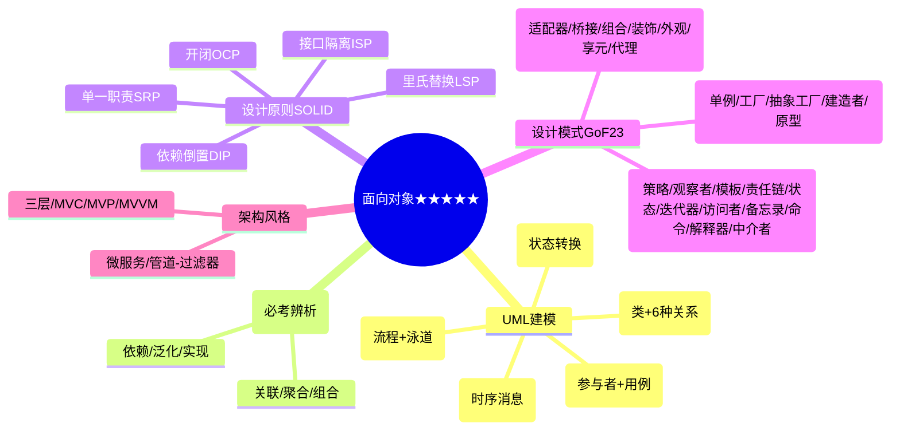

# 第六章：面向对象分析与设计

> 分值占比：10%-15% | 重要程度：★★★★★

## 考情快照

- **分值占比**：10%-15%（上午选择题 6-10 题 + 下午可能出 UML 综合题）
- **题型**：选择题（UML 图辨析 + 设计模式意图 + SOLID 原则）+ 综合题（画类图/序列图）
- **备考建议**：**全卷第二重点**。UML 九种图 + GoF 23 种模式 + SOLID 原则 = 必考铁三角。关联/聚合/组合辨析高频。

## 知识导图

## 考情分析

**高频考点分布：**
- UML 图辨析（用例/类/序列/状态/活动）：~30%
- 类图关系（关联/聚合/组合/依赖/泛化）：~20%
- GoF 设计模式（意图 + 适用场景）：~25%
- SOLID 设计原则：~15%
- 架构风格（MVC/微服务）：~10%

---

## UML 建模（⚠️ 必考九种图）

| 图 | 视角 | 核心元素 | 考法 |
|----|------|---------|------|
| **用例图** | 用户视角 | 参与者、用例、(include/extend/泛化) | 识别参与者、用例关系 |
| **类图** | 静态结构 | 类(三层)、6 种关系 | **考最多**：关系辨析 |
| **对象图** | 静态快照 | 对象实例、链 | 类图的实例化 |
| **序列图** | 动态时序 | 对象、生命线、激活条、消息 | 消息顺序判断 |
| **协作图** | 动态协作 | 对象、链接、消息 | 与序列图等价转换 |
| **状态图** | 动态状态 | 状态、转移、事件/动作 | 状态转换判断 |
| **活动图** | 动态流程 | 活动、决策、泳道、分叉/汇合 | 与流程图区别 |
| **组件图** | 物理结构 | 组件、接口、依赖 | 模块划分 |
| **部署图** | 物理部署 | 节点、组件、连接 | 网络拓扑 |

---

## 类图关系（⚠️ 必考辨析五种）

| 关系 | 符号 | 语义 | 生命周期 | 强度 |
|------|------|------|---------|------|
| **依赖** | 虚线箭头 | A 使用 B（参数/局部变量） | 无绑定 | 最弱 |
| **关联** | 实线箭头 | A 知道 B（成员变量） | 无绑定 | ★ |
| **聚合** | 空心菱形 | 整体-部分，部分可独立 | 不绑定 | ★★ |
| **组合** | 实心菱形 | 整体-部分，部分不可独立 | **绑定** | ★★★ |
| **泛化** | 空心三角 | 继承（is-a） | 绑定 | ★★★★ |
| **实现** | 虚线空心三角 | 实现接口 | 绑定 | ★★★★ |

::: tip 关系辨析口诀
"依赖最弱是虚线，关联实线连两边；聚合空心可独立，组合实心命相连"
:::

---

## SOLID 设计原则（⚠️ 必考）

| 原则 | 缩写 | 一句话 |
|------|------|--------|
| 单一职责 | **SRP** | 一个类只负责一件事 |
| 开闭原则 | **OCP** | 对扩展开放，对修改关闭 |
| 里氏替换 | **LSP** | 子类能替换父类且程序正确 |
| 接口隔离 | **ISP** | 不依赖不需要的接口 |
| 依赖倒置 | **DIP** | 高层不依赖低层，都依赖抽象 |

---

## GoF 设计模式（⚠️ 必考意图+场景）

### 创建型（5 种）
| 模式 | 意图 | 一句话场景 |
|------|------|-----------|
| 单例 | 唯一实例 | 全局配置、连接池 |
| 工厂方法 | 延迟创建到子类 | 产品种类不确定 |
| 抽象工厂 | 创建产品族 | 跨平台 UI、多数据库 |
| 建造者 | 分步构造复杂对象 | 构建复杂配置 |
| 原型 | 复制创建 | 深拷贝、创建成本高 |

### 结构型（7 种）
| 模式 | 意图 | 一句话场景 |
|------|------|-----------|
| 适配器 | 接口转换 | 旧系统集成 |
| 桥接 | 抽象-实现解耦 | 多维度变化 |
| 组合 | 树形结构 | 文件系统、GUI 树 |
| 装饰 | 动态添加功能 | IO 流、动态扩展 |
| 外观 | 统一接口 | 简化复杂子系统 |
| 享元 | 共享细粒度对象 | 大量相似对象 |
| 代理 | 控制访问 | 远程/虚拟/保护代理 |

### 行为型（11 种）
| 模式 | 意图 | 一句话场景 |
|------|------|-----------|
| 策略 | 算法可替换 | 多种排序/支付 |
| 观察者 | 事件通知 | GUI 事件、消息推送 |
| 模板方法 | 算法骨架 | 框架设计 |
| 责任链 | 请求传递链 | 审批流程、过滤器 |
| 状态 | 状态变行为变 | 订单状态、TCP 状态 |
| 迭代器 | 顺序访问 | 集合遍历 |
| 访问者 | 作用于结构操作 | 报表、编译器 AST |
| 备忘录 | 保存/恢复状态 | 撤销/恢复 |
| 命令 | 请求封装为对象 | 事务、宏命令 |
| 解释器 | 解释执行 | 规则引擎 |
| 中介者 | 封装多对象交互 | 聊天室、GUI 分发 |

::: tip 高频模式 TOP 5
单例 > 工厂方法 > 适配器 > 观察者 > 策略（按真题出现频次）
:::

---

## 软件架构风格

| 风格 | 特点 | 适用 |
|------|------|------|
| 管道-过滤器 | 数据流经处理组件 | 编译器、信号处理 |
| 事件驱动 | 组件通过事件通信 | GUI、异步系统 |
| 仓库风格 | 共享数据仓库 | 数据库、黑板系统 |
| C/S | 客户端-服务器 | 桌面应用 |
| B/S | 浏览器-服务器 | Web 应用 |

### MVC 变体
| 变体 | 特点 |
|------|------|
| MVC | Controller 协调 M 和 V |
| MVP | View 被动，Presenter 中介 |
| MVVM | ViewModel 双向绑定 View |

---

## 考点速查

| 考点 | 一句话定义 | 频次 |
|------|----------|------|
| 类图关系辨析 | 依赖<关联<聚合<组合<泛化 | ★★★★★ |
| 组合 vs 聚合 | 组合=实心菱形=生命周期绑定 | ★★★★★ |
| 单例模式 | 唯一实例，饿汉/懒汉 | ★★★★ |
| 工厂方法 vs 抽象工厂 | 单一产品 vs 产品族 | ★★★★ |
| 观察者模式 | 一对多事件通知 | ★★★★ |
| 策略 vs 状态 | 策略=客户端选算法；状态=自动切换行为 | ★★★★ |
| SOLID 口诀 | 单一开闭里氏接依 | ★★★★ |
| 序列图 | 强调消息时间顺序 | ★★★ |
| 状态图 | 对象状态变化（初态→状态→终态） | ★★★ |
| 微服务 | 独立部署+独立数据库+API | ★★★ |

## 考点→题目索引

- **UML 图辨析**：[softdesigner-101]() · [softdesigner-102]() · [softdesigner-111]()
- **类图关系**：[softdesigner-103]() · [softdesigner-104]() · [softdesigner-112]()
- **设计模式**：[softdesigner-105]() · [softdesigner-106]() · [softdesigner-113]() · [softdesigner-114]()
- **SOLID 原则**：[softdesigner-107]() · [softdesigner-115]()
- **架构风格**：[softdesigner-108]() · [softdesigner-116]()
- **用例图/序列图**：[softdesigner-109]() · [softdesigner-117]()
- **状态图/活动图**：[softdesigner-110]() · [softdesigner-118]()
- **综合**：[softdesigner-119]() · [softdesigner-120]()

## 真题练习

::: warning 本章是全卷第二重点
UML 关系辨析 + 设计模式意图 = 必考。做错题回链上方考点表重读。
:::

<Quiz dataUrl="./quiz.json" />
