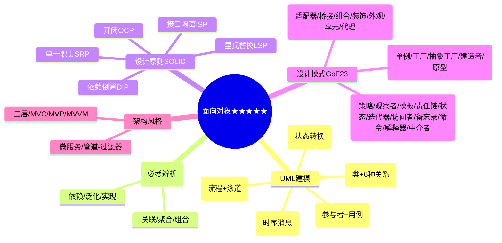

# 第六章：面向对象分析与设计

> 分值占比：10%-15% | 重要程度：★★★★★

**📖 零基础导读**

> 本章讲的是**怎么把真实世界"翻译"成程序里的设计蓝图**：先画图看清世界（UML），再定规矩约束类（SOLID），最后用现成的套路解决反复出现的问题（设计模式）。它是软设考试的**全卷第二重点**（上午 6-10 题 + 下午可能出 UML 综合题），值得多花时间。

**人话概述**：这一章就是"软件设计说明书"——先用 UML 九种图把系统"拍"下来：谁在用、长什么样、怎么动、装在哪（UML 建模）；再理清类与类之间的关系，用箭头和菱形表达"认识 / 绑定 / 继承"（类图关系）；接着学写类的 5 条军规（SOLID 原则）；最后背下 23 种设计模式，遇到"只要一个对象""想通知一堆人"这类需求，直接套现成模板（GoF 设计模式 + 架构风格）。

**生活联系**：盖房子要先画图纸再动工，写软件也一样——UML 就是软件图纸；类图关系像亲戚关系表（谁跟谁住一起、谁是长辈，箭头菱形各有含义）；SOLID 是"分工不越界"的家规；设计模式是装修行业的"标准户型图"，前人踩过的坑你不用再踩一遍。

**学完会什么**：会看会画类图，一眼分清依赖 / 关联 / 聚合 / 组合 / 泛化 / 实现六种关系；能背出 SOLID 五条原则，并指出一段代码违反了哪条；能根据题目场景认出单例、工厂、观察者等高频模式该用哪个；上午选择题不慌，下午 UML 综合题也有底。

**难点预告**：① 类图关系辨析——强度次序"依赖<关联<聚合<组合<泛化/实现"最常考也最容易混，重点记"菱形看生命周期（聚合空心可独立、组合实心命相连）、三角看继承与接口"；② SOLID 五原则容易记串，用口诀"单一开闭里氏接依"；③ 设计模式有 23 种，别硬背——先背高频 TOP 5（单例 > 工厂方法 > 适配器 > 观察者 > 策略），再逐步展开其余模式。

🔗 **前置**：本章需要"类、对象、继承"的基本直觉。零基础建议先花 10 分钟学预备篇 [P4 编程思维入门](/softdesigner/prep/p4)，知道类和对象是怎么回事，再回来读本章。

## 考情快照

- **分值占比**：10%-15%（上午选择题 6-10 题 + 下午可能出 UML 综合题）
- **题型**：选择题（UML 图辨析 + 设计模式意图 + SOLID 原则）+ 综合题（画类图/序列图）
- **备考建议**：**全卷第二重点**。UML 九种图 + GoF 23 种模式 + SOLID 原则 = 必考铁三角。关联/聚合/组合辨析高频。

## 知识导图


```mermaid
mindmap
  root((面向对象★★★★★))
    UML建模
      用例图(参与者+用例)
      类图(类+6种关系)
      序列图(时序消息)
      状态图(状态转换)
      活动图(流程+泳道)
    类图关系(必考辨析)
      关联/聚合/组合
      依赖/泛化/实现
    设计原则SOLID
      单一职责SRP
      开闭OCP
      里氏替换LSP
      接口隔离ISP
      依赖倒置DIP
    设计模式GoF23
      创建型5(单例/工厂/抽象工厂/建造者/原型)
      结构型7(适配器/桥接/组合/装饰/外观/享元/代理)
      行为型11(策略/观察者/模板/责任链/状态/迭代器/访问者/备忘录/命令/解释器/中介者)
    架构风格
      三层/MVC/MVP/MVVM
      微服务/管道-过滤器
```

## 考情分析

**高频考点分布：**
- UML 图辨析（用例/类/序列/状态/活动）：~30%
- 类图关系（关联/聚合/组合/依赖/泛化）：~20%
- GoF 设计模式（意图 + 适用场景）：~25%
- SOLID 设计原则：~15%
- 架构风格（MVC/微服务）：~10%

---

## UML 建模（⚠️ 必考九种图）

| 图 | 视角 | 核心元素 | 考法 |
|----|------|---------|------|
| **用例图** | 用户视角 | 参与者、用例、(include/extend/泛化) | 识别参与者、用例关系 |
| **类图** | 静态结构 | 类(三层)、6 种关系 | **考最多**：关系辨析 |
| **对象图** | 静态快照 | 对象实例、链 | 类图的实例化 |
| **序列图** | 动态时序 | 对象、生命线、激活条、消息 | 消息顺序判断 |
| **协作图** | 动态协作 | 对象、链接、消息 | 与序列图等价转换 |
| **状态图** | 动态状态 | 状态、转移、事件/动作 | 状态转换判断 |
| **活动图** | 动态流程 | 活动、决策、泳道、分叉/汇合 | 与流程图区别 |
| **组件图** | 物理结构 | 组件、接口、依赖 | 模块划分 |
| **部署图** | 物理部署 | 节点、组件、连接 | 网络拓扑 |

**🎯 一句话人话**：UML 九种图=用 9 张图分别拍系统的"谁在用、长什么样、怎么动、装在哪"，考题就是让你分辨每张图管哪个侧面。

**💡 类比**：给大楼出图纸：用例图拍"谁来办事"，类图拍"房间结构"，序列图拍"办事的先后流程"，状态图拍"门禁状态怎么变"，部署图拍"楼建在哪块地皮上"。

**✍️ 小例子**：网上银行：用例图画"用户转账"（参与者+用例）；类图画"Account 类：balance 属性 + withdraw() 方法"；序列图画"用户→界面→Account 依次发消息的先后时序"；状态图画"账户状态：正常→冻结"；部署图画"App 服务器 + 数据库服务器两个节点"。

**⚠️ 常见误区**：序列图强调"消息的时间先后"，协作图强调"对象间链接"，两者可等价转换但考视角区别；组件图=软件物理组成（组件/接口/依赖），部署图=硬件节点分布，别把组件图当部署图。

- ⚠️ 必考行：UML 九种图必考——类图考最多（6 种关系辨析），序列图看消息时序、状态图看状态转换、活动图看流程+泳道。

---

## 类图关系（⚠️ 必考辨析五种）

| 关系 | 符号 | 语义 | 生命周期 | 强度 |
|------|------|------|---------|------|
| **依赖** | 虚线箭头 | A 使用 B（参数/局部变量） | 无绑定 | 最弱 |
| **关联** | 实线箭头 | A 知道 B（成员变量） | 无绑定 | ★ |
| **聚合** | 空心菱形 | 整体-部分，部分可独立 | 不绑定 | ★★ |
| **组合** | 实心菱形 | 整体-部分，部分不可独立 | **绑定** | ★★★ |
| **泛化** | 空心三角 | 继承（is-a） | 绑定 | ★★★★ |
| **实现** | 虚线空心三角 | 实现接口 | 绑定 | ★★★★ |

**🎯 一句话人话**：类之间"认不认识、绑不绑、是不是亲爹"全靠箭头和菱形区分，六种关系按强度排成一把尺。

**💡 类比**：依赖=路边借个打火机（用完就还）；关联=同事名片（长期认识）；聚合=球队和球员（球员走了球队照样转）；组合=人和器官（人没了器官无法独存）；泛化=亲儿子继承家业。

**✍️ 小例子**：Order ◆— OrderItem（组合：生命周期绑定）、Order ◇— Customer（聚合：客户可独立存在）、OrderItem ──> Product（关联）、Order - - -> PaymentService（依赖：仅参数传入），四种关系对号入座（见 ch06 案例2）。

**⚠️ 常见误区**：聚合=空心菱形、组合=实心菱形，看"生命周期是否绑定"；泛化=继承（实线空心三角），实现=接口（虚线空心三角），一个管类继承、一个管接口实现。

- ⚠️ 必考行：类图关系强度：依赖<关联<聚合<组合<泛化/实现，最弱是虚线箭头、最强是空心三角。
- ⚠️ 必考行：组合=实心菱形=生命周期绑定；聚合=空心菱形=部分可独立存在。

::: tip 关系辨析口诀
"依赖最弱是虚线，关联实线连两边；聚合空心可独立，组合实心命相连"
:::

---

## SOLID 设计原则（⚠️ 必考）

| 原则 | 缩写 | 一句话 |
|------|------|--------|
| 单一职责 | **SRP** | 一个类只负责一件事 |
| 开闭原则 | **OCP** | 对扩展开放，对修改关闭 |
| 里氏替换 | **LSP** | 子类能替换父类且程序正确 |
| 接口隔离 | **ISP** | 不依赖不需要的接口 |
| 依赖倒置 | **DIP** | 高层不依赖低层，都依赖抽象 |

**🎯 一句话人话**：SOLID 是写类的 5 条军规：一个类只干一件事、加功能不改老代码、子类能顶替父类、接口别塞多余方法、高层只认抽象。

**💡 类比**：开饭店：SRP=洗菜的只洗菜；OCP=加新菜只加新厨师、不把老厨师重炒一遍；LSP=临时工替正式工上灶菜味不能变；ISP=别让洗碗工考厨师证；DIP=老板只对接"厨师"这个岗位，不绑定某个具体的人。

**✍️ 小例子**：见 ch06 案例1 支付重构：新增支付宝只加一个策略类注册进 Map，不改老代码=OCP；每种支付一个类只做一件事=SRP；高层 strategies 依赖 PayStrategy 接口而非具体微信类=DIP。

**⚠️ 常见误区**：OCP 的"对修改关闭"不是禁止改 bug，而是新增需求走"扩展"不动已有逻辑；DIP 是"高层和低层都依赖抽象"，不是高层一调低层就违规。

- ⚠️ 必考行：SOLID 口诀"单一开闭里氏接依"=SRP 单一职责、OCP 开闭、LSP 里氏替换、ISP 接口隔离、DIP 依赖倒置。

---

## GoF 设计模式（⚠️ 必考意图+场景）

### 创建型（5 种）
| 模式 | 意图 | 一句话场景 |
|------|------|-----------|
| 单例 | 唯一实例 | 全局配置、连接池 |
| 工厂方法 | 延迟创建到子类 | 产品种类不确定 |
| 抽象工厂 | 创建产品族 | 跨平台 UI、多数据库 |
| 建造者 | 分步构造复杂对象 | 构建复杂配置 |
| 原型 | 复制创建 | 深拷贝、创建成本高 |

**🎯 一句话人话**：创建型 5 种管"对象怎么被造出来"：只要一份→单例；子类决定造哪种→工厂方法；造一整套配套→抽象工厂；分步拼复杂对象→建造者；照模板复制→原型。

**💡 类比**：单例=全公司唯一一台复印机；工厂方法=一个工厂只接一种产品订单；抽象工厂=一条产线同时产出"机箱+主板+电源"整机；建造者=按配置单一步步装电脑；原型=拿样机直接复印一台。

**✍️ 小例子**：单例 Config.getInstance() 全局一份配置；工厂方法把 new 具体产品交给子类；抽象工厂 WindowsFactory 一次产出 WindowsButton+WindowsTextBox；建造者 new Builder().setCpu().setRam().build()；原型 obj.clone() 做深拷贝。

**⚠️ 常见误区**：工厂方法=一个工厂产"单一产品"、抽象工厂=一个工厂产"一族产品（产品族）"，别把工厂方法当成所有工厂模式的统称；建造者的重点是"分步构造"，不是"复制"。

- ⚠️ 必考行：单例=全局唯一实例，饿汉=类加载即创建、懒汉=首次调用才创建（懒汉需防线程安全）。
- ⚠️ 必考行：工厂方法=单一产品延迟到子类创建；抽象工厂=创建产品族（跨平台 UI / 多数据库）。

### 结构型（7 种）
| 模式 | 意图 | 一句话场景 |
|------|------|-----------|
| 适配器 | 接口转换 | 旧系统集成 |
| 桥接 | 抽象-实现解耦 | 多维度变化 |
| 组合 | 树形结构 | 文件系统、GUI 树 |
| 装饰 | 动态添加功能 | IO 流、动态扩展 |
| 外观 | 统一接口 | 简化复杂子系统 |
| 享元 | 共享细粒度对象 | 大量相似对象 |
| 代理 | 控制访问 | 远程/虚拟/保护代理 |

**🎯 一句话人话**：结构型 7 种管"类和对象怎么拼成更大的结构"：接口不匹配→适配器；多维度变化→桥接；树形整体-部分→组合；动态加功能→装饰；统一门面→外观；共享细粒度对象→享元；控制访问→代理。

**💡 类比**：适配器=Type-C 转 HDMI 转接头；桥接=手机"品牌×颜色"两维自由组合；组合=文件夹套文件夹；装饰=给汉堡层层加料；外观=前台一键叫齐各部门；享元=共享单车大家骑；代理=明星经纪人替你把关。

**✍️ 小例子**：旧系统接口不兼容→写一个 Adapter 包一层转成新接口；文件系统目录含文件与子目录=组合模式树形结构；Java IO 用 BufferedInputStream 包 FileInputStream=装饰模式加缓冲；远程调用用远程代理；大量相似对象用享元共享内部状态。

**⚠️ 常见误区**：组合模式是"树形结构（整体-部分）"，不是"组合关系"的那个组合；装饰器和适配器都包一层，但适配器"改接口"、装饰器"加功能"，别混。

### 行为型（11 种）
| 模式 | 意图 | 一句话场景 |
|------|------|-----------|
| 策略 | 算法可替换 | 多种排序/支付 |
| 观察者 | 事件通知 | GUI 事件、消息推送 |
| 模板方法 | 算法骨架 | 框架设计 |
| 责任链 | 请求传递链 | 审批流程、过滤器 |
| 状态 | 状态变行为变 | 订单状态、TCP 状态 |
| 迭代器 | 顺序访问 | 集合遍历 |
| 访问者 | 作用于结构操作 | 报表、编译器 AST |
| 备忘录 | 保存/恢复状态 | 撤销/恢复 |
| 命令 | 请求封装为对象 | 事务、宏命令 |
| 解释器 | 解释执行 | 规则引擎 |
| 中介者 | 封装多对象交互 | 聊天室、GUI 分发 |

**🎯 一句话人话**：行为型 11 种管"对象之间怎么协作、行为怎么换"：策略换算法、观察者做通知、模板方法固定骨架、责任链接力传、状态随状态变、迭代器逐个访、访问者加操作、备忘录存快照、命令封请求、解释器译语法、中介者当调停。

**💡 类比**：策略=换不同厨子做同一道菜；观察者=公众号一发文章所有订阅者都收到；责任链=报销逐级审批；状态=红绿灯到点自动变色；中介者=聊天室大家只跟"室主"说话；命令=把"点餐要求"打包成单子交给厨房。

**✍️ 小例子**：支付方式用策略模式——每种支付一个策略类、Map 查表调用，新增支付只加类不改老代码（见 ch06 案例1）；订单状态"待付款→已付款→已发货"用状态模式随状态自动切换行为；GUI 按钮点击用观察者通知监听器。

**⚠️ 常见误区**：策略=客户端主动选算法、状态=对象内部状态自动切换行为，两者结构像但"谁做主"不同；模板方法靠"继承"固定骨架让子类填实现，与策略的"组合"思路不同。

- ⚠️ 必考行：观察者=一对多事件通知，主题状态一变→所有观察者自动更新（GUI 事件/消息推送）。
- ⚠️ 必考行：策略=客户端换算法（多种排序/支付）；状态=状态自动切换行为（订单状态/TCP），两者勿混。

::: tip 高频模式 TOP 5
单例 > 工厂方法 > 适配器 > 观察者 > 策略（按真题出现频次）
:::

---

## 软件架构风格

| 风格 | 特点 | 适用 |
|------|------|------|
| 管道-过滤器 | 数据流经处理组件 | 编译器、信号处理 |
| 事件驱动 | 组件通过事件通信 | GUI、异步系统 |
| 仓库风格 | 共享数据仓库 | 数据库、黑板系统 |
| C/S | 客户端-服务器 | 桌面应用 |
| B/S | 浏览器-服务器 | Web 应用 |

### MVC 变体
| 变体 | 特点 |
|------|------|
| MVC | Controller 协调 M 和 V |
| MVP | View 被动，Presenter 中介 |
| MVVM | ViewModel 双向绑定 View |

**🎯 一句话人话**：架构风格是"系统宏观上怎么组织"：数据流式→管道-过滤器；事件通知→事件驱动；共享数据→仓库风格；前后端分工→C/S 或 B/S；纵向分层→三层（表示/业务/数据）；界面组织→MVC/MVP/MVVM。

**💡 类比**：管道-过滤器=流水线工位逐个加工再传给下一站；事件驱动=微信群，有人发消息大家各自响应；仓库=图书馆，所有人去同一个书库查资料；MVC=餐厅：服务员(View)收单→店长(Controller)下单→后厨(Model)出菜→再端回给顾客。

**✍️ 小例子**：编译器=管道-过滤器（词法→语法→语义→中间代码各阶段处理，数据沿管道流动）；Vue/React 的双向绑定=MVVM（ViewModel 自动同步 View 与 Model）；桌面应用=C/S、Web 应用=B/S；黑板系统中多个专家共享数据=仓库风格。

**⚠️ 常见误区**：MVC 的 View 主动刷新、MVP 的 View 完全被动由 Presenter 驱动、MVVM 靠 ViewModel 双向绑定——"谁主动"层层递进，别记反；微服务=独立部署+独立数据库+API 通信，不是 C/S 的别名。

---

## 💼 真实工作案例

### 案例 1：用策略模式替换 if-else（ch06 → 行为型模式）

::: tip 背景
某电商系统有大量支付方式（微信/支付宝/银行卡/积分），原始代码全是 if-else，每加一种支付方式都要改风险代码。
:::

**重构前**：
```java
if (type.equals("wechat")) { ... }       // 50 行
else if (type.equals("alipay")) { ... }  // 60 行
else if (type.equals("card")) { ... }    // 80 行
else if (type.equals("point")) { ... }   // 40 行
// 每新增一种支付 = 改老代码 + 回归测试
```

**重构后**（策略模式）：
```java
// 1. 定义接口
interface PayStrategy { void pay(BigDecimal amount); }

// 2. 每种支付方式一个策略类
class WechatPay implements PayStrategy { ... }
class AlipayPay implements PayStrategy { ... }
class CardPay implements PayStrategy { ... }

// 3. 使用 Map 自动查找（工厂+策略）
Map<String, PayStrategy> strategies = Map.of(
    "wechat", new WechatPay(),
    "alipay", new AlipayPay(),
    "card",   new CardPay()
);
strategies.get(type).pay(amount);

// 新增支付方式？只加一个新类 + 注册到 Map，不改老代码 → OCP ✓
```

**用到的设计原则**：
| 原则 | 体现 |
|------|------|
| **OC 开闭原则** | 对扩展开放（新策略类），对修改关闭（不改动已有代码） |
| **SR 单一职责** | 每种支付一个类，只负责一种支付方式 |
| **DI 依赖倒置** | 高层模块依赖 PayStrategy 抽象，不依赖具体实现 |

### 案例 2：类关系辨析实战 — 订单系统（ch06 → UML 类图）

**场景建模**：一个 Order 包含多个 OrderItem；OrderItem 引用 Product；Order 使用 PaymentService 计算金额。

```
Order ◆──── OrderItem     (组合：Order 销毁则 Item 销毁)
Order ◇──── Customer      (聚合：Customer 独立于 Order 存在)
OrderItem ──> Product     (关联：Item 知道 Product)
Order - - -> PaymentService (依赖：仅参数传入)
```

| 关系 | 类对 | 为什么 |
|------|------|--------|
| **组合** ◆ | Order — OrderItem | Item 是 Order 的组成部分，Order 删了 Item 不能独存 |
| **聚合** ◇ | Order — Customer | Customer 不是 Order 的一部分，客户可以没订单 |
| **关联** ── | OrderItem — Product | 引用关系，不是"拥有" |
| **依赖** - - | Order — PaymentService | 仅在 calculate() 方法中作为参数使用 |

## 考点速查

| 考点 | 一句话定义 | 频次 |
|------|----------|------|
| 类图关系辨析 | 依赖<关联<聚合<组合<泛化 | ★★★★★ |
| 组合 vs 聚合 | 组合=实心菱形=生命周期绑定 | ★★★★★ |
| 单例模式 | 唯一实例，饿汉/懒汉 | ★★★★ |
| 工厂方法 vs 抽象工厂 | 单一产品 vs 产品族 | ★★★★ |
| 观察者模式 | 一对多事件通知 | ★★★★ |
| 策略 vs 状态 | 策略=客户端选算法；状态=自动切换行为 | ★★★★ |
| SOLID 口诀 | 单一开闭里氏接依 | ★★★★ |
| 序列图 | 强调消息时间顺序 | ★★★ |
| 状态图 | 对象状态变化（初态→状态→终态） | ★★★ |
| 微服务 | 独立部署+独立数据库+API | ★★★ |

## 考点→题目索引

- **UML 图辨析**：[softdesigner-101]() · [softdesigner-102]() · [softdesigner-111]()
- **类图关系**：[softdesigner-103]() · [softdesigner-104]() · [softdesigner-112]()
- **设计模式**：[softdesigner-105]() · [softdesigner-106]() · [softdesigner-113]() · [softdesigner-114]()
- **SOLID 原则**：[softdesigner-107]() · [softdesigner-115]()
- **架构风格**：[softdesigner-108]() · [softdesigner-116]()
- **用例图/序列图**：[softdesigner-109]() · [softdesigner-117]()
- **状态图/活动图**：[softdesigner-110]() · [softdesigner-118]()
- **综合**：[softdesigner-119]() · [softdesigner-120]()

## 🧮 例题精讲

> 下面 5 道题覆盖本章必考点（类图关系、单例模式、SOLID 原则、观察者模式）。先自己选一遍，再看思路与逐步推演——关系符号和模式归属是本章选择题的大头，练熟就能秒杀。

**例题 1**：下列关于 UML 类图的叙述，正确的是：
- A. 关联关系用虚线箭头表示　B. 聚合关系用实心菱形表示　C. 组合关系用空心菱形表示　D. 泛化关系用空心三角箭头

**思路**：类图六种关系各配一种画法——先看"实线还是虚线"，再看"有没有菱形、菱形是空心还是实心"。

**逐步推演**：
1. 关联=实线（A 说虚线，错）
2. 聚合=空心菱形、组合=实心菱形（B 和 C 正好说反，都错）
3. 泛化（继承）=实线空心三角箭头（D 说"空心三角箭头"，✓）；实现才是虚线空心三角

**答案**：D——与 Quiz 中 softdesigner-104 的答案一致。

**易错点**：聚合空心 vs 组合实心是最经典的混淆点，用"空心=可以单飞、实心=命绑在一起"来记；另外泛化是**实线**空心三角、实现是**虚线**空心三角，只有这两个都记准才不丢分。

**例题 2**：类图六种关系按强度从弱到强排列，正确的是：
- A. 依赖 < 关联 < 聚合 < 组合 < 泛化/实现　B. 关联 < 依赖 < 聚合 < 组合 < 泛化/实现　C. 依赖 < 聚合 < 关联 < 组合 < 泛化/实现　D. 依赖 < 关联 < 组合 < 聚合 < 泛化/实现

**思路**：强度看"绑定程度"——借一下就还的（依赖）最弱，血脉相连（泛化/实现）最强；聚合和组合都是"整体-部分"，区别只在部分能不能独立。

**逐步推演**：
1. 依赖：只是方法参数里临时用一下，无绑定 → 最弱
2. 关联：长期认识（成员变量），但无绑定
3. 聚合（空心菱形）：整体-部分，部分可独立存在，如球队和球员
4. 组合（实心菱形）：整体-部分，生命周期绑定，如人和器官
5. 泛化/实现（三角箭头）：继承与接口，最强

**答案**：A——自编题，与 quiz.json 无关，按本章"必考行"关系强度次序手写复核。

**易错点**：聚合和组合的顺序最容易记反——记"组合=实心=绑定=更强"；泛化与实现同级最弱不到它们，泛化管继承、实现管接口，别把两者排先后。

**例题 3**：设计模式中，单例模式（Singleton）的目的是：
- A. 创建一系列相关对象　B. 保证一个类只有一个实例，并提供全局访问点　C. 将对象与表示分离　D. 定义对象间的一对多依赖

**思路**：单例的关键词是"唯一"——全系统只许有一个实例，谁要用都来同一个地方取。

**逐步推演**：
1. A 是"创建一系列相关对象"——那是抽象工厂/工厂方法的活
2. C "对象与表示分离"——是 MVC 的思路
3. D "一对多依赖"——是观察者的活
4. B "一个实例 + 全局访问点"——正是单例的定义（全局配置、连接池都是它）

**答案**：B——与 Quiz 中 softdesigner-102 的答案一致。

**易错点**：把"保证唯一实例"与"工厂类"混淆——工厂是"按需造对象"，单例是"只准有一个"；另外饿汉（类加载即建）vs 懒汉（首次调用才建，要防线程安全）也是常考变体。

**例题 4**：下列关于面向对象设计的叙述，错误的是：
- A. 开闭原则：对扩展开放，对修改关闭　B. 依赖倒置原则：高层模块不应依赖低层模块，两者都应依赖抽象　C. 单一职责原则：一个类只负责一个功能领域　D. 里氏替换原则：子类可以改变父类行为

**思路**：审题先看"错误的是"——四个选项各考一条 SOLID 原则，逐条对照口诀"单一开闭里氏接依"。

**逐步推演**：
1. A = OCP 开闭原则，说法正确
2. B = DIP 依赖倒置，高层低层都依赖抽象，说法正确
3. C = SRP 单一职责，说法正确
4. D = LSP 里氏替换——正确说法是"子类必须能替换父类且程序行为不变"，"子类可以改变父类行为"恰恰是违反 LSP，错误的就是它

**答案**：D——与 Quiz 中 softdesigner-108 的答案一致。

**易错点**：里氏替换的考点是"能顶替、行为不变"——子类改了父类约定（比如重写后抛异常）就破坏了替换性；审题时注意"正确的是 / 错误的是"方向，别选反。

**例题 5**：观察者模式（Observer Pattern）属于：
- A. 创建型模式　B. 结构型模式　C. 行为型模式　D. 并发型模式

**思路**：GoF 23 种模式按"干什么"分三类——管创建（创建型）、管拼装（结构型）、管对象间协作与通信（行为型）。观察者是"通知别人"，是协作行为。

**逐步推演**：
1. 创建型 5 种：单例、工厂方法、抽象工厂、建造者、原型——只负责"怎么造出对象"
2. 结构型 7 种：适配器、桥接、组合、装饰、外观、享元、代理——负责"怎么拼成更大结构"
3. 行为型 11 种：策略、观察者、模板方法、责任链、状态、迭代器……——负责"对象之间怎么协作"
4. 观察者=主题一变，所有订阅者收到通知（一对多事件通知）→ 协作行为

**答案**：C——与 Quiz 中 softdesigner-103 的答案一致。

**易错点**：模式分类靠"管什么事"判断，不用死记 23 个名单——看到"创建"归创建型、"拼装/转换"归结构型、"协作/通知/通信"归行为型；观察者 vs 策略都属行为型但用途不同：观察者是"被动被通知"，策略是"主动换算法"。

## 真题练习

::: warning 本章是全卷第二重点
UML 关系辨析 + 设计模式意图 = 必考。做错题回链上方考点表重读。
:::

<Quiz dataUrl="./quiz.json" />
