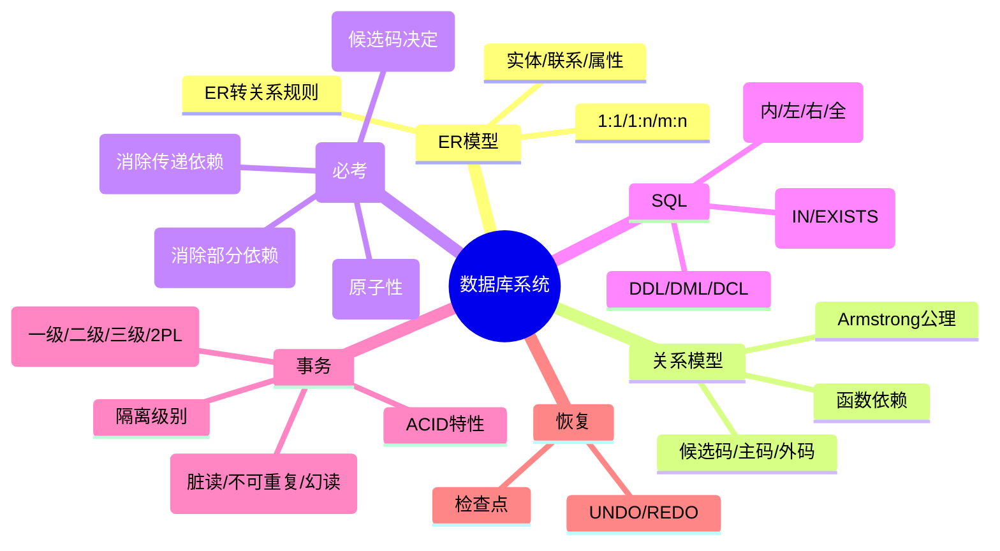

# 第七章：数据库系统

> 分值占比：10%-15% | 重要程度：★★★★

## 考情快照

- **分值占比**：10%-15%（上午选择题 6-8 题 + 下午可能出 SQL/范式综合题）
- **题型**：选择题（范式判别 + SQL 查询 + 事务并发 + ER 转换）+ 综合题（写 SQL/判断范式）
- **备考建议**：范式判别（1NF→2NF→3NF→BCNF）必考，第二步判断（消除部分依赖）和最常考。事务 ACID + 封锁协议必考。

## 知识导图

## 考情分析

**高频考点分布：**
- 范式判别（1NF→BCNF）：~30%
- SQL 查询（JOIN + 子查询）：~20%
- 事务与并发（ACID + 封锁）：~20%
- ER 模型与转换：~15%
- 数据库恢复与安全：~15%

---

## ER 模型

### 联系类型与转换

| 联系 | 转换规则 |
|------|---------|
| 1:1 | 任一方加入对方主码为外码 |
| 1:n | n 方加入 1 方主码为外码 |
| m:n | **新建关系**，包含两方主码 + 联系属性 |
| 实体 | 实体名→关系名，属性→关系属性，键→主码 |

---

## 关系模型与函数依赖

| 术语 | 定义 |
|------|------|
| 候选码 | 唯一标识元组的最小属性集 |
| 主码 | 选定的候选码 |
| 外码 | 引用其他关系主码的属性集 |
| 主属性 | 属于任一候选码的属性 |
| 完全函数依赖 | X→Y 且 X 的任何真子集都不能决定 Y |
| 部分函数依赖 | X→Y 但 X 有真子集也能决定 Y |
| 传递函数依赖 | X→Y，Y→Z，Y 不决定 X → X→Z 为传递 |

---

## 范式（⚠️ 必考判别流程）

| 范式 | 前提 | 核心要求 | 口诀 |
|------|------|---------|------|
| **1NF** | — | 属性不可再分（原子性） | "一格一值" |
| **2NF** | 1NF | 消除**部分函数依赖**（非主属性完全依赖主码） | "整体依赖" |
| **3NF** | 2NF | 消除**传递函数依赖** | "直达不绕" |
| **BCNF** | 3NF | 所有非平凡 FD 左边含候选码 | "决定者必含键" |

::: tip 范式判别四步法
Step 1: 是否原子？否 → 不满足 1NF
Step 2: 非主属性是否部分依赖主码？是 → 最高 1NF
Step 3: 非主属性是否传递依赖主码？是 → 最高 2NF
Step 4: 所有非平凡 FD 左边是否都含候选码？否 → 最高 3NF
全通过 → BCNF
:::

---

## SQL 语言

### 连接查询（⚠️ 必考）

| 连接类型 | 结果 |
|---------|------|
| INNER JOIN | 只返回两表匹配的行 |
| LEFT JOIN | 左表全部 + 右表匹配(不匹配填 NULL) |
| RIGHT JOIN | 右表全部 + 左表匹配 |
| FULL JOIN | 两表全部(不匹配处 NULL) |
| CROSS JOIN | 笛卡尔积 |

### 子查询

| 类型 | 关键字 |
|------|--------|
| 单行比较 | `=, >, <, >=, <=` |
| 多行成员 | `IN, NOT IN` |
| 多行比较 | `ANY, ALL` |
| 存在判断 | `EXISTS` |

### DDL/DML/DCL 对照

| 类型 | 用途 | 核心命令 |
|------|------|---------|
| DDL | 定义结构 | CREATE, ALTER, DROP |
| DML | 操纵数据 | SELECT, INSERT, UPDATE, DELETE |
| DCL | 控制权限 | GRANT, REVOKE |

---

## 事务管理（⚠️ 必考 ACID + 封锁）

### ACID 特性
- **A**tomicity 原子性：全做或全不做
- **C**onsistency 一致性：事务前后数据满足约束
- **I**solation 隔离性：并发事务互不干扰
- **D**urability 持久性：提交后永久生效

### 并发问题

| 问题 | 定义 | 场景 |
|------|------|------|
| 丢失更新 | 后写覆盖前写 | 两事务同时改同一数据 |
| 脏读 | 读到未提交数据 | 事务 A 读了 B 未提交的数据 |
| 不可重复读 | 两次读到不同值 | A 两次读之间 B 修改并提交了 |
| 幻读 | 多出幻影行 | A 两次查询之间 B 插入了新行 |

### 封锁协议

| 协议 | 加锁 | 释放时机 | 防止 |
|------|------|---------|------|
| 一级 | X 锁 | 事务结束 | 丢失更新 |
| 二级 | X 锁 + S 锁 | X:结束/S:**读完即放** | + 脏读 |
| 三级 | X 锁 + S 锁 | 都在**事务结束** | + 不可重复读 |
| 2PL | 两段锁 | 扩展阶段申请/收缩阶段释放 | 可串行化 |

### 隔离级别

| 级别 | 脏读 | 不可重复读 | 幻读 |
|------|------|----------|------|
| Read Uncommitted | ❌ | ❌ | ❌ |
| Read Committed | ✅ | ❌ | ❌ |
| Repeatable Read | ✅ | ✅ | ❌ |
| Serializable | ✅ | ✅ | ✅ |

---

## 数据库恢复

| 故障 | 恢复策略 |
|------|---------|
| 事务故障 | UNDO 未完成事务 |
| 系统故障 | REDO 已提交 + UNDO 未完成 |
| 介质故障 | 从备份恢复 + REDO |

::: tip 恢复口诀
"先 REDO 已提交，再 UNDO 未完成"；检查点减少恢复扫描范围
:::

---

## 考点速查

| 考点 | 一句话定义 | 频次 |
|------|----------|------|
| 2NF 消除部分依赖 | 非主属性必须完全依赖整个主码 | ★★★★★ |
| 3NF 消除传递依赖 | 非主属性不绕弯依赖主码 | ★★★★★ |
| SQL JOIN 区别 | INNER=匹配/左=右补NULL/全=互相补 | ★★★★★ |
| 事务 ACID | 原子/一致/隔离/持久 | ★★★★★ |
| 封锁协议级别 | 一级防更新/二级防脏读/三级防重复读 | ★★★★ |
| 隔离级别 | RC防脏读/RR防重复/Ser全防 | ★★★★ |
| ER m:n 转换 | 新建关系含双方主码+联系属性 | ★★★★ |
| UNDO vs REDO | UNDO撤销未提交/REDO重做已提交 | ★★★ |

## 考点→题目索引

- **范式判别**：[softdesigner-121]() · [softdesigner-122]() · [softdesigner-131]() · [softdesigner-132]()
- **函数依赖**：[softdesigner-123]() · [softdesigner-133]()
- **SQL 查询**：[softdesigner-124]() · [softdesigner-125]() · [softdesigner-134]() · [softdesigner-135]()
- **ER 模型**：[softdesigner-126]() · [softdesigner-136]()
- **事务 ACID**：[softdesigner-127]() · [softdesigner-137]()
- **并发与封锁**：[softdesigner-128]() · [softdesigner-138]()
- **隔离级别**：[softdesigner-129]() · [softdesigner-139]()
- **恢复与安全**：[softdesigner-130]() · [softdesigner-140]()

## 真题练习

::: tip
本章共 20 题，建议 35 分钟。范式判别（四步法）+ SQL JOIN + 事务封锁 = 三大必考模块。
:::

<Quiz dataUrl="./quiz.json" />
