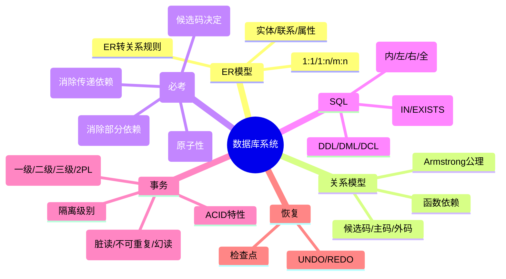

# 第七章：数据库系统

> 分值占比：10%-15% | 重要程度：★★★★

**📖 零基础导读**

> 本章讲的是**数据库**——程序背后真正"存数据"的地方。软设考试里数据库分值很高（10%-15%），上午考 6-8 道选择题，下午还常出写 SQL、判范式的综合题，是"投入小、回报大"的一章。全章围绕四件事展开：ER 模型、关系（表）、范式、SQL。

**人话概述**：这一章就是"怎么把现实世界的业务装进表格，还能又快又不出错"。先学用 ER 图画"人、事、物之间的关系"（学生选课、员工归属部门）；再学怎么把图画成一张张表（关系模型）；接着学"表怎么设计才不乱"——这就是范式，专治数据冗余的规矩；最后学 SQL——用几句像人话的命令查数据（SELECT ... FROM ... JOIN ...）。

**生活联系**：教务系统的"学生选课"、银行的"转账"、淘宝的"下单"，背后全是本章的机制——你的选课记录存在选课表里，选课表和学生表靠"学号"串起来（外码）；转账是"扣钱+加钱"必须同时成功（事务原子性）；你的个人信息只存一份、不用每张表都抄一遍（范式去冗余）。

**学完会什么**：会把"学生选课"这类业务画成 ER 图；判断一张表属于第几范式（1NF/2NF/3NF/BCNF），并说清问题出在"部分依赖"还是"传递依赖"；能写出带 JOIN 的 SQL 查询并预判结果行数；讲清楚转账为什么"要么都成功、要么都失败"，并发时怎么防"脏读"。

**难点预告**：① 范式判别——"部分依赖"和"传递依赖"是两道坎，先背四步法口诀再做题；② SQL JOIN——内连接/左连接的结果行数容易数错，用"左表是老大、缺的补 NULL"画草图；③ 事务 ACID 与并发问题——四个特性、四类并发问题、隔离级别三层容易混，按"每个级别防什么"为主线记。这三块都是必考，别跳过。

🔗 **前置**：本章不需要编程基础，但要有"查表、对应关系"的直觉。零基础建议先花 10 分钟学预备篇 [P3 数学小工具](/softdesigner/prep/p3)，再回来读本章。

## 考情快照

- **分值占比**：10%-15%（上午选择题 6-8 题 + 下午可能出 SQL/范式综合题）
- **题型**：选择题（范式判别 + SQL 查询 + 事务并发 + ER 转换）+ 综合题（写 SQL/判断范式）
- **备考建议**：范式判别（1NF→2NF→3NF→BCNF）必考，第二步判断（消除部分依赖）和最常考。事务 ACID + 封锁协议必考。

## 知识导图

```mermaid
mindmap
  root((数据库系统))
    ER模型
      实体/联系/属性
      1:1/1:n/m:n
      ER转关系规则
    关系模型
      候选码/主码/外码
      函数依赖
      Armstrong公理
    范式(必考)
      1NF(原子性)
      2NF(消除部分依赖)
      3NF(消除传递依赖)
      BCNF(候选码决定)
    SQL
      DDL/DML/DCL
      JOIN(内/左/右/全)
      子查询(IN/EXISTS)
    事务
      ACID特性
      并发问题(脏读/不可重复/幻读)
      封锁协议(一级/二级/三级/2PL)
      隔离级别
    恢复
      UNDO/REDO
      检查点
```

## 考情分析

**高频考点分布：**
- 范式判别（1NF→BCNF）：~30%
- SQL 查询（JOIN + 子查询）：~20%
- 事务与并发（ACID + 封锁）：~20%
- ER 模型与转换：~15%
- 数据库恢复与安全：~15%

---

## ER 模型

### 联系类型与转换

| 联系 | 转换规则 |
|------|---------|
| 1:1 | 任一方加入对方主码为外码 |
| 1:n | n 方加入 1 方主码为外码 |
| m:n | **新建关系**，包含两方主码 + 联系属性 |
| 实体 | 实体名→关系名，属性→关系属性，键→主码 |

---

## 关系模型与函数依赖

| 术语 | 定义 |
|------|------|
| 候选码 | 唯一标识元组的最小属性集 |
| 主码 | 选定的候选码 |
| 外码 | 引用其他关系主码的属性集 |
| 主属性 | 属于任一候选码的属性 |
| 完全函数依赖 | X→Y 且 X 的任何真子集都不能决定 Y |
| 部分函数依赖 | X→Y 但 X 有真子集也能决定 Y |
| 传递函数依赖 | X→Y，Y→Z，Y 不决定 X → X→Z 为传递 |

**🎯 一句话人话**：候选码是"能唯一认出一个人的最小证件组合"，主码是选定用哪一个，外码是"借别人家的主码当引用"。

**💡 类比**：候选码像"身份证号/学号/手机号"都能唯一找人；主码是确定用哪个；外码像填表时写"公司编号"去指另一张表的公司。

**✍️ 小例子**：关系(学号,课程号,姓名,成绩)：成绩 完全依赖(学号,课程号)；姓名只依赖学号 → 部分函数依赖；若 学号→系号→系主任，则 学号→系主任 是传递依赖。

**⚠️ 常见误区**：主属性 = 属于**任一**候选码的属性，不是只属于主码；"完全函数依赖"要求 X 的任何真子集都不能决定 Y，少一个属性就决定不了才算。

---

## 范式（⚠️ 必考判别流程）

| 范式 | 前提 | 核心要求 | 口诀 |
|------|------|---------|------|
| **1NF** | — | 属性不可再分（原子性） | "一格一值" |
| **2NF** | 1NF | 消除**部分函数依赖**（非主属性完全依赖主码） | "整体依赖" |
| **3NF** | 2NF | 消除**传递函数依赖** | "直达不绕" |
| **BCNF** | 3NF | 所有非平凡 FD 左边含候选码 | "决定者必含键" |

::: tip 范式判别四步法
Step 1: 是否原子？否 → 不满足 1NF
Step 2: 非主属性是否部分依赖主码？是 → 最高 1NF
Step 3: 非主属性是否传递依赖主码？是 → 最高 2NF
Step 4: 所有非平凡 FD 左边是否都含候选码？否 → 最高 3NF
全通过 → BCNF
:::

---

## SQL 语言

### 连接查询（⚠️ 必考）

| 连接类型 | 结果 |
|---------|------|
| INNER JOIN | 只返回两表匹配的行 |
| LEFT JOIN | 左表全部 + 右表匹配(不匹配填 NULL) |
| RIGHT JOIN | 右表全部 + 左表匹配 |
| FULL JOIN | 两表全部(不匹配处 NULL) |
| CROSS JOIN | 笛卡尔积 |

### 子查询

| 类型 | 关键字 |
|------|--------|
| 单行比较 | `=, >, <, >=, <=` |
| 多行成员 | `IN, NOT IN` |
| 多行比较 | `ANY, ALL` |
| 存在判断 | `EXISTS` |

**🎯 一句话人话**：子查询是"套娃查询"——外面主查询用里面子查询的结果做条件，IN/ANY/ALL/EXISTS 就是不同用法的钥匙。

**💡 类比**：像先做一道小题算出名单，再用这份名单去主卷里筛选；ANY=满足其中任一，ALL=全部都得满足。

**✍️ 小例子**：员工工资 {3000,5000,8000}，销售部工资 {3000,5000}：`> ANY(销售部)` → 大于 3000 即可 → 5000、8000 命中；`> ALL(销售部)` → 要大于 5000 → 仅 8000。

**⚠️ 常见误区**：IN=等于其中任一值；>ANY 等价于 >MIN、>ALL 等价于 >MAX；EXISTS 用于相关子查询，只关心"存不存在"，不关心返回值。

### DDL/DML/DCL 对照

| 类型 | 用途 | 核心命令 |
|------|------|---------|
| DDL | 定义结构 | CREATE, ALTER, DROP |
| DML | 操纵数据 | SELECT, INSERT, UPDATE, DELETE |
| DCL | 控制权限 | GRANT, REVOKE |

**🎯 一句话人话**：SQL 三类命令——DDL 搭架子（建表改表）、DML 搬数据（增删改查）、DCL 发钥匙（权限）。

**💡 类比**：DDL 是盖楼画图纸，DML 是往里搬家具住人，DCL 是给谁发门禁卡、没收谁的卡。

**✍️ 小例子**：`CREATE TABLE Student(id INT)` = DDL；`INSERT INTO Student VALUES(1)` = DML；`GRANT SELECT ON Student TO u1` = DCL（REVOKE 收回权限）。

**⚠️ 常见误区**：SELECT 属于 DML 不是 DDL；事务回滚只影响 DML，DDL（CREATE/DROP/ALTER）通常不可回滚；GRANT/REVOKE 属于 DCL。

---

## 事务管理（⚠️ 必考 ACID + 封锁）

### ACID 特性
- **A**tomicity 原子性：全做或全不做
- **C**onsistency 一致性：事务前后数据满足约束
- **I**solation 隔离性：并发事务互不干扰
- **D**urability 持久性：提交后永久生效

**🎯 一句话人话**：事务四件套——要么全做要么全不做（原子）、前后都合法（一致）、并发互不干扰（隔离）、提交后雷打不动（持久）。

**💡 类比**：转账就是一笔"要么整笔成功、要么整笔作废"的操作；原子性像买一送一的套餐不可拆分。

**✍️ 小例子**：A 转 B 100 元：A-100、B+100 必须同时成功或同时回滚（原子）；COMMIT 后即使断电，B 也一定 +100（持久）。

**⚠️ 常见误区**：原子性关注"执行层面全做或全不做"，一致性关注"业务规则不被破坏"；持久性靠日志（REDO）保证，不是靠内存。

- ⚠️ 必考行：ACID=原子性/一致性/隔离性/持久性：全做或全不做、前后满足约束、并发互不干扰、提交后永久生效。

### 并发问题

| 问题 | 定义 | 场景 |
|------|------|------|
| 丢失更新 | 后写覆盖前写 | 两事务同时改同一数据 |
| 脏读 | 读到未提交数据 | 事务 A 读了 B 未提交的数据 |
| 不可重复读 | 两次读到不同值 | A 两次读之间 B 修改并提交了 |
| 幻读 | 多出幻影行 | A 两次查询之间 B 插入了新行 |

**🎯 一句话人话**：并发乱序会出四种幺蛾子——后写覆盖前写（丢更新）、读到没提交的（脏读）、两次读不同（不可重复读）、多出幻影行（幻读）。

**💡 类比**：两人同时改同一文件——一个存盘把另一个的改动覆盖了（丢失更新）；看别人没定稿的草稿（脏读）。

**✍️ 小例子**：T1、T2 同读 A=100：T1 写 90、T2 写 80 → 最终 80（丢更新）；T2 改 200 未提交 T1 读到、T2 回滚 → 脏读；T1 两次 count：5 → 中间插入一行 → 6（幻读）。

**⚠️ 常见误区**：脏读=读到**未提交**数据；不可重复读=**同一行两次值不同**（UPDATE）；幻读=**结果集行数变化**（INSERT/DELETE），别把后两者记混。

### 封锁协议

| 协议 | 加锁 | 释放时机 | 防止 |
|------|------|---------|------|
| 一级 | X 锁 | 事务结束 | 丢失更新 |
| 二级 | X 锁 + S 锁 | X:结束/S:**读完即放** | + 脏读 |
| 三级 | X 锁 + S 锁 | 都在**事务结束** | + 不可重复读 |
| 2PL | 两段锁 | 扩展阶段申请/收缩阶段释放 | 可串行化 |

### 隔离级别

| 级别 | 脏读 | 不可重复读 | 幻读 |
|------|------|----------|------|
| Read Uncommitted | ❌ | ❌ | ❌ |
| Read Committed | ✅ | ❌ | ❌ |
| Repeatable Read | ✅ | ✅ | ❌ |
| Serializable | ✅ | ✅ | ✅ |

**🎯 一句话人话**：隔离级别是"防并发问题的档位表"——档位越高防得越全、并发越低，RC 防脏读、RR 防到不可重复读、Serializable 全防。

**💡 类比**：像安检等级——RC 只查随身行李（防脏读），RR 再查托运（防不可重复读），Serializable 连人都登记（全防）。

**✍️ 小例子**：T1 两次读 A=100：RC 下 T2 中途提交 A=90 → T1 第二次读 90（不可重复读）；RR 下 T1 第二次仍读 100（快照）→ 防住，但 RR 防不住幻读（新插入行）。

**⚠️ 常见误区**：隔离级别从低到高防的问题**逐级累加**：RC 防脏读、RR 防脏读+不可重复读、Serializable 全防；MySQL 默认 RR、PostgreSQL 默认 RC，别记反。

- ⚠️ 必考行：隔离级别：RC 防脏读、RR 防不可重复读、Serializable 全防；级别越高并发越低。

---

## 数据库恢复

| 故障 | 恢复策略 |
|------|---------|
| 事务故障 | UNDO 未完成事务 |
| 系统故障 | REDO 已提交 + UNDO 未完成 |
| 介质故障 | 从备份恢复 + REDO |

**🎯 一句话人话**：恢复就是"出事之后的补救"——没做完的撤掉（UNDO）、做完的重新刷一遍（REDO），按故障类型选策略。

**💡 类比**：像写作业——写到一半停电=没写完的作废重写（UNDO）；写完提交了但没落盘=补记（REDO）。

**✍️ 小例子**：系统崩溃时 T1 已 COMMIT、T2 未提交 → REDO T1（重做已提交）+ UNDO T2（撤销未完成）；口诀见下方『恢复口诀』callout。

**⚠️ 常见误区**：介质故障是"盘坏了"，要从备份恢复再 REDO；检查点只缩短恢复扫描范围、不改变 REDO/UNDO 规则；顺序永远是"先 REDO 已提交，再 UNDO 未完成"。

::: tip 恢复口诀
"先 REDO 已提交，再 UNDO 未完成"；检查点减少恢复扫描范围
:::

---

## 📊 跨题对比表（⚠️ 必考）

### ER 联系转换规则

| 联系类型 | 转换规则 | 示例 |
|---------|---------|------|
| 1:1 | 任一方加入对方主码为外码 | 公民 ↔ 身份证 |
| 1:n | **n 方加入 1 方主码**为外码 | 部门(1) → 员工(n) |
| **m:n** | **新建关系**，含双方主码+联系属性 | 学生 ↔ 课程（新建选课表） |

**🎯 一句话人话**：ER 里"怎么把实体联系变成表"就三句话——1:1 随便放一边，1:n 把"1 方"塞进"n 方"，m:n 必须单独建一张关联表。

**💡 类比**：1:1 像身份证和公民，一方记对方的号就行；1:n 像部门管员工，员工表里写个"部门号"；m:n 像学生选课，得另开一张"选课表"记谁选了什么课。

**✍️ 小例子**：学生↔课程（m:n）→ 新建选课表，主码=(学号,课程号)，联系属性"成绩"放这里；部门(1)→员工(n) → 员工表加"部门号"作外码。

**⚠️ 常见误区**：m:n 不能只把一方主码塞给对方（会数据冗余），必须新建关系表；联系属性（如成绩）要放在关系表里，别塞进任一方。

- ⚠️ 必考行：ER 转换：1:1 任一方加对方主码；1:n 把 1 方主码并入 n 方；m:n 新建关系含双方主码+联系属性。

### 范式判别快速对照

| 判定步骤 | 若满足 | 若不满足 |
|---------|--------|---------|
| 所有属性原子？ | → 1NF ✓ | → 不满足 1NF |
| 非主属性**完全**依赖主码？ | → 2NF ✓ | → 最高 1NF |
| 非主属性**不传递**依赖主码？ | → 3NF ✓ | → 最高 2NF |
| 所有非平凡 FD 左边含候选码？ | → BCNF ✓ | → 最高 3NF |

**🎯 一句话人话**：范式是给表"排等级"——先保证一格一值（1NF），再要求都依赖整个主码（2NF），再要求别绕弯依赖（3NF），最后要求所有"决定者"都得是候选码（BCNF）。

**💡 类比**：像体检分级——先查有没有重病（原子性），再查有没有"局部依赖"（部分依赖），再查有没有"间接关系"（传递依赖），逐级过关才升级。

**✍️ 小例子**：R(学号,系号,系主任)：主码=学号，学号→系号→系主任 传递依赖 → 最高 2NF；判别步骤见上方 §范式『范式判别四步法』callout。

**⚠️ 常见误区**：满足 3NF 未必满足 BCNF（如 R(学生,课程,教师)，教师→课程 决定者不是候选码 → 最高 3NF）；2NF 看**部分依赖**、3NF 看**传递依赖**，别混。

- ⚠️ 必考行：2NF 消除部分依赖：非主属性必须完全依赖整个主码（少一部分就决定不了）。
- ⚠️ 必考行：3NF 消除传递依赖：非主属性直达主码、不绕弯；不满足则最高 2NF。

### SQL JOIN 对比

| JOIN 类型 | 结果 | 记忆 |
|-----------|------|------|
| **INNER JOIN** | 只保留两表匹配 | "取交集" |
| **LEFT JOIN** | 左表全保留 | "左表是老大" |
| RIGHT JOIN | 右表全保留 | 很少用 |
| FULL JOIN | 两表全保留 | MySQL 不支持 |
| CROSS JOIN | 笛卡尔积 | `FROM A,B` |

**🎯 一句话人话**：JOIN 就是"拼表"——内连接只留两边都有的，左连接左边全留、右边没有的填空 NULL。

**💡 类比**：内连接像"交集"；左连接像"以左表为主，右表是配菜，配菜缺席就写'无'"。

**✍️ 小例子**：员工表(张三,李四)，部门表(张三→研发部)：INNER → 只 1 行"张三|研发部"；员工 LEFT JOIN 部门 → 2 行"张三|研发部、李四|NULL"。

**⚠️ 常见误区**：FULL JOIN 是"两边都留、缺的补 NULL"；MySQL 不支持 FULL JOIN；CROSS JOIN 是笛卡尔积，不写 ON 会行数爆炸。

- ⚠️ 必考行：JOIN 区别：INNER=取交集；LEFT=左表全保留+右表匹配；RIGHT=右表全保留；FULL=两表全保留；CROSS=笛卡尔积。

### 封锁协议与并发问题

| 协议 | 加锁 | S 锁释放 | 防止脏读 | 防止不可重复读 |
|------|------|---------|---------|-------------|
| 一级 | X 锁 | — | ❌ | ❌ |
| 二级 | X+S | **读完即放** | ✅ | ❌ |
| **三级** | X+S | **事务结束** | ✅ | ✅ |

**🎯 一句话人话**：封锁协议靠"锁"管住并发——一级只加写锁防丢更新，二级读锁读完就放再加防脏读，三级读锁也留到事务结束再加防不可重复读，2PL 两阶段升级到可串行化。

**💡 类比**：像借书——一级是"借了就锁到还书"；二级是"看完立刻还"；三级是"借的书到结账前都不让别人碰"。

**✍️ 小例子**：T1 读 A=100：二级读完即放 S 锁 → T2 改 A=90 并提交 → T1 再读 A=90（防不住不可重复读）；三级 S 锁留到 T1 结束 → T2 改不了 → 两次都读到 100（防住）。

**⚠️ 常见误区**：级别差在 **S 锁释放时机**：二级"读完即放"、三级"事务结束才放"；2PL 不是锁的粒度，是"扩展/收缩"两阶段，保证可串行化。

- ⚠️ 必考行：封锁协议：一级防丢失更新、二级防脏读、三级防不可重复读；S 锁读完即放（二级）vs 事务结束（三级）。

## 考点速查

| 考点 | 一句话定义 | 频次 |
|------|----------|------|
| 2NF 消除部分依赖 | 非主属性必须完全依赖整个主码 | ★★★★★ |
| 3NF 消除传递依赖 | 非主属性不绕弯依赖主码 | ★★★★★ |
| SQL JOIN 区别 | INNER=匹配/左=右补NULL/全=互相补 | ★★★★★ |
| 事务 ACID | 原子/一致/隔离/持久 | ★★★★★ |
| 封锁协议级别 | 一级防更新/二级防脏读/三级防重复读 | ★★★★ |
| 隔离级别 | RC防脏读/RR防重复/Ser全防 | ★★★★ |
| ER m:n 转换 | 新建关系含双方主码+联系属性 | ★★★★ |
| UNDO vs REDO | UNDO撤销未提交/REDO重做已提交 | ★★★ |

## 考点→题目索引

- **范式判别**：[softdesigner-121]() · [softdesigner-122]() · [softdesigner-131]() · [softdesigner-132]()
- **函数依赖**：[softdesigner-123]() · [softdesigner-133]()
- **SQL 查询**：[softdesigner-124]() · [softdesigner-125]() · [softdesigner-134]() · [softdesigner-135]()
- **ER 模型**：[softdesigner-126]() · [softdesigner-136]()
- **事务 ACID**：[softdesigner-127]() · [softdesigner-137]()
- **并发与封锁**：[softdesigner-128]() · [softdesigner-138]()
- **隔离级别**：[softdesigner-129]() · [softdesigner-139]()
- **恢复与安全**：[softdesigner-130]() · [softdesigner-140]()

## 🧮 例题精讲

> 下面 5 道题覆盖本章必考点（范式判别、SQL JOIN 行数、事务 ACID、ER 转换）。先自己动手算，再看思路与逐步推演——考试时选择题也能快速锁定答案。

**例题 1**：关系模式 R(学号, 课程号, 姓名, 成绩)，主码为 (学号, 课程号)。已知"姓名"只依赖于学号，"成绩"完全依赖于 (学号, 课程号)。则 R 最高满足第几范式？
- A. 1NF　B. 2NF　C. 3NF　D. BCNF

**思路**：范式判别用四步法——先看是否原子（1NF），再看非主属性是否完全依赖主码（2NF）。只要发现"部分函数依赖"，范式等级就被卡死在 1NF。

**逐步推演**：
1. 所有属性都是原子值（学号/课程号/姓名/成绩都是一格一值）→ 满足 1NF
2. "姓名"只依赖"学号"，而学号是主码 (学号, 课程号) 的真子集 → "姓名"对主码是**部分函数依赖**
3. 存在部分函数依赖 → 不满足 2NF，范式等级最多到 1NF
4. 结论：R 最高是 1NF（要升 2NF，必须把姓名拆到单独的学生表里）

**答案**：A（1NF）——自编题，与 quiz.json 无关，按四步法手算复核。

**易错点**：① 看到"成绩完全依赖主码"就以为满足 2NF——2NF 要求的是**所有**非主属性都完全依赖主码，只要有一个部分依赖（姓名）就卡在 1NF；② 把"最高满足"当成"最低要求"——问的是最高能到第几级，不是从第几级起步。

**例题 2**：关系数据库中，满足 2NF 但可能不满足 3NF 的关系模式是：
- A. 所有非主属性完全函数依赖于码，但存在传递依赖
- B. 存在部分函数依赖
- C. 所有属性都完全函数依赖
- D. 满足BCNF

**思路**：2NF 只管"部分依赖"，3NF 才管"传递依赖"。先看每个选项落在四步法的哪一步，再判断哪个恰好是"过了 2NF、没过 3NF"的状态。

**逐步推演**：
1. 2NF 的要求：消除非主属性对码的部分函数依赖 → 所有非主属性**完全**依赖码
2. 3NF 的要求：再消除非主属性对码的传递函数依赖
3. 选项 A："完全依赖"（无部分依赖，过 2NF）+ "存在传递依赖"（没过 3NF）→ 恰好符合题意
4. 选项 B 存在部分依赖 → 连 2NF 都不满足；C、D 均已超越 3NF

**答案**：A——与 Quiz 中 softdesigner-122 的答案一致。

**易错点**：① 选项 B 是"1NF 级别"的毛病，别和 A 混——记口诀"2NF 查部分依赖、3NF 查传递依赖"，两把尺子各管一段；② "存在传递依赖"不等于"存在部分依赖"，一字之差范式等级差一级。

**例题 3**：学生表 S 有 3 行（张三、李四、王五），选课表 C 有 3 行（张三→语文、张三→数学、王五→英语）。执行 S LEFT JOIN C ON S.学号 = C.学号 后，结果的行数为：
- A. 3　B. 4　C. 5　D. 6

**思路**：LEFT JOIN 的规则是"左表全保留 + 右表匹配行；右表没匹配上的，补一行 NULL"。按左表每一行逐个数匹配结果，最后相加。

**逐步推演**：
1. 张三：选课表里有 2 行匹配（语文、数学）→ 出 2 行
2. 王五：选课表里有 1 行匹配（英语）→ 出 1 行
3. 李四：选课表里没有匹配 → LEFT JOIN 规则下仍保留，课程列填 NULL → 出 1 行
4. 总行数 = 2 + 1 + 1 = 4 行（若换成 INNER JOIN，李四那行会被删掉，只剩 3 行）

**答案**：B（4 行）——自编题，与 quiz.json 无关，按 JOIN 规则手算复核。

**易错点**：① 数漏"左表不匹配也要保留"——LEFT 连接里左表每一行至少出现一次，这是它与 INNER 最大的区别；② 一个人选两门课会出两行，别按"人"数行，要按"匹配对数"数行。

**例题 4**：事务的ACID特性中，原子性(Atomicity)是指：
- A. 事务一旦提交，结果永久保存
- B. 事务是不可分割的最小工作单位，要么全做要么全不做
- C. 并发事务之间互不干扰
- D. 事务执行前后数据一致性

**思路**：ACID 四兄弟一一对号——A 是"全做或全不做"、C 是"前后一致"、I 是"互不干扰"、D 是"提交后永久"。题目问 A，直接匹配定义。

**逐步推演**：
1. 原子性：事务内的操作不可拆分——转账"扣 A 的钱 + 加 B 的钱"必须同时成功，任一失败则整体回滚
2. 逐项排除：选项 A 描述的是持久性（D），选项 C 描述的是隔离性（I），选项 D 描述的是一致性（C）
3. 选项 B 的"要么全做要么全不做"正是原子性的定义

**答案**：B——与 Quiz 中 softdesigner-124 的答案一致。

**易错点**：ACID 四个词是本章最高频的混淆点——"永久保存"是持久性、"互不干扰"是隔离性、"前后一致"是一致性，只有"全做或全不做"才是原子性；考试爱把四者互相替换来考。

**例题 5**：数据库设计中，E-R图转换为关系模式的规则是：
- A. 实体转换为关系，属性转换为列，联系也转换为关系(m:n必须转换，1:1/1:n可合并)
- B. 所有元素都转换为表
- C. 联系不转换
- D. 属性不需要转换

**思路**：ER 转关系有口诀——实体变表、属性变列；联系按类型处理：1:1 任一方加对方主码、1:n 把"1 方"并入"n 方"、m:n 必须新建一张关系表。

**逐步推演**：
1. 实体 → 关系（表），实体的属性 → 列，实体的主键 → 主码：最基础的转换规则
2. 联系的处理分三种：1:1 任一方加对方主码为外码（可合并）；1:n 在 n 方加 1 方主码为外码（可合并）；m:n **必须**新建独立关系，含双方主码 + 联系属性
3. 对照选项：A 完整覆盖上述规则；B 说"所有元素都转表"过度转换；C/D 直接否认联系/属性要转换，均错误

**答案**：A——与 Quiz 中 softdesigner-133 的答案一致。

**易错点**：① m:n 是"必须转"、1:1/1:n 是"可合并"——一"必"一"可"是考点关键词；② 联系属性（如成绩）要放进新建的关系表里，别塞回任一方实体。

## 真题练习

::: tip
本章共 20 题，建议 35 分钟。范式判别（四步法）+ SQL JOIN + 事务封锁 = 三大必考模块。
:::

<Quiz dataUrl="./quiz.json" />
