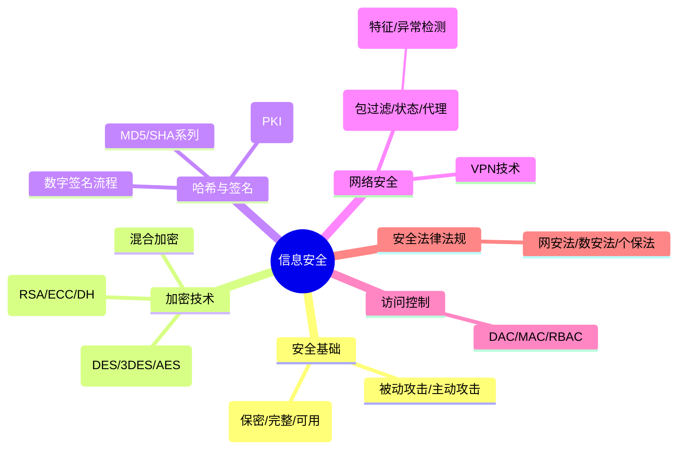

# 第八章：信息安全知识

> 分值占比：5%-8% | 重要程度：★★★

## 考情快照

- **分值占比**：5%-8%（上午选择题 4-6 题）
- **题型**：选择题（加密对比 + 数字签名 + 安全攻击辨析）
- **备考建议**：对称 vs 非对称加密对比 + 数字签名流程 + 防火墙类型 = 三大必考点。哈希算法输出长度要记。

## 知识导图



## 考情分析

**高频考点分布：**
- 加密算法对比（对称 vs 非对称）：~25%
- 数字签名 + 证书 + PKI：~20%
- 防火墙类型 + IDS 检测方式：~15%
- 网络攻击与防护：~15%
- 安全法律法规：~15%
- 访问控制（DAC/MAC/RBAC）：~10%

---

## 安全基础

### CIA 三要素
| 要素 | 含义 |
|------|------|
| **C**onfidentiality | 保密性：未经授权不可读 |
| **I**ntegrity | 完整性：未经授权不可改 |
| **A**vailability | 可用性：授权后可正常访问 |

### OSI 七层 vs TCP/IP 四层
| OSI | TCP/IP |
|-----|--------|
| 应用层 · 表示层 · 会话层 | 应用层 |
| 传输层 | 传输层 |
| 网络层 | 网际层 |
| 数据链路层 · 物理层 | 网络接口层 |

---

## 加密技术（⚠️ 必考对比）

| 对比项 | 对称加密 | 非对称加密 |
|--------|---------|-----------|
| 密钥 | 加密=解密（同一密钥） | 加密≠解密（公钥+私钥） |
| 速度 | 快 | 慢 |
| 用途 | 大量数据加密 | 密钥交换 + 数字签名 |
| 密钥分发 | 困难（需安全通道） | 简单（公钥公开） |
| 代表 | DES/3DES/AES | RSA/ECC |

### 对称加密算法

| 算法 | 密钥长度 | 状态 |
|------|---------|------|
| DES | 56 位 | ❌ 已不安全 |
| 3DES | 112/168 位 | ⚠️ 过渡 |
| **AES** | 128/192/256 位 | ✅ 现行标准 |
| IDEA | 128 位 | PGP 中使用 |

### 非对称加密算法

| 算法 | 基于 | 用途 |
|------|------|------|
| **RSA** | 大数分解 | 加密+签名（最广泛） |
| **ECC** | 椭圆曲线 | 密钥短效率高 |
| Diffie-Hellman | 离散对数 | 密钥交换 |
| DSA | 离散对数 | 数字签名专用 |

### 混合加密（实际方案）

```
1. 发送方：生成随机对称密钥 K
2. 用接收方公钥加密 K → 传给接收方
3. 用 K 加密实际数据 → 传给接收方
4. 接收方：用私钥解出 K → 用 K 解密数据
```

::: tip 为什么用混合？
非对称慢但方便传密钥 → 传密钥用非对称
对称快但不能安全传密钥 → 加密数据用对称
:::

---

## 哈希函数与数字签名

### 哈希算法

| 算法 | 输出 | 安全状态 |
|------|------|---------|
| MD5 | 128 位 | ❌ 已碰撞 |
| SHA-1 | 160 位 | ❌ 已不安全 |
| **SHA-256** | 256 位 | ✅ 常用 |
| SHA-3 | 可变 | ✅ 最新 |

### 数字签名流程（⚠️ 必考）

```
签名：私钥加密(Hash(消息))
验证：Hash(消息) == 公钥解密(签名)
```

::: tip 数字签名 ≠ 加密
签名用**私钥**（证明身份），验证用**公钥**（任何人可验证）
加密用**公钥**（只有私钥持有者可读），解密用**私钥**
:::

### PKI 三要素
- **CA**（证书颁发机构）：签发和管理证书
- **证书**：绑定公钥和身份
- **CRL**（证书撤销列表）：已失效证书清单

---

## 网络安全技术

### 防火墙类型

| 类型 | 工作层 | 特点 |
|------|--------|------|
| 包过滤 | 网络层 | 基于 IP/端口，**最快**但最弱 |
| 状态检测 | 传输层 | 跟踪连接状态，较安全 |
| 应用代理 | 应用层 | **最安全**但最慢 |
| 电路网关 | 会话层 | 验证 TCP/UDP 连接 |

### IDS 检测方式

| 方式 | 原理 | 优劣 |
|------|------|------|
| **误用检测（特征）** | 匹配已知攻击模式 | 误报低，漏报高（无法检新攻击） |
| **异常检测** | 偏离正常行为则报警 | 可检新攻击，误报高 |

### VPN 协议
| 协议 | 特点 |
|------|------|
| PPTP | 微软，较老 |
| L2TP | 常与 IPSec 结合 |
| **IPSec** | 网络层标准 |
| SSL/TLS VPN | 应用层，浏览器即用 |
| OpenVPN | 开源，灵活 |

---

## 网络攻击与防护

| 攻击 | 描述 | 防护 |
|------|------|------|
| DoS/DDoS | 耗尽资源 | 防火墙、流量清洗、CDN |
| SQL 注入 | 注入恶意 SQL | 参数化查询、输入过滤 |
| XSS | 注入恶意脚本 | 输入过滤、输出编码 |
| CSRF | 伪造用户请求 | 令牌验证、Referer 检查 |
| 中间人 | 拦截通信 | TLS 加密、证书验证 |
| 缓冲区溢出 | 利用程序漏洞 | 输入验证、内存保护 |

---

## 访问控制

| 模型 | 决策者 | 特点 |
|------|--------|------|
| **DAC**（自主访问控制） | 资源所有者 | 灵活但不严格 |
| **MAC**（强制访问控制） | 管理员（安全级别） | 严格，军用 |
| **RBAC**（基于角色） | 角色权限分配 | 企业常用 |

---

## 📊 跨题对比表（⚠️ 必考）

### 加密算法完整对比

| 维度 | 对称加密 | 非对称加密 |
|------|---------|-----------|
| 密钥关系 | 加密 = **解密**（同一密钥） | 加密 ≠ 解密（公钥 + 私钥） |
| 速度 | **快** | 慢 |
| 密钥数量 | 1 个 | 1 对（公钥公开，私钥保密） |
| 密钥分发 | **困难**（需安全通道） | 简单（公钥可公开） |
| 数字签名 | ❌ 不支持 | ✅ 支持（私钥签，公钥验） |
| 代表算法 | DES / 3DES / **AES** | **RSA** / ECC / DH |
| 用途 | 大量数据加密 | 密钥交换 + 数字签名 |

### 哈希算法输出长度速查

| 算法 | 输出长度 | 安全状态 |
|------|---------|---------|
| MD5 | 128 位 | ❌ 已碰撞 |
| SHA-1 | 160 位 | ❌ 已不安全 |
| **SHA-256** | 256 位 | ✅ 最常用 |
| SHA-384 | 384 位 | ✅ |
| SHA-512 | 512 位 | ✅ |
| SHA-3 | 可变 | ✅ 最新标准 |

### 防火墙类型

| 类型 | 工作层 | 速度 | 安全性 |
|------|--------|------|--------|
| 包过滤 | 网络层 | **最快** | 最弱 |
| 状态检测 | 传输层 | 快 | 较安全 |
| **应用代理** | 应用层 | **最慢** | **最安全** |
| 电路网关 | 会话层 | 中 | 中 |

### 访问控制

| 模型 | 决策者 | 严格度 | 适用 |
|------|--------|--------|------|
| DAC（自主） | 资源所有者 | 松 | 文件共享 |
| MAC（强制） | 管理员（安全级） | **最严** | 军事/政府 |
| **RBAC（角色）** | 角色权限分配 | 中 | **企业常用** |

### 攻击 ↔ 防护 配对

| 攻击类型 | 防护措施 |
|---------|---------|
| SQL 注入 | **参数化查询**、输入过滤 |
| XSS | 输入过滤、输出编码 |
| CSRF | 令牌验证、Referer 检查 |
| 中间人攻击 | TLS 加密、**证书验证** |
| DoS/DDoS | 防火墙、流量清洗、**CDN** |

## 考点速查

| 考点 | 一句话定义 | 频次 |
|------|----------|------|
| 对称 vs 非对称 | 对称=同钥快；非对称=双钥方便 | ★★★★★ |
| 混合加密 | 非对称传密钥 + 对称加密数据 | ★★★★ |
| 数字签名流程 | 私钥签 + 公钥验 | ★★★★★ |
| 哈希算法长度 | MD5=128/SHA1=160/SHA256=256 | ★★★★ |
| 防火墙类型 | 包过滤/状态/代理（最快→最安全） | ★★★★ |
| IDS 检测 | 误用（特征）vs 异常（偏离） | ★★★ |
| 攻击防护 | 配对题（SQL注入→参数化） | ★★★ |
| PKI | CA+证书+CRL | ★★★ |
| 访问控制 | DAC/MAC/RBAC | ★★★ |

## 考点→题目索引

- **加密算法对比**：[softdesigner-141]() · [softdesigner-142]() · [softdesigner-151]()
- **混合加密**：[softdesigner-143]() · [softdesigner-152]()
- **哈希算法**：[softdesigner-144]() · [softdesigner-153]()
- **数字签名**：[softdesigner-145]() · [softdesigner-154]() · [softdesigner-155]()
- **PKI/证书**：[softdesigner-146]() · [softdesigner-156]()
- **防火墙**：[softdesigner-147]() · [softdesigner-157]()
- **IDS**：[softdesigner-148]() · [softdesigner-158]()
- **攻击防护**：[softdesigner-149]() · [softdesigner-159]()
- **访问控制/法规**：[softdesigner-150]() · [softdesigner-160]()

## 真题练习

::: tip
本章共 20 题，建议 25 分钟。加密对比 + 数字签名 = 送分题必须拿满。
:::

<Quiz dataUrl="./quiz.json" />
