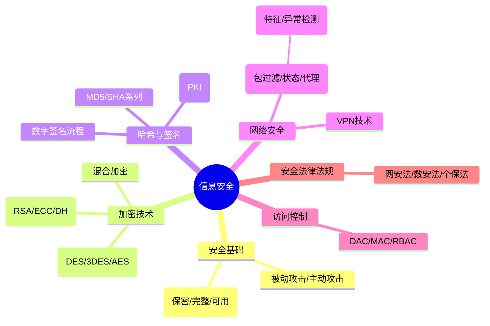

# 第八章：信息安全知识

> 分值占比：5%-8% | 重要程度：★★★

## 考情快照

- **分值占比**：5%-8%（上午选择题 4-6 题）
- **题型**：选择题（加密对比 + 数字签名 + 安全攻击辨析）
- **备考建议**：对称 vs 非对称加密对比 + 数字签名流程 + 防火墙类型 = 三大必考点。哈希算法输出长度要记。

## 知识导图


```mermaid
mindmap
  root((信息安全))
    安全基础
      CIA三要素(保密/完整/可用)
      被动攻击/主动攻击
    加密技术
      对称(DES/3DES/AES)
      非对称(RSA/ECC/DH)
      混合加密
    哈希与签名
      MD5/SHA系列
      数字签名流程
      数字证书(PKI)
    网络安全
      防火墙(包过滤/状态/代理)
       IDS(特征/异常检测)
      VPN技术
    访问控制
      DAC/MAC/RBAC
    安全法律法规
      网安法/数安法/个保法
```

## 考情分析

**高频考点分布：**
- 加密算法对比（对称 vs 非对称）：~25%
- 数字签名 + 证书 + PKI：~20%
- 防火墙类型 + IDS 检测方式：~15%
- 网络攻击与防护：~15%
- 安全法律法规：~15%
- 访问控制（DAC/MAC/RBAC）：~10%

---

## 安全基础

### CIA 三要素
| 要素 | 含义 |
|------|------|
| **C**onfidentiality | 保密性：未经授权不可读 |
| **I**ntegrity | 完整性：未经授权不可改 |
| **A**vailability | 可用性：授权后可正常访问 |

**🎯 一句话人话**：信息安全的三条底线——读不了（保密）、改不了（完整）、用得了（可用），丢任何一条都算出事。

**💡 类比**：快递柜——只有你的钥匙能开箱（保密）；箱子被人撬开换过货却看不出来（破坏完整）；柜子整体瘫痪取不了件（失去可用）。

**✍️ 小例子**：文件加密=保保密性；报文被中间人篡改但校验和通不过=破坏完整性；DDoS 把服务器打崩=破坏可用性。

**⚠️ 常见误区**：保密性和完整性常混——加密保的是"读不到"（保密），校验和/哈希保的是"改不掉"（完整），两者不是一回事。

### OSI 七层 vs TCP/IP 四层
| OSI | TCP/IP |
|-----|--------|
| 应用层 · 表示层 · 会话层 | 应用层 |
| 传输层 | 传输层 |
| 网络层 | 网际层 |
| 数据链路层 · 物理层 | 网络接口层 |

**🎯 一句话人话**：网络分层就是把"发数据"拆成几层各管一段；七层是教科书标准，四层是实际用的简化版。

**💡 类比**：寄快递——你只管写地址（应用层），分拣中心（传输层）、路线规划（网络层）、实际运送（网络接口层）各司其职。

**✍️ 小例子**：上层三层（应用/表示/会话）归并成 TCP/IP 的应用层；数据链路层+物理层合并成网络接口层；中间的传输层、网络层一一对应。

**⚠️ 常见误区**：别把表示层、会话层硬塞进 TCP/IP——四层模型只有应用/传输/网际/网络接口四层；后面防火墙"包过滤=网络层、代理=应用层"就是按这套层定位的。

---

## 加密技术（⚠️ 必考对比）

| 对比项 | 对称加密 | 非对称加密 |
|--------|---------|-----------|
| 密钥 | 加密=解密（同一密钥） | 加密≠解密（公钥+私钥） |
| 速度 | 快 | 慢 |
| 用途 | 大量数据加密 | 密钥交换 + 数字签名 |
| 密钥分发 | 困难（需安全通道） | 简单（公钥公开） |
| 代表 | DES/3DES/AES | RSA/ECC |

### 对称加密算法

| 算法 | 密钥长度 | 状态 |
|------|---------|------|
| DES | 56 位 | ❌ 已不安全 |
| 3DES | 112/168 位 | ⚠️ 过渡 |
| **AES** | 128/192/256 位 | ✅ 现行标准 |
| IDEA | 128 位 | PGP 中使用 |

**🎯 一句话人话**：对称加密就一把钥匙，加解密都用它；考试只记"谁还安全、密钥多少位"。

**💡 类比**：一把家门钥匙，锁门开门同一把——快，但钥匙得先安全送到对方手里。

**✍️ 小例子**：AES-128 = 128 位 = 16 字节（128÷8）；DES 只有 56 位早被穷举攻破，3DES 112/168 位是过渡，AES 128/192/256 位才是现行标准。

**⚠️ 常见误区**：DES 的"56 位"别记成 64 位（实际密钥 56 位、另 8 位作校验）；3DES 只是过渡，不是"最新最安全"，现行标准是 AES。

### 非对称加密算法

| 算法 | 基于 | 用途 |
|------|------|------|
| **RSA** | 大数分解 | 加密+签名（最广泛） |
| **ECC** | 椭圆曲线 | 密钥短效率高 |
| Diffie-Hellman | 离散对数 | 密钥交换 |
| DSA | 离散对数 | 数字签名专用 |

**🎯 一句话人话**：非对称加密是一对钥匙——公钥随便发、私钥自己藏；一个加密、另一个解密。

**💡 类比**：公共信箱——任何人都能投信（公钥加密），但只有你手里的钥匙能打开（私钥解密）。

**✍️ 小例子**：RSA 靠大数分解（33=3×11 好算，反推 3、11 难）；ECC 用椭圆曲线，256 位 ECC ≈ 3072 位 RSA 的安全强度，密钥更短；DH、DSA 都基于离散对数，DSA 专用于签名。

**⚠️ 常见误区**：DH/DSA 都基于离散对数，但 DSA 只签名不加密；ECC 的优势是"密钥短、效率高"，不是安全性碾压 RSA——是同等级更省资源。

### 混合加密（实际方案）

```
1. 发送方：生成随机对称密钥 K
2. 用接收方公钥加密 K → 传给接收方
3. 用 K 加密实际数据 → 传给接收方
4. 接收方：用私钥解出 K → 用 K 解密数据
```

::: tip 为什么用混合？
非对称慢但方便传密钥 → 传密钥用非对称
对称快但不能安全传密钥 → 加密数据用对称
:::

**🎯 一句话人话**：混合加密 = 用非对称安全地送钥匙，再用对称钥匙快速加密正文——两头好处都占。

**💡 类比**：先花大钱用保险柜把家里钥匙送过去，之后每次开门都用那把普通钥匙（对称），又快又安全。

**✍️ 小例子**：流程见上方 code 与 callout：随机生成 K → 公钥加密 K → K 加密数据 → 接收方私钥解 K → K 解密数据（HTTPS 握手就是这套）。

**⚠️ 常见误区**：不是"两层都加密数据"——非对称只加密会话密钥 K，真正的大数据用对称加密；别用对称加密传 K（那就又回到密钥分发难题）。

- ⚠️ 必考行：混合加密=非对称传密钥 + 对称加密数据，HTTPS/SSL 就是这一套。

---

## 哈希函数与数字签名

### 哈希算法

| 算法 | 输出 | 安全状态 |
|------|------|---------|
| MD5 | 128 位 | ❌ 已碰撞 |
| SHA-1 | 160 位 | ❌ 已不安全 |
| **SHA-256** | 256 位 | ✅ 常用 |
| SHA-3 | 可变 | ✅ 最新 |

### 数字签名流程（⚠️ 必考）

```
签名：私钥加密(Hash(消息))
验证：Hash(消息) == 公钥解密(签名)
```

::: tip 数字签名 ≠ 加密
签名用**私钥**（证明身份），验证用**公钥**（任何人可验证）
加密用**公钥**（只有私钥持有者可读），解密用**私钥**
:::

**🎯 一句话人话**：数字签名 = 拿私钥给"内容的指纹"盖章；谁都能用公钥验章，但只有你有私钥能盖——防篡改、防抵赖。

**💡 类比**：亲笔签名——任何人拿你的签名样本都能核对（公钥验证），但别人伪造不出来（私钥唯一）。

**✍️ 小例子**：对消息 M 哈希得 H（如 SHA-256 256 位）→ 私钥加密 H 得签名 S → 接收方公钥解 S 得 H'，H'==H 则通过（签名≠加密见上方 callout）。

**⚠️ 常见误区**：签名是"私钥签、公钥验"，加密是"公钥加密、私钥解"——方向恰好相反；签名的目的是身份+完整+防抵赖，不是保密。

- ⚠️ 必考行：数字签名=私钥签 + 公钥验（先哈希再签名），作用是防篡改、防抵赖；加密才是公钥加密+私钥解密。

### PKI 三要素
- **CA**（证书颁发机构）：签发和管理证书
- **证书**：绑定公钥和身份
- **CRL**（证书撤销列表）：已失效证书清单

**🎯 一句话人话**：PKI 就是"给公钥办身份证"的体系——CA 发证、证书绑定身份、CRL 记废证。

**💡 类比**：公安局办身份证（CA 签发证书），证件把"人脸↔姓名"绑在一起（公钥↔身份），挂失作废就进名单（CRL）。

**✍️ 小例子**：访问 https 网站，浏览器先验证书是否由可信 CA 签发、是否有效，再决定要不要建立加密连接。

**⚠️ 常见误区**：CA 是"信任起点"（根证书），不是加密算法；CRL 是"撤销列表"，别和证书有效期混——证书过期≠进 CRL。

---

## 网络安全技术

### 防火墙类型

| 类型 | 工作层 | 特点 |
|------|--------|------|
| 包过滤 | 网络层 | 基于 IP/端口，**最快**但最弱 |
| 状态检测 | 传输层 | 跟踪连接状态，较安全 |
| 应用代理 | 应用层 | **最安全**但最慢 |
| 电路网关 | 会话层 | 验证 TCP/UDP 连接 |

### IDS 检测方式

| 方式 | 原理 | 优劣 |
|------|------|------|
| **误用检测（特征）** | 匹配已知攻击模式 | 误报低，漏报高（无法检新攻击） |
| **异常检测** | 偏离正常行为则报警 | 可检新攻击，误报高 |

**🎯 一句话人话**：IDS 盯着网络找坏人——一条路认老面孔（误用/特征），一条路看新异动（异常）。

**💡 类比**：误用检测像按通缉令认脸（只认识已知逃犯）；异常检测像保安发现"你平时不加班、今晚却在办公室"这种反常（新招也可能被逮）。

**✍️ 小例子**：病毒库匹配已知样本=误用检测（漏报新变种）；凌晨 3 点出现批量登录=异常检测（能报新攻击但日常误报多）。

**⚠️ 常见误区**：误用检测"误报低、漏报高"（检不出新攻击）；异常检测"漏报低、误报高"——两个指标的"高/低"别记反。

### VPN 协议
| 协议 | 特点 |
|------|------|
| PPTP | 微软，较老 |
| L2TP | 常与 IPSec 结合 |
| **IPSec** | 网络层标准 |
| SSL/TLS VPN | 应用层，浏览器即用 |
| OpenVPN | 开源，灵活 |

**🎯 一句话人话**：VPN 是在公网上挖一条"加密隧道"，让远程访问像在内网一样；区别在协议工作在第几层。

**💡 类比**：给专用车开一条封闭通道，外面看不见车里装的啥（加密）、也进不来。

**✍️ 小例子**：IPSec 工作在网络层，站点互联标准；SSL/TLS VPN 工作在应用层，浏览器即用、无需装客户端；OpenVPN 开源灵活、常跑在 UDP 443。

**⚠️ 常见误区**：IPSec=网络层，SSL VPN=应用层，层数别记反；L2TP 本身不加密、常与 IPSec 结合（L2TP over IPSec）才安全。

---

## 网络攻击与防护

| 攻击 | 描述 | 防护 |
|------|------|------|
| DoS/DDoS | 耗尽资源 | 防火墙、流量清洗、CDN |
| SQL 注入 | 注入恶意 SQL | 参数化查询、输入过滤 |
| XSS | 注入恶意脚本 | 输入过滤、输出编码 |
| CSRF | 伪造用户请求 | 令牌验证、Referer 检查 |
| 中间人 | 拦截通信 | TLS 加密、证书验证 |
| 缓冲区溢出 | 利用程序漏洞 | 输入验证、内存保护 |

---

## 访问控制

| 模型 | 决策者 | 特点 |
|------|--------|------|
| **DAC**（自主访问控制） | 资源所有者 | 灵活但不严格 |
| **MAC**（强制访问控制） | 管理员（安全级别） | 严格，军用 |
| **RBAC**（基于角色） | 角色权限分配 | 企业常用 |

---

## 📊 跨题对比表（⚠️ 必考）

### 加密算法完整对比

| 维度 | 对称加密 | 非对称加密 |
|------|---------|-----------|
| 密钥关系 | 加密 = **解密**（同一密钥） | 加密 ≠ 解密（公钥 + 私钥） |
| 速度 | **快** | 慢 |
| 密钥数量 | 1 个 | 1 对（公钥公开，私钥保密） |
| 密钥分发 | **困难**（需安全通道） | 简单（公钥可公开） |
| 数字签名 | ❌ 不支持 | ✅ 支持（私钥签，公钥验） |
| 代表算法 | DES / 3DES / **AES** | **RSA** / ECC / DH |
| 用途 | 大量数据加密 | 密钥交换 + 数字签名 |

**🎯 一句话人话**：对称快但传密钥难，非对称慢但公钥可公开——所以实战是两个配合着用。

**💡 类比**：对称像用同一把钥匙的暗号信，快但钥匙怎么送过去是大问题；非对称像公共信箱+私钥，安全但每封都开信箱很慢。

**✍️ 小例子**：RSA 实例：p=3、q=11 → n=33、φ=20；取 e=3、d=7（3×7=21≡1 mod 20）；加密 m=5 → 5³=125≡26 (mod 33)；解密 26⁷≡5 ✓。非对称能数字签名（私钥签公钥验），对称不行。

**⚠️ 常见误区**：方向别记反——"公钥加密、私钥解密"是保密；"私钥签名、公钥验证"是签名。混用就全错。

- ⚠️ 必考行：对称=同钥快、加密数据；非对称=公钥+私钥、慢、管密钥分发+数字签名；AES 代表对称、RSA 代表非对称。

### 哈希算法输出长度速查

| 算法 | 输出长度 | 安全状态 |
|------|---------|---------|
| MD5 | 128 位 | ❌ 已碰撞 |
| SHA-1 | 160 位 | ❌ 已不安全 |
| **SHA-256** | 256 位 | ✅ 最常用 |
| SHA-384 | 384 位 | ✅ |
| SHA-512 | 512 位 | ✅ |
| SHA-3 | 可变 | ✅ 最新标准 |

**🎯 一句话人话**：哈希把任意内容"压"成固定长度的数字指纹，长度由算法定；考题就考每个算法输出多少位。

**💡 类比**：每个人的身份证号都是定长的；内容变一点、指纹全变（雪崩效应），所以能用来验"有没有被改"。

**✍️ 小例子**：MD5=128 位（32 个 hex，128÷4）；SHA-1=160 位（40 个 hex）；SHA-256=256 位（64 个 hex）；SHA-512=512 位（128 个 hex）——位数÷4=十六进制字符数 ✓。

**⚠️ 常见误区**：MD5 和 SHA-1 都已发现碰撞、不安全；输出长度单位是"位"，MD5 128 位=16 字节，别把位当字节。

- ⚠️ 必考行：MD5=128 位（已碰撞）、SHA-1=160 位（不安全）、SHA-256=256 位（最常用）、SHA-512=512 位。

### 防火墙类型

| 类型 | 工作层 | 速度 | 安全性 |
|------|--------|------|--------|
| 包过滤 | 网络层 | **最快** | 最弱 |
| 状态检测 | 传输层 | 快 | 较安全 |
| **应用代理** | 应用层 | **最慢** | **最安全** |
| 电路网关 | 会话层 | 中 | 中 |

**🎯 一句话人话**：防火墙是网络门口的查证保安；查得越深越安全、也越慢——从包过滤到应用代理，一层比一层严。

**💡 类比**：包过滤只看快递单（IP/端口）；状态检测还看"是不是刚才那单的回单"（连接状态）；应用代理要把包裹打开检查内容（应用层），最安全也最慢。

**✍️ 小例子**：封外部访问内网 8080 端口→包过滤（网络层）；跟踪 TCP 三次握手判断连接是否合法→状态检测（传输层）；代理代用户访问外网并审查内容→应用代理（应用层）。

**⚠️ 常见误区**：别以为"包过滤最安全"——它最快但最弱；应用代理最安全但最慢；电路网关工作在会话层（验证 TCP/UDP 连接），别漏。

- ⚠️ 必考行：包过滤=网络层最快最弱，状态检测=传输层，应用代理=应用层最慢最安全。

### 访问控制

| 模型 | 决策者 | 严格度 | 适用 |
|------|--------|--------|------|
| DAC（自主） | 资源所有者 | 松 | 文件共享 |
| MAC（强制） | 管理员（安全级） | **最严** | 军事/政府 |
| **RBAC（角色）** | 角色权限分配 | 中 | **企业常用** |

**🎯 一句话人话**：访问控制就是"谁能动这个资源"由谁说了算——DAC 资源主人说了算、MAC 上级强制定、RBAC 按角色分工。

**💡 类比**：DAC 像自己家门自己定谁进（灵活）；MAC 像军事区由司令统一分级（严格）；RBAC 像公司按"经理/员工"职位发权限（企业标配）。

**✍️ 小例子**：Linux `chmod` 由属主授权=DAC；涉密文件按"绝密/机密/秘密"级别访问=MAC；公司给"财务角色"分配报表权限、谁挂这角色谁就有=RBAC。

**⚠️ 常见误区**：MAC 的决策者是"管理员+安全级别"，不是资源所有者；RBAC 授权给"角色"而非具体个人——换人继承角色即继承权限。

### 攻击 ↔ 防护 配对

| 攻击类型 | 防护措施 |
|---------|---------|
| SQL 注入 | **参数化查询**、输入过滤 |
| XSS | 输入过滤、输出编码 |
| CSRF | 令牌验证、Referer 检查 |
| 中间人攻击 | TLS 加密、**证书验证** |
| DoS/DDoS | 防火墙、流量清洗、**CDN** |

**🎯 一句话人话**：攻击题就是"攻击在干嘛 → 用什么招防"的配对题；另分被动（只偷看）和主动（动手改/破坏）两大类。

**💡 类比**：被动攻击像隔墙偷听（不动现场）；主动攻击像翻墙进屋搞破坏——动静大、更容易被发现。

**✍️ 小例子**：窃听/流量分析=被动攻击；DoS、SQL 注入、XSS、CSRF、中间人篡改=主动攻击。配对：SQL 注入→参数化查询；XSS→输出编码；CSRF→令牌验证；中间人→TLS+证书验证；DDoS→防火墙/流量清洗/CDN。

**⚠️ 常见误区**：XSS 与 SQL 注入都靠"输入"，但 XSS 是"在用户浏览器执行脚本"（防在输出编码）、SQL 注入是"骗数据库执行语句"（防在参数化）；CSRF 是"借你的身份发请求"，靠令牌/Referer 防。

## 考点速查

| 考点 | 一句话定义 | 频次 |
|------|----------|------|
| 对称 vs 非对称 | 对称=同钥快；非对称=双钥方便 | ★★★★★ |
| 混合加密 | 非对称传密钥 + 对称加密数据 | ★★★★ |
| 数字签名流程 | 私钥签 + 公钥验 | ★★★★★ |
| 哈希算法长度 | MD5=128/SHA1=160/SHA256=256 | ★★★★ |
| 防火墙类型 | 包过滤/状态/代理（最快→最安全） | ★★★★ |
| IDS 检测 | 误用（特征）vs 异常（偏离） | ★★★ |
| 攻击防护 | 配对题（SQL注入→参数化） | ★★★ |
| PKI | CA+证书+CRL | ★★★ |
| 访问控制 | DAC/MAC/RBAC | ★★★ |

## 考点→题目索引

- **加密算法对比**：[softdesigner-141]() · [softdesigner-142]() · [softdesigner-151]()
- **混合加密**：[softdesigner-143]() · [softdesigner-152]()
- **哈希算法**：[softdesigner-144]() · [softdesigner-153]()
- **数字签名**：[softdesigner-145]() · [softdesigner-154]() · [softdesigner-155]()
- **PKI/证书**：[softdesigner-146]() · [softdesigner-156]()
- **防火墙**：[softdesigner-147]() · [softdesigner-157]()
- **IDS**：[softdesigner-148]() · [softdesigner-158]()
- **攻击防护**：[softdesigner-149]() · [softdesigner-159]()
- **访问控制/法规**：[softdesigner-150]() · [softdesigner-160]()

## 真题练习

::: tip
本章共 20 题，建议 25 分钟。加密对比 + 数字签名 = 送分题必须拿满。
:::

<Quiz dataUrl="./quiz.json" />
