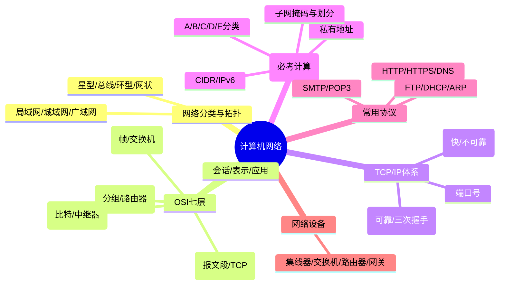

# 第九章：计算机网络基础

> 分值占比：5%-8% | 重要程度：★★★

**📖 零基础导读**

::: guide 零基础导读

> 本章讲的是**计算机网络**：数据怎么打包上路、IP 地址怎么分、两台电脑怎么"对上话"。软设考试里它是**拿分性价比高**的一章——概念题为主，外加一道必考的计算题（子网划分 / IP 分类），把"七层模型每层干什么"和"IP 怎么算"记住就能稳拿分。

**人话概述**：这一章就是"网络世界的交通规则"——先看网络有哪些类型和拓扑（9.1）；再看教科书级的 OSI 七层模型，数据从应用层一路"打包"到物理层再发出去（9.2）；然后是实际使用的 TCP/IP 体系，TCP 三次握手、UDP 快而不稳（9.3）；接着是必考计算：IP 地址分 A/B/C/D/E 五类、子网掩码怎么划分子网（9.4）；再认识 DNS、HTTP、FTP 这些常用协议和交换机、路由器这些网络设备（9.5、9.6）；最后简单了解网络管理与排障（9.7）。

**生活联系**：你家的路由器 = 连接内网和外网的网关；`192.168.x.x` 就是你家私有 IP；上网就是 DNS 把"www.example.com"翻译成 IP 地址；WiFi 连不上时"重启路由器"其实就是网络排障。

**学完会什么**：能背出 OSI 七层及各层的数据单位（比特/帧/分组/报文段）；会算 IP 地址属于哪一类、子网掩码能把网络切成几个子网、每个子网能放多少台主机；知道 TCP 三次握手是 SYN→SYN+ACK→ACK；能说出 HTTP/FTP/DNS 的默认端口和"谁用 TCP、谁用 UDP"。

**难点预告**：① 子网划分计算——"借 n 位得 2ⁿ 个子网、主机位剩 m 位得 2ᵐ-2 台主机"，套公式就能算，别慌；② 七层模型每层功能容易串——用口诀"物链网传会表应"和每层的"典型设备 + 数据单位"双锚点记；③ TCP 三次握手为什么不是两次——丢包重传的角度想就懂了。

🔗 **前置**：本章需要"数据在网络上怎么传"的基本概念，信息安全章节（[第八章](./ch08)）里已出现过 OSI/TCP 分层的简化对比。零基础建议先花 10 分钟学预备篇 [P5 领域常识](/softdesigner/prep/p5)（有"网络 = 寄快递/送信"的入门比喻），再回来读本章。

:::
## 考情快照

- **分值占比**：5%-8%（上午选择题 4-6 题，含 1 道必考计算题）
- **题型**：选择题（IP/子网计算 + OSI 层功能 + 协议端口）
- **备考建议**：IP 地址分类与子网划分计算 = 必考；OSI 七层功能与典型设备、TCP 三次握手、常用协议端口 = 高频记忆点。

## 知识导图



## 考情分析

**高频考点分布：**
- IP 地址分类与子网划分（计算）：~30%
- OSI 七层功能 + 典型设备/协议：~25%
- TCP vs UDP + 三次握手：~15%
- 常用协议与端口：~15%
- 网络设备与拓扑：~10%
- IPv6 与网络管理：~5%

---

## 9.1 网络分类与拓扑

**按覆盖范围分类：**
- **局域网（LAN）**：一栋楼/一个园区，速度快、延迟低
- **城域网（MAN）**：一座城市范围
- **广域网（WAN）**：跨城市/跨国，速度较慢（如互联网）

::: info
**🎯 一句话人话**：网络按"地盘大小"分三档——家里/公司（局域网）、一个城市（城域网）、全世界（广域网）。
:::

::: tip
**💡 类比**：局域网像楼内快递柜，城域网像同城快递，广域网像跨国物流。
:::

::: details ✍️ 小例子
**✍️ 小例子**：办公室 WiFi=局域网；城市政务网=城域网；你访问国外网站走的就是广域网（互联网）。
:::

::: warning
**⚠️ 常见误区**：局域网快≠广域网快——速度差异来自传输距离和中间设备数量，考试常考"哪个范围最大/最小"。
:::

**常见拓扑结构：**
| 拓扑 | 特点 | 缺点 |
|------|------|------|
| 星型 | 所有节点连到中心（交换机） | 中心故障全瘫 |
| 总线型 | 一根主干线，所有节点共享 | 主干断则全断，冲突多 |
| 环型 | 节点首尾相连成环 | 单点故障影响整环 |
| 网状 | 节点两两互联 | 布线成本高，可靠性最高 |

::: info
**🎯 一句话人话**：拓扑就是"电脑怎么连线"的四种方案——星型最常用（家用路由器就是中心），网状最可靠（骨干网用）。
:::

::: tip
**💡 类比**：星型=公司前台统一转接电话；总线型=一条走廊大家轮流用；环型=接力传话；网状=全员两两直连。
:::

::: warning
**⚠️ 常见误区**：现代局域网几乎都是星型（交换机为中心），考试里"总线型/环型"主要考"哪根线断了影响谁"的推理。
:::

---

## 9.2 OSI 七层模型（⚠️ 必考分层）

| 层 | 功能一句话 | 数据单位 | 典型设备/协议 |
|----|-----------|----------|--------------|
| 7 应用层 | 面向用户的网络服务（收发文件、浏览网页） | 报文 | HTTP/FTP/DNS/SMTP |
| 6 表示层 | 数据格式转换、加密压缩 | 报文 | 格式/编码 |
| 5 会话层 | 建立/管理/终止会话 | 报文 | 会话管理 |
| 4 传输层 | 端到端可靠传输、流量控制 | **报文段** | **TCP/UDP** |
| 3 网络层 | 寻址与路由选择 | **分组** | **IP/ICMP/路由器** |
| 2 数据链路层 | 相邻节点成帧传输、差错控制 | **帧** | **交换机/网桥** |
| 1 物理层 | 比特流的物理传输 | **比特** | **中继器/集线器** |

::: info
**🎯 一句话人话**：七层=数据从"人话"一层层"打包"成"比特流"发出去，收方再一层层"拆包"还原——每层只和相邻层打交道。
:::

::: tip
**💡 类比**：寄国际快递——你写好信（应用层）、翻译成英文（表示层）、约好通话（会话层）、快递公司保证送到并签收（传输层）、按地址规划路线（网络层）、装车过站（数据链路层）、实际运输（物理层）。
:::

::: details ✍️ 小例子
**✍️ 小例子**：访问网页时：HTTP 报文（应用层）→ 交给 TCP 分包并编号（传输层）→ IP 加上源/目的地址（网络层）→ 网卡封装成帧（数据链路层）→ 变成电信号发出（物理层）。
:::

::: warning
**⚠️ 常见误区**：①"帧"是数据链路层单位、"分组"是网络层单位、"报文段"是传输层单位——三者别混；② 交换机是数据链路层设备、路由器是网络层设备——考试最爱考"某设备工作在几层"。
:::

::: danger ⚠️ 必考行
OSI 口诀"物链网传会表应"+ 各单位/设备：比特-中继器/集线器、帧-交换机、分组-路由器、报文段-TCP/UDP。
:::

---

## 9.3 TCP/IP 体系结构

### TCP/IP 四层（实际使用）

| TCP/IP 四层 | 对应 OSI | 核心协议 |
|-------------|---------|---------|
| 应用层 | 应用+表示+会话 | HTTP/FTP/DNS/SMTP/Telnet |
| 传输层 | 传输层 | **TCP / UDP** |
| 网际层 | 网络层 | **IP / ICMP / ARP** |
| 网络接口层 | 数据链路+物理 | 以太网等 |

::: info
**🎯 一句话人话**：TCP/IP 是"实际在用的七层简化版"——最上面三层合并成应用层，最下面两层合并成网络接口层。
:::

::: tip
**💡 类比**：七层像完整的规章制度，四层像实际执行的简化流程——考试两者都会考，映射关系要会背。
:::

::: details ✍️ 小例子
**✍️ 小例子**：你的浏览器→DNS 查域名（应用层）→TCP 建立连接（传输层）→IP 选路（网际层）→网卡发帧（网络接口层）。
:::

### TCP vs UDP（⚠️ 必考对比）

| 对比项 | TCP | UDP |
|--------|-----|-----|
| 可靠性 | ✅ 可靠（确认+重传） | ❌ 不可靠（尽力而为） |
| 连接 | 面向连接（三次握手） | 无连接 |
| 速度 | 慢 | 快 |
| 应用 | HTTP/FTP/邮件/SMTP | DNS/视频直播/语音通话 |
| 数据单位 | 报文段 | 数据报 |

::: info
**🎯 一句话人话**：TCP=挂号信（能送到、要签收、慢）；UDP=平信（寄出就完事、快、可能丢）。
:::

::: tip
**💡 类比**：TCP 像快递要签收，UDP 像广播喇叭喊一嗓子——后者快但没人保证你听见。
:::

::: details ✍️ 小例子
**✍️ 小例子**：网页/文件传输必须 TCP（丢一个字节都要重传）；视频直播/游戏用 UDP（丢几帧无所谓，卡顿比等重传好）。
:::

::: warning
**⚠️ 常见误区**：DNS 默认用 UDP（53 端口），但区域传送用 TCP——别一刀切说"DNS 一定用 UDP"。
:::

### TCP 三次握手与四次挥手（⚠️ 必考）

```
三次握手（建立连接）        四次挥手（关闭连接）
Client → Server             Client → Server
1. SYN                    1. FIN
2. SYN + ACK              2. ACK
3. ACK                    3. FIN
                          4. ACK
```

::: info
**🎯 一句话人话**：三次握手=双方各确认一次"你能收到我、我能收到你"（前两次确认双向通）；四次挥手=谁先关都要对方确认，所以多一次。
:::

::: tip
**💡 类比**：三次握手像打电话："喂？"（SYN）→"喂，听见了！"（SYN+ACK）→"好，开始说！"（ACK）；四次挥手像挂电话："我说完了"→"收到"→（对方）"我也说完了"→"收到，挂"。
:::

::: details ✍️ 小例子
**✍️ 小例子**：为什么不是两次？若只有 SYN→ACK，Client 发起的第一个 SYN 在网络中滞留后重发，Server 会误建两个连接——第三次 ACK 就是为了让 Server 确认"Client 真的收到了我的应答"。
:::

::: warning
**⚠️ 常见误区**：挥手是四次不是三次——因为 TCP 是**全双工**，两个方向各自独立关闭，各需一次 FIN+ACK；第三次握手的 ACK 和第二次的 SYN+ACK 可以合并，但挥手不能合并。
:::

### 常用端口号（⚠️ 高频）

| 端口 | 协议/服务 | 传输层 |
|------|-----------|--------|
| 20/21 | FTP（数据/控制） | TCP |
| 22 | SSH | TCP |
| 23 | Telnet | TCP |
| 25 | SMTP（发邮件） | TCP |
| 53 | DNS | UDP（区域传送用 TCP） |
| 67/68 | DHCP（服务器/客户端） | UDP |
| 80 | HTTP | TCP |
| 110 | POP3（收邮件） | TCP |
| 143 | IMAP（收邮件） | TCP |
| 443 | HTTPS | TCP |
| 161/162 | SNMP | UDP |

::: info
**🎯 一句话人话**：端口=进程的"门牌号"；记口诀"80 网页、443 加密网页、21 传文件、53 查域名、25 发信、110 收信"。
:::

::: warning
**⚠️ 常见误区**：FTP 是 21（控制）+ 20（数据）两个端口；HTTPS 是 443 不是 8443（那是开发用的备用端口）。
:::

---

## 9.4 IP 地址与子网划分（⚠️ 必考计算）

### IPv4 分类（⚠️ 必考）

| 类别 | 首字节范围 | 二进制前缀 | 默认掩码 | 用途 |
|------|-----------|-----------|---------|------|
| A | 1~126 | 0 | 255.0.0.0（/8） | 大型网络 |
| B | 128~191 | 10 | 255.255.0.0（/16） | 中型网络 |
| C | 192~223 | 110 | 255.255.255.0（/24） | 小型网络 |
| D | 224~239 | 1110 | — | **组播** |
| E | 240~255 | 1111 | — | 保留 |

::: info
**🎯 一句话人话**：看 IP 第一个数字就知道类别：1-126 是 A、128-191 是 B、192-223 是 C；127 是回环地址（本机自己），不算 A 类。
:::

::: tip
**💡 类比**：类别像门牌号段——A 类是大单位（可挂几千万台机器），C 类是小户型（最多 254 台）。
:::

::: details ✍️ 小例子
**✍️ 小例子**：10.0.0.1→A 类；172.16.5.8→B 类；192.168.1.100→C 类；224.0.0.1→D 类组播地址。
:::

::: warning
**⚠️ 常见误区**：① 127.x.x.x 是回环（localhost），不属于 A 类可用地址；② D 类组播、E 类保留都不能分配给主机；③ 判断类别看**首字节十进制范围**，不是看前几位二进制（两者等价但考试常用十进制）。
:::

### 私有地址（⚠️ 必考）

| 类别 | 私有地址范围 | CIDR |
|------|-------------|------|
| A | 10.0.0.0 ~ 10.255.255.255 | 10.0.0.0/8 |
| B | 172.16.0.0 ~ 172.31.255.255 | 172.16.0.0/12 |
| C | 192.168.0.0 ~ 192.168.255.255 | 192.168.0.0/16 |

::: info
**🎯 一句话人话**：私有地址=内部用的"公司内线号码"，只能在局域网用，上公网必须经 NAT 转成公网 IP——你家的 192.168.x.x 就是私有地址。
:::

::: warning
**⚠️ 常见误区**：私有地址能出现在公网上吗？不能直接路由——考试爱考"下列哪个是私有地址/公网地址"。
:::

### 子网划分计算（⚠️ 必考公式）

**核心公式：**
- 借 **n** 位作子网号 → 子网数 = **2ⁿ**
- 主机位剩 **m** 位 → 每子网主机数 = **2ᵐ − 2**（全 0 网络号、全 1 广播号不可用）
- 子网掩码 = 原掩码前 n 位置 1

::: info
**🎯 一句话人话**：子网划分=把一大块 IP 分成若干小格子——"借位"越多格子越多，但每个格子能装的机器越少。
:::

::: tip
**💡 类比**：把一栋大楼（一个网段）用隔断（子网掩码）分成若干小办公室，隔断越多房间越小。
:::

::: details ✍️ 小例子
**✍️ 小例子**：C 类网 192.168.1.0/24 借 3 位作子网 → 子网数 2³=8；主机位剩 8-3=5 位 → 每子网主机数 2⁵-2=30 台；掩码为 255.255.255.224。
:::

::: warning
**⚠️ 常见误区**：① 主机数要 **−2**（网络号+广播号），子网数在新标准（CIDR/无类）下**不−2**；② 掩码 224=11100000，借 3 位别算成 2³−2=6 个子网（那是旧标准"全0全1子网不可用"的说法，软考按 2ⁿ 计）；③ 掩码换算：128=1位、192=2位、224=3位、240=4位、248=5位、252=6位、254=7位、255=8位。
:::

::: danger ⚠️ 必考行
子网数=2ⁿ；每子网主机数=2ᵐ−2（m=32−掩码位数−n 或 8−借位数）；IP 首字节定类别。
:::

### CIDR 与 IPv6

- **CIDR（无类域间路由）**：用 `/n` 表示掩码位数，如 192.168.1.0/26 表示前 26 位是网络位
- **IPv6**：128 位地址，8 组十六进制数，冒号分隔，如 `2001:0db8:85a3::8a2e:0370:7334`；连续的 0 可用 `::` 压缩（只能一次）

::: info
**🎯 一句话人话**：IPv4 是 32 位"门牌号"快用完了，IPv6 是 128 位"门牌号"多到用不完——考试只考"多长、怎么缩写"。
:::

::: details ✍️ 小例子
**✍️ 小例子**：`2001:0db8:0000:0000:0000:0000:0000:0001` 可缩写为 `2001:db8::1`（:: 代替连续 0 组，只能用一次）。
:::

::: warning
**⚠️ 常见误区**：IPv6 是 128 位 = 32 个十六进制位；`::` 只能出现一次，出现两次就是错的。
:::

---

## 9.5 常用网络协议

| 协议 | 全称/作用 | 默认端口 |
|------|-----------|---------|
| **HTTP** | 网页传输（明文） | 80 |
| **HTTPS** | HTTP + SSL/TLS 加密 | 443 |
| **FTP** | 文件传输 | 21/20 |
| **DNS** | 域名→IP 翻译 | 53 |
| **ARP** | IP→MAC 地址解析（网际层） | — |
| **DHCP** | 自动分配 IP | 67/68 |
| **ICMP** | 网络诊断（ping 用它） | — |
| **SMTP** | 发邮件 | 25 |
| **POP3/IMAP** | 收邮件 | 110/143 |

::: info
**🎯 一句话人话**：协议=网络世界的"办事窗口"——查域名找 DNS、传文件找 FTP、发邮件找 SMTP，各管一摊。
:::

::: tip
**💡 类比**：DNS 像电话簿（记名字查号码）；DHCP 像酒店前台（入住时给你分配房间号）；ARP 像问邻居"XX 家在几零几"。
:::

::: details ✍️ 小例子
**✍️ 小例子**：打开网页的全过程：DNS 查 www.example.com 的 IP → TCP 三次握手 → HTTP GET 请求 → 服务器返回网页 → 四次挥手关闭。
:::

::: warning
**⚠️ 常见误区**：ARP 工作在**网际层**（网络层）负责 IP→MAC，和 DNS（应用层）的域名→IP 不是一回事；ping 用的是 ICMP 不是 TCP/UDP。
:::

---

## 9.6 网络设备

| 设备 | 工作层 | 作用 |
|------|--------|------|
| 中继器/集线器 | 物理层 | 放大/转发信号（集线器=多口中继器） |
| 网桥/交换机 | 数据链路层 | 按 MAC 地址转发帧（交换机=多口网桥） |
| 路由器 | 网络层 | 按 IP 地址选路转发分组 |
| 网关 | 传输层及以上 | 连接不同协议/体系（如 NAT 网关） |

::: info
**🎯 一句话人话**：设备越往上"越聪明"——集线器无脑广播、交换机认 MAC、路由器认 IP、网关负责翻译对接。
:::

::: tip
**💡 类比**：集线器=小区广播喇叭（所有人都能听见）；交换机=按门牌号投递（只送到对应房间）；路由器=跨城市路线规划师；网关=两国边境翻译官。
:::

::: warning
**⚠️ 常见误区**：交换机能隔离冲突域但不能隔离广播域；路由器能隔离广播域——"冲突域/广播域"判断题常考，记住"路由器最聪明"。
:::

---

## 9.7 网络管理与排障（简要）

- **ping**：用 ICMP 测试连通性
- **tracert/traceroute**：追踪路由经过的节点
- **SNMP**：网络设备统一管理协议（161/162 端口，UDP）
- 常见排障顺序：物理连接 → IP 配置（ipconfig）→ 网关（ping 网关）→ DNS → 外网

::: info
**🎯 一句话人话**：排障就像"从家门口一路问到国外"——先看自己通不通，再看网关，再看 DNS，一层层缩小范围。
:::

::: details ✍️ 小例子
**✍️ 小例子**：能上微信不能开网页 → 多半是 DNS 问题（域名解析失败），不是断网。
:::

---

## 考点速查

| 考点 | 一句话定义 | 频次 |
|------|----------|------|
| IP 地址分类 | 首字节 1-126=A、128-191=B、192-223=C | ★★★★★ |
| 子网划分 | 子网数=2ⁿ，主机数=2ᵐ−2 | ★★★★★ |
| 私有地址 | 10/172.16-31/192.168 三个网段 | ★★★★★ |
| OSI 七层 | 物链网传会表应，各单位/设备 | ★★★★★ |
| TCP 三次握手 | SYN→SYN+ACK→ACK | ★★★★ |
| TCP vs UDP | TCP 可靠慢，UDP 快不可靠 | ★★★★ |
| 常用端口 | 80/443/21/53/25/110 | ★★★★ |
| 网络设备分层 | 交换机=链路层，路由器=网络层 | ★★★ |
| IPv6 | 128 位，8 组十六进制，:: 压缩 | ★★★ |
| 网络拓扑 | 星型最常用、网状最可靠 | ★★★ |

## 考点→题目索引

> 点击题号跳转到下方 Quiz 组件做题，做完后看解析回链到考点。

- **IP 分类与私有地址**：[softdesigner-161](#softdesigner-161) · [softdesigner-162](#softdesigner-162) · [softdesigner-163](#softdesigner-163) · [softdesigner-171](#softdesigner-171)
- **子网划分计算**：[softdesigner-164](#softdesigner-164) · [softdesigner-165](#softdesigner-165) · [softdesigner-172](#softdesigner-172) · [softdesigner-173](#softdesigner-173)
- **OSI 七层**：[softdesigner-166](#softdesigner-166) · [softdesigner-167](#softdesigner-167) · [softdesigner-174](#softdesigner-174)
- **TCP/UDP 与握手**：[softdesigner-168](#softdesigner-168) · [softdesigner-175](#softdesigner-175) · [softdesigner-176](#softdesigner-176)
- **协议与端口**：[softdesigner-169](#softdesigner-169) · [softdesigner-170](#softdesigner-170) · [softdesigner-177](#softdesigner-177) · [softdesigner-178](#softdesigner-178)
- **网络设备与拓扑**：[softdesigner-179](#softdesigner-179)
- **IPv6**：[softdesigner-180](#softdesigner-180)

## 🧮 例题精讲

> 下面 5 道题覆盖本章必考点（IP 分类、子网划分、OSI 分层、三次握手、端口）。先自己动手算，再看思路与逐步推演——子网计算题是上午卷的固定送分题。

::: details 例题 1
**例题 1**：下列 IP 地址中，属于 B 类地址的是：
- A. 10.10.10.10　B. 126.0.0.1　C. 172.20.5.8　D. 192.168.1.1

**思路**：看首字节范围：A 类 1-126、B 类 128-191、C 类 192-223。

**逐步推演**：
1. A：10 开头 → A 类
2. B：126 开头 → A 类（127 才是回环，126 仍属 A 类）
3. C：172 开头 → **B 类**（172.16-31 是私有，但类别仍是 B）
4. D：192 开头 → C 类

**答案**：C（172.20.5.8）——与 Quiz 中 softdesigner-161 的答案一致。

**易错点**：① 私有地址不影响类别判断（172.20 是 B 类私有段，类别照样是 B）；② 126 是 A 类最大可用网络号，127 回环不算。
:::
::: details 例题 2
**例题 2**：某 C 类网络 200.16.5.0/24，若需要划分 6 个子网且每个子网至少 12 台主机，则子网掩码应设为：
- A. 255.255.255.192　B. 255.255.255.224　C. 255.255.255.240　D. 255.255.255.248

**思路**：子网数=2ⁿ≥6 → n≥3；主机数=2ᵐ−2≥12 → m≥4；n+m≤8（C 类主机位共 8 位）。取 n=3、m=5：2³=8≥6 ✓，2⁵−2=30≥12 ✓。

**逐步推演**：
1. 需要 2ⁿ≥6 → n=3 够（2²=4 不够）
2. 掩码 = 24+3 = 27 位 → 255.255.255.**11100000** = 255.255.255.224
3. 验证主机数：2⁵−2=30 ≥ 12 ✓

**答案**：B（255.255.255.224）——与 Quiz 中 softdesigner-164 的答案一致。

**易错点**：① 先分别满足"子网数"和"主机数"两个不等式再取掩码；② 224=11100000 是借 3 位，别和 240（借 4 位）混。
:::
::: details 例题 3
**例题 3**：在 OSI 参考模型中，路由器工作在：
- A. 物理层　B. 数据链路层　C. 网络层　D. 传输层

**思路**：设备工作层级 = 它"看什么地址"——看 MAC 是链路层（交换机），看 IP 是网络层（路由器）。

**逐步推演**：
1. 路由器转发依据是 IP 地址（逻辑地址）
2. IP 地址是网络层概念 → 路由器工作在网络层
3. 对照：集线器（物理层）、交换机（数据链路层）、路由器（网络层）、网关（高层）

**答案**：C（网络层）——与 Quiz 中 softdesigner-166 的答案一致。

**易错点**：交换机和路由器分层最常考——"交换机=链路层、路由器=网络层"这个配对要背死。
:::
::: details 例题 4
**例题 4**：TCP 建立连接的三次握手过程中，第二次握手的报文标志位为：
- A. SYN　B. ACK　C. SYN+ACK　D. FIN

**思路**：三次握手流程：① Client→Server：SYN；② Server→Client：SYN+ACK；③ Client→Server：ACK。

**逐步推演**：
1. 第一次：客户端发 SYN（请求建立连接）
2. 第二次：服务器回应 SYN+ACK（"收到你的请求，我也要建立连接"）
3. 第三次：客户端回 ACK（"确认收到"），连接建立

**答案**：C（SYN+ACK）——与 Quiz 中 softdesigner-168 的答案一致。

**易错点**：第二次握手是"SYN+ACK 合并"，不是单独 ACK——考试常把选项设计成 A. SYN B. ACK 来干扰。
:::
::: details 例题 5
**例题 5**：下列协议中，默认使用 UDP 的是：
- A. FTP　B. SMTP　C. DNS　D. HTTP

**思路**：可靠传输类（文件/网页/邮件）用 TCP；查询/实时类用 UDP。DNS 查询默认 UDP 53。

**逐步推演**：
1. FTP（文件传输）→ TCP
2. SMTP（邮件）→ TCP
3. DNS（域名查询）→ **UDP**（查询快，失败重发即可）
4. HTTP（网页）→ TCP

**答案**：C（DNS）——与 Quiz 中 softdesigner-169 的答案一致。

**易错点**：DNS 是"默认 UDP"不是绝对 UDP（区域传送用 TCP）——但单选题里"默认使用 UDP"就是它。
:::
## 真题练习

::: tip
本章共 20 题，建议 30 分钟内做完。做完后对照上方"考点→题目索引"回链薄弱考点重新阅读。
:::

<Quiz dataUrl="./quiz.json" initialChapter="09" />
