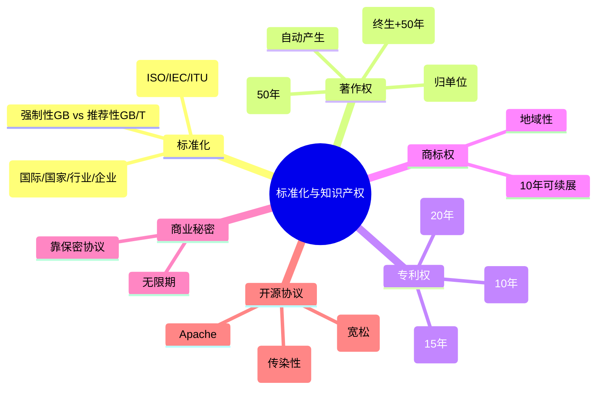

# 第十章：标准化与知识产权

> 分值占比：5%-8% | 重要程度：★★★

**📖 零基础导读**

::: guide 零基础导读

> 本章讲的是**标准化与知识产权**：软件行业有哪些"规矩"（标准），代码和创意归谁、保护多久（知识产权）。它是软设考试里**纯记忆、零计算**的一章——把"标准分几级、保护期各几年、侵权怎么判"这几张表背熟，分数就到手。

**人话概述**：这一章分两大块——先说"标准化"：标准分国际/国家/行业/企业四级，国家标准的 GB 是强制、GB/T 是推荐（10.1）；再说"知识产权"：作品和软件自动获得著作权、保护期 50 年；发明创造可申请专利，发明 20 年、实用新型 10 年；商标 10 年可续；商业秘密靠保密不靠注册（10.2）；最后看工作中最相关的软件著作权、开源协议和侵权判定（10.3）。

**生活联系**：你电脑里软件图标旁的"© 版权所有"就是著作权声明；开源软件（Linux、MySQL）都带 GPL/MIT 协议；公司要求你写的代码版权归公司——这就是职务作品的权属规则。

**学完会什么**：能分清标准等级与代号（GB 强制 / GB/T 推荐 / ISO 国际）；背出保护期限表（著作权 50 年、发明 20 年、实用新型 10 年、外观设计 15 年、商标 10 年可续、商业秘密无限）；知道软件著作权"自动产生、不登记也受保护"；能判断职务作品/职务发明的权属归单位；知道 GPL 的"传染性"和 MIT/BSD 的宽松。

**难点预告**：① 各种"年限"最容易混——用"著作权 50、发明 20、实用新型 10、商标 10 可续、秘密无限"的口诀；② 专利与著作权的保护对象区别——专利保护"技术方案"、著作权保护"表达"，同一个软件两者都可能涉及；③ 知识产权"地域性"——在中国申请的专利只在"中国境内"有效。

🔗 **前置**：本章基本独立，不需要前面章节的基础。若对"软件是怎么做出来的"没概念，可先看[第五章 软件工程](./ch05)的前置导读，5 分钟即可。

:::
## 考情快照

- **分值占比**：5%-8%（上午选择题 4-6 题）
- **题型**：选择题（保护期限 + 标准分类 + 侵权判定）
- **备考建议**：保护期限表（著作/专利/商标）= 必考；标准代号（GB/GB/T/ISO）+ 知识产权特性 = 高频；开源协议偶有涉及。

## 知识导图

## 考情分析

**高频考点分布：**
- 保护期限（著作权/专利/商标）：~35%
- 标准分类与代号（GB/GB/T/ISO）：~20%
- 知识产权特性（无形/专有/地域/时间）：~15%
- 侵权判定与权属（职务作品/职务发明）：~15%
- 软件著作权与开源协议：~15%

---

## 10.1 标准化知识

### 标准的分级（⚠️ 必考）

| 级别 | 制定机构 | 我国代号 | 例子 |
|------|---------|---------|------|
| 国际标准 | ISO、IEC、ITU 等 | ISO 9001 | 国际质量管理体系 |
| 国家标准 | 国家标准化管理委员会 | **GB（强制）/ GB/T（推荐）** | GB/T 19001 |
| 行业标准 | 行业主管部门 | 如 YD（通信） | — |
| 地方标准 | 省级政府 | DB + 地区号 | — |
| 企业标准 | 企业自行制定 | Q + 企业代号 | — |

::: info
**🎯 一句话人话**：标准就是"行业通用规矩"——国际的管全球、国家的管全国、行业的管本行、企业的管自家。
:::

::: tip
**💡 类比**：标准像"插座规格"——全国家统一（国标）才能通用；企业标准像"公司内部流程"，只在自己公司用。
:::

::: details ✍️ 小例子
**✍️ 小例子**：GB/T 19001（质量管理体系）是推荐性国标；GB 强制标准必须执行，如 GB 8898 电子产品安全要求。
:::

::: warning
**⚠️ 常见误区**：GB=强制（guóbiāo 强制）、GB/T=推荐（T=tui 推）、GB/Z=指导性技术文件——代号辨析是高频选择题。
:::

### 标准化机构

- **ISO**：国际标准化组织（最广为人知）
- **IEC**：国际电工委员会（电工电子领域）
- **ITU**：国际电信联盟（电信领域）
- 我国：国家标准化管理委员会（SAC），负责 GB 标准

::: info
**🎯 一句话人话**：三大国际机构记住分工：ISO 管大而全、IEC 管电气、ITU 管通信。
:::

::: details ✍️ 小例子
**✍️ 小例子**：ISO 9001 质量体系、ISO/IEC 27001 信息安全管理体系（联合发布）、ITU-T 管电信标准（如 H.264 视频编码）。
:::

---

## 10.2 知识产权基础（⚠️ 必考特性与期限）

### 知识产权四大特性

| 特性 | 含义 |
|------|------|
| 无形性 | 客体是智力成果，无物理形态 |
| 专有性（独占性） | 未经许可他人不得使用 |
| 地域性 | 只在授予/注册国境内有效 |
| 时间性 | 有法定保护期限（商业秘密除外） |

::: info
**🎯 一句话人话**：知识产权=给"脑力劳动成果"发的产权证——看不见摸不着、只有你能用、只管本国、只管若干年。
:::

::: tip
**💡 类比**：像"独家菜谱专利"——别人不能抄（专有），在美国注册的只在有效（地域），有效期过了大家都能用（时间）。
:::

::: warning
**⚠️ 常见误区**：商业秘密没有时间性（可以无限期），但一旦公开就丧失保护——"无限期≠永久安全"。
:::

### 保护期限总表（⚠️ 必考背记）

| 类型 | 保护期限 | 备注 |
|------|---------|------|
| 著作权（自然人） | **作者终生 + 死后 50 年** | 发表权、财产权 50 年 |
| 著作权（法人/单位） | **50 年**（首次发表后） | 软件著作权同 |
| 软件著作权 | **50 年** | 自开发完成/首次发表起 |
| 发明专利权 | **20 年** | 自申请日起算 |
| 实用新型专利权 | **10 年** | 自申请日起算 |
| 外观设计专利权 | **15 年**（2021 新专利法） | 旧法为 10 年 |
| 商标权 | **10 年**，期满可**续展**（每次 10 年） | 续展次数不限 |
| 商业秘密 | **无限期**（保密状态下） | 公开即失效 |

::: info
**🎯 一句话人话**：口诀——"著作 50、发明 20、实用 10、外观 15、商标 10 可续、秘密无限"。
:::

::: tip
**💡 类比**：保护期像"版权租约"——著作权的租约最长（作者一辈子+50 年），商标的租约可以一直续租。
:::

::: details ✍️ 小例子
**✍️ 小例子**：某单位 2020 年开发完成并发表一款软件 → 著作权保护期到 **2070 年**（50 年）；若个人开发，保护到作者死后 50 年。
:::

::: warning
**⚠️ 常见误区**：① 署名权、修改权、保护作品完整权是**精神权利**，**不受期限限制**（永久）——只有发表权和财产权是 50 年；② 专利从**申请日**起算，著作权从**完成/发表**起算；③ 商标过期不续展就失效。
:::

::: danger ⚠️ 必考行
保护期：著作（个人终生+50 / 单位 50）、发明 20、实用新型 10、外观设计 15、商标 10 可续、商业秘密无限；精神权利永久。
:::

---

## 10.3 软件著作权与权属（⚠️ 高频）

### 软件著作权要点

- **自动取得**：软件著作权自**开发完成之日**起自动产生，**不以登记为要件**（登记只是证据）
- 保护对象：计算机程序 + 相关文档；**只保护表达，不保护思想/算法/处理过程**
- 权利内容：发表权、署名权、修改权、复制权、发行权、信息网络传播权等

::: info
**🎯 一句话人话**：写完代码那一刻著作权就有了——登记不是必须，只是"打官司时更方便举证"。
:::

::: tip
**💡 类比**：著作权像"出生证明"——生下来就有（自动产生），登记只是去派出所补个证方便办事。
:::

::: warning
**⚠️ 常见误区**：著作权保护"代码怎么写的"（表达），不保护"代码要解决什么问题"（思想/算法）——算法可以申请专利，但不能靠著作权垄断。
:::

### 职务作品 / 职务发明（⚠️ 必考权属）

| 情形 | 权属 |
|------|------|
| 职务作品（本职工作完成的作品） | **归单位**（署名权归个人） |
| 职务发明（执行本单位任务/主要利用本单位资源） | **归单位**（发明人有署名与报酬权） |
| 委托开发软件 | **有约定从约定**；无约定归**受托人**（开发者） |
| 合作开发 | 有约定从约定；无约定**共有** |

::: info
**🎯 一句话人话**：上班写的代码、做的发明，默认归公司；委托别人开发的软件，没写合同默认归开发方——合同最重要。
:::

::: tip
**💡 类比**：单位发的工资买工具做出来的产品当然归单位（职务发明）；你外包找人做软件，没签合同就像"没写收据的买卖"——默认东西归干活的人。
:::

::: details ✍️ 小例子
**✍️ 小例子**：甲公司委托乙公司开发管理系统，合同未约定著作权归属 → 著作权归**乙公司**（受托人）；若约定"归甲公司"则从其约定。
:::

::: warning
**⚠️ 常见误区**：委托开发的默认权属是"归受托人"不是"归委托人"——正好和多数人直觉相反，考试常考。
:::

### 开源协议（了解）

| 协议 | 特点 |
|------|------|
| **GPL** | 强传染性（Copyleft）：修改/衍生作品必须同样开源 |
| LGPL | 弱传染：库可被闭源程序链接 |
| **MIT / BSD** | 最宽松：可自由使用修改，甚至闭源商用 |
| Apache 2.0 | 宽松 + 专利授权条款 |

::: info
**🎯 一句话人话**：开源协议=代码的使用许可"套餐"——GPL 是"你用我也得开"（传染），MIT 是"随便用，出事别找我"（宽松）。
:::

::: warning
**⚠️ 常见误区**：GPL 的"传染性"只针对**衍生/修改作品**，不针对"只是使用/链接在旁"的场景（LGPL 专门放宽了库的场景）。
:::

---

## 考点速查

| 考点 | 一句话定义 | 频次 |
|------|----------|------|
| 保护期限 | 著作50/发明20/实用10/外观15/商标10可续 | ★★★★★ |
| 标准分级 | 国际/国家/行业/地方/企业 | ★★★★ |
| GB vs GB/T | 强制 vs 推荐 | ★★★★ |
| 知识产权特性 | 无形/专有/地域/时间 | ★★★★ |
| 软件著作权 | 自动产生、登记非必须 | ★★★★ |
| 职务作品权属 | 归单位，署名归个人 | ★★★★ |
| 委托开发权属 | 无约定归受托人 | ★★★★ |
| 精神权利 | 署名/修改/完整权永久 | ★★★ |
| 开源协议 | GPL 传染、MIT 宽松 | ★★★ |
| 专利类型 | 发明20/实用新型10/外观设计15 | ★★★ |

## 考点→题目索引

> 点击题号跳转到下方 Quiz 组件做题，做完后看解析回链到考点。

- **保护期限**：[softdesigner-181](#softdesigner-181) · [softdesigner-182](#softdesigner-182) · [softdesigner-191](#softdesigner-191) · [softdesigner-192](#softdesigner-192)
- **标准分级与代号**：[softdesigner-183](#softdesigner-183) · [softdesigner-184](#softdesigner-184) · [softdesigner-193](#softdesigner-193)
- **知识产权特性**：[softdesigner-185](#softdesigner-185) · [softdesigner-194](#softdesigner-194)
- **软件著作权**：[softdesigner-186](#softdesigner-186) · [softdesigner-195](#softdesigner-195) · [softdesigner-196](#softdesigner-196)
- **权属判定**：[softdesigner-187](#softdesigner-187) · [softdesigner-188](#softdesigner-188) · [softdesigner-197](#softdesigner-197)
- **专利与商标**：[softdesigner-189](#softdesigner-189) · [softdesigner-198](#softdesigner-198)
- **开源协议**：[softdesigner-190](#softdesigner-190) · [softdesigner-199](#softdesigner-199) · [softdesigner-200](#softdesigner-200)

## 🧮 例题精讲

> 下面 5 道题覆盖本章必考点（保护期限、标准代号、软件著作权、权属判定、知识产权特性）。全是记忆题，把表背熟就是送分题。

::: details 例题 1
**例题 1**：我国发明专利权的保护期限为：
- A. 10 年　B. 15 年　C. 20 年　D. 50 年

**思路**：专利三兄弟的年限：发明 20、实用新型 10、外观设计 15——背口诀"发明 20 最值钱"。

**逐步推演**：
1. 发明（技术方案）→ 20 年，含金量最高
2. 实用新型（小改进）→ 10 年
3. 外观设计（形状图案）→ 15 年（2021 新专利法前为 10 年）
4. 50 年是著作权，不是专利

**答案**：C（20 年）——与 Quiz 中 softdesigner-181 的答案一致。

**易错点**：发明/实用新型/外观设计三个年限常混着出选项；期限都从**申请日**起算，不是授权日。
:::
::: details 例题 2
**例题 2**：推荐性国家标准的代号是：
- A. GB　B. GB/T　C. ISO　D. DB

**思路**：GB=强制国标、GB/T=推荐国标（T=推）、ISO=国际标准、DB=地方标准。

**逐步推演**：
1. GB：强制性国家标准（必须执行）
2. **GB/T**：推荐性国家标准（自愿采用，T 即"推"）
3. ISO：国际标准化组织标准
4. DB：地方标准

**答案**：B（GB/T）——与 Quiz 中 softdesigner-183 的答案一致。

**易错点**：GB 与 GB/T 只差一个字母，但强制/推荐天差地别；"T"就是"推荐"的拼音首字母，靠这个记。
:::
::: details 例题 3
**例题 3**：关于软件著作权，下列说法正确的是：
- A. 必须登记后才受保护
- B. 保护期自登记之日起算
- C. 自开发完成之日起自动产生
- D. 保护期只有 25 年

**思路**：软件著作权是"自动取得"——开发完成即产生，登记只是证据。

**逐步推演**：
1. A ✗：登记不是取得要件（只是维权证据）
2. B ✗：保护期从完成/首次发表起算
3. C ✓：**开发完成自动产生**（我国与《伯尔尼公约》一致）
4. D ✗：软件著作权保护期 50 年

**答案**：C（自开发完成之日起自动产生）——与 Quiz 中 softdesigner-186 的答案一致。

**易错点**："登记制"和"自动产生"的区别是高频考点——我国著作权（含软件）采用自动取得原则。
:::
::: details 例题 4
**例题 4**：甲单位委托乙公司开发一套软件，双方未约定著作权归属，则该软件的著作权属于：
- A. 甲单位　B. 乙公司　C. 甲、乙共有　D. 国家

**思路**：委托开发的著作权归属——有约定从约定，无约定归**受托人**（开发者）。

**逐步推演**：
1. 合同有约定 → 按约定
2. 无约定 → 归**受托人乙公司**（法律默认保护"创作人"）
3. 与职务作品（归单位）不同：委托开发无约定时归开发者

**答案**：B（乙公司）——与 Quiz 中 softdesigner-187 的答案一致。

**易错点**：委托开发"无约定归受托人"是反直觉考点——委托人出钱不等于拥有著作权。
:::
::: details 例题 5
**例题 5**：知识产权的时间性是指：
- A. 知识产权只在注册国有效
- B. 知识产权有法定保护期限
- C. 知识产权客体是无形智力成果
- D. 未经许可不得使用他人成果

**思路**：四个选项正好对应四个特性——时间性=有法定期限。

**逐步推演**：
1. A：地域性（只在注册国有效）
2. B：**时间性**（有法定保护期限，过期进入公有领域）
3. C：无形性（客体无形）
4. D：专有性（独占使用）

**答案**：B（有法定保护期限）——与 Quiz 中 softdesigner-185 的答案一致。

**易错点**：四大特性（无形/专有/地域/时间）一一对应记，考试把特性描述互换出题。
:::
## 真题练习

::: tip
本章共 20 题，建议 30 分钟内做完。做完后对照上方"考点→题目索引"回链薄弱考点重新阅读。
:::

<Quiz dataUrl="./quiz.json" initialChapter="10" />
