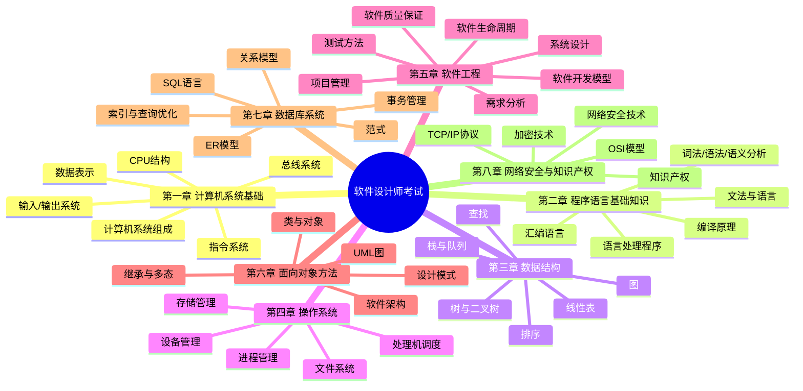

# 软件设计师 - 总结

## 知识框架思维导图

## 高频考点速查表

| 考点 | 内容 | 记忆要点 |
|------|------|----------|
| 补码运算 | 负数补码 = 反码+1；补码运算溢出判断 | 正数同源码，负数取反加1 |
| Cache命中率 | 命中率 = Cache命中次数/总访问次数 | 局部性原理（时间+空间） |
| RAID级别 | RAID0~RAID5，其中RAID1+0/0+1为组合级 | 0=条带，1=镜像，5=奇偶校验 |
| 存储系统 | 速度：寄存器 > Cache > 主存 > 磁盘 > 磁带 | 速度越快容量越小价格越高 |
| 编译过程 | 词法→语法→语义→中间代码→目标代码 | 词法分析输出token序列 |
| 文法分类 | 0型(短语文法)、1型(上下文有关)、2型(上下文无关)、3型(正规文法) | Chomsky层次，2型最常用 |
| 二叉树性质 | 第i层最多2^(i-1)个节点；n个节点深度ceil(log2(n+1)) | 叶子节点=度为2节点+1 |
| 排序算法 | 快速排序O(nlogn)/不稳定，归并排序O(nlogn)/稳定，堆排序O(nlogn)/不稳定 | 时间+稳定性都要记 |
| 进程状态 | 新建→就绪→运行→阻塞→就绪→终止 | 阻塞因I/O或等待事件 |
| 调度算法 | FCFS、SJF、RR(时间片)、优先级、多级反馈 | RR时间片太短→调度频繁 |
| 存储管理 | 连续分配(碎片)、页式(固定)、段式(可变)、段页式 | 页面置换：OPT、FIFO、LRU |
| 文件系统 | 文件逻辑结构（流式/记录式）、物理结构（连续/链接/索引） | inode存放文件控制块 |
| 软件开发模型 | 瀑布、原型、增量、螺旋、喷泉、敏捷 | 瀑布线性；敏捷迭代 |
| UML图 | 类图、对象图、用例图、活动图、时序图、协作图、状态图、部署图 | 9种图 |
| 测试方法 | 黑盒测试(等价类、边界值)、白盒测试(语句/分支/路径覆盖) | 语句>分支>路径覆盖率 |
| CMMI | 初始级→已管理级→已定义级→量化管理级→优化级 | 5个成熟度等级 |
| 设计模式 | 单例、工厂、观察者、装饰器、适配器 | GoF 23种 |
| 范式 | 1NF(原子性)、2NF(消除部分依赖)、3NF(消除传递依赖)、BCNF | 规范化程度逐步提高 |
| 事务特性 | ACID：原子性、一致性、隔离性、持久性 | 并发问题：丢失修改、脏读、不可重复读、幻读 |
| TCP/IP | 四层：应用层、传输层、网际层、网络接口层 | TCP可靠/UDP不可靠 |
| OSI模型 | 七层：应用层→表示层→会话层→传输层→网络层→数据链路层→物理层 | 会话层管理会话，表示层处理数据格式 |
| 加密技术 | 对称加密(DES/3DES/AES)、非对称加密(RSA)、哈希(SHA/MD5) | 对称加密快但密钥分发难 |

## 易混淆概念对比表

### 1. 瀑布模型 vs 敏捷模型

| 对比项 | 瀑布模型 | 敏捷模型 |
|--------|----------|----------|
| 开发风格 | 线性顺序、阶段分明 | 迭代增量、持续交付 |
| 需求变化 | 难以适应，变更成本高 | 灵活响应，拥抱变化 |
| 适用场景 | 需求明确、稳定的项目 | 需求不明确、变化快的项目 |
| 文档 | 重视文档，每阶段有交付物 | 轻文档，重可运行软件 |
| 客户参与 | 阶段评审，后期反馈 | 持续参与，频繁反馈 |
| 典型方法 | V模型、结构化开发 | Scrum、XP、极限编程 |

### 2. 1NF vs 2NF vs 3NF

| 对比项 | 1NF | 2NF | 3NF |
|--------|-----|-----|-----|
| 核心要求 | 属性不可再分(原子性) | 消除非主属性对码的部分函数依赖 | 消除非主属性对码的传递函数依赖 |
| 前提条件 | 无 | 先满足1NF | 先满足2NF |
| 依赖处理 | 不涉及 | 部分依赖 | 传递依赖 |
| 异常消除 | 消除重复组 | 减少插入/删除异常 | 消除更新异常 |
| 典型实例 | 学号、课程、成绩 | 订单明细去掉商品名 | 去除非主属性间的传递 |

### 3. 进程 vs 线程

| 对比项 | 进程 | 线程 |
|--------|------|------|
| 资源分配 | 资源分配和调度的基本单位 | CPU调度的基本单位 |
| 地址空间 | 拥有独立的地址空间 | 同一进程内线程共享地址空间 |
| 通信方式 | 通过IPC(管道、消息队列、共享内存) | 通过共享变量/全局变量 |
| 切换开销 | 开销大(涉及页表、缓存刷新) | 开销小(同进程内线程切换) |
| 健壮性 | 进程崩溃不影响其他进程 | 线程崩溃可能影响整个进程 |
| 并发粒度 | 粗粒度 | 细粒度 |

### 4. 黑盒测试 vs 白盒测试

| 对比项 | 黑盒测试 | 白盒测试 |
|--------|----------|----------|
| 测试依据 | 软件规格说明书 | 程序内部逻辑结构 |
| 关注点 | 功能是否正确 | 代码逻辑、路径、条件 |
| 测试人员 | 不需要编程知识 | 需要编程知识 |
| 典型方法 | 等价类划分、边界值、因果图、错误推测 | 语句覆盖、分支覆盖、路径覆盖、条件覆盖 |
| 覆盖率 | 无法度量代码覆盖率 | 可度量代码覆盖率 |
| 发现缺陷 | 功能错误、接口错误、性能问题 | 逻辑错误、路径遗漏、死代码 |

### 5. 面向对象分析 vs 面向对象设计

| 对比项 | 面向对象分析(OOA) | 面向对象设计(OOD) |
|--------|------------------|------------------|
| 目标 | 理解问题域，建立需求模型 | 建立解决方案模型 |
| 核心活动 | 建立用例模型、领域模型 | 设计类、接口、架构 |
| 关注点 | 做什么(what) | 怎么做(how) |
| 交付物 | 用例图、类图、活动图 | 设计类图、组件图、部署图 |
| 使用者 | 用户、领域专家 | 开发人员 |
| 抽象层次 | 问题空间 | 解空间 |

### 6. SQL DDL vs DML vs DCL

| 对比项 | DDL(数据定义语言) | DML(数据操纵语言) | DCL(数据控制语言) |
|--------|-------------------|-------------------|-------------------|
| 用途 | 定义/修改数据库结构 | 操纵数据库中的数据 | 控制数据库访问权限 |
| 核心操作 | CREATE、ALTER、DROP | SELECT、INSERT、UPDATE、DELETE | GRANT、REVOKE |
| 是否自动提交 | 是 | 取决于事务设置 | 是 |
| 执行结果 | 改变表/索引/视图结构 | 改变表中的数据行 | 改变权限配置 |
| 使用频率 | 较少(初始化/变更) | 最频繁(日常操作) | 较少(安全管理) |
| 权限要求 | 通常需要DBA权限 | 普通用户可操作 | 通常需要DBA权限 |
