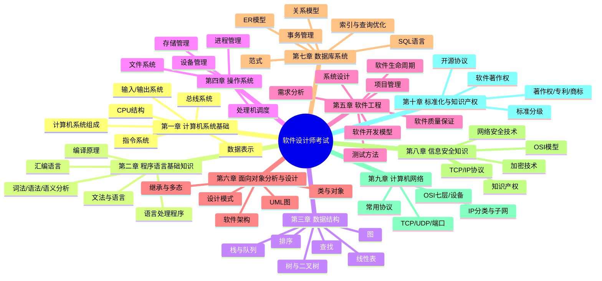

# 软件设计师 - 总结

## 知识框架思维导图

```mermaid
mindmap
  root((软件设计师考试))
    第一章 计算机系统基础
      计算机系统组成
      数据表示
      指令系统
      CPU结构
      总线系统
      输入/输出系统
    第二章 程序语言基础知识
      汇编语言
      编译原理
      词法/语法/语义分析
      文法与语言
      语言处理程序
    第三章 数据结构
      线性表
      栈与队列
      树与二叉树
      图
      查找
      排序
    第四章 操作系统
      进程管理
      处理机调度
      存储管理
      文件系统
      设备管理
    第五章 软件工程
      软件生命周期
      软件开发模型
      需求分析
      系统设计
      测试方法
      项目管理
      软件质量保证
    第六章 面向对象分析与设计
      UML图
      设计模式
      类与对象
      继承与多态
      软件架构
    第七章 数据库系统
      ER模型
      关系模型
      范式
      SQL语言
      事务管理
      索引与查询优化
    第八章 信息安全知识
      OSI模型
      TCP/IP协议
      网络安全技术
      加密技术
      知识产权
    第九章 计算机网络
      OSI七层/设备
      IP分类与子网
      TCP/UDP/端口
      常用协议
    第十章 标准化与知识产权
      标准分级
      著作权/专利/商标
      软件著作权
      开源协议
```

## 高频考点速查表

| 考点 | 内容 | 记忆要点 |
|------|------|----------|
| 补码运算 | 负数补码 = 反码+1；补码运算溢出判断 | 正数同源码，负数取反加1 |
| Cache命中率 | 命中率 = Cache命中次数/总访问次数 | 局部性原理（时间+空间） |
| RAID级别 | RAID0~RAID5，其中RAID1+0/0+1为组合级 | 0=条带，1=镜像，5=奇偶校验 |
| 存储系统 | 速度：寄存器 > Cache > 主存 > 磁盘 > 磁带 | 速度越快容量越小价格越高 |
| 编译过程 | 词法→语法→语义→中间代码→目标代码 | 词法分析输出token序列 |
| 文法分类 | 0型(短语文法)、1型(上下文有关)、2型(上下文无关)、3型(正规文法) | Chomsky层次，2型最常用 |
| 二叉树性质 | 第i层最多2^(i-1)个节点；n个节点深度ceil(log2(n+1)) | 叶子节点=度为2节点+1 |
| 排序算法 | 快速排序O(nlogn)/不稳定，归并排序O(nlogn)/稳定，堆排序O(nlogn)/不稳定 | 时间+稳定性都要记 |
| 进程状态 | 新建→就绪→运行→阻塞→就绪→终止 | 阻塞因I/O或等待事件 |
| 调度算法 | FCFS、SJF、RR(时间片)、优先级、多级反馈 | RR时间片太短→调度频繁 |
| 存储管理 | 连续分配(碎片)、页式(固定)、段式(可变)、段页式 | 页面置换：OPT、FIFO、LRU |
| 文件系统 | 文件逻辑结构（流式/记录式）、物理结构（连续/链接/索引） | inode存放文件控制块 |
| 软件开发模型 | 瀑布、原型、增量、螺旋、喷泉、敏捷 | 瀑布线性；敏捷迭代 |
| UML图 | 用例/类/对象/序列/协作/状态/活动/组件/部署（常考9种） | UML 2.0 规范共13种（结构图7+行为图6），考试常考其中9种 |
| 测试方法 | 黑盒测试(等价类、边界值)、白盒测试(语句/分支/路径覆盖) | 语句>分支>路径覆盖率 |
| CMMI | 初始级→已管理级→已定义级→量化管理级→优化级 | 5个成熟度等级 |
| 设计模式 | 单例、工厂、观察者、装饰器、适配器 | GoF 23种 |
| 范式 | 1NF(原子性)、2NF(消除部分依赖)、3NF(消除传递依赖)、BCNF | 规范化程度逐步提高 |
| 事务特性 | ACID：原子性、一致性、隔离性、持久性 | 并发问题：丢失修改、脏读、不可重复读、幻读 |
| TCP/IP | 四层：应用层、传输层、网际层、网络接口层 | TCP可靠/UDP不可靠 |
| OSI模型 | 七层：应用层→表示层→会话层→传输层→网络层→数据链路层→物理层 | 会话层管理会话，表示层处理数据格式 |
| IP地址分类 | A=1-126、B=128-191、C=192-223，D组播E保留 | 127回环；私有：10/172.16-31/192.168 |
| 子网划分 | 子网数=2ⁿ，主机数=2ᵐ−2 | 掩码：128/192/224/240=借1/2/3/4位 |
| TCP三次握手 | SYN→SYN+ACK→ACK；四次挥手FIN×2 | 全双工，两个方向各自关闭 |
| 常用端口 | 80/443/21/53/25/110/143 | DNS默认UDP 53，FTP 21控制+20数据 |
| 网络设备 | 集线器(物理)、交换机(链路)、路由器(网络)、网关(高层) | 路由器隔离广播域，交换机只隔离冲突域 |
| 标准代号 | GB强制、GB/T推荐、GB/Z指导；ISO国际 | 国际/国家/行业/地方/企业五级 |
| 知识产权特性 | 无形性、专有性、地域性、时间性 | 商业秘密无限期（时间性例外） |
| 保护期限 | 著作(个人终生+50/单位50)、发明20、实用新型10、外观设计15 | 商标10年可续展；精神权利永久 |
| 软件著作权 | 自动取得、登记非必须；职务作品归单位 | 委托开发无约定归受托人 |
| 开源协议 | GPL传染、LGPL弱传染、MIT/BSD宽松 | GPL衍生作品必须开源 |
| 加密技术 | 对称加密(DES/3DES/AES)、非对称加密(RSA)、哈希(SHA/MD5) | 对称加密快但密钥分发难 |

## 易混淆概念对比表

### 1. 瀑布模型 vs 敏捷模型

| 对比项 | 瀑布模型 | 敏捷模型 |
|--------|----------|----------|
| 开发风格 | 线性顺序、阶段分明 | 迭代增量、持续交付 |
| 需求变化 | 难以适应，变更成本高 | 灵活响应，拥抱变化 |
| 适用场景 | 需求明确、稳定的项目 | 需求不明确、变化快的项目 |
| 文档 | 重视文档，每阶段有交付物 | 轻文档，重可运行软件 |
| 客户参与 | 阶段评审，后期反馈 | 持续参与，频繁反馈 |
| 典型方法 | V模型、结构化开发 | Scrum、XP、极限编程 |

### 2. 1NF vs 2NF vs 3NF

| 对比项 | 1NF | 2NF | 3NF |
|--------|-----|-----|-----|
| 核心要求 | 属性不可再分(原子性) | 消除非主属性对码的部分函数依赖 | 消除非主属性对码的传递函数依赖 |
| 前提条件 | 无 | 先满足1NF | 先满足2NF |
| 依赖处理 | 不涉及 | 部分依赖 | 传递依赖 |
| 异常消除 | 消除重复组 | 减少插入/删除异常 | 消除更新异常 |
| 典型实例 | 学号、课程、成绩 | 订单明细去掉商品名 | 去除非主属性间的传递 |

### 3. 进程 vs 线程

| 对比项 | 进程 | 线程 |
|--------|------|------|
| 资源分配 | 资源分配和调度的基本单位 | CPU调度的基本单位 |
| 地址空间 | 拥有独立的地址空间 | 同一进程内线程共享地址空间 |
| 通信方式 | 通过IPC(管道、消息队列、共享内存) | 通过共享变量/全局变量 |
| 切换开销 | 开销大(涉及页表、缓存刷新) | 开销小(同进程内线程切换) |
| 健壮性 | 进程崩溃不影响其他进程 | 线程崩溃可能影响整个进程 |
| 并发粒度 | 粗粒度 | 细粒度 |

### 4. 黑盒测试 vs 白盒测试

| 对比项 | 黑盒测试 | 白盒测试 |
|--------|----------|----------|
| 测试依据 | 软件规格说明书 | 程序内部逻辑结构 |
| 关注点 | 功能是否正确 | 代码逻辑、路径、条件 |
| 测试人员 | 不需要编程知识 | 需要编程知识 |
| 典型方法 | 等价类划分、边界值、因果图、错误推测 | 语句覆盖、分支覆盖、路径覆盖、条件覆盖 |
| 覆盖率 | 无法度量代码覆盖率 | 可度量代码覆盖率 |
| 发现缺陷 | 功能错误、接口错误、性能问题 | 逻辑错误、路径遗漏、死代码 |

### 5. 面向对象分析 vs 面向对象设计

| 对比项 | 面向对象分析(OOA) | 面向对象设计(OOD) |
|--------|------------------|------------------|
| 目标 | 理解问题域，建立需求模型 | 建立解决方案模型 |
| 核心活动 | 建立用例模型、领域模型 | 设计类、接口、架构 |
| 关注点 | 做什么(what) | 怎么做(how) |
| 交付物 | 用例图、类图、活动图 | 设计类图、组件图、部署图 |
| 使用者 | 用户、领域专家 | 开发人员 |
| 抽象层次 | 问题空间 | 解空间 |

### 6. SQL DDL vs DML vs DCL

| 对比项 | DDL(数据定义语言) | DML(数据操纵语言) | DCL(数据控制语言) |
|--------|-------------------|-------------------|-------------------|
| 用途 | 定义/修改数据库结构 | 操纵数据库中的数据 | 控制数据库访问权限 |
| 核心操作 | CREATE、ALTER、DROP | SELECT、INSERT、UPDATE、DELETE | GRANT、REVOKE |
| 是否自动提交 | 是 | 取决于事务设置 | 是 |
| 执行结果 | 改变表/索引/视图结构 | 改变表中的数据行 | 改变权限配置 |
| 使用频率 | 较少(初始化/变更) | 最频繁(日常操作) | 较少(安全管理) |
| 权限要求 | 通常需要DBA权限 | 普通用户可操作 | 通常需要DBA权限 |

### 7. TCP vs UDP

| 对比项 | TCP | UDP |
|--------|-----|-----|
| 连接 | 面向连接（三次握手） | 无连接 |
| 可靠性 | 可靠（确认+重传） | 不可靠（尽力而为） |
| 速度 | 慢 | 快 |
| 数据单位 | 报文段 | 数据报 |
| 典型应用 | HTTP/FTP/邮件 | DNS/直播/语音/游戏 |
| 握手/挥手 | 三次握手、四次挥手 | 无 |

### 8. 著作权 vs 专利权

| 对比项 | 著作权 | 专利权 |
|--------|--------|--------|
| 保护对象 | 作品的表达（代码/文档） | 技术方案/发明创造 |
| 取得方式 | 自动产生（无需申请） | 需向专利局申请、审查授权 |
| 保护期限 | 个人终生+50年 / 单位50年 | 发明20年、实用新型10年、外观设计15年 |
| 起算时间 | 创作完成/首次发表 | 申请日 |
| 典型场景 | 软件代码、文章、音乐 | 算法实现、产品结构、外观 |
| 保护强度 | 不保护思想/算法 | 可垄断技术方案（需公开） |

### 9. 强制标准 vs 推荐标准

| 对比项 | 强制标准 | 推荐标准 |
|--------|---------|---------|
| 代号 | GB | GB/T（T=推荐） |
| 执行要求 | 必须执行 | 自愿采用（合同约定除外） |
| 违反后果 | 违法，承担法律责任 | 一般无法律强制后果 |
| 制定层级 | 国家标准 | 国家标准（另有行业/地方/企业） |
