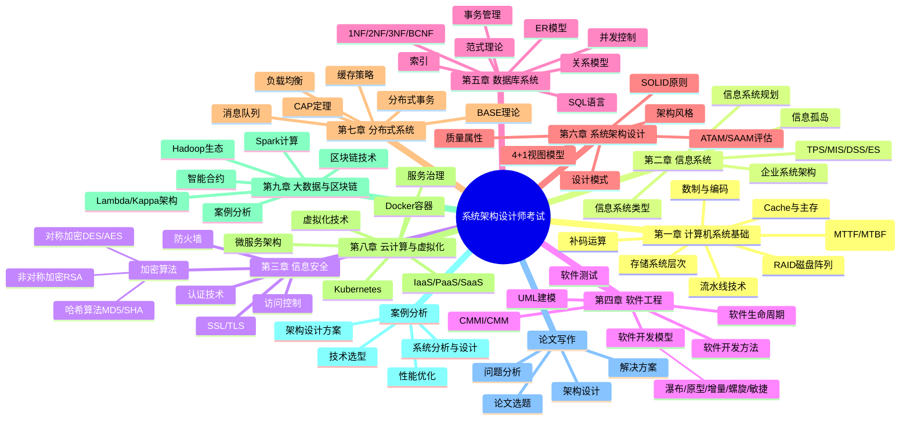

# 系统架构设计师 - 总结

## 知识框架思维导图

## 高频考点速查表

| 考点 | 内容 | 记忆要点 |
|------|------|----------|
| 补码运算 | 负数补码 = 反码+1；补码运算溢出判断 | 正数同源码，负数取反加1 |
| 存储系统 | 速度：寄存器 > Cache > 主存 > 磁盘 > 磁带 | 速度越快容量越小价格越高 |
| Cache命中率 | 命中率 = Cache命中次数/总访问次数 | 局部性原理（时间+空间） |
| RAID级别 | RAID0~RAID5，其中RAID1+0/0+1为组合级 | 0=条带，1=镜像，5=奇偶校验 |
| 可靠性计算 | MTTF(平均无故障时间)、MTBF(平均故障间隔) | MTTF>10万小时为高可靠 |
| 流水线技术 | 流水线执行时间 = (t1+...+tk)+(n-1)*max(ti) | 吞吐率 = n/(k+n-1)*max(ti) |
| 信息系统类型 | TPS(事务处理)、MIS(管理)、DSS(决策)、ES(专家) | 从结构化到非结构化递进 |
| UML图 | 类图、对象图、用例图、活动图、时序图、协作图、状态图、部署图 | 9种图，需求分析+设计都要用 |
| 软件测试 | 单元/集成/确认/系统测试；白盒/黑盒测试 | 测试阶段：编码后依次进行 |
| CMMI等级 | 初始级→已管理级→已定义级→量化管理级→优化级 | 5个成熟度等级，由低到高 |
| 4+1视图 | 逻辑视图、开发视图、进程视图、物理视图、场景 | RUP提出，从不同角度描述架构 |
| 架构风格 | 数据流风格、调用返回风格、独立组件风格、虚拟机风格、仓库风格 | 每种风格有代表结构 |
| 范式理论 | 1NF(原子性)、2NF(消除部分依赖)、3NF(消除传递依赖)、BCNF | 规范化程度逐步提高 |
| 事务特性 | ACID：原子性、一致性、隔离性、持久性 | 并发问题：丢失修改、脏读、不可重复读、幻读 |
| CAP定理 | 一致性、可用性、分区容错性，三者最多取其二 | 分布式系统必须选择AP或CP |
| BASE理论 | Basically Available, Soft state, Eventually consistent | CAP中AP的延伸，最终一致性 |
| 分布式事务 | 2PC两阶段提交、3PC三阶段提交 | 2PC有阻塞问题，3PC解决超时 |
| 加密技术 | 对称加密(DES/3DES/AES)、非对称加密(RSA)、哈希(SHA/MD5) | 对称加密快但密钥分发难 |
| 虚拟化 | 全虚拟化、半虚拟化、硬件辅助虚拟化 | KVM为Linux内核虚拟化 |
| 区块链 | 分布式账本、共识机制、不可篡改、智能合约 | POW/POS/PBFT共识算法 |
| 微服务 | 单一职责、独立部署、轻量级通信、去中心化治理 | 与SOA相比更轻、粒度更小 |

## 易混淆概念对比表

### 1. 瀑布模型 vs 敏捷模型

| 对比项 | 瀑布模型 | 敏捷模型 |
|--------|----------|----------|
| 开发风格 | 线性顺序、阶段分明 | 迭代增量、持续交付 |
| 需求变化 | 难以适应，变更成本高 | 灵活响应，拥抱变化 |
| 适用场景 | 需求明确、稳定的项目 | 需求不明确、变化快的项目 |
| 文档 | 重视文档，每阶段有交付物 | 轻文档，重可运行软件 |
| 客户参与 | 阶段评审，后期反馈 | 持续参与，频繁反馈 |
| 典型方法 | V模型、结构化开发 | Scrum、XP、极限编程 |

### 2. 1NF vs 2NF vs 3NF

| 对比项 | 1NF | 2NF | 3NF |
|--------|-----|-----|-----|
| 核心要求 | 属性不可再分(原子性) | 消除非主属性对码的部分函数依赖 | 消除非主属性对码的传递函数依赖 |
| 前提条件 | 无 | 先满足1NF | 先满足2NF |
| 依赖处理 | 不涉及 | 部分依赖 | 传递依赖 |
| 异常消除 | 消除重复组 | 减少插入/删除异常 | 消除更新异常 |
| 典型实例 | 学号、课程、成绩 | 订单明细去掉商品名 | 去除非主属性间的传递 |

### 3. CAP定理 vs BASE理论

| 对比项 | CAP定理 | BASE理论 |
|--------|----------|----------|
| 核心内容 | 一致性、可用性、分区容错性三者最多取其二 | Basically Available, Soft state, Eventually consistent |
| 适用场景 | 分布式系统架构设计基础 | 大型互联网系统设计 |
| 选择倾向 | 必须选择CP或AP | 优先保证可用性，接受最终一致性 |
| 一致性要求 | 强一致性或弱一致性 | 最终一致性 |
| 可用性要求 | 高可用或分区容忍 | 基本可用，允许软状态 |

### 4. 瀑布模型 vs 原型模型

| 对比项 | 瀑布模型 | 原型模型 |
|--------|----------|----------|
| 开发风格 | 严格线性顺序 | 快速迭代构建原型 |
| 需求理解 | 前期必须完全明确 | 通过原型逐步澄清需求 |
| 变更成本 | 后期变更成本极高 | 早期变更成本低 |
| 用户参与 | 前期和后期参与 | 持续参与原型验证 |
| 适用场景 | 需求明确、稳定的项目 | 需求模糊、需要探索的项目 |
| 最终产品 | 与规格说明完全一致 | 基于原型逐步演化 |

### 5. 2PC vs 3PC

| 对比项 | 2PC(两阶段提交) | 3PC(三阶段提交) |
|--------|-----------------|-----------------|
| 阶段数 | 准备阶段+提交阶段，共2个阶段 | CanCommit+PreCommit+DoCommit，共3个阶段 |
| 阻塞问题 | 协调者故障会导致参与者阻塞 | 引入超时机制，减少阻塞 |
| 数据一致性 | 强一致性 | 强一致性 |
| 性能 | 2次网络往返 | 3次网络往返，性能略低 |
| 实现复杂度 | 较简单 | 较复杂 |
| 应用场景 | 传统分布式数据库 | 高可用分布式系统 |

### 6. 微服务架构 vs SOA

| 对比项 | 微服务架构 | SOA(面向服务架构) |
|--------|------------|-------------------|
| 服务粒度 | 细粒度，单一职责 | 粗粒度，业务组件 |
| 通信方式 | 轻量级(REST/HTTP) | 重量级(ESB/SOAP) |
| 部署方式 | 独立部署，容器化 | 集中式部署，ESB集成 |
| 治理方式 | 去中心化治理 | 集中式治理 |
| 技术异构 | 鼓励技术异构 | 倾向于统一技术栈 |
| 适用场景 | 互联网、快速迭代 | 企业级、复杂系统集成 |
